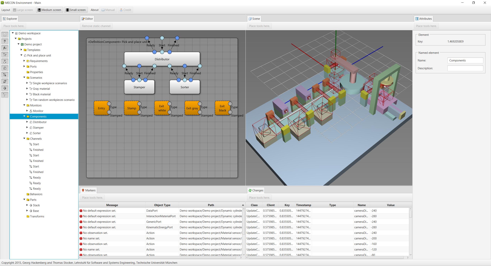
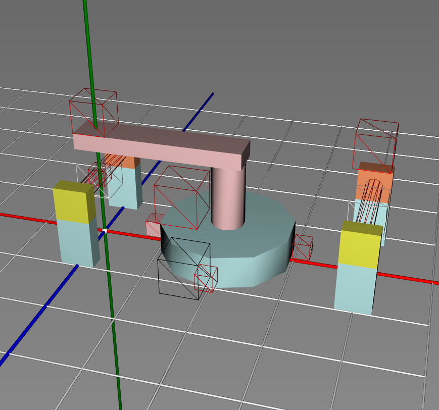
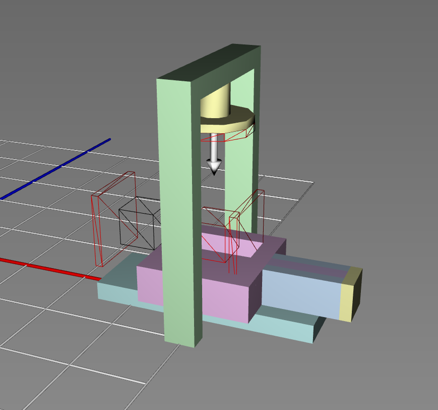
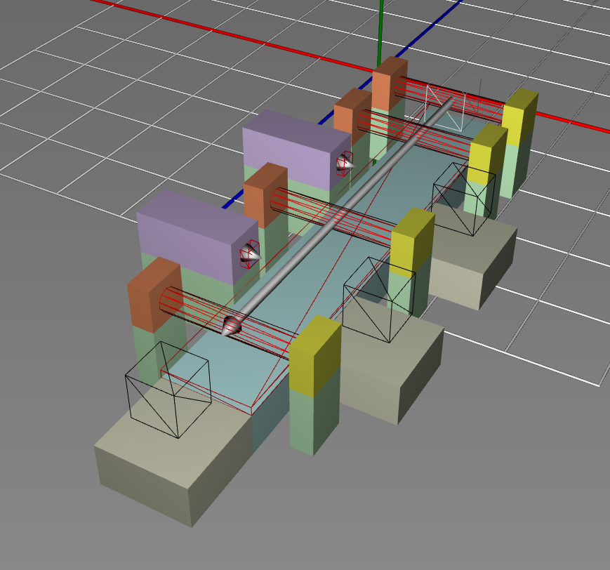
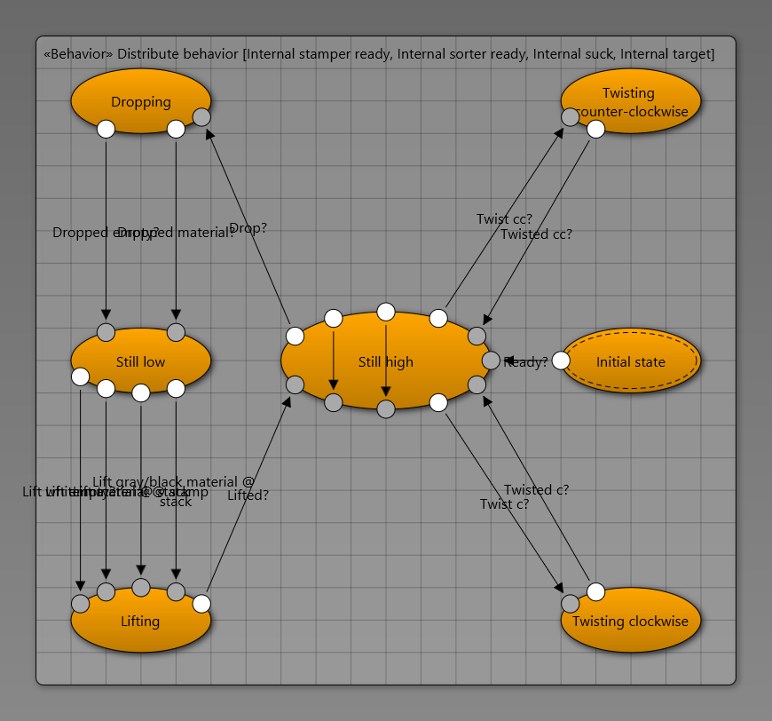
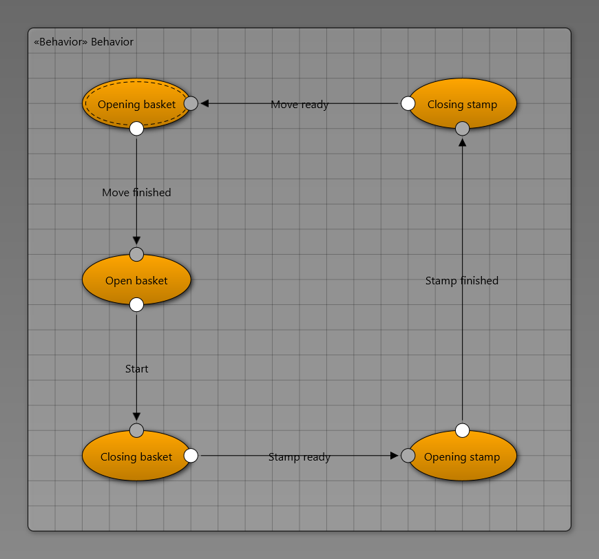
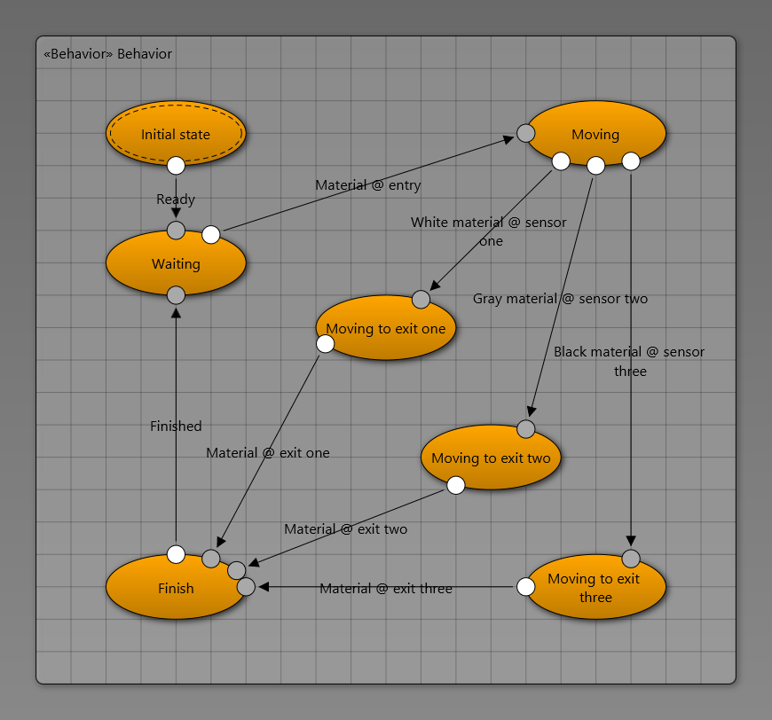

The case study is based on the [pick and place unit demonstrator](https://www.ais.mw.tum.de/en/research/equipment/ppu/) developed at the [Institute for Automation and Information Systems, Prof. Dr.-Ing. Birgit Vogel-Heuser, Technische Universitaet Muenchen](https://www.ais.mw.tum.de/en/homepage/).
The following screenshot shows the model of the pick and place unit, which has been developed using the prototypical tooling proposed in my dissertation work.
In particular, the screenshot shows the decomposition of the system into modules (middle left view) as well as the geometric structure of the system (middle right view).
The modules are the distributor, the stamper, and the sorter each serving a different purpose during system operation.
The distributor is responsible for distributing workpieces to the other two modules, the stamper is responsible for stamping workpieces, and the sorter is reponsible for sorting workpieces.

One key feature of the modeling technique is the decomposition of manufacturing systems into mechatronic modules and components.
In particular, mechatronic modules and components can be engineered in parallel and tested individually, which speeds up system development.
To achieve this feature, mechatronic modules and components define their own geometric structure and behavior.
Also, mechatronic modules and components can be decomposed further leading to arbitrary decomposition structures.
The following screenshots show the geometric structure of the distributor module, the stamper module, and the sorter module.
Note that these geometric structures can be seen also in the geometric structure of the overall system.

Another key feature of the modeling technique is the support for both geometric structure and behavior.
The geometric structure is developed typically using [computer aided design software](https://en.wikipedia.org/wiki/Computer-aided_design).
While computer aided design software provides powerful tools for geometry editing, the system behavior cannot be captured.
The behavior is developed typically using [integrated development environments](https://en.wikipedia.org/wiki/Integrated_development_environment).
While integrated development environments provide powerful tools for behavior editing, the system geometry cannot be captured.
Consequently, the consistency of the geometric structure and the behavior cannot be checked efficiently.
The novel technique proposed in my dissertation work integrates geometry and behavior such that automatic consistency checking is made possible.
The geometric structure has been shown in the previous screenshots, while examples of behavior are shown in the following screenshots.
In particular, the following screenshots show the software controllers of the distributor module, the stamper module, and the sorter module.
As typical for many other modeling techniques, the controller behavior is modeled using a variant of [finite state machines](https://en.wikipedia.org/wiki/Finite-state_machine).

Currently, we are working on a video demonstrating the tool and its features.
We are also thinking about releasing the prototypical tooling under some appropriate license.
If you are interested, let me know!!
