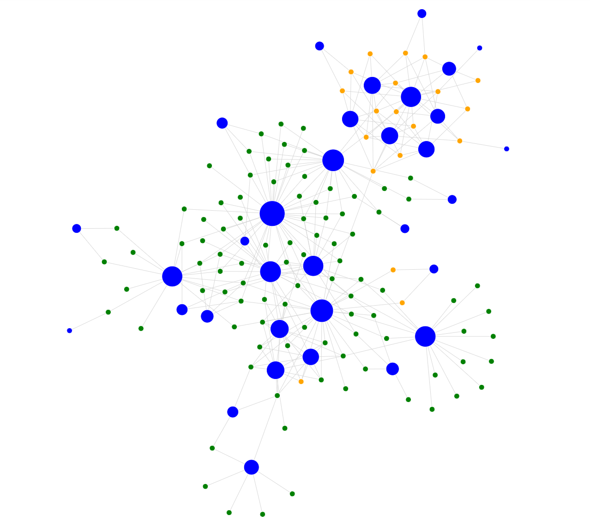
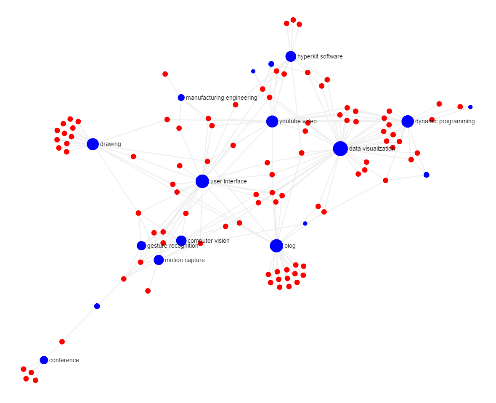
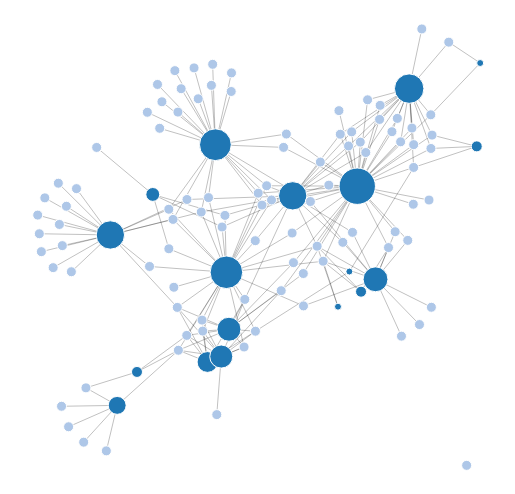

The implementation with all three JavaScript libraries was straight forward.
In all three cases, I had to convert the tag information into a proprietary [JSON](http://www.json.org/) format.
Converting the tag information into the proprietary format took me less than 30 minutes coding and less and 100 lines of code per JavaScript library.
Then, each JavaScript library requires its own configuration of the display style.
[Cytoscape](http://js.cytoscape.org/) and [Sigma](http://sigmajs.org/) provide style configuration objects, which support basic style options.
[D3](http://d3js.org/) on the other hand provdes seamless integration with [CSS](https://en.wikipedia.org/wiki/Cascading_Style_Sheets), which enables a wide variety of style options.
Furthermore, the library provides a stream processing API, which can be exploited for advanced style manipulations.
However, [D3](http://d3js.org/) also requires extra code for rendering the graph layout, which can be omitted in [Cytoscape](http://js.cytoscape.org/) and [Sigma](http://sigmajs.org/). Here are the visualization results for the individual JavaScript libraries (**click to run in your browser**):

From this first experience with using those three libraries I want to make a first conclusion on in which situation to use which of the JavaScript libraries.
Please note that my experience is limited to getting started knowledge about the presented libraries only.
More advanced users might think differently about the features and potentials of the individual libraries.

- Use [Cytoscape](http://js.cytoscape.org/) if you want to have **computationally fast** results.

- Use [Sigma](http://sigmajs.org/) if you want to have **basic interactive** results.

- Use [D3](http://d3js.org/) if you want to have **maximum customizable** results.

I hope with this post I could help some of you guys on the question which JavaScript graph library to use in what situation.
Also, I would be interested in feedback from other developers on using those libraries for different purposes.
Please note that we also provide alternative graph visualization and exploration techniques in [Zumida](http://www.zumida.com/), a product of [Hyperkit Software](http://www.hyperkit-software.com/).
