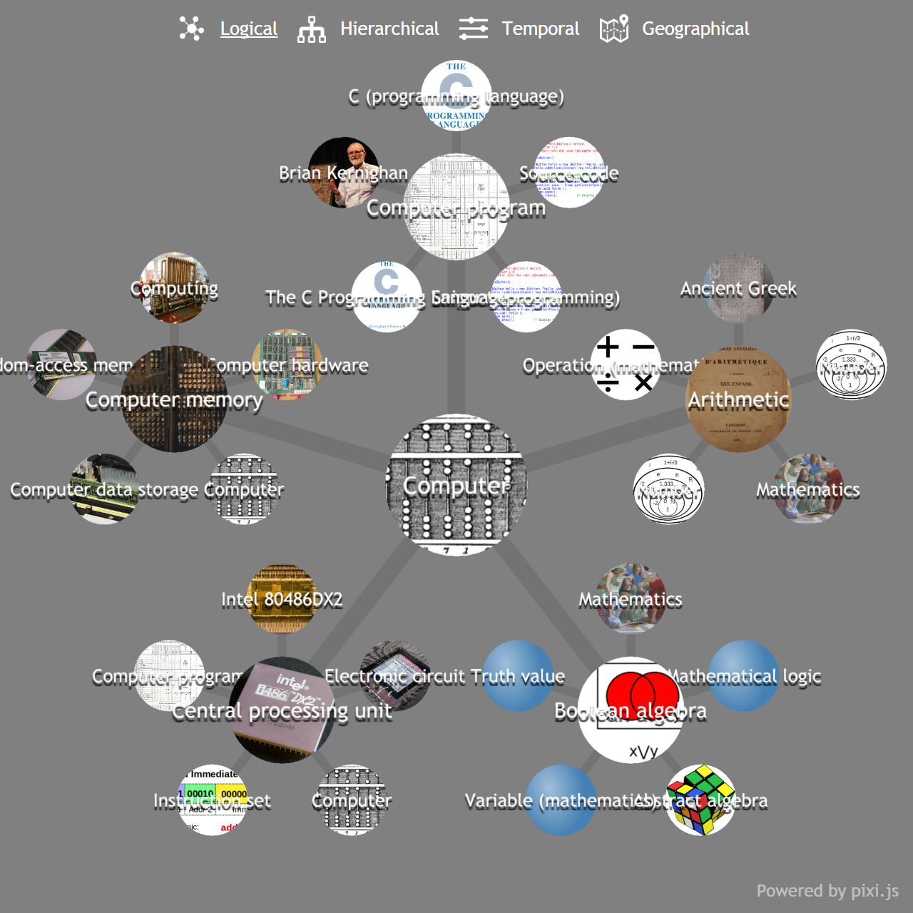
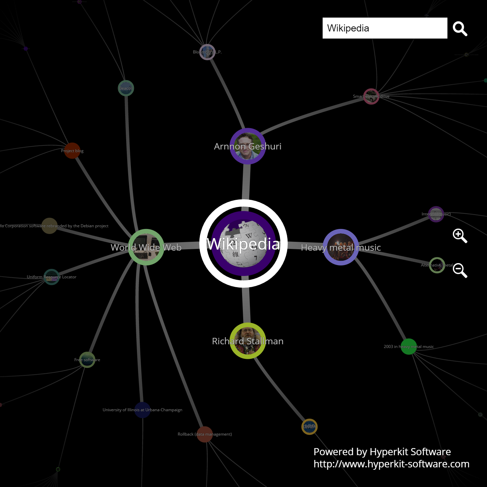
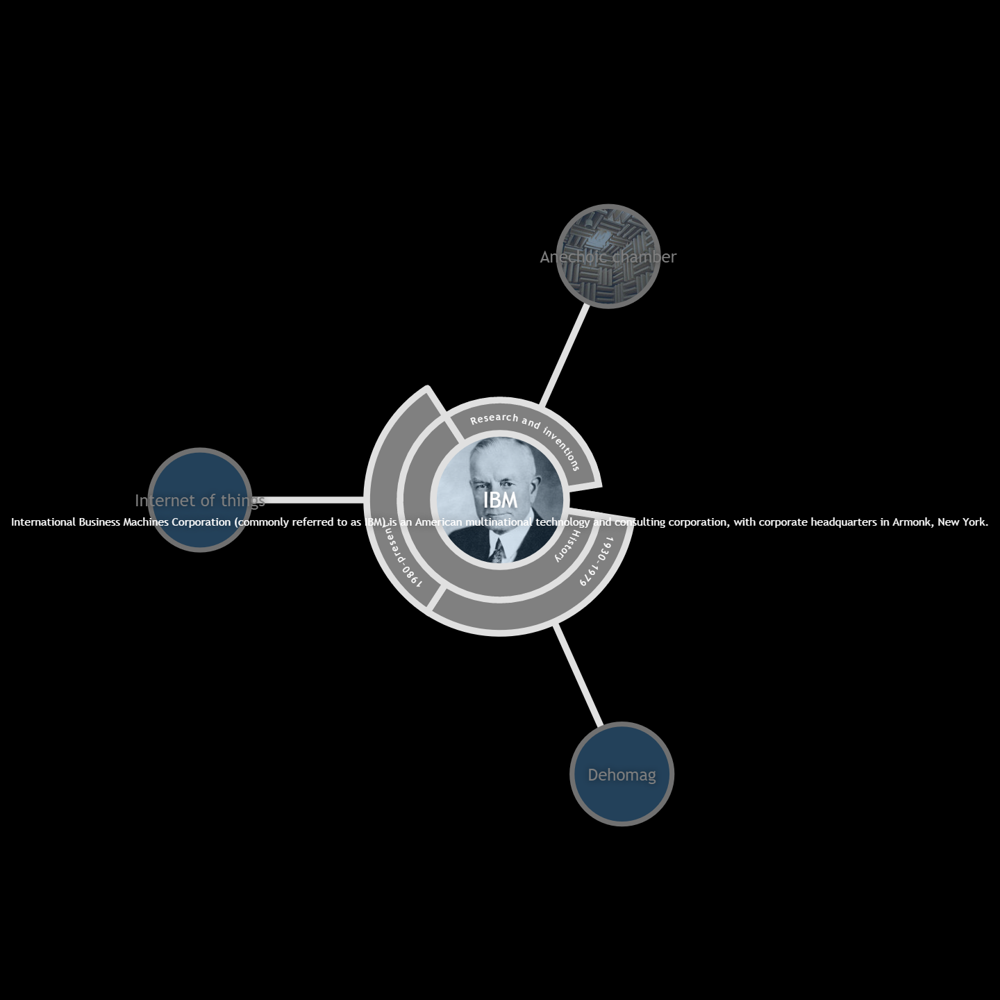
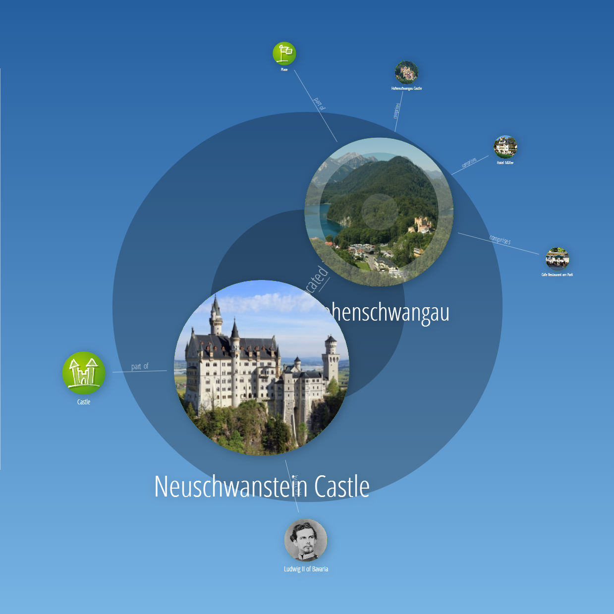
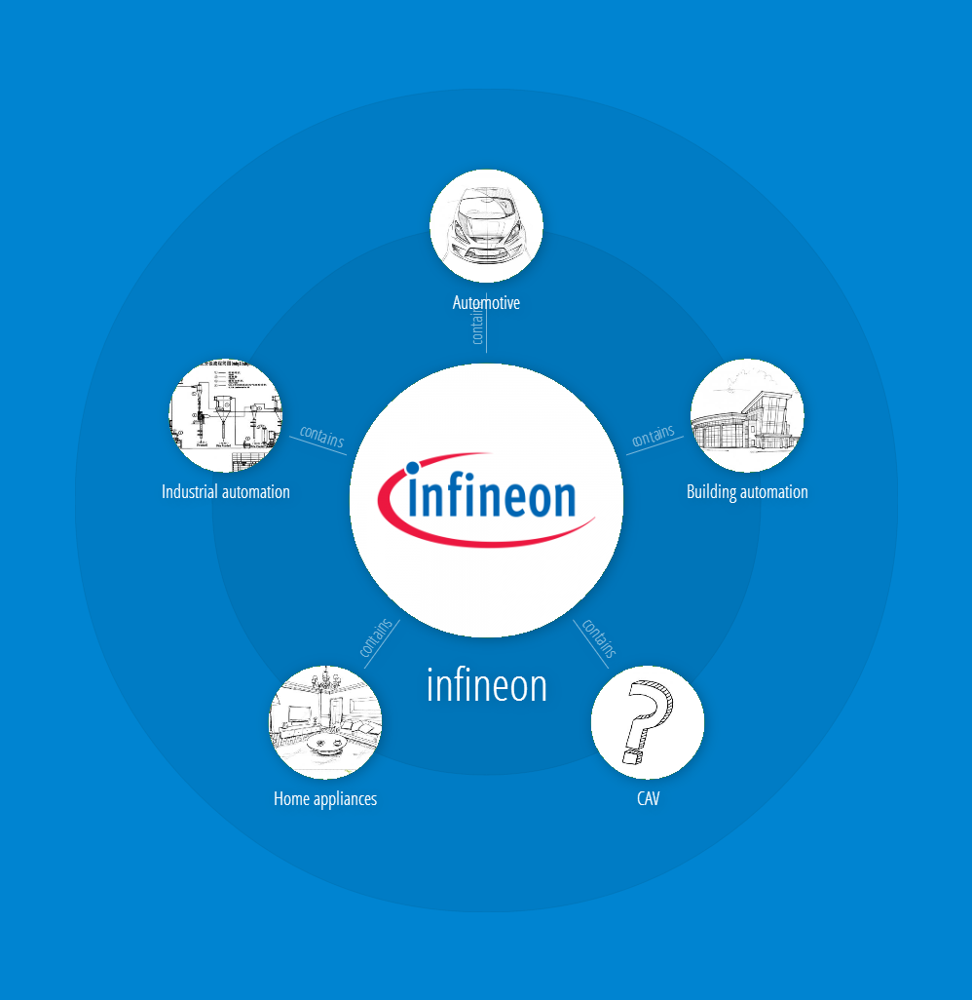

The first three graph visualizations are based on [Wikipedia](https://en.wikipedia.org/wiki/Main_Page) content.
In the graph each node represents a Wikipedia page, while each edge represents a link between two Wikipedia pages.
Furthermore, we extract for each Wikipedia page respectively graph node an icon representing the page content.

The second three graph visualizations are based on our custom content management system **Infoterm** (see [Hyperkit Software]() for more information).
The content management system allows one to create graph nodes with associated icon and rich text content.
Furthermore, graph edges can be added easily between any nodes.

We hope that we have attracted your interest on our JavaScript graph library with this article.
If you are seeking for intuitive and fun graph exploration techniques then we might be the right partner for you.
Contact us any time via e-mail under [georg@hyperkit-software.com](/posts/2016_03_07_hyperkit_graph_library/mailto:georg@hyperkit-software.com).
Cheers!
