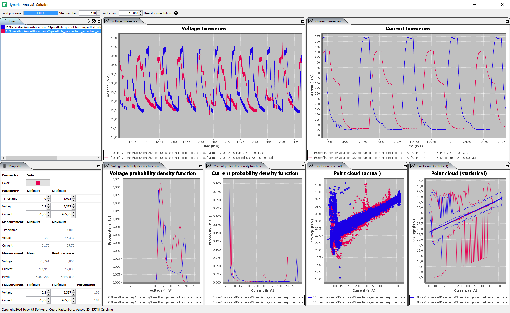

The following screenshot provides an overview over the features of the data anaylsis tool.
On the left hand side the files are listed, which are loaded currently into the tool.
Hereby, each file corresponds to one welding experiment, which are characterized by voltage and current measurements.
When selecting a file, the lower part of the left hand side shows some properties of the selected experiment.
These properties include statistical indicators such as minimum and maximum of timestamps, voltages, and currents.
Furthermore, the mean and root variance of the voltages, currents, and powers (= voltages times currents) are provided.
Finally, the center and the right hand side of the screen show different diagrams of the experiment data.
In the upper parts the raw voltage and current measurements are displayed as timeseries charts.
In the lower parts the voltage and current density functions as well as voltage-current point clouds are displayed.

Technically, the tool is implemented in the [Java](http://www.oracle.com/technetwork/java/index.html) programming language using [Apache Maven](https://maven.apache.org/) for build management.
Furthermore, the user interface is based on [Swing](https://docs.oracle.com/javase/tutorial/uiswing/), [Docking Frames](http://www.docking-frames.org/), and [JFreeChart](http://www.jfree.org/jfreechart/).
If you are interested in further information about the tool, please contact me at [mail@georg-hackenberg.de](/posts/2016_09_19_experiment_data_analysis/mailto:mail@georg-hackenberg.de).
