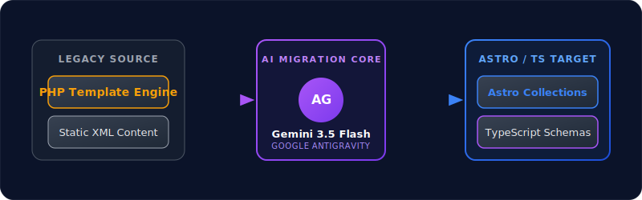
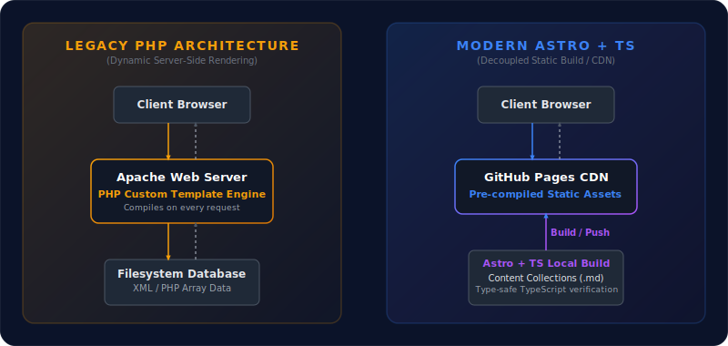

After many years of running my personal website on a custom, server-side template engine, I have officially relaunched it! The new website is a fully static application built with **Astro** and **TypeScript**, hosted entirely on **GitHub Pages**. 

This modernization represents a massive leap forward in load performance, developer experience, type-safety, and security. However, migrating over a decade of blog posts, publication records, and course materials was a daunting task. Here is the story of how I successfully automated this migration using **Google Antigravity** powered by **Gemini 3.5 Flash (High)**.

## Why Relaunch? Outgrowing the Legacy Stack

My original website was built using a custom PHP template engine that compiled XML content files into HTML pages dynamically on every client request. While this architecture served me well for many years and gave me ultimate control over layouts, it had several drawbacks:

1. **Server Maintenance**: Running PHP required active hosting servers (LAMP stack), which introduced maintenance overhead, database backups, and security vulnerabilities.
2. **Speed**: Processing PHP templates dynamically on the fly meant page responses were slower than serving pre-compiled static files from a global CDN.
3. **No Type-Safety**: Content files were stored as raw XML and PHP array definitions. There was no compile-time check to ensure a blog post or course record actually had the required fields (e.g., matching tags, formatted dates, or correct cover paths).

By moving to Astro and TypeScript, I transitioned to a **static-first, decoupled architecture** where everything is validated at compile-time and served in milliseconds via a global CDN.

## The Migration Workflow: Powered by AI

Manually converting over a hundred content entries—spread across different collections—from custom XML/PHP files to Astro markdown frontmatter was out of the question. 

To automate the migration, I leveraged **Google Antigravity** running **Gemini 3.5 Flash (High)**. This combination allowed me to parse the complex legacy templates, read database files, map the fields dynamically, and output perfectly structured Markdown and MDX files.

Here is the migration workflow in detail:



1. **Legacy Source**: The migration script extracted raw XML and PHP content from my original database.
2. **AI Translation**: Using Google Antigravity's agentic workspace tools, Gemini 3.5 Flash analyzed the structure of my old files, mapped attributes (e.g., date formats, tag arrays, image assets), and converted them into clean markdown/frontmatter.
3. **Astro Schema Validation**: Since Astro supports schema validation out of the box using Zod, any incorrect format or missing field was caught during the translation phase, enabling immediate, automated fixes.

Everything ran completely smoothly in a matter of minutes, preserving all formatting, code blocks, links, and layout metadata perfectly.

## Architecture Comparison: Legacy vs. Modern

The new setup completely decouples the content creation and compilation step from the content delivery step. The architecture below showcases the contrast between the old dynamic approach and the modern, static CDN-driven approach:



- **Old (Left)**: The client had to wait for Apache to compile the PHP template engine and retrieve values from the filesystem on every request.
- **New (Right)**: The compiler runs locally or via CI/CD. The build output is a folder of optimized HTML, CSS, and JS files served directly from the GitHub Pages CDN.

## The New Foundation: Type-Safe Content Collections

One of the best features of the relaunch is Astro's type-safe **Content Collections**. Powered by TypeScript and Zod schemas, we can guarantee that all content has correct frontmatter values. For example, my blog posts schema ensures every post contains a valid title, date, and description:

```typescript
const posts = defineCollection({
  loader: glob({
    base: './src/content/posts',
    pattern: '**/index.{md,mdx}',
    generateId: ({ entry }) => entry.replace(/\/index\.(md|mdx)$/, '')
  }),
  schema: z.object({
    title: z.string(),
    pubDate: z.coerce.date(),
    description: z.string().optional(),
    tags: z.array(z.string()).default([]),
    icon: z.string().optional(),
  }),
});
```

If I accidentally misspell a tag or omit a required date, the build fails immediately during development or CI/CD compilation, preventing broken pages from ever reaching production.

## Conclusion & Next Steps

Relaunching on GitHub Pages with Astro and TypeScript has been an incredibly satisfying experience. The page load speeds are near-instantaneous, and publishing a new post is now as simple as running `git push`. 

Thanks to **Google Antigravity** and the impressive speed and comprehension of **Gemini 3.5 Flash (High)**, the migration of all legacy content was a flawless success.

Stay tuned for more updates as I continue to share insights on software engineering, data visualization, and web technologies!
