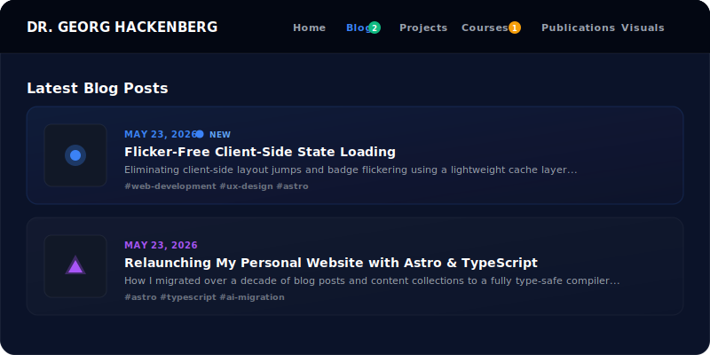
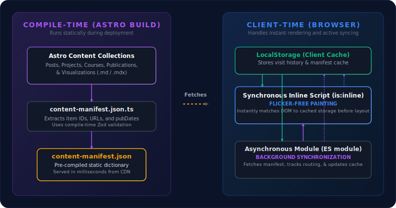
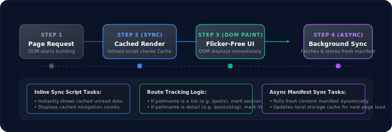

After modernizing my personal website to Astro and TypeScript, I wanted to find a way to make it more engaging for returning visitors. Specifically, I wanted to highlight **newly published content** (such as blog posts, projects, courses, publications, and visualizations) that a user has not seen yet. 

However, since this website is fully static and hosted on **GitHub Pages**, there is no server-side database or user authentication to track read states. Everything has to happen client-side. 

This post details how we built a type-safe, client-side unread content tracking system that resolves the classic user experience challenge of **asynchronous state loading: the visual flicker (Layout Shift)**.

## The UI Mockup: Where Indicators Live

We wanted a visual system that instantly guides users. The final interface features two levels of unread notifications:
1. **Navbar Badges**: Colored, rounded numeric counts (matching the section's accent color) indicating the total number of unread items in that collection.
2. **Card Indicators**: A subtle glowing dot next to the date header on cards representing content that has not yet been visited.

Here is a mockup of the visual interface:



## The Core Challenge: The Visual Flicker

A standard approach for client-side state is to load an asynchronous JavaScript script, read `localStorage`, fetch a manifest of posts, and inject the badges into the DOM.

While simple, this pattern introduces a major UX flaw: **Visual Flickering**. Because async scripts execute after the DOM is rendered and styled, the user will see the navbar *without* badges for a split second, followed by a sudden jump as badges and unread dots pop into existence. This layout shift looks unpolished and cheap.

To achieve a **flicker-free experience**, we designed a decoupled synchronization architecture.

## Decoupled Architecture: Build-Time meets Client-Time

To make indicators render instantly, we split our system into three layers:
1. **Build-Time Manifest Generation**: A static endpoint compiled during deployment.
2. **Synchronous Inline Painting**: A tiny render-blocking inline script that uses local cache to update the UI before the browser paints.
3. **Background Asynchronous Syncing**: A full-featured module that tracks user navigation, fetches the latest manifest, updates `localStorage`, and handles new items.



### 1. Build-Time Content Manifest
First, we created a dynamic endpoint `src/pages/content-manifest.json.ts` that runs during the Astro build process. It fetches all content collections, extracts their URLs and publication timestamps (validated by Zod schemas), and output a single, pre-compiled static JSON file:

```typescript
export async function GET() {
  const posts = await getCollection("posts");
  const courses = await getCollection("courses");
  const projects = await getCollection("projects");
  const publications = await getCollection("publications");
  const visualizations = await getCollection("visualizations");

  const manifest = {
    posts: posts.map(p => ({ id: p.id, url: `/posts/${p.id}`, date: parseItemDate(p.id, p.data.pubDate) })),
    courses: courses.map(c => ({ id: c.id, url: `/courses/${c.id}`, date: parseItemDate(c.id, c.data.pubDate) })),
    // ... other collections
  };

  return new Response(JSON.stringify(manifest), {
    headers: { "Content-Type": "application/json" }
  });
}
```

### 2. Synchronous Inline Painting (Flicker-Free)
To completely prevent the layout flash, we injected a synchronous, inlined script block `(is:inline)` right at the bottom of the `<body>` in our main layout `Layout.astro`. 

Because this script is inlined and simple, it executes synchronously during the initial HTML rendering loop. It reads the user's notification state and the cached content manifest directly from `localStorage`, instantly toggling the visibility of `.unread-dot` and `.nav-badge` DOM nodes **before the browser executes the first paint**:

```html
<script is:inline>
  (function() {
    const STORAGE_KEY = 'gh_site_notifications_v1';
    const MANIFEST_CACHE_KEY = 'gh_content_manifest_cache';
    
    // 1. Read state
    let state = { lastVisitedSections: {}, visitedItems: {} };
    try {
      const stored = localStorage.getItem(STORAGE_KEY);
      if (stored) state = JSON.parse(stored);
    } catch(e) {}
    
    // 2. Instantly update unread dots
    const unreadDots = document.querySelectorAll('.unread-dot');
    unreadDots.forEach(dot => {
      const rawUrl = dot.getAttribute('data-item-url');
      if (rawUrl) {
        const isVisited = !!state.visitedItems[normalizePath(rawUrl)];
        if (!isVisited) dot.classList.remove('hidden');
      }
    });
    
    // 3. Instantly update navbar badges using cached manifest
    // ...
  })();
</script>
```

### 3. Background Asynchronous Syncing
Once the page is rendered, our primary client-side TypeScript module `src/scripts/notifications.ts` runs asynchronously in the background. Its job is to:
- **Track Page Visits**: If the user is viewing `/posts`, it updates the `lastVisitedSections['posts']` timestamp. If they view an article like `/posts/my-post`, it flags the item URL as visited.
- **Fetch Manifest**: It queries the static `/content-manifest.json` on the server.
- **Update Cache**: It recalculates the unread item counts using the fresh data, updates any badges if a new post has been published since their last cached visit, and writes the updated manifest back into the `localStorage` cache for the next page load.

## State and Event Workflows

The sequence diagram below displays the step-by-step workflow of the client state machine when a user triggers a page request:



By utilizing the cached manifest cache from the *previous* session, the client is able to execute Step 2 synchronously. When the background fetch completes in Step 4, if there is a discrepancy (e.g., a new article was published since the user last refreshed), the UI updates smoothly, ensuring they always have accurate, real-time unread counts without sacrificing performance.

## Summary of Benefits

This decoupled notification architecture provides several major advantages:
1. **Zero Cumulative Layout Shift (CLS)**: The client paint phase always has access to the cached values, meaning badges are shown immediately, preventing layout flickering.
2. **Static Compilation**: The server never has to execute dynamic database queries. The manifest is pre-compiled at build time and served globally via a fast CDN.
3. **No Database Dependencies**: Users are tracked anonymously on their own machines using local storage, keeping the application fast, privacy-friendly, and cost-effective.

Implementing this pattern ensures that static sites feel as reactive and feature-rich as complex single-page apps, while retaining all the speed and security benefits of pre-rendered HTML.
