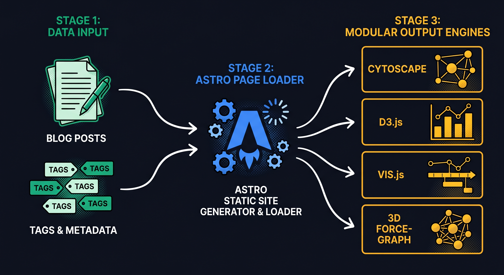
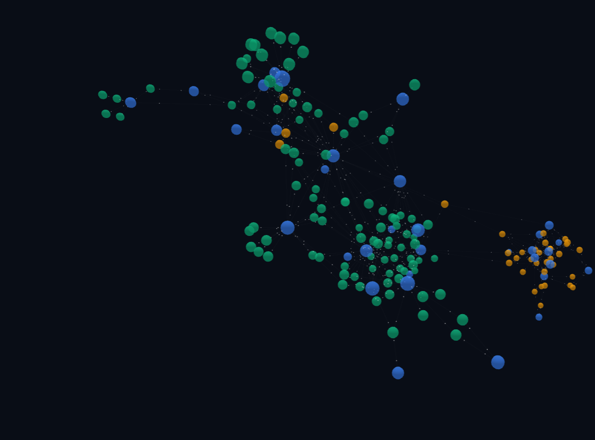
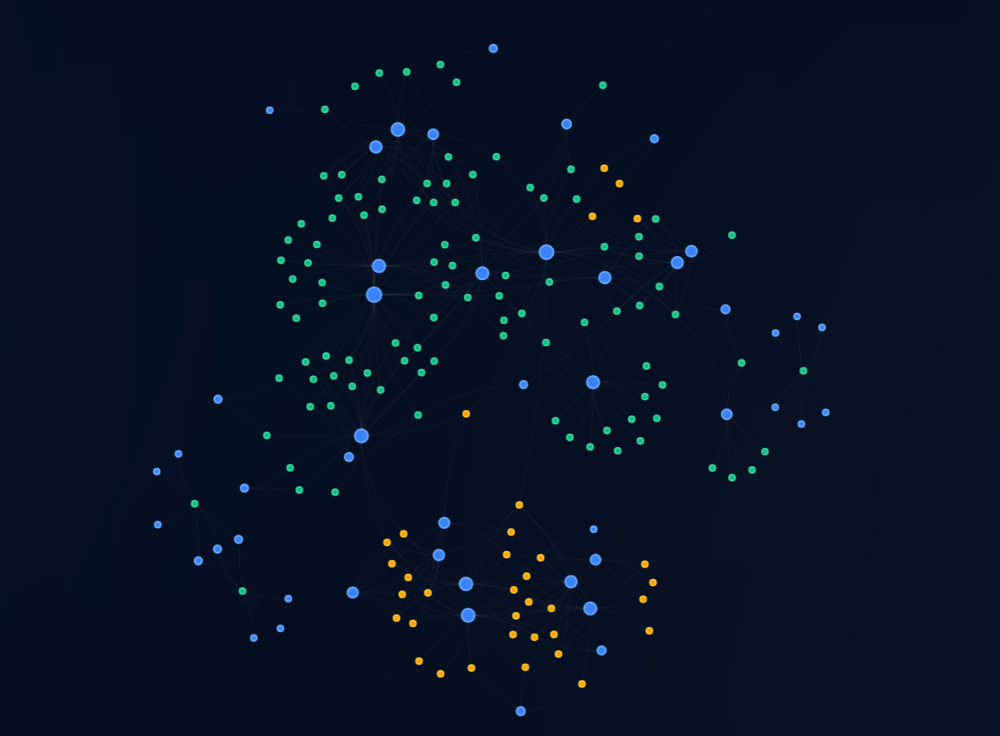

To help visitors explore the relationships between topics, blog posts, and academic publications, this website features interactive network graph visualizations. Recently, we gave this visualization system a major architectural and aesthetic overhaul. 

Instead of a monolithic script, the system now runs on a modular, multi-engine architecture supporting **Cytoscape.js**, **D3.js**, **Sigma.js**, **Vis.js Network**, and an immersive **3D Force Graph** powered by Three.js and WebGL.

Here is a technical walkthrough of how we restructured the system, implemented layout algorithms with smooth animations, added live theme-awareness, and synchronized user settings via the URL.

## 1. Modular Architecture: Decoupling the Engines



Originally, the logic for loading libraries and initializing the graphs was crammed directly inside our Astro page. This made it difficult to maintain and expand. To resolve this, we extracted the code into a modular structure where each graphing engine is defined as a standalone JavaScript ES module.

Every engine conforms to a unified interface:

```javascript
export default {
  layouts: [
    { id: 'force', label: 'Force Directed (Organic)' },
    { id: 'radial', label: 'Concentric Rings' },
    { id: 'columns', label: 'Structured Columns' }
  ],
  async init(container, payload, layout, isLight) { ... },
  updateLayout(layout, isLight) { ... },
  destroy() { ... }
}
```

The Astro template [[slug].astro](https://github.com/ghackenberg/ghackenberg.github.io/blob/3db2d5eb7c2b1c6ba4b2f0e9f472f011b9a6f981/src/pages/visualizations/%5Bslug%5D.astro) dynamically imports the selected engine at runtime using code splitting:

```javascript
const engineModule = await import(`../../content/visualizations/${type}/engine.js`);
const engine = engineModule.default;
activeInstance = await engine.init(container, payload, currentLayout, isLight);
```

This drastically reduces the initial page bundle size, loading dependencies like Three.js or Vis.js only when the user selects that specific engine.

## 2. Introducing New Engines: 3D Force Graph & Vis.js

Alongside our existing Cytoscape, D3, and Sigma engines, we introduced two new visualization engines:

### 3D Force Graph (WebGL & Three.js)
The 3D Force Graph engine ([3d-force/engine.js](https://github.com/ghackenberg/ghackenberg.github.io/blob/3db2d5eb7c2b1c6ba4b2f0e9f472f011b9a6f981/src/content/visualizations/3d-force/engine.js)) renders the network as a floating three-dimensional sphere. 



- **Volumetric Rendering**: Users can rotate, zoom, and pan around the network using an orbit controller.
- **Dynamic Particles**: To show connections actively, we enabled directional particles traveling along links.
- **Three.js Context**: Built on WebGL, it runs fluidly at 60 FPS even with complex force calculations.

### Vis.js Network (HTML5 Canvas)
The Vis.js engine ([vis-network/engine.js](https://github.com/ghackenberg/ghackenberg.github.io/blob/3db2d5eb7c2b1c6ba4b2f0e9f472f011b9a6f981/src/content/visualizations/vis-network/engine.js)) provides an incredibly smooth 2D canvas visualization.



- **Elastic Physics**: Nodes react like spring-mass dampers, settling into place with organic bouncing effects.
- **Custom Shapes & Labels**: Each node type (Tag, Post, Publication) is color-coded and sized proportionally based on its degree of connections, with custom font configurations matching our typography.
- **Interaction Events**: Handles hover states and double-clicks cleanly to navigate users directly to posts or publications.

## 3. Smooth Layout Transitions (Concentric & Columns)

A major feature of this update is the ability to toggle between three distinct layouts:
1. **Force Directed**: Nodes self-organize organically based on charge repulsion and edge attraction forces.
2. **Concentric Rings (Radial)**: Topic tags cluster in a dense inner ring, while posts and publications radiate out in an outer concentric ring.
3. **Structured Columns (Category)**: Organizes nodes into vertical columns—posts on the left, tags in the center, and publications on the right.

### Easing Coordinate Interpolation
Rather than snapping nodes instantly to new layouts (which is disorienting), we disable the physics solvers during transition and manually interpolate coordinates using a **cubic ease-in-out** function:

$$f(t) = \begin{cases} 4t^3 & \text{if } t < 0.5 \\ 1 - \frac{(-2t + 2)^3}{2} & \text{otherwise} \end{cases}$$

This is implemented in Javascript using `requestAnimationFrame`:

```javascript
animateTo(targets, duration = 600) {
  const startTime = performance.now();
  const startPositions = this.network.getPositions(); // Fetch current positions

  const step = (time) => {
    const elapsed = time - startTime;
    const progress = Math.min(elapsed / duration, 1);
    
    // Easing calculation
    const ease = progress < 0.5 
      ? 4 * progress * progress * progress 
      : 1 - Math.pow(-2 * progress + 2, 3) / 2;

    const updates = [];
    this.nodes.forEach(n => {
      const start = startPositions[n.id] || { x: 0, y: 0 };
      const target = targets[n.id];
      if (target) {
        updates.push({
          id: n.id,
          x: start.x + (target.x - start.x) * ease,
          y: start.y + (target.y - start.y) * ease
        });
      }
    });

    this.visNodes.update(updates);

    if (progress < 1) {
      this.animationFrameId = requestAnimationFrame(step);
    }
  };

  this.animationFrameId = requestAnimationFrame(step);
}
```

## 4. Theme-Aware Style Syncing

The website supports light and dark modes. Network graphs rendered on a canvas or WebGL context don't automatically update when the HTML document's class changes. 

To bridge this gap, we set up a custom listener for theme changes:

```javascript
window.addEventListener('theme-changed', () => {
  const isLight = document.documentElement.classList.contains('light');
  if (activeInstance) {
    const params = new URLSearchParams(window.location.search);
    const currentLayout = params.get('layout') || activeInstance.layouts[0].id;
    activeInstance.updateLayout(currentLayout, isLight);
  }
});
```

Within each engine, `updateLayout` updates the node and label colors, background properties, and edge styles on the fly:

- **Cytoscape**: Updates node label colors using the stylesheet selector APIs (`cy.style().selector('node').style(...)`).
- **D3**: Updates svg attributes (`nodeElements.selectAll("text").style("fill", ...)`).
- **3D Force**: Readjusts the renderer background color and edge material properties dynamically.
- **Vis.js**: Modifies datasets in batches and calls `.update()` to tell the canvas to repaint.

This guarantees that toggling between light and dark modes feels completely seamless, with no ugly canvas flashes or context losses.

## 5. URL State Synchronization

When users discover a layout they like (e.g., concentric rings in Vis.js), navigating away and returning shouldn't reset their choice. We resolved this by persisting the layout ID directly into the browser's URL query string.

When a layout is selected from the dropdown:

```javascript
selector.addEventListener('change', (e) => {
  const newLayout = e.target.value;
  if (activeInstance) {
    const url = new URL(window.location.href);
    url.searchParams.set('layout', newLayout);
    window.history.pushState({}, '', url.toString()); // Update URL without reloading
    
    const isLight = document.documentElement.classList.contains('light');
    activeInstance.updateLayout(newLayout, isLight);
  }
});
```

On page load, the Astro script parses the URL parameters to fetch the state, initializing the canvas directly with the user's preferred layout.

## Conclusion

With this modular refactoring, the graph visualization page is more robust, lighter on initial loading speeds, and visually synchronized with the rest of the website. Whether you prefer the organic physics of **Vis.js**, the raw data transparency of **D3**, or the futuristic fly-throughs of the **3D Force Graph**, the system delivers a premium, smooth interactive experience in light and dark mode alike.

Try out the different engines on the [Visualizations Panel](/visualizations)!
