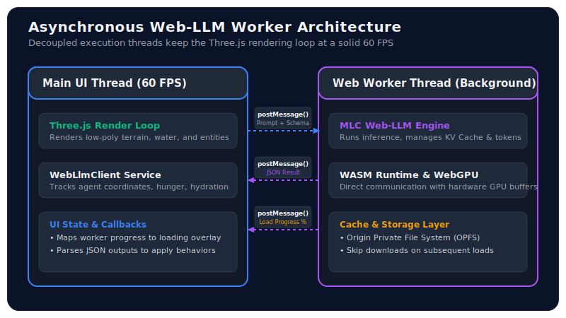

In building **Delta Dynamics**, a low-poly ecosystem simulator, we designed a world that is physically alive—featuring GPU-accelerated hydrology, dynamic terrain, and vegetation growth. However, a living world needs intelligent inhabitants. Traditional game AI relies on static finite state machines (FSMs) or behavior trees. While fast, these methods result in highly predictable, repetitive behaviors.

To create entities with genuine situational awareness and organic decision-making, we wanted to power them with Large Language Models (LLMs). But sending API requests to a server for dozens of entities running in a simulation loop is a non-starter: it introduces network latency, high running costs, and privacy concerns.

The solution? **Run the LLM entirely client-side, in the browser, powered by the user's local GPU.**

This post details how we integrated **MLC Web-LLM** via **WebGPU** into Delta Dynamics, offloaded the execution to a **Web Worker** to maintain a smooth 60 FPS Three.js rendering loop, and enforced **JSON Schema grammar constraints** to turn conversational AI into structured, executable game commands.

---

## 1. WebGPU & MLC Web-LLM: Direct Hardware Access

For years, web-based graphics and computing were restricted to WebGL, which is tailored for rendering and lacks support for compute shaders and general-purpose GPU (GPGPU) operations. The arrival of **WebGPU** changes this. It provides low-level, high-performance access to the graphics card directly from the browser, allowing us to run heavy parallel tensor calculations.

We leverage the [MLC Web-LLM](https://webllm.mlc.ai/) library, which compiles model weights and runtime execution kernels to WASM and WebGPU. This allows us to load lightweight models—such as `Qwen2.5-1.5B-Instruct` or `Llama-3-8B-Instruct`—and run inference at speeds upwards of 30-50 tokens per second on consumer laptops.

---

## 2. Decoupled Architecture: Offloading to Web Workers

LLM inference is highly compute-intensive. If we ran the Web-LLM execution loop directly on the browser's main thread, each token generation step would block the CPU. In a web application rendering a 3D scene at 60 FPS, any block longer than **16.6ms** causes visible stuttering (dropped frames). An LLM inference pass taking 200–500ms would freeze the simulation entirely.

To prevent this, we designed a **decoupled multi-threaded architecture** where the entire LLM lifecycle (initialization, weight loading, and prompt execution) is offloaded to a dedicated browser **Web Worker**.



The main thread runs the Three.js render loop and updates entity coordinates, while the worker thread handles the heavy inference pipeline. The two threads communicate asynchronously using structured message passing via `postMessage` and `onmessage`.

---

## 3. Implementing the Web Worker

Below is the implementation of our Web Worker, `webLlmWorker.ts`. It listens for messages from the main thread, initializes the `CreateEngine` engine from Web-LLM, downloads model files, and executes completion prompts.

```typescript
// src/workers/webLlmWorker.ts
import { CreateEngine, type ChatCompletionRequest, type InitProgressCallback } from "@mlc-ai/web-llm";

let engine: any = null;

// Report loading progress back to the UI thread
const reportProgress: InitProgressCallback = (report) => {
  postMessage({
    type: "progress",
    payload: {
      progress: report.progress,
      text: report.text
    }
  });
};

self.onmessage = async (event: MessageEvent) => {
  const { type, payload } = event.data;

  try {
    if (type === "init") {
      const { modelId } = payload;
      
      // Initialize the engine with the WebGPU context in the worker
      engine = await CreateEngine(modelId, {
        initProgressCallback: reportProgress,
      });

      postMessage({ type: "ready" });
    }

    if (type === "generate") {
      if (!engine) {
        throw new Error("Web-LLM engine not initialized.");
      }

      const { prompt, systemPrompt, responseFormat } = payload;

      const request: ChatCompletionRequest = {
        messages: [
          { role: "system", content: systemPrompt },
          { role: "user", content: prompt }
        ],
        temperature: 0.2, // Low temperature for deterministic behavior
        response_format: responseFormat, // Schema enforcement
      };

      const reply = await engine.chat.completions.create(request);
      const outputText = reply.choices[0].message.content;

      postMessage({
        type: "success",
        payload: {
          text: outputText,
          usage: reply.usage
        }
      });
    }
  } catch (error: any) {
    postMessage({
      type: "error",
      payload: { message: error.message || "Unknown error during inference" }
    });
  }
};
```

On the main thread, we wrap this worker in a client class (`WebLlmClient.ts`) that manages callbacks using Promises to turn message-passing into clean, async method calls:

```typescript
// src/services/WebLlmClient.ts
export class WebLlmClient {
  private worker: Worker;
  private onReadyCallback?: () => void;
  private onProgressCallback?: (progress: number, text: string) => void;
  private resolveGenerate?: (value: string) => void;
  private rejectGenerate?: (reason: any) => void;

  constructor() {
    // Initialize worker
    this.worker = new Worker(
      new URL("../workers/webLlmWorker.ts", import.meta.url),
      { type: "module" }
    );
    this.worker.onmessage = this.handleMessage.bind(this);
  }

  public init(modelId: string, onProgress: (p: number, t: string) => void): Promise<void> {
    this.onProgressCallback = onProgress;
    this.worker.postMessage({ type: "init", payload: { modelId } });
    
    return new Promise((resolve) => {
      this.onReadyCallback = resolve;
    });
  }

  public generate(prompt: string, systemPrompt: string, schema: object): Promise<string> {
    this.worker.postMessage({
      type: "generate",
      payload: {
        prompt,
        systemPrompt,
        responseFormat: { type: "json_object", schema: JSON.stringify(schema) }
      }
    });

    return new Promise((resolve, reject) => {
      this.resolveGenerate = resolve;
      this.rejectGenerate = reject;
    });
  }

  private handleMessage(event: MessageEvent) {
    const { type, payload } = event.data;

    switch (type) {
      case "progress":
        this.onProgressCallback?.(payload.progress, payload.text);
        break;
      case "ready":
        this.onReadyCallback?.();
        break;
      case "success":
        this.resolveGenerate?.(payload.text);
        break;
      case "error":
        this.rejectGenerate?.(new Error(payload.message));
        break;
    }
  }
}
```

---

## 4. Structuring AI Actions: Enforcing JSON Schemas

An LLM is naturally conversational; if you ask it to make a decision, it might reply with: *"Based on my current hunger level, I think it is best if I walk over to the river at coordinates (12, 45) to drink some water."*

In a game simulation loop, parsing conversational sentences using regex is error-prone and brittle. We need structured data. Web-LLM supports structured JSON outputs by utilizing **JSON Schema schema grammar compiler**. By passing a Zod-like JSON schema, Web-LLM forces the model to restrict its output tokens so that it strictly adheres to the specified structure.

Here is how we define the schema for our agent's decision:

```json
{
  "$schema": "http://json-schema.org/draft-07/schema#",
  "type": "object",
  "properties": {
    "action": {
      "type": "string",
      "enum": ["MOVE_TO", "DRINK", "EAT", "REST", "SOCIALIZE"]
    },
    "targetCoordinates": {
      "type": "array",
      "items": { "type": "integer" },
      "minItems": 2,
      "maxItems": 2
    },
    "reasoning": {
      "type": "string"
    }
  },
  "required": ["action", "targetCoordinates", "reasoning"]
}
```

By enforcing this schema, the model is physically incapable of outputting normal text. It is forced to output a valid JSON string matching the format:

```json
{
  "action": "MOVE_TO",
  "targetCoordinates": [12, 45],
  "reasoning": "Energy is low, going to rest near coordinates (12, 45)."
}
```

---

## 5. Feeding the World State to the LLM Prompt

In the simulation, every agent (e.g., an animal or citizen entity) runs a tick update. If an agent is idle, we serialize its local environment and internal state to feed into the LLM context.

The prompt construction follows a clean, descriptive format:

```typescript
const agentStatePrompt = `
Your current state:
- Health: ${agent.health}/100
- Hunger: ${agent.hunger}/100
- Hydration: ${agent.hydration}/100
- Energy: ${agent.energy}/100
- Position: [${agent.x}, ${agent.z}]

Nearby entities and resources:
- Nearest Water Source: Coordinates [${water.x}, ${water.z}] (Distance: ${distToWater})
- Nearest Fruit Bush: Coordinates [${food.x}, ${food.z}] (Distance: ${distToFood})
- Nearest Predator: Coordinates [${predator.x}, ${predator.z}] (Distance: ${distToPredator})

Based on these statistics and nearby hazards/resources, select your next logical action.
`;
```

The system prompt sets the roleplay context, restricting the agent to act logically based on its survival instincts (e.g., flee from predators if too close, seek water if hydration is under 30).

Once the worker returns the structured JSON, we parse it and inject it directly into the agent's behavior engine:

```typescript
const decisionStr = await llmClient.generate(agentStatePrompt, systemPrompt, actionSchema);
const decision = JSON.parse(decisionStr);

// Apply behavior
if (decision.action === "MOVE_TO") {
  agent.setPathTo(decision.targetCoordinates[0], decision.targetCoordinates[1]);
  agent.statusText = `Moving: ${decision.reasoning}`;
} else if (decision.action === "DRINK") {
  agent.drink();
  agent.statusText = `Drinking: ${decision.reasoning}`;
}
```

---

## 6. Visualizing Weight Downloads: UX Best Practices

One of the biggest hurdles of running in-browser LLMs is the initial model download. Even a small 1.5-billion-parameter model requires downloading approximately **1.2 GB to 1.8 GB** of quantized weights. 

To prevent users from thinking the web app has crashed, we must handle this load state elegantly:

1. **Persistent Caching**: Web-LLM automatically leverages the browser's **Cache API** and **Origin Private File System (OPFS)**. Once a model is downloaded, subsequent page visits load the model directly from local disk storage, skipping network requests completely.
2. **Detailed Progress UI**: We map the worker's `progress` messages to a beautiful circular loading rings or progress bar overlay.
3. **Interactive Pre-Simulation**: While the model is downloading, we allow users to shape the terrain or adjust water levels, keeping them engaged.

---

## Conclusion

Running local AI models directly in the web browser removes server hosting bills and latency issues. By leveraging WebGPU for compute power, Web Workers for asynchronous thread containment, and JSON Schema constraints for structured output, **Delta Dynamics** demonstrates that high-performance 3D graphics and complex LLM-driven behaviors can live together seamlessly in a standard web browser.

As lightweight open-source models continue to get smaller and more capable, the web browser will increasingly become a powerful, self-contained runtime for decentralized, AI-driven applications.

Try spawning LLM-driven agents on the [Delta Dynamics Simulation Panel](/projects/delta-dynamics)!
