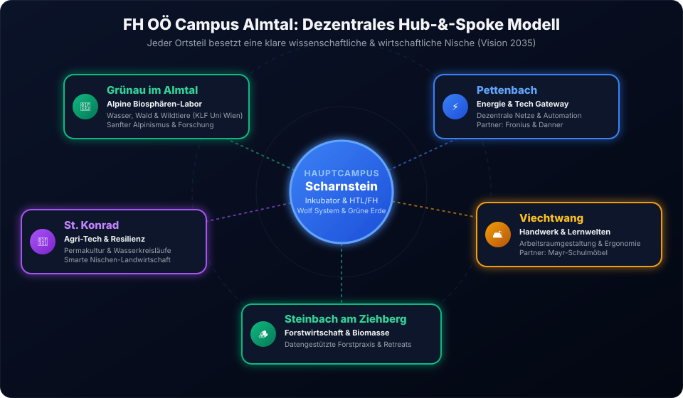
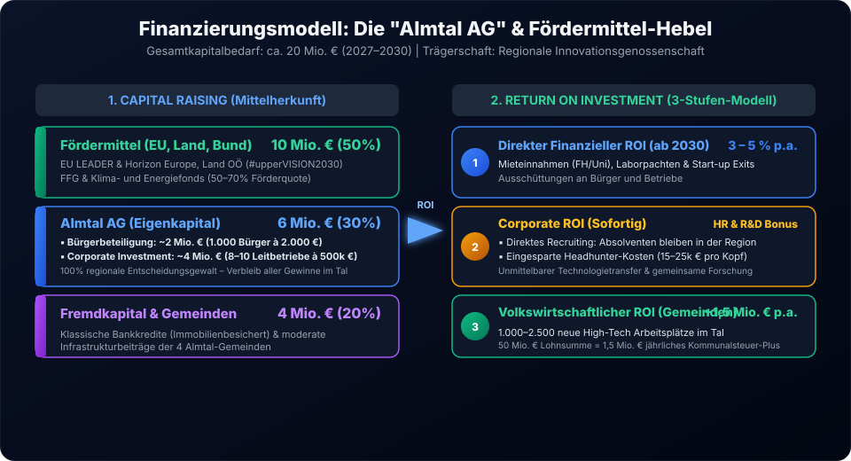
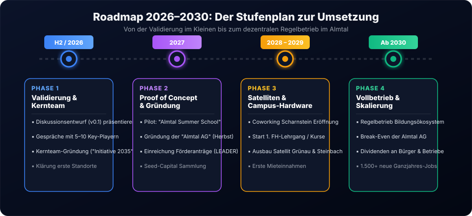

Die aktuelle Diskussion rund um die Zukunft des Kasbergs steht stellvertretend für ein tiefgreifendes regionales Strukturproblem: Der klassische Erholungstourismus gerät im Zuge des Klimawandels und sich wandelnder Freizeitgewohnheiten zunehmend unter Druck. Gleichzeitig pendeln viele unserer besten Fachkräfte und jungen Talente täglich in die oberösterreichischen Zentralräume ab. 

Wenn das Almtal wirtschaftlich, demografisch und ökologisch gesund bleiben will, reicht es nicht aus, nur über neue Sommer-Tourismuskonzepte nachzudenken. Wir müssen die **regionale Wertschöpfung grundlegend neu denken**. 

Mit dem vorliegenden Diskussionsentwurf (Version 0.1) präsentiere ich meine Vision für das Almtal als **dezentrales Reallabor** und akademisches Ökosystem: Die **FH OÖ School of Natural Sciences and Applications** (Campus Almtal 2035).

## 1. Die Kernvision: Das Almtal als dezentrales "Reallabor"

Das Almtal verfügt über einen unfairen Wettbewerbsvorteil, den kaum eine andere Region in Oberösterreich vorweisen kann: Die unmittelbare Nachbarschaft von intakter alpiner Wildnis, enormen natürlichen Ressourcen (Holz, sauberes Wasser) und echten industriellen Weltmarktführern (*Fronius*, *Wolf System*, *Grüne Erde*, *Mayr-Schulmöbel*, *Danner* etc.).

Die Vision des **Campus Almtal** verwandelt diese Ausgangslage in einen klaren Standortvorteil: Wir veredeln unsere Rohstoffe nicht mehr nur physisch vor Ort, sondern verknüpfen sie direkt mit angewandtem Wissen. Das Almtal wird zur **verlängerten Werkbank der oberösterreichischen Hochschulen** (insbesondere der FH Oberösterreich und der Universität Wien) sowie zum Testfeld für Hochtechnologie in den Bereichen:
- **Nachhaltiges Bauen & Holz-Tech**
- **Dezentrale Energienetze & Automatisierung**
- **Naturraum- & Wildtiermanagement**
- **Agri-Tech & ressourcenschonende Landwirtschaft**

## 2. Das "Hub-and-Spoke" Modell: Jeder Ort besetzt seine Stärke

Um politische Grabenkämpfe zwischen den Gemeinden zu vermeiden, baut das Konzept auf ein dezentrales **Hub-and-Spoke-Netzwerk**. Jeder Ortsteil besetzt genau jene wissenschaftliche und wirtschaftliche Nische, die perfekt zu seiner Geschichte und seinen ansässigen Leitbetrieben passt:

### Die 6 Satelliten des Campus Almtal

1. **Scharnstein (Der Inkubator & Hauptcampus):**  
   Scharnstein bildet das organisatorische Herzstück. Hier entsteht ein Bildungs-Hub (in Kooperation mit HTL/HAK und FH) für industrielles Bauen, Automatisierung und Kreislaufwirtschaft. Leitbetriebe wie *Wolf System* und *Grüne Erde* werden direkt in die praxisnahe Ausbildung eingebunden.
2. **Grünau im Almtal (Das Alpine Biosphären-Labor):**  
   Grünau fokussiert sich auf Wasser, Wald und Wildtiere. Aufbauend auf der traditionsreichen *Konrad-Lorenz-Forschungsstelle (Universität Wien)* wird Grünau zum Zentrum für ökologische Forschung, Wildtiermanagement und sanften Alpinismus.
3. **Pettenbach (Das Energie- & Tech-Gateway):**  
   Als Tor zum Almtal bietet Pettenbach mit Partnern wie *Fronius* und *Danner Wasserkraft* den idealen Standort für die Erprobung dezentraler Energienetze, Energiespeicher und Automatisierungshardware.
4. **Viechtwang (Campus für Premium-Handwerk & Lernwelten):**  
   Mit Leitbetrieben wie *Mayr-Schulmöbel* wird Viechtwang zum Zentrum für moderne Arbeitsraumgestaltung, Ergonomie und spezialisiertes Premium-Handwerk. Hier werden die Lern- und Arbeitswelten der Zukunft erforscht und produziert.
5. **Steinbach am Ziehberg (Feldlabor für Forstwirtschaft & Biomasse):**  
   Mit seiner waldreichen Topografie und Betrieben wie dem *Sägewerk Aitzetmüller* dient Steinbach als Erprobungsraum für datengestütztes Forstmanagement, nachhaltige Holznutzung und lokale Nahwärmekonzepte. Zudem bietet es Raum für akademische "Retreats".
6. **St. Konrad (Agri-Tech & Ressourcen-Resilienz):**  
   St. Konrad fokussiert sich auf Permakultur, geschlossene Wasserkreisläufe und smarte Lösungen für eine resilientere Landwirtschaft abseits der industriellen Großproduktion.

## 3. Die Campus-Hardware: Räume für Innovation & Begegnung

Ein dezentrales Ökosystem benötigt keine teuren Neubauten auf der grünen Wiese. Stattdessen aktivieren wir **bestehende Leerstände in den Ortskernen**:

- **Start-up-Zentren & Coworking (Fokus Scharnstein/Pettenbach):** Flexible Arbeitsräume und Inkubatoren in direkter Nähe zu den ansässigen Leitbetrieben.
- **Konferenz- & Seminarinfrastruktur (Fokus Grünau/Steinbach):** Infrastruktur für wissenschaftliche Tagungen, Summer Schools und Unternehmens-Retreats unter Einbindung der regionalen Gastronomie.
- **Wohnen & Leben auf Zeit:** Transformation von gefährdeten Tourismusbetten. Gasthöfe, die im Wintertourismus unter Druck stehen, erhalten als Unterkünfte für Gastdozenten, Forschergruppen und Studierende eine krisenfeste Ganzjahres-Auslastung.

## 4. Volkswirtschaftliche Perspektive & Finanzierung: Die "Almtal AG"

Ein Zukunftsprojekt dieser Größenordnung darf weder an knappen Gemeindebudgets scheitern noch von einzelnen Großinvestoren abhängig sein. Wir schlagen eine **regionale Trägergesellschaft ("Almtal AG")** in Form einer Genossenschaft oder AG vor.

### Der Kapitalbedarf von ca. 20 Mio. € bis 2030 teilt sich wie folgt auf:
- **50 % Fördermittel (ca. 10 Mio. €):** Hebelung von Förderungen aus dem Land Oberösterreich (*#upperVISION2030*, *Arbeitsplatz OÖ 2030*), EU-Programmen (*LEADER*, *Horizon Europe*) sowie Bundestöpfen (*FFG*, *Klima- und Energiefonds*).
- **30 % Almtal AG (ca. 6 Mio. €):** Setzt sich zusammen aus Bürgerbeteiligung (ca. 2 Mio. € von 1.000 Bürgern) und Corporate Investments (ca. 4 Mio. € von 8–10 regionalen Leitbetrieben).
- **20 % Fremdkapital & Gemeindebeteiligung (ca. 4 Mio. €):** Immobilienbesicherte Bankkredite und moderate Infrastrukturbeiträge der Gemeinden.

### Der Return on Investment auf 3 Ebenen:
1. **Direkter finanzieller ROI (3–5 % p.a.):** Mieteinnahmen von Hochschulen, Pacht von Start-ups und Erlöse aus Ausgründungen fließen an die Bürger und Betriebe zurück.
2. **Corporate ROI für Betriebe:** Massive Einsparung bei Rekrutierungskosten (15.000–25.000 € pro Fachkraft) und direkter Zugang zu F&E-Ergebnissen.
3. **Volkswirtschaftlicher ROI:** Erstellung von 1.500 bis 2.500 krisenfesten Ganzjahres-Arbeitsplätzen. Bei einer Lohnsumme von 50 Mio. € bedeutet das ein **jährliches Kommunalsteuer-Plus von ca. 1,5 Mio. €** für die Gemeinden im Tal.

## 5. Der Stufenplan: Roadmap 2026–2030

Um Bedenken auszuräumen und Machbarkeit schrittweise zu beweisen, folgen wir einem klaren 4-Phasen-Modell:

- **Phase 1: Validierung & Kernteam (H2/2026):** Veröffentlichung dieses Diskussionsentwurfs, Gespräche mit 5–10 Schlüsselakteuren und Gründung des Kernteams *"Initiative Almtal 2035"*.
- **Phase 2: Proof of Concept & Gründung (2027):** Durchführung des ersten sichtbaren Pilotprojekts (z. B. *"Almtal Summer School"*) im Frühjahr 2027, gefolgt von der formellen Gründung der *Almtal AG* im Herbst 2027.
- **Phase 3: Erste Satelliten & Campus-Hardware (2028–2029):** Eröffnung des ersten Coworking-Centers in Scharnstein, Start des ersten Fachhochschul-Lehrgangs und Ausbau der Satelliten in Grünau und Steinbach.
- **Phase 4: Vollbetrieb (Ab 2030):** Regelbetrieb des dezentralen Bildungs- und Wirtschaftsökosystems, Erreichen des operativen Break-Even und erste Dividendenausschüttungen.

## 6. Download & Diskussionsbeitrag

Das vollständige Visionsdokument liegt aktuell als **Version 0.1 (Initialer Diskussionsentwurf)** vor. Ich lade Vertreter aus Politik, Wirtschaft, Wissenschaft und der Almtaler Bevölkerung herzlich ein, diesen Entwurf mitzugestalten.

  <h3 class="text-xl font-bold mb-2 text-brand-blue">Visionsdokument herunterladen</h3>
  
Laden Sie das detaillierte Konzeptpapier als PDF herunter (Version 0.1, Stand Juli 2026):

  <a 
    href="/documents/Vision_Almtal_2035.pdf" 
    target="_blank"
    download="Vision_Almtal_2035_v0.1.pdf"
    style="color: #ffffff !important; text-decoration: none;"
    class="inline-flex items-center space-x-2 px-6 py-3 rounded-xl font-bold !text-white !no-underline bg-brand-blue hover:bg-blue-600 transition-all shadow-lg hover:shadow-brand-blue/25"
  >
    <svg class="w-5 h-5 text-white" fill="none" stroke="currentColor" viewBox="0 0 24 24">
      <path stroke-linecap="round" stroke-linejoin="round" stroke-width="2" d="M12 10v6m0 0l-3-3m3 3l3-3m2 8H7a2 2 0 01-2-2V5a2 2 0 012-2h5.586a1 1 0 01.707.293l5.414 5.414a1 1 0 01.293.707V19a2 2 0 01-2 2z"></path>
    </svg>
    Vision Almtal 2035 (PDF herunterladen)
  </a>

Ich freue mich über Ihr Feedback, Ihre Anregungen und interessante Kooperationsgespräche!
