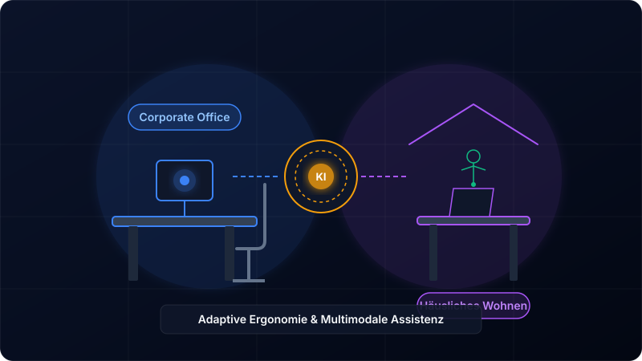
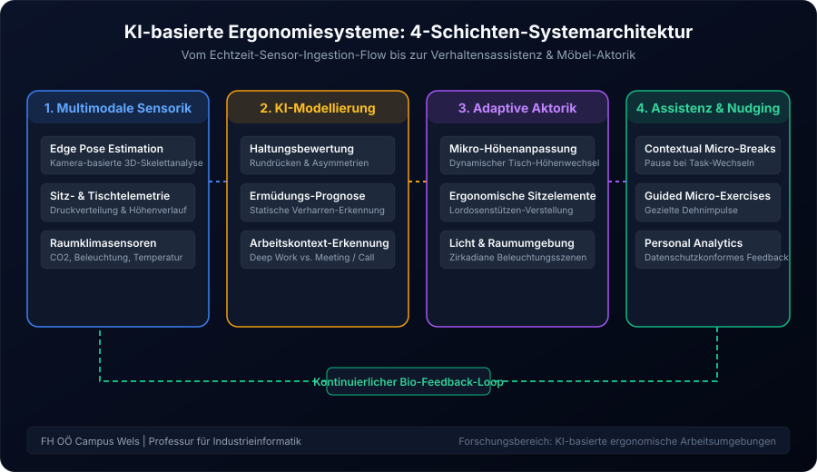

Die Moderne Arbeitswelt ist geprägt von Flexibilität und zeitortsunabhängigem Arbeiten. Während sich Arbeitsinhalte, digitale Tools und Kommunikationskanäle in rasantem Tempo weiterentwickelt haben, hinken unsere physischen Arbeitsplätze diesem Wandel oft hinterher. Sowohl im klassischen Unternehmensbüro als auch im häuslichen Homeoffice verbringen Wissensarbeiter viele Stunden in weitgehend statischen Körperhaltungen. 

Klassische Ergonomie-Ansätze stoßen hier an ihre Grenzen: Ein höhenverstellbarer Schreibtisch oder ein ergonomischer Bürostuhl entfalten ihre Wirkung nur dann, wenn sie von den Anwendern auch aktiv und korrekt eingestellt werden. Zudem berücksichtigte die traditionelle Ergonomie bislang kaum, wie sich Ermüdung, Haltungsmuster, kognitive Belastung und physiologische Zustände im Tagesverlauf dynamisch verändern.

An unserer **Professur für Industrieinformatik an der FH OÖ Campus Wels** widmen wir uns daher einem zentralen Forschungsthema der Zukunft: Der **Entwicklung KI-basierter ergonomischer Arbeitsumgebungen**, die sich durch multimodale Sensorik, lernende Algorithmen und adaptive Aktorik kontinuierlich und unaufdringlich an den Menschen anpassen.

## 1. Das Kernproblem: Statische Ergonomie trifft auf dynamische Menschen

Sowohl im Corporate Office als auch in der häuslichen Wohnumgebung lassen sich prägnante ergonomische Herausforderungen beobachten:

- **Das "Verharren"-Phänomen:** Selbst wer über einen ergonomischen Steh-Sitz-Tisch verfügt, verharrt oft stundenlang in derselben Position. Die statische Muskelanspannung führt zu Durchblutungsstörungen, Verspannungen im Nacken- und Lendenwirbelbereich sowie zu frühzeitiger Ermüdung.
- **Unzulänglichkeiten im Homeoffice:** In häuslichen Wohnräumen sind die Voraussetzungen oft noch komplexer. Nicht jede Wohnung bietet Platz für ein separates Arbeitszimmer. Häufig wird am Esszimmertisch oder auf Provisorien gearbeitet. Lichtverhältnisse, Raumklima und Sitzgelegenheiten entsprechen selten arbeitsmedizinischen Idealstandards.
- **Fehlende Rückkopplung:** Nutzer merken Haltungsfehler meist erst dann, wenn Schmerzen oder Muskelverspannungen eintreten. Ein rechtzeitiges, präventives Biofeedback fehlt in der Regel.

Unsere Forschung setzt genau an dieser Schnittstelle an: Wir wandeln die Arbeitsumgebung von einem passiven Mobiliar in ein **aktives, lernendes Assistenzsystem** um, das Prävention im Alltag verankert.

## 2. Die 4-Schichten-Systemarchitektur

Um eine transparente, datenschutzkonforme und reaktionsschnelle Steuerung zu gewährleisten, basiert unser Forschungsansatz auf einer modularen, vierstufigen Systemarchitektur.

### Schicht 1: Multimodale Sensorik & Edge-Erfassung (Privacy-First)
Um Haltung und Umgebungsfaktoren präzise zu erfassen, kombinieren wir unterschiedliche Sensor modalitäten:
- **Edge Computer Vision:** Leichtgewichtige KI-Modelle zur 3D-Pose-Estimation erfassen Oberkörperneigung, Schulterasymmetrien und Kopfhaltung. *Strikter Grundsatz:* Sämtliche Bilddaten werden direkt lokal auf der Edge-Hardware (z.B. Kamera-MCU) verarbeitet und unverzüglich verworfen. Es werden ausschließlich anonymisierte Vektorkoordinaten weitergeleitet.
- **Tisch- & Stuhltelemetrie:** In Sitzflächen und Rückenlehnen integrierte Druckfolien und Kraftmesssensoren ermitteln die Lastverteilung und erkennen Fehlhaltungen (z.B. einseitiges Entlasten oder Überstrecken).
- **Umwelt- & Klimasensorik:** Erfassung von CO2-Konzentration, Beleuchtungsstärke, Farbtemperatur und Lärmpegel zur ganzheitlichen Bewertung der Raumqualität.

### Schicht 2: KI-Analyse & Dynamische Belastungsmodellierung
Die erfassten Sensordaten fließen in ein biologisch motiviertes Belastungsmodell ein. Mithilfe von Methoden des maschinellen Lernens (z.B. Temporal Convolutional Networks und Decision Trees) analysiert das System:
- **Ergonomie-Indizes:** Echtzeit-Bewertung von Haltungsabweichungen und Dauer statischer Belastungsphasen.
- **Arbeitskontext-Erkennung:** Unterscheidung zwischen konzentrierter Einzelarbeit (Tippen/Programmieren), Bildschirm-Lesepassagen und aktiver Teilnahme an Videokonferenzen.
- **Ermüdungsprognose:** Frühzeitige Signalerkennung von Absacken der Haltung durch ermüdende Rumpfmuskulatur.

### Schicht 3: Adaptive Aktorik & Mikrostimulation
Statt den Nutzer kontinuierlich mit Warnhinweisen zu stören, greift das System auf physische und umgebungsbasierte Stellglieder zurück:
- **Mikro-Höhenanpassung:** Der Motor-Schreibtisch führt unmerkliche Höhenveränderungen im Bereich von wenigen Millimetern über Zeiträume von 20 bis 30 Minuten durch. Dies regt Mikrobewegungen der Tiefenmuskulatur an, ohne den Arbeitsfluss (Flow) zu unterbrechen.
- **Dynamische Stuhlelemente:** Automatische Justierung von Lordosenstützen oder Sitzneigungen zur Entlastung der Bandscheiben.
- **Zirkadianes Lichtmanagement:** Dynamische Anpassung der Farbtemperatur (von kühlem Konzentrationslicht bis zu warmem Licht gegen Nachmittag) zur Unterstützung des natürlichen Biorythmus.

### Schicht 4: Mensch-zentrierte Assistenz & Nudging
Wenn physische Anpassungen nicht ausreichen, tritt die digitale Assistenz in Interaktion mit dem Menschen:
- **Contextual Micro-Breaks:** Pause- und Bewegungsempfehlungen werden nicht nach starren Zeitintervallen (z.B. alle 60 Min.) gegeben, sondern exakt in natürlichen Aufgabenwechseln (z.B. nach dem Schließen eines Dokumentes oder Beenden eines Telefonats).
- **Geführte Dehnübungen:** Kurze, gezielte Mikroubungen auf dem Bildschirm, abgestimmt auf die zuvor identifizierte Muskelbelastung.

## 3. Büroarbeitsumgebung vs. Häusliche Wohnumgebung: Eine vergleichende Analyse

Ein zentraler Fokus unserer Forschungsarbeit liegt auf den unterschiedlichen Rahmenbedingungen im Corporate Office im Vergleich zur häuslichen Wohnumgebung. Ein Universalsystem greift hier zu kurz; die Anforderungen unterscheiden sich grundlegend:

| Anforderungsdimension | Büroarbeitsumgebung (Corporate Office) | Häusliche Wohnumgebung (Homeoffice) |
| :--- | :--- | :--- |
| **Raum- & Möbelkontext** | Standardisierte Büromöbel, dedizierte Arbeitsflächen, oft Shared-Desking / Hot-Desking. | Variable Raumbedingungen, multifunktionale Nutzung (z.B. Esszimmer), oft eingeschränktes Platzangebot. |
| **Sensorkonfiguration** | Fest installierte Sensor-Knoten am Arbeitsplatz, Anbindung an Gebäudeleittechnik. | Kompakte, agile Edge-Kits, universell an Bestandsmöbeln nachrüstbar (Retrofit). |
| **Nutzerprofil-Management** | Schnelle Authentifizierung & Roaming von Einstellungen via RFID/NFC/BLE beim Platzwechsel. | Individuelles Nutzerprofil, Nahtloser Wechsel zwischen Arbeits- und Freizeitmodus. |
| **Datenschutz & Akzeptanz** | Strikte BGM-Compliance, aggregierte & anonymisierte Kennzahlen für den Betrieb. | Absoluter Fokus auf lokale Datensouveränität (keine Rohdatenübertragung aus dem privaten Wohnraum). |
| **Umgebungssteuerung** | Steuerung von Zonen-Beleuchtung und zentraler HVAC-Lüftung. | Ansteuerung smarter Verbraucher über offene IoT-Standards (z.B. Matter / Zigbee). |

## 4. Interdisziplinäre Forschung am FH OÖ Campus Wels

Die Entwicklung KI-basierter ergonomischer Arbeitsumgebungen erfordert einen stark **interdisziplinären Ansatz**. Am **FH OÖ Campus Wels (School of Engineering)** bündeln wir Kompetenzen aus mehreren Fachbereichen:

- **Industrieinformatik & Software Engineering:** Entwicklung der verteilten Software-Architekturen, Edge-AI-Pipelines und datenschutzkonformen Protokolle.
- **Mechatronik & Sensorik:** Integration präziser Sensorteleskope, Druckmessmatten und geräuscharmer Aktorik.
- **Human Factors & Ergonomie:** Validierung der Bio-Feedback-Schleifen und Nutzerakzeptanz in Zusammenarbeit mit Arbeitsmediziner*innen und Sportwissenschafter*innen.

Durch den Aufbau von **Reallaboren (Living Labs)** testen wir Prototypen unter realistischen Bedingungen – sowohl in Testbüros am Campus als auch in realen Homeoffice-Szenarien unserer Projektpartner.

## 5. Fazit & Ausblick

Die Arbeitsumgebung der Zukunft ist weder ein starrer Holztisch noch ein isoliertes technisches Gadget. Sie ist ein **intelligentes, adäquates Ökosystem**, das den Menschen aktiv schützt, ohne ihn zu bevormunden.

Mit unserer Forschung an der FH OÖ Campus Wels leisten wir einen Beitrag dazu, Muskel-Skelett-Erkrankungen – eine der Hauptursachen für gesundheitsbedingte Ausfälle im Berufsleben – nachhaltig zu reduzieren. Indem wir KI-gestützte Ergonomie sowohl für das professionelle Büro als auch für die häusliche Wohnumgebung erschwinglich, sicher und benutzerfreundlich gestalten, schaffen wir die Basis für gesundes und produktives Arbeiten im digitalen Zeitalter.

*Haben Sie Fragen zu unseren Forschungsprojekten oder Interesse an einer Kooperation im Bereich Smart Workplace & KI-Ergonomie? Kontaktieren Sie uns gerne am FH OÖ Campus Wels!*
