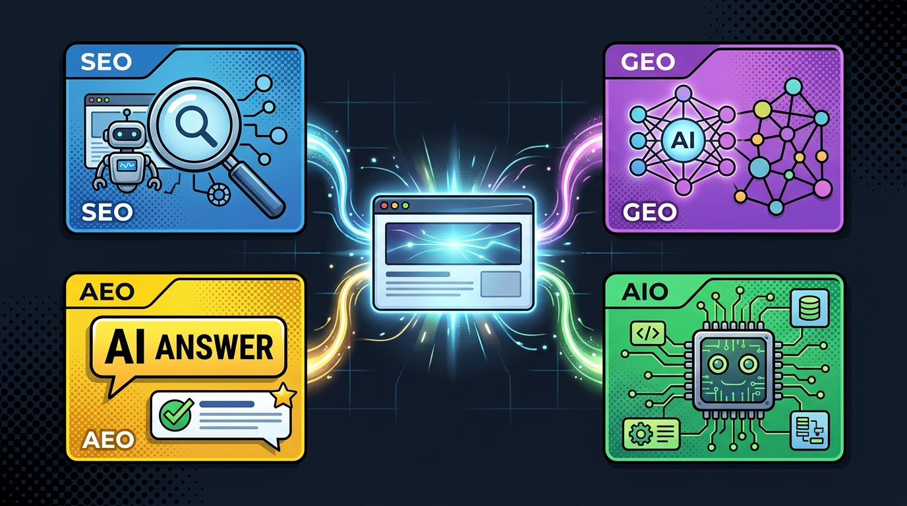

Die Art und Weise, wie Menschen und Maschinen Informationen im Internet suchen und verarbeiten, hat sich grundlegend verändert. Während vor wenigen Jahren die klassische Suchmaschinenoptimierung (SEO) der alleinige Standard war, um im Netz gefunden zu werden, bestimmen heute **Generative AI Engines** (wie ChatGPT Search, Perplexity, Claude und Gemini) sowie **Answer Engines** (wie Google AI Overviews) maßgeblich die Informationsbeschaffung.

Damit eine persönliche, wissenschaftliche oder unternehmerische Website im modernen KI-Zeitalter sichtbar, zitierfähig und maschinenlesbar bleibt, reicht SEO alleine nicht mehr aus. Wir müssen Websites multidimensional optimieren: für **SEO**, **GEO**, **AEO** und **AIO**.

In diesem Artikel erklären wir die vier Begriffe kurz und zeigen anschließend Schritt für Schritt, wie wir diesen Ansatz auf dieser Website ([hackenberg.tech](https://hackenberg.tech), entwickelt auf Basis des modernen Web-Frameworks Astro) strategisch und technisch umgesetzt haben.



## 1. Was unterscheidet SEO, GEO, AEO und AIO? Die vier Dimensionen im Vergleich

Während traditionelles SEO auf Crawler-Indizes und Klicks abzielt, optimieren GEO, AEO und AIO auf generative Synthesen, direkte Antwort-Snippets und maschinenlesbare Agenten-APIs. Wer heute im Web nachhaltig sichtbar bleiben will, muss menschliche User Experience mit maschinenlesbaren Ingestion-Schnittstellen (`llms.txt`, JSON-LD, Tabellensynthese) verbinden.

| Dimension | Primäre Zielgruppe | Technische Kernmetriken | Hauptwerkzeuge & Standards |
| :--- | :--- | :--- | :--- |
| **SEO** (Search Engine Optimization) | Klassische Web-Crawler (Google, Bing) | Ladezeiten (CWV), HTML-Hierarchie, Backlinks, Meta-Tags | XML-Sitemaps, Google Search Console, OpenGraph |
| **GEO** (Generative Engine Optimization) | Generative Suchmaschinen (Perplexity, ChatGPT) | Zitationsrate, Wissensgraphen-Verankerung, Entity-Dichte | `llms.txt`, `llms-full.txt`, `sameAs`-Schemas |
| **AEO** (Answer Engine Optimization) | Direct-Answer-Engines (Google AI Overviews) | Direct-Answer-Dichte (40–60 Wörter), Tabellensynthese | Answer-First-Muster, FAQ-Schemas, Aufzählungen |
| **AIO** (Artificial Intelligence Optimization) | Autonome Agenten & RAG-Pipelines | Strukturierte Tool-Calls, deterministische Extraktion | Model Context Protocol (MCP), Manifest-APIs |

### 1. SEO (Search Engine Optimization)
* **Zielgruppe**: Klassische Web-Crawler von Google, Bing und DuckDuckGo.
* **Kernfokus**: Technische Crawlbarkeit, saubere HTML5-Hierarchie (`<h1>`–`<h6>`), schnelle Ladezeiten (Core Web Vitals), mobile Responsivität, OpenGraph-Tags, XML-Sitemaps und Keyword-Relevanz.

### 2. GEO (Generative Engine Optimization)
* **Zielgruppe**: Generative KI-Suchmaschinen und RAG-Systeme (Retrieval-Augmented Generation) wie Perplexity, ChatGPT Search, Claude und Gemini.
* **Kernfokus**: Standardisierte Ingestion-Schnittstellen wie `llms.txt` und `/llms-full.txt`, eindeutige Knowledge-Graph-Verknüpfungen (`sameAs`), direkte Zitationsfähigkeit, Verifizierung von Urheberschaft und explizite Bot-Freigaben in der `robots.txt`.

### 3. AEO (Answer Engine Optimization)
* **Zielgruppe**: Direct Answer Engines, Featured Snippets und Sprachassistenten (Siri, Alexa, Google AI Overviews).
* **Kernfokus**: Das „Answer-First“-Muster (prägnante 40–60 Wörter Kernaussagen direkt unter Überschriften), strukturierte FAQs mit `FAQPage`-Schema sowie übersichtliche Datentabellen und Aufzählungslisten.

### 4. AIO (Artificial Intelligence Optimization)
* **Zielgruppe**: Autonome KI-Agenten, RAG-Pipelines und automatisierte Web-Scraper.
* **Kernfokus**: Maschinenlesbare Manifest-APIs (`/content-manifest.json`), tiefgreifendes JSON-LD Schema.org Markup (`Person`, `ScholarlyArticle`, `SoftwareApplication`, `Course`, `Service`) und starker Nachweis von E-E-A-T (Experience, Expertise, Authoritativeness, Trustworthiness).

## 2. Wie sieht unser strategischer und technischer Umsetzungsansatz aus?

Um diese Website ([hackenberg.tech](https://hackenberg.tech)) systematisch für alle vier Dimensionen aufzustellen, haben wir eine Architektur umgesetzt, die sowohl menschlichen Besuchern eine erstklassige UX bietet als auch Maschinen maximale Transparenz garantiert.

### Schritt 1: Das maschinenlesbare Fundament (`llms.txt` & `llms-full.txt`)
Gemäß dem aufkommenden Web-Standard [llmstxt.org](https://llmstxt.org) haben wir zwei zentrale Text-Dateien bereitgestellt:
- **`public/llms.txt`**: Eine strukturierte Übersicht über Dr. Georg Hackenberg, Hauptforschungsgebiete, Kernprojekte (wie CADdrive, unsere Cloud-Plattform für CAD-Kollaboration, und Mentawise, unsere Plattform für kognitives Training) und die Navigationsstruktur der Website.
- **`src/pages/llms-full.txt.ts`**: Ein dynamischer Endpunkt, der beim Aufruf von `/llms-full.txt` den gesamten Content-Corpus der Website (alle Blogbeiträge, Publikations-Abstracts, Kursübersichten, Softwareprojekte und Beratungsleistungen) in einer einzigen sauberen Markdown-Datei aggregiert. Dadurch können RAG-Engine-Crawler den vollständigen Inhalt mit einem einzigen Request erfassen.

### Schritt 2: Eindeutige Identitäten via JSON-LD Schema.org Markup
Um Verwechslungen bei KI-Modellen zu vermeiden und Dr. Georg Hackenberg als eindeutige Entität im globalen Wissensgraphen zu verankern, haben wir über eine wiederverwendbare Astro-Komponente typisierte Schema.org-Daten integriert:
- **`Person` & `ProfilePage`**: Auf der Startseite mit Verknüpfung zu Affiliationen (FH Oberösterreich) und externen Profilen (`sameAs`: ORCID, Google Scholar, DBLP – die weltweite Informatik-Bibliografie, GitHub, LinkedIn, YouTube).
- **`BlogPosting` & `BreadcrumbList`**: Auf allen Blogbeiträgen für Autor, Veröffentlichungsdatum und Pfadnavigation.
- **`ScholarlyArticle`**: Auf allen Forschungspublikationen inklusive Autorenliste, BibTeX-Metadaten und Verlag-Links.
- **`SoftwareApplication`**: Auf Projekten wie CADdrive und Mentawise mit Repositories und Anwendungs-Kategorien.
- **`Course`**: Auf akademischen Lehrveranstaltungen mit Lehrzielen und Anbietern.
- **`Service`**: Auf Beratungs- und Workshop-Angeboten.

### Schritt 3: KI-Bot-Freigaben & RSS 2.0 Syndikation
In der `public/robots.txt` wurden KI-Such-Crawler explizit freigeschaltet:
```txt
User-agent: GPTBot
Allow: /

User-agent: PerplexityBot
Allow: /

User-agent: ClaudeBot
Allow: /

User-agent: Google-Extended
Allow: /

# LLM Standard Definition
# llms.txt: https://hackenberg.tech/llms.txt
# llms-full.txt: https://hackenberg.tech/llms-full.txt
```
Zusätzlich generiert `@astrojs/rss` unter `/rss.xml` ein valides RSS 2.0 XML-Feed für Feed-Reader und automatisierte Aggregatoren.

### Schritt 4: „Answer-First“-Muster & FAQ-Integration (AEO)
Für Antwort-Engines wie Google AI Overviews und Perplexity haben wir auf Detailseiten prägnante **Key Takeaways / Executive Summary**-Blöcke integriert. Zudem nutzt die Website auf der Startseite ein strukturiertes `FAQPage`-Schema für direkte Antworten auf häufige Fragen. Dieses Answer-First-Muster adressiert nicht nur maschinelle RAG-Extraktoren, sondern begegnet auch der menschlichen Reizüberflutung – ein kognitives Phänomen, das wir in unserer interdisziplinären Analyse zur [Psychologie der modernen Informationstechnologie](/posts/2026_09_01_psychologie_der_modernen_informationstechnologie/) detailliert aufschlüsseln.

### Schritt 5: Maschinenlesbares Content-Manifest (`/content-manifest.json`)
Der Endpunkt `/content-manifest.json` wurde erweitert, sodass autonome KI-Agenten das Verzeichnis der Website programmatisch abfragen und filtern können.

## 3. Fazit

Die Zukunft des Web-Engineerings liegt in der Symbiose aus **ästhetischer Experience für Menschen** und **perfekter Strukturierung für Maschinen**. Durch die Kombination aus klassischem SEO, generativer Optimierung (GEO), direkter Antwortbereitschaft (AEO) und strukturierter KI-Vorbereitung (AIO) bleibt diese Website auch im Zeitalter intelligenter Agenten bestens auffindbar und zitierfähig.
