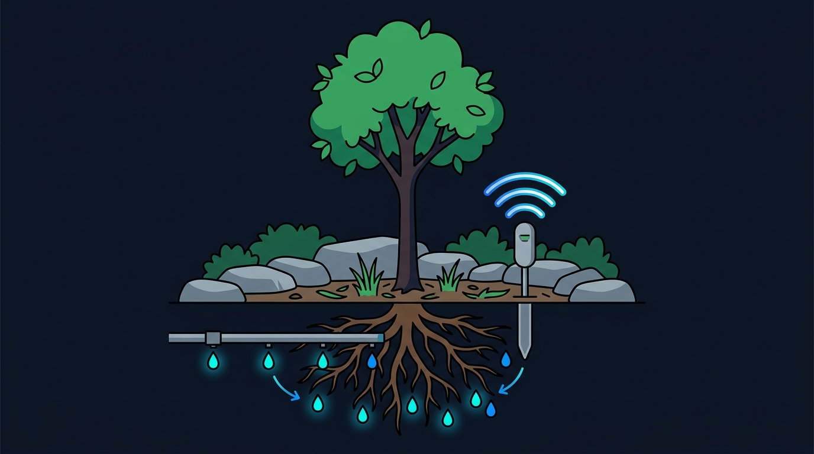
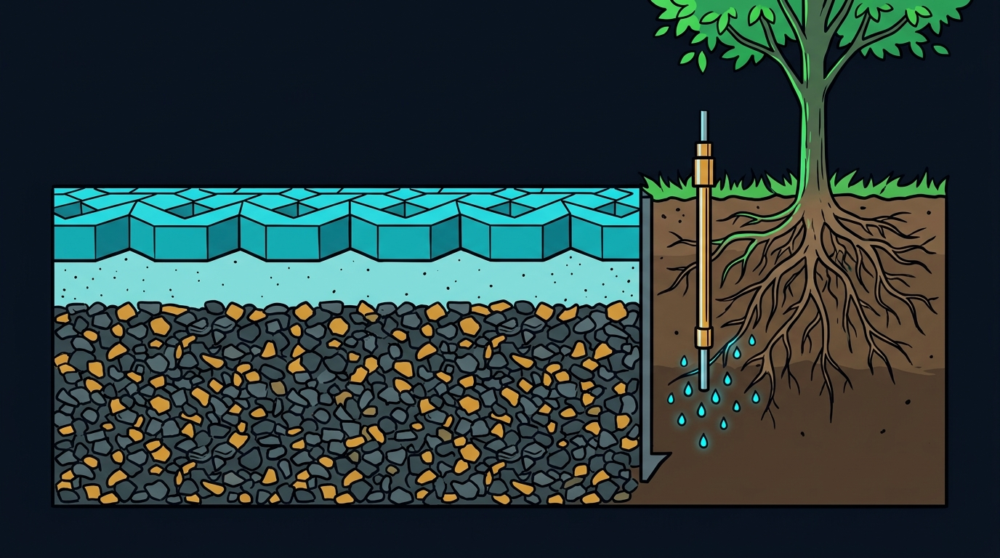
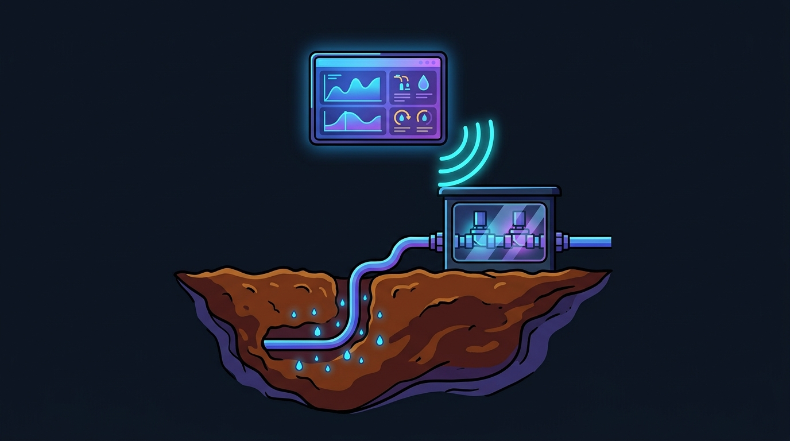

Urbane Grünflächen und private Außenanlagen stehen vor einem fundamentalen Zielkonflikt: Einerseits verlangen Einfahrten, Vorplätze und Parkflächen eine **hohe bauliche Tragfähigkeit für PKW- und Lieferverkehr**. Andererseits benötigen Solitärbäume – wie etwa die beliebte Kupfer-Felsenbirne (*Amelanchier lamarckii*) – ein **ausreichendes Wurzelraumvolumen mit intakter Porenstruktur**, kontinuierlicher Sauerstoffversorgung und bedarfsgerechtem Wasserhaushalt.

Konventionelle Bewässerungsmethoden stoßen in solchen Mischzonen schnell an physikalische Grenzen:
- **Oberflächliche Bewässerung** verdunstet an heißen Sommertagen zu bis zu $60\text{--}80\,\%$ ungenutzt an der Pflaster- oder Rindenmulchoberfläche (Evapotranspiration).
- **Verdichteter Baugrund** unter Verkehrsflächen erstickt Feinwurzeln und verhindert das Versickern von Niederschlagswasser in tiefere Schichten.
- **Flachwurzelbildung:** Oberflächliche Wassergaben animieren Bäume dazu, ihre Wurzeln direkt unter die Pflasterdecke zu legen, was langfristig zu schweren Pflasterschäden und verminderter Standfestigkeit führt.

In diesem Beitrag stellen wir ein ganzheitliches mechatronisches und bodenbauliches Gesamtkonzept vor: **Die Kombination aus strukturell tragfähigem, überbaubarem Baumsubstrat, unterirdischer Unterflur-Tropfbewässerung, variablen Tiefenlanzen und einer Edge-integrierten Smart-Home-Regelung.**

## 1. Bautechnische Bodenstruktur: Wurzelraum unter befahrbaren Pflasterflächen

Um Verkehrsflächen dauerhaft befahrbar zu halten, ohne das Wurzelwachstum abzuschnüren, ist ein präzise dimensionierter Schichtenaufbau nach den Richtlinien der FLL (Forschungsgesellschaft Landschaftsentwicklung Landschaftsbau e.V.) erforderlich.

### Der Schichtenaufbau im Detail

1. **Sickerfähiges Öko-Pflaster (ca. 10 cm):**  
   Verbundsteinpflaster mit breiten, splittverfüllten Sickerfugen oder porösem Pflastergefüge. Dies erlaubt die direkte Vorort-Versickerung moderater Niederschläge und entlastet das kommunale Kanalnetz.
2. **Bettungsschicht (3–5 cm):**  
   Brechsand-Splitt-Gemisch (Körnung 0/5 oder 1/3 mm) zur kraftschlüssigen Lastübertragung und gleichmäßigen Pflasterverlegung.
3. **Überbaubares Baumsubstrat Klasse 2 (min. 50–80 cm Mächtigkeit):**  
   Das Herzstück des Wurzelraums unter versiegelten bzw. befahrbaren Flächen. Dieses Substrat besteht aus einem mineralischen Korngerüst (z. B. Lava, Bims, gebrochener Naturstein) mit definiertem Porenvolumen und einer organischen Komponente (Kompost/Oberbodenanteil). Selbst nach mechanischer Verdichtung zur Aufnahme von Verkehrslasten (Verdichtungsgrad $D_{\text{Pr}} \ge 95\text{--}97\,\%$) bleibt ein lufterfülltes Porenvolumen von über $15\,\%$ erhalten. Feinwurzeln können ungehindert atmen und in die Tiefe vordringen.
4. **Vertikale Wurzelsperre (Root Barrier):**  
   Hochdichte HDPE-Platten (z. B. $1\text{--}2\,\text{mm}$ stark), die parallel zur Pflasterkante oder entlang von Leitungstrassen eingebracht werden. Sie lenken aggressive Flachwurzeln gezielt nach unten ab und verhindern das Aufhebeln von Pflasterbelägen.
5. **Unverdichteter natürlicher Baugrund:**  
   Dient als tief liegender Sicker- und Verbindungshorizont für die Tiefenwurzeln des Baumes.

## 2. Präzise Tiefenbewässerung: Unterflur-Tropfleitung vs. Tiefenlanze

Um Wasser verlustfrei direkt dorthin zu bringen, wo Pflanzen es aufnehmen – in die Saug- und Feinwurzelzone in $30\text{ bis }70\,\text{cm}$ Tiefe –, kommen zwei komplementäre hydraulische Verfahren zum Einsatz:

### A. Unterflur-Tropfbewässerung (Subsurface Drip Irrigation, SDI)

Im Wurzelraum wird ein spezieller Unterflur-Tropfschlauch schnecken- oder ringförmig um den Wurzelballen verlegt:
- **Druckkompensation (PC):** Integrierte Druckkompensations-Membranen stellen sicher, dass jeder Tropfer über die gesamte Leitungslänge exakt die gleiche Wassermenge (z. B. $1{,}6\text{ bis }2{,}3\,\text{l/h}$) abgibt – unabhängig von Vordruck und Geländeneigung.
- **Wurzeleinwuchssperre (Copper-Shield / Rootguard):** Chemisch-physikalische Barrieren oder Kupferoxid-Inlays an den Tropfauslässen verhindern, dass Pflanzenwurzeln in die Emitteröffnungen einwachsen und diese verstopfen.
- **Vakuum- und Rücksaug-Schutz (Anti-Siphon):** Beim Abschalten des Wasserdrucks verhindert eine integrierte Membran das Einsaugen von feinen Bodenpartikeln in den Schlauch.

### B. Nachrüstbare Tiefenbewässerungslanze (Gießlanze)

Für bestehende Gehölze oder punktuelle Tiefenversorgung bietet sich die Installation von Tiefenlanzen an:
- **Variable Einstichtiefe:** Edelstahl- oder formstabile PE-Lanzen werden vertikal in das Substrat eingebracht.
- **Direktinjektion:** Das Wasser tritt über eine perforierte Injektionszone in $40\text{--}75\,\text{cm}$ Tiefe aus und befeuchtet die unteren Bodenschichten, ohne die Oberfläche zu benetzen.
- **Keine Oberflächenerosion & kein Unkraut:** Da die oberste Bodenschicht trocken bleibt, wird Unkrautkeimung drastisch reduziert und das Auswaschen von Mulchschichten verhindert.

## 3. IoT- und Smart-Home-Systemarchitektur

Ein energie- und wassereffizientes System lebt von der intelligenten Verknüpfung von Messwerten, Aktorik und Regelungsalgorithmen.

### 1. Sensorik & Telemetrie
- **Kapazitive Bodenfeuchtesensoren (FDR/TDR-Prinzip):** In verschiedenen Tiefen ($20\,\text{cm}$ und $50\,\text{cm}$) positioniert, erfassen sie die volumetrische Bodenfeuchte ($\theta$ in Vol.-%) in Echtzeit.
- **Kabellose Signalübertragung:** Extrem stromsparende Funkprotokolle (Zigbee, Thread oder LoRaWAN) ermöglichen mehrjährigen Batteriebetrieb der Erdsensoren.

### 2. Dezentrale Aktorik & Ventilboxen
- **24V AC bistabile oder stromlos geschlossene Magnetventile:** Gewährleisten sicheres, leckagefreies Schalten der einzelnen Bewässerungskreise (z. B. getrennte Zonen für *Einfahrt-Bäume*, *Hecken* und *Staudenbeete*).
- **Integrierte Impuls-Durchflussmesser (Flow Meter):** Digitale Durchflussmesser erfassen das tatsächlich ausgebrachte Wasservolumen in Litern. Treten Abweichungen zwischen Soll- und Ist-Durchfluss auf (z. B. Rohrbruch oder verstopfter Filter), schaltet das System die Zone automatisch ab und sendet eine Push-Warnung an das Dashboard.

### 3. Edge-Server & Prädiktive Regelungslogik
Der zentrale Edge-Controller führt alle Telemetriedaten zusammen und errechnet dynamisch den Bewässerungsbedarf anhand des **Bodenwasserbilanz-Modells**:

$$\Delta W = P_{\text{eff}} + I_{\text{drip}} - ET_c - D_{\text{deep}}$$

Dabei gilt:
- $\Delta W$: Veränderung des Bodenwasserspeichers
- $P_{\text{eff}}$: Effektiver natürlicher Niederschlag
- $I_{\text{drip}}$: Zugeführte Bewässerungsmenge (Liter)
- $ET_c$: Kulturspezifische Evapotranspiration ($ET_c = K_c \cdot ET_0$)
- $D_{\text{deep}}$: Tiefensickerung unter die Wurzelzone

Das System bewässert ausschließlich in den kühlen Nacht- oder frühen Morgenstunden ($03:00\text{--}06:00\,\text{Uhr}$), wenn der hydrostatische Druck im Pflanzengewebe optimal ist und keine Verdunstungsverluste auftreten. Bei prognostiziertem Regen stoppt die vorausschauende Wetter-Integration den Gießzyklus automatisch.

## 4. Hydraulischer Effizienzvergleich

| Kriterium | Konventioneller Regner / Gießrand | Smart Subsurface Drip & Tiefenlanze |
| :--- | :--- | :--- |
| **Applikationswirkungsgrad** | $50\text{--}65\,\%$ (hohe Verdunstung) | **$> 90\text{--}95\,\%$** (Verdunstung minimiert) |
| **Wurzelarchitektur** | Flachwurzeln, Hebung von Pflastersteinen | **Tiefenwurzeln**, stabiler Stand, geschütztes Pflaster |
| **Wasserverbrauch** | Hoch (starker Oberflächenabfluss) | **Minimal** (punktgenau bedarfsgeregelt) |
| **Befahrbarkeit / Ästhetik** | Schläuche & Regner stören Verkehrsraum | **Vollständig unsichtbar unterflur integriert** |
| **Pilzbefall / Blattnässe** | Begünstigt Pilzkrankheiten durch nasse Blätter | **Blätter bleiben trocken**, gesündere Gehölze |
| **Bodenstruktur-Schutz** | Verschlämmung der Oberfläche | **Porenvolumen & Belüftung bleiben stabil** |

## 5. Fazit & Ausblick

Eine zukunftssichere Außenraumgestaltung verbindet **Bauingenieurwesen, Pflanzengesundheit und moderne Automatisierungstechnik**. Durch den Einsatz von überbaubarem Baumsubstrat Klasse 2 in Kombination mit unterirdischer Tropfbewässerung und IoT-gesteuerten Ventilboxen müssen Hausbesitzer und Städteplaner keine Kompromisse mehr zwischen belastbaren Verkehrsflächen und vitalem Stadtgrün eingehen.

Die kontinuierliche Überwachung via Bodenfeuchtesensoren und Durchflussmessern garantiert maximale Ressourceneffizienz bei minimalem Wasserverbrauch – ein entscheidender Schritt hin zu klimaresistenten Smart Homes.

*Planen Sie ein eigenes Bewässerungsprojekt oder haben Sie Fragen zur Dimensionierung von Baumsubstraten und Magnetventilzonen? Ich freue mich auf Ihre Anregungen und den fachlichen Austausch!*
