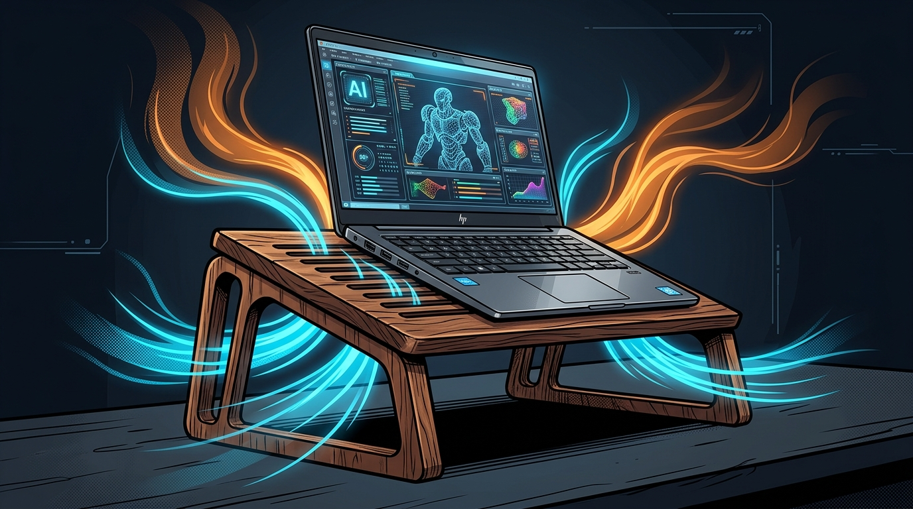
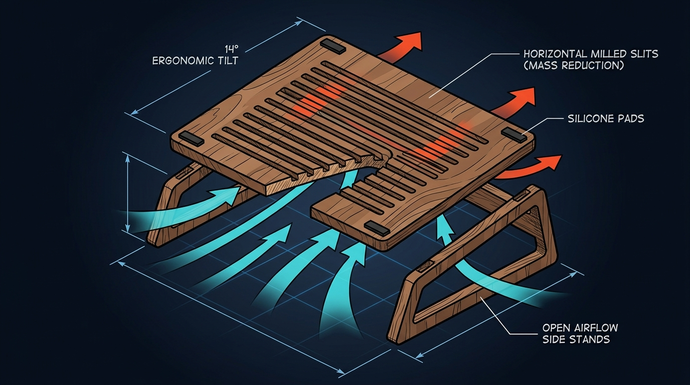
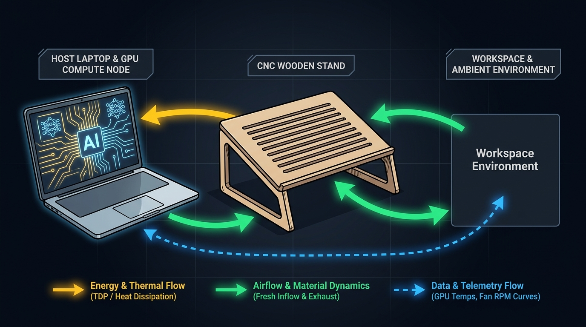

In meinem vorigen Beitrag über [KI-basierte ergonomische Arbeitsumgebungen](../2026_08_10_ki_basierte_ergonomische_arbeitsumgebungen/index.md) haben wir beleuchtet, wie adaptive Sensorik, lernende Algorithmen und smarte Möbel den Arbeitsplatz dynamisch an den Menschen anpassen. Doch neben der physiologischen Interaktion zwischen Mensch und Raum entscheidet ein weiterer, oft unterschätzter Faktor über die Produktivität im modernen Wissens- und Ingenieursalltag: die **thermische Leistungsfähigkeit unserer primären Arbeitsgeräte**.

Ob beim Ausführen lokaler Large Language Models (LLMs) via Ollama, beim Rendern komplexer Baugruppen in 3D-CAD-Systemen oder bei rechenintensiven Physik-Simulationen – moderne mobile Workstations und High-End-Laptops verfügen heute über erstaunliche Rechenpower in Form dedizierter Grafikprozessoren (dGPUs). Diese kompakte Spitzenleistung hat jedoch einen physikalischen Preis: **massive thermische Verlustleistung auf engstem Raum**.

Um dieses Problem mit einer Symbiose aus minimalistischer Konstruktion, Thermodynamik und zeitlosem Naturdesign zu lösen, stelle ich in diesem Beitrag ein neuartiges Hardware-Konzept vor: **Den CNC-gefertigten Leichtbau-Holzständer mit offenen Seitenwangen und horizontalen Belüftungsschlitzen**.

## 1. Die Problemstellung: Hitzestau und Thermal Throttling am Schreibtisch

Moderne Laptop-Kühlsysteme vollbringen mechatronische Höchstleistungen. Kompakte Vapor Chambers und hochdrehende Radiallüfter (oft 4.500 bis über 6.000 U/min) transportieren bis zu 150 bis 175 Watt Verlustleistung (TDP) aus CPU und dedizierter GPU ab. 

Ein konstruktives Dilemma vieler aktueller Hochleistungs-Notebooks liegt jedoch in der **aerodynamischen Bodengeometrie**:
1. **Abwärts gerichteter Ausblas- bzw. Ansaugstrom:** Viele Gehäusedesigns blasen heiße Abluft schräg nach unten ab oder saugen kühle Frischluft durch schmale Schlitze am Geräteboden an.
2. **Der „Tischplatten-Effekt“ (Thermal Trapping):** Wird der Laptop direkt auf eine ebene Schreibtischplatte gestellt, beträgt der Bodenabstand durch die Gummifüße meist nur 1,5 bis 3 Millimeter. Die ausströmende Heißluft prallt auf die Tischoberfläche, staut sich unter dem Gehäuse und wird durch den entstehenden Unterdruck unmittelbar wieder von den Lüftern angesaugt (**thermische Re-Zirkulation**).
3. **Thermal Throttling & Akustikbelastung:** Die GPU erreicht binnen weniger Minuten ihr Temperatur-Limit ($T_{j,\max} \approx 87\text{--}100\,^\circ\text{C}$). Die Folge: Die Taktfrequenzen brechen drastisch ein (Leistungsverluste von 20–35 %), während die Lüfter mit schrillem, ermüdendem Rauschen auf maximaler Drehzahl laufen.

Herkömmliche Laptop-Ständer aus gestanztem Blech oder klapprigem Plastik schaffen hier oft nur unzureichend Abhilfe und wirken im hochwertigen Büro- oder Homeoffice-Ambiente wie Fremdkörper.

## 2. Das Konzept: Maximale Luftzirkulation durch minimalistischen Holz-Leichtbau

Um maximale thermische Entlastung bei minimalem Materialeinsatz zu erreichen, bricht unser Konzept mit klobigen, geschlossenen Konstruktionen:

Der Ständer besteht **ausschließlich aus einer geneigten Deckplatte sowie zwei offenen Seitenwangen links und rechts**. Auf einen geschlossenen Unterboden oder ein schweres 2D-Kreuzgitter wird bewusst verzichtet, um die Holzmasse auf das konstruktive Minimum zu reduzieren und das Luftvolumen unter dem Laptop maximal zu vergrößern.

Die obere Auflageplatte verfügt über eine Reihe **präzise von links nach rechts gefräster, horizontaler Querschlitze**:

### Konstruktive & Physikalische Schlüsselmerkmale

- **Horizontale Belüftungsschlitze (Maximale Massereduktion):** Anstelle eines dichten 2D-Gitters geben die parallelen Querschlitze den direkten Weg für den vertikalen Luftaustausch frei. Die Kontaktfläche zum Laptopgehäuse wird minimiert, während die strukturelle Steifigkeit für schwere 16"- bis 17"-Workstations voll erhalten bleibt.
- **Skelettierte, offene Seitenwangen:** Die linken und rechten Standbeine sind als offene Rahmenkonstruktion ausgeführt. Dadurch kann kühle Raumluft von allen Seiten ungehindert unter das Notebook nachströmen, während heiße Abluft ohne Verwirbelungsbarrieren nach hinten und zur Seite entweicht.
- **Akustische Resonanzdämpfung von Massivholz:** Holz besitzt durch seine Faserstruktur eine signifikant höhere innere Eigendämpfung als Metall. Vibrationen und hochfrequente Strömungsgeräusche der Notebook-Lüfter werden gedämpft, was zu einer spürbaren Geräuschreduktion von bis zu $6\text{ bis }8\text{ dB(A)}$ am Arbeitsplatz führt.
- **Ergonomischer $14^\circ$-Winkel mit Silikon-Pads:** Die Neigung entlastet Handgelenke und Nackenmuskulatur. Punktuell eingelassene Silikon-Puffer verhindern jedes Verrutschen und entkoppeln das Gerät mechanisch vom Schreibtisch.

## 3. Systemarchitektur & Multidomänen-Flussmodell

Um die Interaktion zwischen Berechnungs-Workload, thermischer Dissipation und Raumumgebung ganzheitlich im Sinne der Industrieinformatik abzubilden, lässt sich das System in drei interagierende Domänen gliedern: **Energiefluss**, **Materialfluss (Fluidik)** und **Datenfluss**.

### A. Der Energiefluss (Gelb)
Elektrische Energie ($P_{\text{el}} \approx 100\text{--}230\text{ W}$) wird primär über USB-C Power Delivery oder das Systemnetzteil bereitgestellt. Innerhalb der Halbleiter (CPU-Cores, GPU Tensor Cores, VRAM) wird diese Leistung nahezu vollständig in thermische Verlustenergie $Q_{\text{diss}}$ umgewandelt. Über Heatpipes und Kühlrippen wird die Wärme auf den Luftmassenstrom übertragen und über den offenen Standbereich als freie Konvektion an den Raum abgegeben.

### B. Der Material- & Fluidikfluss (Grün)
Frische Umgebungsluft ($T_{\text{amb}} \approx 21\text{--}23\,^\circ\text{C}$) tritt ungehindert durch die offenen Seitenwangen und den Frontbereich in die Kammer ein. Die horizontalen Frässchlitze erlauben einen widerstandsfreien Eintritt in die Lüfteransaugung. Die heiße Abluft ($T_{\text{exhaust}} \approx 55\text{--}70\,^\circ\text{C}$) wird widerstandsfrei abgeleitet – ein thermischer Rückstau ist physikalisch ausgeschlossen.

### C. Der Daten- & Regelungsfluss (Blau)
Auf Softwareebene überwacht ein Telemetrie-Daemon (über APIs wie NVIDIA NVML) kontinuierlich Kern- und Hotspot-Temperaturen, Power Limits und Fan Curves. Dank des verbesserten Wärmeübergangs $\Delta T$ kann das Notebook dauerhaft im optimalen Boost-Bereich takten, ohne in thermisch bedingte Drosselungen abzugleiten.

## 4. Primäre Einsatzgebiete: Wo die Holzunterlage den Unterschied macht

Der Holz-Laptopständer entfaltet seinen größten Mehrwert bei kontinuierlichen Rechenlasten (Sustained Workloads):

### 1. Lokale KI-Inferenz & Agenten-Workflows
Wer moderne Open-Source-Modelle (wie Llama 3, Mistral Large oder DeepSeek Coder) sowie multimodale Diffusionsmodelle (Stable Diffusion, ComfyUI) lokal auf dem Entwicklungsrechner ausführt, beansprucht VRAM und Tensor-Recheneinheiten über viele Minuten oder Stunden hinweg bei 100 % Auslastung. Der offene Ständer verhindert den thermischen Leistungsabfall bei langen Generierungsprozessen.

### 2. 3D-CAD, Simulation & Rendering
Im mechatronischen Engineering – von parametrischen CAD-Konstruktionen (Autodesk Inventor, SolidWorks) über FEA-Festigkeitsberechnungen bis hin zu GPU-beschleunigtem Raytracing in Blender – sind stabile Taktfrequenzen essenziell. Die ergonomische $14^\circ$-Neigung verbessert gleichzeitig die Ergonomie bei Tastatureingaben und den Blickwinkel auf das Display.

### 3. Realtime Visualisierung & Game Engine Development
Beim Arbeiten in Umgebungen wie Unreal Engine oder Unity sowie bei anspruchsvollen Rendering-Sessions bleibt die Tischoberfläche kühl, und die Handauflageflächen des Laptops heizen sich nicht unangenehm auf.

## 5. Modulare Erweiterungsoption: Passive vs. Aktive Kühlung

Während die passive Konvektion des offenen Holzständers für die allermeisten Anwendungsszenarien einen Temperaturvorteil von **$8\text{ bis }12\,^\circ\text{C}$** an den GPU-Hotspots erzielt, lässt sich das Design modular erweitern:

- **Passiv-Modus (Standard):** Völlig geräuschlos, wartungsfrei und ohne zusätzliche Kabel. Reine Ausnutzung von Naturkonvektion, Strömungsdynamik und Werkstoffdämpfung.
- **Aktiv-Modus (Power-User):** In den offenen Freiraum unter der Deckplatte können magnetisch fixierbare, ultraleise $120\,\text{mm}$-Fluid-Dynamic-Lüfter eingehängt werden. Über ein kurzes, im Holz versenktes USB-C-Kabel mit integriertem Drehzahl-Potentiometer lässt sich bei extremen Render-Sessions ein zusätzlicher, flüsterleiser Frischluftstrom direkt an die Notebook-Bodenansaugung leiten.

## 6. Fazit & Ausblick

Gutes Arbeitsplatzdesign der Zukunft besteht nicht nur aus Software und Bildschirmen. Es entsteht dort, wo **High-Tech-Computing und natürliche, haptisch ansprechende Materialien** intelligent zusammenfinden. 

Der minimalistische Leichtbau-Holzständer beweist, dass thermische Ingenieurskunst und nachhaltiges Produktdesign keine Gegensätze sind: Er schützt teure Workstation-Hardware vor thermischem Verschleiß, sichert maximale Rechenleistung für anspruchsvolle KI- und CAD-Aufgaben und bereichert den Schreibtisch als ästhetisches Statement gegen die Wegwerfkultur aus Plastik.

*Wie betreiben Sie Ihre mobilen Workstations unter Volllast? Haben Sie bereits Erfahrungen mit thermischen Engpässen bei lokaler KI gesammelt? Ich freue mich auf den Austausch und Ihr Feedback!*
