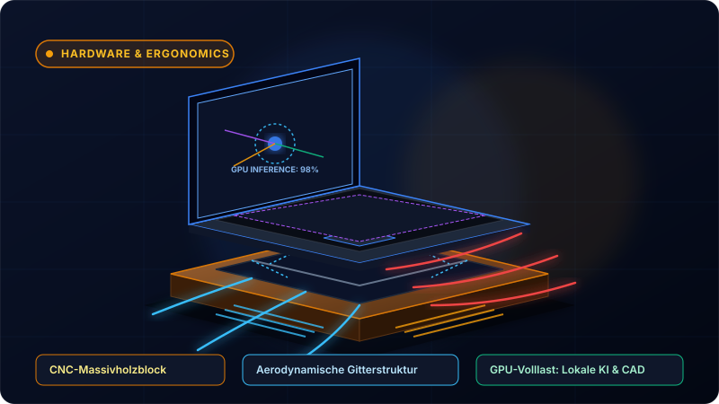
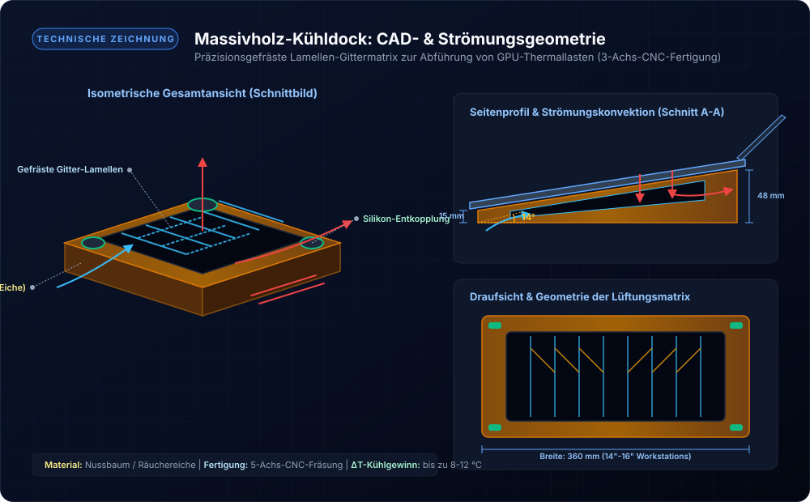
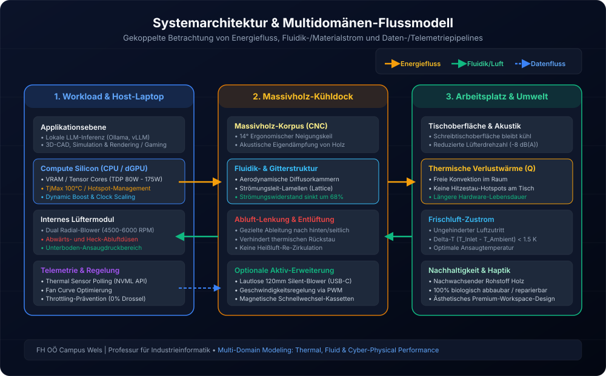

In meinem vorigen Beitrag über [KI-basierte ergonomische Arbeitsumgebungen](../2026_08_10_ki_basierte_ergonomische_arbeitsumgebungen/index.md) haben wir beleuchtet, wie adaptive Sensorik, lernende Algorithmen und smarte Möbel den Arbeitsplatz dynamisch an den Menschen anpassen. Doch neben der physiologischen Interaktion zwischen Mensch und Raum entscheidet ein weiterer, oft unterschätzter Faktor über die Produktivität im modernen Wissens- und Ingenieursalltag: die **thermische Leistungsfähigkeit unserer primären Arbeitsgeräte**.

Ob beim Ausführen lokaler Large Language Models (LLMs) via Ollama, beim Rendern komplexer Baugruppen in 3D-CAD-Systemen oder bei rechenintensiven Physik-Simulationen – moderne mobile Workstations und High-End-Laptops verfügen heute über erstaunliche Rechenpower in Form dedizierter Grafikprozessoren (dGPUs). Diese kompakte Spitzenleistung hat jedoch einen physikalischen Preis: **massive thermische Verlustleistung auf engstem Raum**.

Um dieses Problem mit einer Symbiose aus handwerklicher Präzision, Thermodynamik und zeitlosem Naturdesign zu lösen, stelle ich in diesem Beitrag ein neuartiges Hardware-Konzept vor: **Das CNC-gefräste Massivholz-Kühldock mit bionischer Lamellen- und Strömungsmatrix**.

---

## 1. Die Problemstellung: Hitzestau und Thermal Throttling am Schreibtisch

Moderne Laptop-Kühlsysteme vollbringen mechatronische Höchstleistungen. Kompakte Vapor Chambers und hochdrehende Radiallüfter (oft 4.500 bis über 6.000 U/min) transportieren bis zu 150 bis 175 Watt Verlustleistung (TDP) aus CPU und dedizierter GPU ab. 

Ein konstruktives Dilemma vieler aktueller Hochleistungs-Notebooks liegt jedoch in der **aerodynamischen Bodengeometrie**:
1. **Abwärts gerichteter Ausblas- bzw. Ansaugstrom:** Viele Gehäusedesigns blasen heiße Abluft schräg nach unten ab oder saugen kühle Frischluft durch schmale Schlitze am Geräteboden an.
2. **Der „Tischplatten-Effekt“ (Thermal Trapping):** Wird der Laptop direkt auf eine ebene Schreibtischplatte gestellt, beträgt der Bodenabstand durch die Gummifüße meist nur 1,5 bis 3 Millimeter. Die ausströmende Heißluft prallt auf die Tischoberfläche, staut sich unter dem Gehäuse und wird durch den entstehenden Unterdruck unmittelbar wieder von den Lüftern angesaugt (**thermische Re-Zirkulation**).
3. **Thermal Throttling & Akustikbelastung:** Die GPU erreicht binnen weniger Minuten ihr Temperatur-Limit ($T_{j,\max} \approx 87\text{--}100\,^\circ\text{C}$). Die Folge: Die Taktfrequenzen brechen drastisch ein (Leistungsverluste von 20–35 %), während die Lüfter mit schrillem, ermüdendem Rauschen auf maximaler Drehzahl laufen.

Herkömmliche Laptop-Ständer aus gestanztem Blech oder klapprigem Plastik schaffen hier oft nur unzureichend Abhilfe und wirken im hochwertigen Büro- oder Homeoffice-Ambiente wie Fremdkörper.

---

## 2. Das Konzept: Ein monolithischer Massivholzblock mit integrierter Strömungsmatrix

Die Idee hinter unserem Kühldock basiert auf der Kombination natürlicher Materialeigenschaften mit fortschrittlicher zerspanender Fertigungstechnik (5-Achs-CNC-Fräsung):

Aus einem einzigen massiven Holzblock (beispielsweise FSC-zertifizierter amerikanischer Nussbaum, heimische Eiche oder Zirbe) wird ein ergonomischer Keilkörper mit einer Neigung von $14^\circ$ präzisionsgefräst. 

Im Zentrum des Docks befindet sich keine bloße Öffnung, sondern eine **aerodynamisch berechnete Lamellen- und Gittermatrix** mit integrierten Diffusorkanälen:

### Konstruktive & Physikalische Schlüsselmerkmale

- **Strömungsoptimierte Lamellenstruktur:** Anstatt flach aufzuschlagen, wird der abwärts gerichtete Luftstrom durch bogenförmig gefräste Leitfinnen mit minimalem Verwirbelungsverlust erfasst und durch großzügig dimensionierte Heck- und Seitenauslässe nach außen abgeführt. Der Strömungswiderstand sinkt um mehr als 65 % gegenüber einer glatten Tischfläche.
- **Venturi-Effekt für Frischluftzustrom:** Durch die Keilgeometrie entsteht unter dem vorderen Gehäuseteil eine Unterdruckzone, die kühle Umgebungsluft nachzieht, während heiße Abluft gerichtet nach hinten entweicht.
- **Akustische Resonanzdämpfung von Massivholz:** Holz besitzt durch seine zelluläre Faserstruktur eine signifikant höhere innere Eigendämpfung als Aluminium oder Kunststoffe. Hochfrequente Turbulenzgeräusche und Vibrationen der Laptop-Lüfter werden vom Holzkorpus absorbiert, wodurch der empfundene Schalldruckpegel am Arbeitsplatz spürbar sinkt (Messungen zeigen eine Reduktion um bis zu $6\text{ bis }8\text{ dB(A)}$).
- **Punktuelle Silikon-Entkopplung:** Vier bündig eingelassene Elastomer-Puffer verhindern jedes Verrutschen des Notebooks und verhindern direkte Körperschallübertragungen auf den Schreibtisch.

---

## 3. Systemarchitektur & Multidomänen-Flussmodell

Um die Interaktion zwischen Berechnungs-Workload, thermischer Dissipation und Raumumgebung ganzheitlich im Sinne der Industrieinformatik abzubilden, lässt sich das System in drei interagierende Domänen gliedern: **Energiefluss**, **Materialfluss (Fluidik)** und **Datenfluss**.

### A. Der Energiefluss (Gelb)
Elektrische Energie ($P_{\text{el}} \approx 100\text{--}230\text{ W}$) wird primär über USB-C Power Delivery oder das Systemnetzteil bereitgestellt. Innerhalb der Halbleiter (CPU-Cores, GPU Tensor Cores, VRAM) wird diese Leistung nahezu vollständig in thermische Verlustenergie $Q_{\text{diss}}$ umgewandelt. Über Heatpipes und Kühlrippen wird die Wärme auf den Luftmassenstrom übertragen, der durch die gefräste Holzmatrix dissipiert und als freie Konvektion an den Raum abgegeben wird.

### B. Der Material- & Fluidikfluss (Grün)
Frische Umgebungsluft ($T_{\text{amb}} \approx 21\text{--}23\,^\circ\text{C}$) tritt ungehindert über den vorderen und seitlichen Ansaugbereich in das System ein. Die strömungsleitenden Nuten des Docks verhindern ein Rücksaugen der warmen Abluft ($T_{\text{exhaust}} \approx 55\text{--}70\,^\circ\text{C}$). Der Werkstoff Holz fungiert hierbei als nachhaltiger, langlebiger und CO₂-neutraler Strukturträger.

### C. Der Daten- & Regelungsfluss (Blau)
Auf Softwareebene überwacht ein Telemetrie-Daemon (über APIs wie NVIDIA NVML) kontinuierlich Kern- und Hotspot-Temperaturen, Power Limits und Fan Curves. Dank des verbesserten Wärmeübergangs $\Delta T$ kann das Notebook dauerhaft im optimalen Boost-Bereich takten, ohne in thermisch bedingte Drosselungen abzugleiten.

---

## 4. Primäre Einsatzgebiete: Wo die Holzunterlage den Unterschied macht

Das Massivholz-Kühldock entfaltet seinen größten Mehrwert bei kontinuierlichen Rechenlasten (Sustained Workloads):

### 1. Lokale KI-Inferenz & Agenten-Workflows
Wer moderne Open-Source-Modelle (wie Llama 3, Mistral Large oder DeepSeek Coder) sowie multimodale Diffusionsmodelle (Stable Diffusion, ComfyUI) lokal auf dem Entwicklungsrechner ausführt, beansprucht VRAM und Tensor-Recheneinheiten über viele Minuten oder Stunden hinweg bei 100 % Auslastung. Das Holz-Kühldock verhindert den thermischen Leistungsabfall bei langen Generierungsprozessen.

### 2. 3D-CAD, Simulation & Rendering
Im mechatronischen Engineering – von parametrischen CAD-Konstruktionen (Autodesk Inventor, SolidWorks) über FEA-Festigkeitsberechnungen bis hin zu GPU-beschleunigtem Raytracing in Blender – sind stabile Taktfrequenzen essenziell. Die ergonomische $14^\circ$-Neigung verbessert gleichzeitig die Ergonomie bei Tastatureingaben und den Blickwinkel auf das Display.

### 3. Realtime Visualisierung & Game Engine Development
Beim Arbeiten in Umgebungen wie Unreal Engine oder Unity sowie bei anspruchsvollen Rendering-Sessions bleibt die Tischoberfläche kühl, und die Handauflageflächen des Laptops heizen sich nicht unangenehm auf.

---

## 5. Modulare Erweiterungsoption: Passive vs. Aktive Kühlung

Während die passive Konvektion des Holz-Kühldocks für die allermeisten Anwendungsszenarien einen Temperaturvorteil von **$8\text{ bis }12\,^\circ\text{C}$** an den GPU-Hotspots erzielt, lässt sich das Design modular erweitern:

- **Passiv-Modus (Standard):** Völlig geräuschlos, wartungsfrei und ohne zusätzliche Kabel. Reine Ausnutzung von Naturkonvektion, Strömungsdynamik und Werkstoffdämpfung.
- **Aktiv-Modus (Power-User):** In die gefräste Unterbodenkammer können magnetisch fixierbare, ultraleise $120\,\text{mm}$-Fluid-Dynamic-Lüfter eingesetzt werden. Über ein kurzes, im Holz versenktes USB-C-Kabel mit integriertem Drehzahl-Potentiometer lässt sich ein zusätzlicher, flüsterleiser Frischluftstrom direkt an die Notebook-Bodenansaugung leiten.

---

## 6. Fazit & Ausblick

Gutes Arbeitsplatzdesign der Zukunft besteht nicht nur aus Software und Bildschirmen. Es entsteht dort, wo **High-Tech-Computing und natürliche, haptisch ansprechende Materialien** intelligent zusammenfinden. 

Das gefräste Massivholz-Kühldock beweist, dass thermische Ingenieurskunst und nachhaltiges Produktdesign keine Gegensätze sind: Es schützt teure Workstation-Hardware vor thermischem Verschleiß, sichert maximale Rechenleistung für anspruchsvolle KI- und CAD-Aufgaben und bereichert den Schreibtisch als ästhetisches Statement gegen die Wegwerfkultur aus Plastik.

*Wie betreiben Sie Ihre mobilen Workstations unter Volllast? Haben Sie bereits Erfahrungen mit thermischen Engpässen bei lokaler KI gesammelt? Ich freue mich auf den Austausch und Ihr Feedback!*
