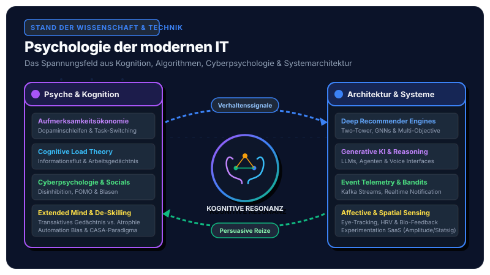
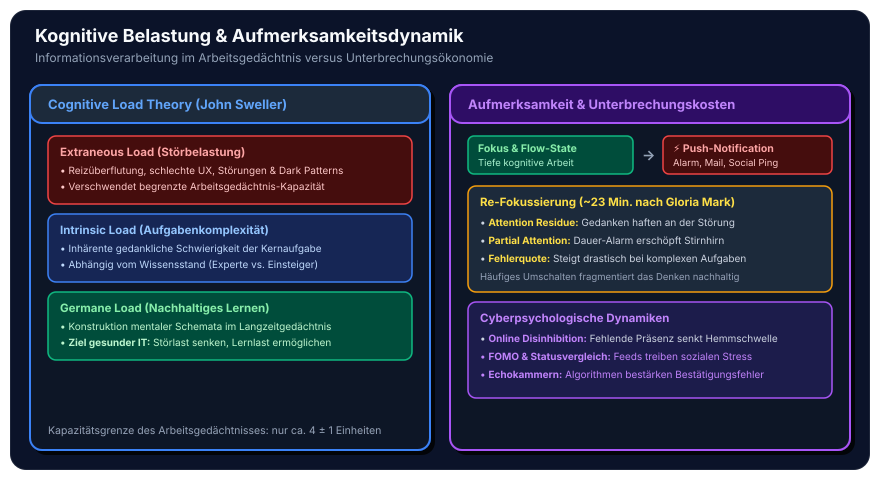
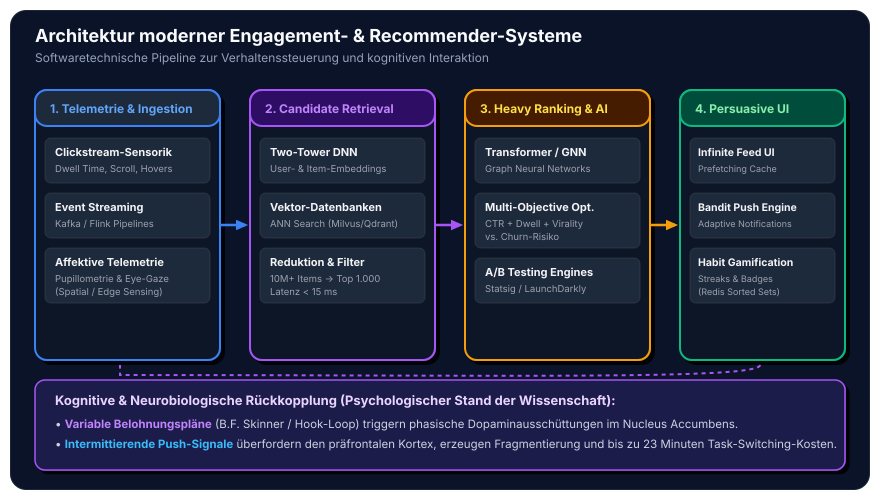
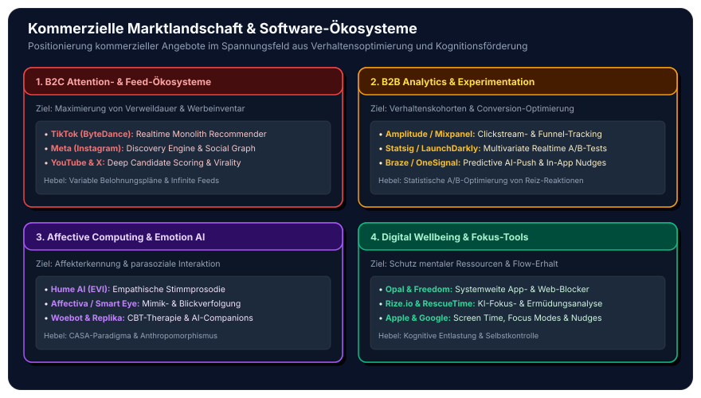
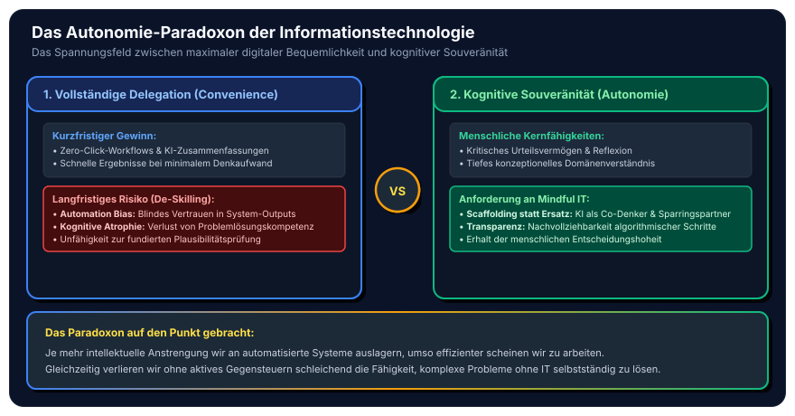

Die Informationstechnologie hat einen fundamentalen Paradigmenwechsel vollzogen: Während die frühe Informatik primär darauf abzielte, Rechenleistung bereitzustellen und funktionale Geschäftsprozesse abzubilden, greifen moderne Softwaresysteme tief in die neurobiologischen, kognitiven und sozialpsychologischen Grundstrukturen des Menschen ein. 

Ob Empfehlungsalgorithmen sozialer Netzwerke, generative KI-Agenten, persuasive Benutzeroberflächen oder immersive Spatial-Computing-Umgebungen – moderne IT ist längst nicht mehr nur ein Werkzeug zur Datenverarbeitung. Sie ist ein **verhaltensformendes, kognitionsveränderndes Ökosystem**.

Wer heute Softwaresysteme, Datenarchitekturen oder Benutzeroberflächen gestaltet, betreibt unweigerlich angewandte Psychologie. In diesem Beitrag fassen wir den aktuellen **Stand der Wissenschaft** (Kognitionspsychologie, Cyberpsychologie, Neurobiologie) sowie den **Stand der Technik** (Software-Architekturen, Recommender-Pipelines, kommerzielle Plattformen) fundiert und anschaulich zusammen.

## 1. Der Stand der Wissenschaft: Wie digitale Systeme den menschlichen Geist fordern

Die wissenschaftliche Erforschung der Mensch-Technik-Interaktion speist sich heute aus der Kognitionspsychologie, den Neurowissenschaften und der Cyberpsychologie. Vier Kernbereiche beschreiben den aktuellen Forschungsstand:

### A. Aufmerksamkeitsökonomie & Neurobiologie

Das menschliche Gehirn ist evolutionär darauf programmiert, auf neuartige Umweltreize mit erhöhter Aufmerksamkeit und der Ausschüttung von Neurotransmittern zu reagieren.

* **Dopaminerge Verstärkungsschleifen:** Entgegen früherer Annahmen wird der Botenstoff Dopamin nicht primär bei Belohnungserhalt ausgeschüttet, sondern bereits bei der *Erwartung* einer Belohnung. Auf Verhaltensmodellen von B.F. Skinner aufbauend (vgl. das *Hook-Modell* nach Nir Eyal) nutzen moderne Feeds **variable Belohnungspläne** (*Variable Reward Schedules*). Jeder Pull-to-Refresh oder jeder Blick auf Benachrichtigungen gleicht dem Zug an einem digitalen Glücksspielautomaten: Unvorhersehbare Reize maximieren die phasische Dopaminausschüttung im *Nucleus Accumbens*.
* **Prefrontaler Kortex vs. Limbisches System:** Während der präfrontale Kortex für rationale Selbstkontrolle, langfristige Planung und Arbeitsgedächtnisfunktionen zuständig ist, reagiert das limbische System reflexartig auf emotionale Reize und Push-Mitteilungen. Permanente digitale Reize führen zu einer chronischen Erschöpfung der exekutiven Kontrollressourcen (*Ego Depletion*).
* **Task-Switching & Attention Residue:** Echte Multitasking-Fähigkeit ist eine neurokognitive Illusion. Wechselt ein Nutzer zwischen primärer Arbeit (z. B. Programmieren oder Konzeption) und einer Notification, entstehen hohe kognitive Wechselkosten. Studien der Aufmerksamkeitsforscherin Gloria Mark (University of California, Irvine) zeigen, dass es nach einer Unterbrechung im Schnitt **rund 23 Minuten** dauert, bis der ursprüngliche Fokus wieder vollständig hergestellt ist. Das Phänomen des *Aufmerksamkeitsresiduums* (*Attention Residue*) beschreibt, dass Gedanken noch lange an der vorangegangenen Störung haften bleiben.

### B. Kognitive Belastung & Informationsverarbeitung (Cognitive Load Theory)

Die von John Sweller begründete **Cognitive Load Theory** unterscheidet drei Formen der Belastung des menschlichen Arbeitsgedächtnisses:

1. **Intrinsic Load (Inhärente Belastung):** Die gedankliche Komplexität der eigentlichen Kernaufgabe (z. B. das Verstehen eines mathematischen Beweises).
2. **Extraneous Load (Störbelastung):** Mentale Energie, die durch schlechtes Interface-Design, unübersichtliche Navigation, visuelle Störgeräusche, Werbebanner oder Dark Patterns verschwendet wird.
3. **Germane Load (Lernbezogene Belastung):** Die produktive mentale Arbeit, die zur Bildung dauerhafter mentaler Schemata im Langzeitgedächtnis führt.

Da die Kapazität des menschlichen Arbeitsgedächtnisses auf lediglich etwa $4 \pm 1$ Informationseinheiten begrenzt ist (Cowan / Miller), führt ein hoher *Extraneous Load* durch schlecht konzipierte Software unmittelbar zum **Information Overload** und zu kognitiver Erschöpfung.

### C. Internet, Cyberpsychologie & Digitale Sozialdynamiken

Die Vernetzung von Milliarden Menschen über das World Wide Web und soziale Netzwerke hat neuartige sozialpsychologische Phänomene hervorgebracht:

* **Der Online Disinhibition Effect (John Suler):** Durch dissoziative Anonymität, Asynchronität und fehlendes physisches Bio-Feedback (Mimik, Tonlage) sinkt die Hemmschwelle in Online-Diskussionen dramatisch. Dies führt sowohl zu *benigner Enthemmung* (offenere Selbstoffenbarung, gegenseitige emotionale Hilfe in Selbsthilfeforen) als auch zu *toxischer Enthemmung* (Flaming, Cybermobbing, Hasskommentare).
* **Soziale Vergleichsprozesse & FOMO:** Gemäß der *Social Comparison Theory* von Leon Festinger neigen Menschen dazu, ihren Selbstwert durch Vergleiche mit Peers zu bestimmen. Auf Instagram, LinkedIn oder TikTok werden Nutzer primär mit kuratierten "Highlight-Reels" anderer konfrontiert (*Upward Social Comparison*). Dies korreliert empirisch mit Phänomenen wie der Angst, etwas zu verpassen (*Fear of Missing Out – FOMO*) und sinkendem subjektivem Wohlbefinden.
* **Echokammern & Affective Polarization:** Bestätigungsfehler (*Confirmation Bias*) führen dazu, dass Nutzer Informationen bevorzugen, die ihr bestehendes Weltbild stützen. Werden diese Präferenzen durch algorithmische Filter verstärkt, bilden sich geschlossene Resonanzräume, die zur gesellschaftlichen Polarisierung beitragen.

### D. Extended Mind, Transaktives Gedächtnis & Mensch-KI-Interaktion

* **Transaktives Gedächtnis & der "Google-Effekt":** Die *Extended Mind Thesis* (Clark & Chalmers) besagt, dass kognitive Prozesse nicht an der Schädeldecke enden, sondern physische und digitale Werkzeuge als externe Speicher einbinden. Die Forschung von Betsy Sparrow et al. belegt: Wissen Menschen, dass Informationen im Internet permanent abrufbar sind, speichert das Gehirn nicht mehr den *Inhalt*, sondern primär den *Ort des Zugriffs* (*Digital Amnesia*).
* **Automation Bias & De-Skilling:** Übermäßiges Vertrauen in automatisierte Systeme und KI-Assistenten führt dazu, dass menschliche Anwender Warnsignale übersehen oder eigene analytische Fähigkeiten verlernen (*kognitive Atrophie*).
* **Das CASA-Paradigma & Anthropomorphismus:** Das von Clifford Nass und Byron Reeves formulierte Paradigma **"Computers Are Social Actors" (CASA)** belegt, dass Menschen Computern, Sprachassistenten und Chatbots instinktiv soziale Eigenschaften (Höflichkeit, Geschlecht, Intentionalität) zuschreiben – selbst wenn ihnen vollkommen bewusst ist, dass sie mit Algorithmen interagieren (verstärkter *ELIZA-Effekt*).

## 2. Der Stand der Technik: Software-Architekturen & Persuasive Systeme

Um psychologische Prinzipien in großem Maßstab zu operationalisieren, hat die IT-Industrie hochentwickelte, verteilte Software-Architekturen entwickelt. Moderne Systeme basieren auf einer engen Verzahnung von Event-Streaming, mehrstufigen Deep-Learning-Modellen und adaptiver Benutzeroberflächen-Steuerung.

### A. Event-Driven Telemetry & Clickstream-Ingestion

Die Grundlage jeder verhaltensbasierten Software ist die kontinuierliche, latenzarme Erfassung von Nutzerinteraktionen:

* **Event-Streaming-Pipelines:** Über Frameworks wie **Apache Kafka** oder **Apache Flink** werden pro Sekunde Millionen von Interaktionsereignissen erfasst. Gemessen werden nicht nur harte Klicks, sondern granulare Verhaltensdaten: Verweildauer auf Beiträgen (*Dwell Time*), Scroll-Geschwindigkeit, Beschleunigungsmuster sowie Maus-Hover-Zeiten.
* **Edge Sensing & Spatial Telemetry:** Bei modernen Endgeräten (VR/AR-Headsets wie Apple Vision Pro, Smartwatches, Eye-Tracking-Kameras) fließen biometrische Signale ein: Pupillendilatation (als Indikator für kognitive Belastung), Mikrosakkaden der Augen und Herzratenvariabilität (HRV).

### B. Mehrstufige Deep-Recommender-Pipelines

Angesichts von Hunderten Millionen Inhalten nutzen moderne Plattformen eine mehrstufige Verarbeitungs-Pipeline, um in unter 50 Millisekunden den optimalen Inhalt auszuspielen:

1. **Candidate Retrieval (Candidate Generation):**
   * Reduktion eines Katalogs von zig Millionen Elementen auf eine Vorselektion von 500 bis 1.000 relevanten Kandidaten.
   * Einsatz von **Two-Tower Neural Networks**: Ein Turm kodiert das Nutzerprofil und den Verhaltenskontext in einen dichten Vektorraum; der zweite Turm kodiert Content-Items.
   * Schnelle Ähnlichkeitssuche in Vektor-Datenbanken (z. B. **Milvus**, **Qdrant**, **FAISS**) über Approximate Nearest Neighbor (ANN) Algorithmen mit Latenzen unter 10–15 Millisekunden.
2. **Heavy Ranking (Deep Scoring & Graph Neural Networks):**
   * Einsatz tiefer Transformator-Modelle und **Graph Neural Networks (GNNs)**, die komplexe soziale Graphen (Wer folgt wem? Welche Cluster interagieren?) analysieren.
   * Vorhersage spezifischer Verhaltenswahrscheinlichkeiten: $P(\text{Click})$, $P(\text{Like})$, $P(\text{Share})$, $P(\text{Comment})$ und erwartete Watch-Time $E(\text{WatchTime})$.
3. **Multi-Objective Optimization (Re-Ranking & Balancing):**
   * Die finalen Scores werden durch eine gewichtete Zielfunktion optimiert:
     $$\text{Score} = w_1 \cdot P(\text{Engagement}) + w_2 \cdot P(\text{Retention}) - w_3 \cdot P(\text{Churn}) + w_4 \cdot \text{Diversity}$$
   * Hier wird die Balance zwischen kurzfristigem Klickreiz und langfristiger Nutzerbindung softwaretechnisch austariert.

### C. Persuasive Interaktions- & Habit-Engines

Um Gewohnheitsschleifen (*Habit Loops*) stabil zu halten, nutzen Systeme spezialisierte Microservices:

* **Contextual Multi-Armed Bandits für Push-Notifications:** Benachrichtigungen werden nicht mehr nach starren Zeitplänen versendet. Reinforcement-Learning-Algorithmen berechnen für jeden individuellen Nutzer dynamisch den optimalen Zeitpunkt und den Betreff, an dem die Öffnungswahrscheinlichkeit am höchsten ist.
* **Gamification- & Streak-Services:** Über In-Memory-Datenstrukturen (wie **Redis Sorted Sets**) werden Realtime-Leaderboards, Aktivitäts-Streaks (z. B. Snapchat/Duolingo) und Abzeichen-Systeme synchronisiert, die das psychologische Bedürfnis nach Kompetenz und Status adressieren.

### D. Generative KI & Empathic Voice Interfaces

Mit dem Aufkommen großer Sprachmodelle (LLMs) verschiebt sich die Interaktion von statischen Formularen zu natürlicher Konversation:

* **Reasoning-Chains & Agenten-Ökosysteme:** KI-Modelle unterstützen dynamisches Problem-Solving und fungieren als kognitive Entlastung oder Kollaborationspartner.
* **Empathic Voice Interfaces (EVI):** Multimodale Audio-Modelle (z. B. von Hume AI oder OpenAI) analysieren nicht nur den transkribierten Text, sondern erkennen anhand von Tonhöhe, Sprechtempo und Timbre emotionale Nuancen und passen ihre eigene Stimmmodulation empathisch an.

## 3. Die kommerzielle Marktlandschaft & Software-Ökosysteme

Die praktische Anwendung psychologischer Mechanismen spiegelt sich in einer diversifizierten kommerziellen Marktlandschaft wider. Wir können den Markt entlang zweier Hauptdimensionen strukturieren:

### 1. B2C Attention- & Feed-Ökosysteme
* **Unternehmen:** ByteDance (TikTok Monolith Algorithm), Meta (Instagram/Reels Discovery Engine), YouTube (Deep Neural Recommenders), X (Twitter Open Source Heavy Ranker).
* **Geschäftsmodell & Fokus:** Monetarisierung über zielgerichtete Werbung. Maximierung von Verweildauer, täglichen aktiven Nutzern (DAU) und Interaktionsfrequenz durch variable Belohnungspläne und algorithmische Personalisierung.

### 2. B2B Behavioral Analytics & Experimentation SaaS
* **Unternehmen & Tools:**
  * **Amplitude & Mixpanel:** Enterprise-Plattformen zur Kohortenanalyse und zum Triggern verhaltensbasierter Events.
  * **Statsig, LaunchDarkly & Optimizely:** Plattformen für multivariates A/B-Testing in Echtzeit. Ermöglichen Entwicklerteams, Tausende UI-Varianten parallel gegeneinander antreten zu lassen, um psychologische Reiz-Reaktions-Muster experimentell zu optimieren.
  * **Braze & OneSignal:** KI-gestützte Customer-Engagement-Plattformen zur automatisierten Ausspielung personalisierter Push-Nachrichten und In-App-Nudges.

### 3. Affective Computing, Emotion AI & Parasoziale KI-Companions
* **Unternehmen & Tools:**
  * **Hume AI:** Spezialisiert auf das Messen und Generieren expressiver, emotional nuancierter Stimm-Interfaces (*Empathic Voice Interface*).
  * **Affectiva / Smart Eye:** Automotive- und UX-Emotionserkennung mittels Gesichtsausdrucksanalyse (Facial Action Coding System).
  * **Woebot & Wysa:** Klinisch evaluierte Konversationsagenten auf Basis der Kognitiven Verhaltenstherapie (CBT) zur mentalen Gesundheitsunterstützung.
  * **Character.ai & Replika:** KI-Begleiter zur Befriedigung des Bedürfnisses nach sozialer Nähe und parasozialem Austausch.

### 4. Digital Wellbeing & Cognitive Ergonomics (Der Gegenpol)
* **Unternehmen & Tools:**
  * **Opal, Freedom & Forest:** Consumer-Anwendungen zur Durchbrechung von Dopaminschleifen durch Hardware- und VPN-basierte App-Blockaden.
  * **Rize.io & RescueTime:** KI-gestützte Zeiterfassungs- und Fokus-Analyse-Tools, die Arbeitsgewohnheiten auswerten und Überlastungswarnungen ausgeben.
  * **Betriebssystem-Hersteller:** Apple (*Screen Time*, *Focus Modes*) und Google (*Android Digital Wellbeing*), die kognitive Entlastung zunehmend als natives Systemfeature integrieren.

## 4. Reibungsflächen & Spannungsfelder

Aus dem Aufeinandertreffen menschlicher Kognition und hochoptimierter IT-Systeme resultieren fundamentale Spannungsfelder:

1. **Das Autonomie-Paradoxon:** Je nahtloser und reibungsloser generative KI und Recommender-Systeme Aufgaben übernehmen, desto geringer wird der kognitive Eigenaufwand. Was kurzfristig Zeit spart, birgt langfristig das Risiko von *De-Skilling* und *Automation Bias* – die Fähigkeit zur eigenständigen Problemlösung verkümmert.
2. **Die Polarisierungsfalle von Optimierungsmetriken:** Wenn Softwarearchitekturen ausschließlich auf messbare Verhaltenssignale (Klicks, Kommentare, Verweildauer) hin optimiert werden, bevorzugen Algorithmen evolutionär bedingt moralische Empörung und Sensationalismus, da diese die stärksten affektiven Reaktionen im menschlichen Gehirn auslösen.
3. **Kognitive Ergonomie vs. Technostress:** Während moderne Software durch geschickte Abstraktion den *Extraneous Load* reduzieren kann, führt ständige Erreichbarkeit und asynchrone Kommunikationsflut (Slack, E-Mails, Benachrichtigungen) zu chronischer mentaler Erschöpfung.

## 5. Fazit & Ausblick: Kriterien für eine „Mindful IT“

Die Erkenntnisse der Psychologie dürfen nicht länger ausschließlich dazu genutzt werden, Nutzer an Bildschirme zu fesseln. Für Software-Ingenieure, Architekten und Produktgestalter entsteht daraus eine neue Verantwortung: **Cognitive Ergonomics by Design**.

Ein zukunftsfähiges, menschenzentriertes Softwaresystem zeichnet sich durch folgende Leitlinien aus:

* **Kognitive Schonkost statt Reizüberflutung:** Reduktion von *Extraneous Load* durch klare visuelle Hierarchien, minimalistische Informationsdichte und den Verzicht auf manipulative Dark Patterns.
* **Batching & Fokus-Respekt:** Bündelung von Benachrichtigungen in logischen Zeitfenstern statt ständiger Mikrostörungen im Sekundentakt.
* **Transparenz & kognitive Souveränität:** Dem Nutzer die Kontrolle über algorithmische Filter und Empfehlungen zurückgeben; Erklärbarkeit bei KI-gestützten Entscheidungshilfen.
* **Privacy-Preserving Bio-Adaptive UX:** Sensordaten (wie Eye-Tracking oder Ermüdungsmetriken) dürfen ausschließlich zur lokalen, datenschutzkonformen Entlastung des Nutzers eingesetzt werden – niemals zur Steigerung von Werbeeinnahmen.

Moderne Informationstechnologie entfaltet ihr wahres Potenzial erst dann, wenn sie die menschliche Psyche nicht als Schwachstelle zur Verhaltensausbeutung begreift, sondern als wertvolle Ressource, die es durch intelligente, ergonomische Werkzeuge zu stärken und zu erweitern gilt.
