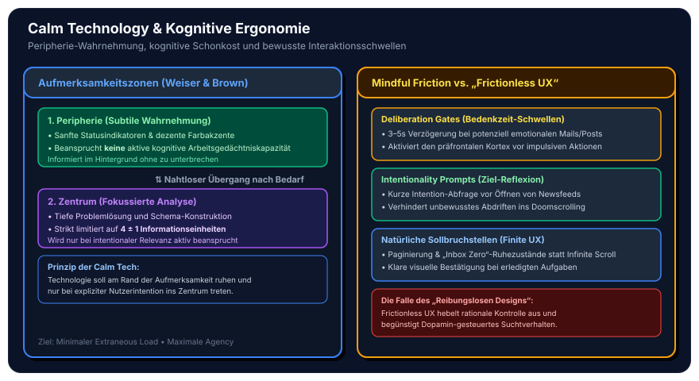
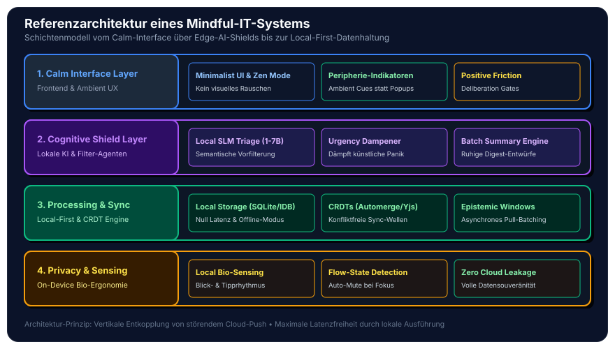
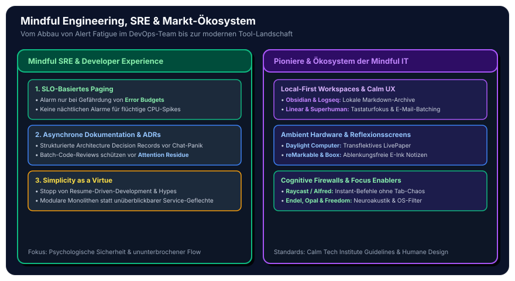

In unserem vorherigen Beitrag zur [Psychologie der modernen Informationstechnologie](/posts/2026_09_01_psychologie_der_modernen_informationstechnologie/) haben wir die Mechanismen analysiert, mit denen heutige Plattformen, Recommender-Pipelines und persuasive Benutzeroberflächen auf das menschliche Gehirn einwirken: dopaminerge Verstärkungsschleifen, kognitive Fragmentierung, *Attention Residue* und das Phänomen des *Information Overload*.

Die Diagnose war eindeutig: Die vorherrschende Maxime der Tech-Industrie – die bedingungslose Maximierung von Verweildauer (*Engagement*), Klickraten und Interaktionsfrequenzen – führt zu chronischer mentaler Erschöpfung und kognitiver Atrophie.

Doch wie sieht die **konstruktive ingenieurwissenschaftliche Antwort** aus?

**Mindful IT** (Achtsame Informationstechnologie) und **Calm Computing** sind keine esoterischen Wellness-Trends oder bloße Meditations-Apps. Sie markieren einen fundamentalen **Paradigmenwechsel im Software-Engineering und in der Systemarchitektur**. Es geht um den systematischen Entwurf von IT-Systemen, Datenarchitekturen und KI-Agenten, die die biologischen Grenzen der menschlichen Kognition respektieren, mentale Reibung minimieren und den Menschen als intentional handelndes Subjekt in den Mittelpunkt stellen.

## 1. Der Paradigmenwechsel: Von „Attention Extraction“ zu „Kognitiver Resilienz“

In den vergangenen zwei Jahrzehnten wurden IT-Systeme primär auf Metriken optimiert, die Aufmerksamkeit wie einen Rohstoff abbauen: *Daily Active Users (DAU)*, *Time-on-Screen*, *Scroll Depth* und *Impression Volume*. 

Mindful IT definiert den Erfolg von Software grundlegend neu:

| Dimension | Attention-Extractive Systems (Status Quo) | Mindful IT & Calm Computing (Neues Paradigma) |
| :--- | :--- | :--- |
| **Primäre Zielmetrik** | Verweildauer, Klicks, Interaktionsfrequenz | *Time Well Spent*, Aufgabenqualität, mentale Klarheit |
| **Interaktionsmodell** | Reaktiver Push (Alerts, Badges, Popups) | Intentionaler Pull & aggregierte Digest-Fenster |
| **Kognitive Belastung** | Hoher *Extraneous Load* (Ablenkungen, Dark Patterns) | Radikal minimaler *Extraneous Load*, Fokus auf *Germane Load* |
| **Datenarchitektur** | Cloud-Lock-in & permanente Live-Telemetrie | *Local-First*, dezentral, datensparsam & offline-fähig |
| **Rolle von KI** | Maximierung von Reizbarkeit und Konsumdauer | Kognitiver Schutzschild (*Quiet AI* & Triage-Agenten) |
| **Feedback-Schleifen** | Variable Belohnungspläne (Dopamin-Triggers) | Deterministische, vorhersehbare und ruhige Rückmeldungen |

Software ist dann exzellent konstruiert, wenn sie dem Anwender hilft, sein eigentliches Ziel mit minimalem mentalem Energieaufwand zu erreichen – und danach **unsichtbar in den Hintergrund tritt**.

## 2. Wissenschaftliche & Theoretische Fundamente

Mindful IT stützt sich auf etablierte Erkenntnisse aus Kognitionswissenschaft, Arbeitspsychologie und Human-Computer Interaction (HCI):

### A. Calm Technology & Peripherie-Kognition (Weiser, Brown & Case)

Bereits 1995 formulierten **Mark Weiser** und **John Seely Brown** (Xerox PARC) das Konzept der *Calm Technology*:
> *„A calm technology will move easily from the periphery of our attention, to the center, and back.“*

Das menschliche Bewusstsein verfügt über zwei Aufmerksamkeitsbereiche:
1. **Das Aufmerksamkeitszentrum (*Center of Attention*):** Fokussiert, analytisch, aber extrem energieintensiv und in der Kapazität strikt limitiert ($4 \pm 1$ Chunks).
2. **Die Peripherie (*Periphery of Attention*):** Nimmt subtile Umgebungsinformationen (Geräusche, Lichtveränderungen, periphere Bewegungen) parallel und ohne spürbaren kognitiven Aufwand wahr.

Schlecht gestaltete Software zwingt jede triviale Statusänderung durch blinkende Badges, Töne oder Banner mit Gewalt in das Aufmerksamkeitszentrum. Calm Technology hingegen platziert Statusinformationen in der Peripherie (z. B. dezente Farbverläufe, sanfte Helligkeitsnuancen) und erlaubt dem Nutzer, sie bei Bedarf mühelos ins Zentrum zu holen – ohne den aktuellen Denkprozess zu unterbrechen.

### B. Humane Technology & Mindful Friction (Positive Reibung)

Die Tech-Branche propagierte jahrelang das Dogma des **„Reibungslosen Designs“ (*Frictionless UX*)**: Ein-Klick-Käufe, Infinite Scrolling, Autoplay und Instant-Reaktionen. Was vordergründig nach Bequemlichkeit aussieht, hebelt gezielt den präfrontalen Kortex aus und delegiert Entscheidungen an impulsive, limbische Reflexe.

Mindful IT setzt gezielt auf **Positive Friction (Mindful Friction)**:
* **Deliberation Gates (Bedenkzeit-Schwellen):** Eine bewusste Verzögerung von wenigen Sekunden vor dem Absenden einer emotional verfassten Nachricht oder vor dem Ausführen einer irreversiblen Systemaktion.
* **Intentionality Prompts:** Vor dem Öffnen einer Informationsquelle wird der Nutzer kurz nach seinem eigentlichen Ziel gefragt, um zielloses Driften (*Doomscrolling*) zu verhindern.
* **Natürliche Sollbruchstellen:** Paginierung statt Endlos-Scrollen; bewusste visuelle Abschlüsse nach Erledigung aller anstehenden Aufgaben (*Inbox Zero als Ruhezustand*).

### C. Positive Computing & Kognitive Ergonomie (Sweller, Calvo & Peters)

Aufbauend auf der *Cognitive Load Theory* von John Sweller unterscheidet **Positive Computing** (Rafael Calvo & Dorian Peters) zwischen Belastung, die geistiges Wachstum fördert, und unnötigem Interface-Ballast:
* **Extraneous Load minimieren:** Beseitigung von visuellen Störgeräuschen, inkonsistenten Navigationsstrukturen und redundantem Feedback.
* **Germane Load maximieren:** Bereitstellung präziser mentaler Modelle, klarer Abstraktionen und nachvollziehbarer Systemzustände, die das Verstehen komplexer Zusammenhänge unterstützen.

## 3. Software-Architekturen & Engineering-Muster für Mindful Systems

Wie übersetzt man psychologische Achtsamkeitsprinzipien in konkrete Systemarchitekturen, Datenmodelle und Code? Fünf Architekturmuster bilden das technologische Rückgrat:

### 1. Pull- & Digest-First vs. Realtime-Push-Spam

In klassischen Microservice-Architekturen werden Ereignisse oft ungefiltert via WebSockets oder Server-Sent Events (SSE) an den Client durchgereicht. Für den menschlichen Empfänger bedeutet das: permanenter Unterbrechungsstress.

Mindful IT implementiert **asynchrone Digest-Engines** und **epistemische Fenster**:
* **Event-Aggregation am Server/Edge:** Ereignisse werden in temporären Puffern gesammelt, nach semantischer Relevanz dedupliziert und nur in definierten Zeitfenstern gebündelt ausgeliefert.
* **Kognitives Rate-Limiting:** Die Zustellfrequenz passt sich dynamisch an den Arbeitskontext an:
  $$\Delta t_{\text{Delivery}} = \max\left(\Delta t_{\text{Min}}, f(\text{Priority}, \text{FocusState})\right)$$
* Nicht-kritische Ereignisse (z. B. „Kollege X hat dein Dokument angesehen“) werden niemals als Realtime-Interrupt gepusht, sondern ausschließlich beim nächsten intentionalen Abruf (*Pull*) im Hintergrund synchronisiert.

### 2. Local-First & Offline-First mit CRDTs

Klassische Cloud-Anwendungen leiden unter Netzwerk-Latenzen und zwingen den Anwender in eine permanente Abhängigkeit vom Server. Jede Verzögerung bei Eingaben erzeugt subbewusste Mikrostress-Reaktionen.

Das **Local-First-Paradigma** (vgl. Martin Kleppmann et al.) löst dieses Problem:
* **Lokale Datenhoheit:** Die primäre Datenhaltung erfolgt direkt auf dem Endgerät (z. B. via **SQLite in WASM**, **IndexedDB** oder embedded Key-Value Stores).
* **Konfliktfreie Replikation:** Die Synchronisation im Hintergrund nutzt **CRDTs (Conflict-free Replicated Data Types)** wie *Yjs* oder *Automerge*.
* **Null Latenz & Offline-Resilienz:** Schreib- und Lesevorgänge geschehen instantan und lokal. Der Anwender kann völlig ungestört im Flugzeug, im Wald oder bei instabiler Verbindung arbeiten, ohne Fehlermeldungen oder Lade-Spinner.

### 3. Cognitive Load Budgeting in CI/CD-Pipelines

In modernen Web-Projekten sind *Performance Budgets* (z. B. max. 150 KB initiales JavaScript, Core Web Vitals) Standard. Mindful IT erweitert diesen Ansatz um **Cognitive Load Budgets**:

Im Rahmen von automatisierten Linting- und End-to-End-Test-Pipelines werden Grenzwerte überwacht:
* **DOM-Elemente & Visuelle Komplexität:** Maximale Anzahl von UI-Komponenten und interaktiven Elementen pro Viewport.
* **Notification-Dichte:** Verbot von mehr als $N$ Systemmeldungen pro Zeiteinheit.
* **Entscheidungstiefe (Hick-Hyman-Gesetz):** Begrenzung der gleichzeitig angebotenen Navigations- und Aktionsoptionen auf maximal $7 \pm 2$.
* **Modal-Verbot:** Automatisierte Warnung bei blockierenden Modal-Dialogen, die den Nutzer aus seinem aktuellen Aufgabenkontext reißen.

### 4. Quiet AI & Agentic Cognitive Shields (Lokale SLMs als Schutztür)

Anstatt generative KI zur Erzeugung von noch mehr Textfluten und synthetischem Rauschen einzusetzen, fungiert KI in der Mindful IT als **kognitiver Airbag** und persönlicher Schutzschild (*Guardian Agent*):

* **Lokale Small Language Models (SLMs):** Modelle mit 1 bis 7 Milliarden Parametern (z. B. via *WebLLM*, *Ollama* oder *Apple Neural Engine*) laufen lokal auf dem Client – bei voller Datensouveränität.
* **Semantische Dringlichkeits-Triage:** Der Agent analysiert eingehende E-Mails und Chat-Nachrichten, filtert manipulatives *Urgency Framing* heraus und extrahiert den sachlichen Kern:
  * *Original:* „Dringend! Sofort ansehen! Wichtiges Update zum Projekt! 🔥“
  * *Gefilterte Zusammenfassung:* „Projektstatus: Freigabe von Dokument B bis Freitag erforderlich.“
* **Batching & Draft-Generierung:** Der Agent bereitet strukturierte Antwortvorschläge vor, die der Nutzer in einem einzigen, ruhigen Durchgang abarbeiten kann.

### 5. Privacy-Preserving On-Device Bio-Ergonomie

Moderne Endgeräte erfassen zunehmend biometrische Kontextdaten (z. B. über Webcams, Smartwatches oder Eye-Tracker). Während werbegetriebene Systeme diese Daten zur Erstellung psychografischer Profile missbrauchen, nutzt Mindful IT sie **ausschließlich lokal**:
* **Flow-State-Erkennung:** Anhand von Tipprhythmus, reduzierter Blinkrate und kontinuierlicher Tastaturinteraktion erkennt das Betriebssystem einen tiefen Konzentrationszustand.
* **Automatischer Schild-Modus:** Bei erkanntem Flow werden sämtliche Benachrichtigungen, Systemtöne und sekundäre Hintergrunddienste vollautomatisch und geräuschlos unterdrückt.
* **Zero Cloud Leakage:** Sämtliche Rohdaten verbleiben im flüchtigen Speicher des Edge-Geräts und werden nach der Signalverarbeitung sofort verworfen.

## 4. Mindful IT im Software-Engineering & DevOps (Developer Experience)

Achtsame Informationstechnologie beginnt bei den Menschen, die sie erschaffen. Software-Entwickler und IT-Betriebsteams leiden heute unter chronischem **Technostress** durch zersplitterte Tool-Landschaften und permanente Bereitschaftsalarmierung.

### A. Mindful SRE & Alert Fatigue Prevention

Das klassische Monitoring bombardiert Ingenieure oft mit Hunderten Warnungen wegen irrelevanter CPU-Spikes oder transienter Netzwerkfehler. Die Folge: *Alert Fatigue* – echte Notfälle werden im Alarmrauschen übersehen.

**Mindful Site Reliability Engineering (SRE):**
* **Alarmierung nur auf Service Level Objectives (SLOs):** Alarme werden ausschließlich ausgelöst, wenn das *Error Budget* von Endnutzer-kritischen Pfaden in Gefahr ist.
* **Intelligente Alert-Korrelation:** Tausende Rohmetriken werden durch Observability-Pipelines (z. B. via OpenTelemetry und adaptive Korrelation) zu einem einzigen, kontextreichen Vorfall zusammengefasst.
* **Schutz der Nachtruhe:** Keine automatisierten Pager-Benachrichtigungen außerhalb von Kernarbeitszeiten für Vorfälle, die bis zum nächsten Morgen warten können (*No-Panic Defaults*).

### B. Asynchrone Engineering-Kultur

* **ADRs (Architecture Decision Records) & RFCs vor Chat:** Technische Diskussionen finden strukturiert und asynchron in Markdown-Dokumenten und Versionskontrollsystemen statt – nicht in flüchtigen, stressigen Chat-Kanälen.
* **Fokus-Blöcke & Batch-Reviews:** Pull Requests werden nicht im Minutentakt „zwischendurch“ begutachtet, sondern in dedizierten Review-Zeitfenstern, um *Attention Residue* zu vermeiden.

### C. Architektonische Schlichtheit (Simplicity as a Virtue)

Ein unterschätzter Treiber von kognitiver Überlastung in Entwicklungsteams ist das *Resume-Driven Development* – die künstliche Aufblähung von Architekturen durch überkomplexe Microservice-Geflechte, redundante Frameworks und permanente Tool-Migrationen. 

Mindful IT besinnt sich auf das Prinzip der **minimalen hinreichenden Komplexität**: Ein gut strukturierter Monolith oder eine klar umrissene Modul-Architektur schont die mentalen Ressourcen des gesamten Teams über Jahre hinweg.

## 5. Marktlandschaft & Referenz-Ökosysteme

Der Wandel hin zu Mindful IT ist kein rein theoretisches Konzept; er spiegelt sich in einer dynamisch wachsenden Bewegung moderner Werkzeuge wider:

1. **Local-First & Distraction-Free Workspaces:**
   * **Obsidian & Logseq:** Lokale Markdown-Dateien ohne Cloud-Zwang, blitzschnell und dauerhaft haltbar.
   * **Linear:** Ein Projektmanagement-Werkzeug, das bewusst auf visuelle Ruhe, extreme Reaktionsschnelligkeit und Tastaturnavigation optimiert wurde, anstatt Teams mit überladenen Dashboards zu überfordern.
   * **Superhuman & Hey:** E-Mail-Clients, die das Screening von Absendern und das Bündeln von Newslettern (*The Feed / Paper Trail*) als Standardarchitektur etablieren.

2. **Ambient Hardware & Transflektive Displays:**
   * **Daylight Computer:** Ein Tablet mit reflexionsarmem, transflektivem Bildschirm (*LivePaper*), das auf blaues Hintergrundlicht und flackernde Bildwiederholraten verzichtet.
   * **reMarkable:** Ein digitales Notizbuch, das sich strikt auf das haptische Schreiben und Denken konzentriert und sämtliche Webbrowser- oder Social-Media-Ablenkungen bewusst verweigert.

3. **Cognitive Firewalls & System-Tools:**
   * **Raycast:** Ersetzt unzählige geöffnete Browser-Tabs und fragmentierte Apps durch eine zentrale, ruhige Tastaturschnittstelle.
   * **Opal & Freedom:** Blockieren auf Betriebssystem- und DNS-Ebene dopaminerge Trigger und erzwingen gesunde Pausen.

## 6. Fazit & Handlungsleitfaden für Software-Architekten

Mindful IT ist das Versprechen, Technologie wieder in den Dienst des Menschen zu stellen. Wenn Softwareentwickler und Architekten Systeme entwerfen, entscheiden sie maßgeblich darüber, ob die Nutzer kognitiv erschöpft oder befähigt und fokussiert aus der Interaktion hervorgehen.

### Die Mindful-IT-Checkliste für dein nächstes Projekt

1. **Interaktionsmuster prüfen:** Gibt es Push-Benachrichtigungen, die durch asynchrone Digest-Fenster oder Intentional-Pull ersetzt werden können?
2. **Positive Friction einbauen:** Sind potenziell impulsive oder folgenreiche Nutzeraktionen durch bewusste Bedenkzeit-Schwellen geschützt?
3. **Local-First evaluieren:** Kann der Kern des Datenmodells offline auf dem Client laufen (CRDTs, lokale Speicherung), um Latenzen und Cloud-Abhängigkeiten zu eliminieren?
4. **Cognitive Load im CI/CD messen:** Werden Interfaces auf visuelle Einfachheit, klare Hierarchien und den Verzicht auf Dark Patterns automatisiert getestet?
5. **KI als Schutzschild einsetzen:** Nutzt das System Sprachmodelle, um Informationsfluten zu bündeln und künstliche Dringlichkeit zu neutralisieren, statt zusätzlichen Content-Spam zu generieren?
6. **SRE-Ruhe sicherstellen:** Werden Alarmierungsregeln auf echte Nutzer-SLOs begrenzt, um Alert Fatigue im Team dauerhaft zu verhindern?

> **Leitsatz:** Die höchste Kunst des Software-Engineerings im 21. Jahrhundert besteht nicht darin, die Aufmerksamkeit des Nutzers lückenlos zu fesseln, sondern Software so transparent, ruhig und kraftvoll zu bauen, dass der menschliche Geist frei bleibt für das Wesentliche.