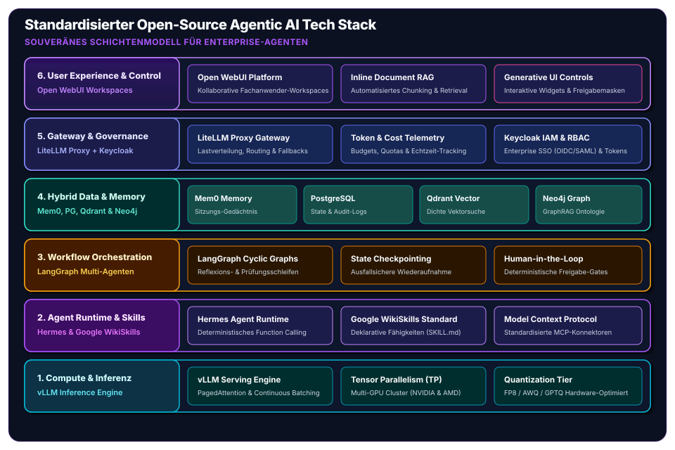
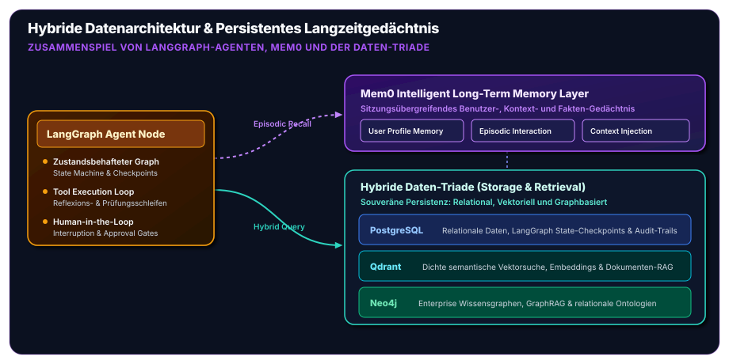

---
title: "Ein standardisierter Open-Source Agentic AI Tech Stack: Architektur, Komponenten und Governance für souveräne Enterprise-Agenten"
pubDate: "2026-09-03"
description: "Eine detaillierte ingenieurwissenschaftliche Analyse unseres standardisierten Open-Source KI-Tech-Stacks: vLLM, Hermes Agent, Google WikiSkills, LangGraph, Mem0, PostgreSQL/Qdrant + Neo4j, LiteLLM Proxy, Keycloak und Open WebUI."
tags: ["artificial-intelligence", "agentic-ai", "open-source", "software-architecture", "vllm", "langgraph", "mem0", "neo4j", "keycloak", "enterprise-ai"]
icon: "./icon.jpg"
---

Die Diskussion um generative künstliche Intelligenz in Industrie und Wissenschaft hat einen kritischen Reifegrad erreicht. Während in den ersten Jahren der Hype-Phase einfache Chatbot-Wrapper und der unreflektierte Konsum proprietärer Cloud-APIs dominierten, erkennen Enterprise-Architekten und IT-Entscheider heute die gravierenden systemischen Risiken dieser Herangehensweise: unkontrollierbare Token-Kosten, intransparente Modell-Änderungen über Nacht, regulatorische Konflikte hinsichtlich des Datenschutzes (DSGVO, AI Act) und ein fataler strategischer Vendor Lock-in.

Wer Künstliche Intelligenz nicht nur als Spielerei, sondern als tragende Säule mission-kritischer Unternehmensprozesse etablieren will, benötigt **Souveränität, Determinismus und architektonische Exzellenz**. 

In unserer Beratungspraxis an der Schnittstelle zwischen angewandter Spitzenforschung und industrieller Softwaretechnik haben wir einen **standardisierten, quelloffenen Agentic AI Tech Stack** konzipiert und implementiert. Dieser Beitrag legt die Architektur, das Schichtenmodell und das Zusammenspiel der einzelnen Kernkomponenten detailliert dar.

## 1. Das 6-Schichten-Modell für Souveräne KI-Agenten

Ein belastbarer KI-Stack darf kein unübersichtlicher Flickenteppich aus Python-Skripten sein. Wir strukturieren die Gesamtlösung in sechs klar abgegrenzte, modular austauschbare Architekturschichten:

| Schicht | Funktionale Domäne | Kerntechnologien | Primäre Verantwortung |
| :--- | :--- | :--- | :--- |
| **6. User Experience & Control** | Mensch-Maschine-Schnittstelle | **Open WebUI** | Ergonomische Fachanwender-Workspaces, Dokumenten-RAG & Generative UI |
| **5. Gateway & Governance** | Sicherheit, Identity & Routing | **LiteLLM Proxy + Keycloak** | Zentrales Token-Accounting, Fallbacks, Enterprise SSO (OIDC/SAML) & RBAC |
| **4. Hybrid Data & Memory** | Persistenz & Kontextgedächtnis | **Mem0, PostgreSQL, Qdrant, Neo4j** | Relationale Daten, dichte Vektorsuche, Wissensgraphen & episodisches Gedächtnis |
| **3. Workflow Orchestration** | Zyklische Multi-Agenten-Steuerung | **LangGraph** | Zustandsbehaftete Graphen, Prüfschleifen, Time-Travel & Human-in-the-Loop |
| **2. Agent Runtime & Skills** | Autonome Logik & Werkzeug-Standards | **Hermes Agent & Google WikiSkills** | Deterministisches Function Calling, standardisierte Werkzeugkataloge (SKILL.md) |
| **1. Compute & Inference** | Hardware-nahe Modellausführung | **vLLM** | Hochdurchsatz-Serving, PagedAttention, Continuous Batching, Tensor-Parallelismus |

## 2. Schicht 1: Hochdurchsatz-Inferenz mit vLLM

Das Fundament jedes autonomen Systems ist die Fähigkeit, Open-Weights-Modelle (wie Llama, Mistral, Qwen oder DeepSeek) mit minimaler Latenz (*Time-to-First-Token*, TTFT) und maximaler Concurrency bereitzustellen. 

Herkömmliche HuggingFace-Inferenz-Pipelines scheitern unter Last an Speicherfragmentierung und linearem Skalierungsaufwand. Wir setzen im Inferenz-Tier standardmäßig auf **vLLM**:

* **PagedAttention-Algorithmus**: Analog zur virtuellen Speicherverwaltung und Paging in modernen Betriebssystemen fragmentiert PagedAttention den Key-Value-Cache (KV-Cache) nicht im zusammenhängenden GPU-VRAM, sondern verwaltet ihn in flexiblen Speicherseiten. Dies senkt den VRAM-Verbrauch um bis zu 60–80 % und erlaubt massive Batch-Größen.
* **Continuous Batching**: Eingehende Benutzer- und Agenten-Prompts werden dynamisch auf Iterationsebene zusammengefasst, anstatt auf die Beendigung kompletter Sequenzen zu warten.
* **Hardware-Parallelismus**: Native Unterstützung für Tensor Parallelism (TP) und Pipeline Parallelism (PP) über mehrere NVIDIA- oder AMD-Beschleuniger sowie moderne Quantisierungsstandards (FP8, AWQ, GPTQ).

## 3. Schicht 2: Autonome Agenten-Intelligenz mit Hermes & Google WikiSkills

Ein Inferenz-Server liefert reine Next-Token-Vorhersagen. Um daraus handlungsfähige Agenten zu formen, die Datenbanken abfragen, Code ausführen und APIs ansprechen, bedarf es zweier Standards:

### Hermes Agent Runtime
Das von Nous Research vorangetriebene **Hermes-Ökosystem** repräsentiert die Speerspitze offener Modelle für agentische Workflows. Hermes ist gezielt auf strukturiertes JSON-Output, fortgeschrittenes Function Calling und autonome Denkprozesse (*Chain-of-Thought / ReAct*) trainiert. Es agiert deterministisch und lässt sich ohne Abhängigkeit von geschlossenen OpenAI-Funktionen betreiben.

### Google WikiSkills / Agent Skills Standard
Werkzeuge (*Tools*) dürfen nicht als undokumentierter Spaghetti-Code im Prompt enden. Wir standardisieren alle Fähigkeiten nach dem **Google WikiSkills / Agent Skills Format**:
* Jede Fähigkeit wird deklarativ in einer standardisierten Schnittstellendatei (SKILL.md) spezifiziert.
* Typisierung via Zod oder Pydantic garantiert, dass Parameternamen, Typen, Grenzwerte und Validierungsregeln zur Laufzeit strikt erzwungen werden.
* Dynamische Skill-Discovery erlaubt es Agenten, zur Laufzeit gezielt diejenigen Werkzeuge in den Kontext zu laden, die für die aktuelle Teilaufgabe erforderlich sind, wodurch das Context Window sauber und fokussiert bleibt.

## 4. Schicht 3: Zyklische Orchestrierung mit LangGraph

Einfache Automatisierungen lassen sich mit linearen Ketten (DAGs) lösen. Reale Geschäftsprozesse erfordern jedoch **Schleifen, Rekursion, Fehlerkorrektur und Reflexion**. 

Wir nutzen **LangGraph**, um Multi-Agenten-Systeme als zustandsbehaftete, zyklische Graphen zu modellieren:

1. **State Persistence & Checkpointing**: Nach jedem Berechnungsschritt (*Node*) speichert LangGraph den globalen Systemzustand persistent in einer Datenbank ab. Stürzt ein Inferenz-Node ab oder tritt ein Netzwerk-Timeout auf, setzt der Agent die Arbeit nahtlos am letzten Prüfpunkt fort.
2. **Human-in-the-Loop Interruption**: Gefährliche Aktionen (z. B. das Ausführen einer SQL-Mutation oder das Versenden einer E-Mail) können im Graph als Unterbrechungspunkt (*Breakpoint*) definiert werden. Der Graph pausiert deterministisch, wartet auf die explizite Freigabe eines menschlichen Experten über das Web-UI und führt den Pfad erst nach Zustimmung fort.
3. **Multi-Agenten-Handoffs**: Spezialisierte Sub-Agenten (z. B. ein Recherche-Agent, ein Code-Reviewer und ein Test-Validator) arbeiten kollaborativ zusammen, moderiert durch deterministische Routing-Knoten.

## 5. Schicht 4: Hybride Datenarchitektur & Mem0-Langzeitgedächtnis

LLMs leiden unter zwei systemischen Schwächen: begrenzten Kontextfenstern und vollständiger Amnesie zwischen zwei Sitzungen. Ein produktionsreifer Tech-Stack löst dies durch eine hybride Speicher-Triade in Kombination mit einer dedizierten Gedächtnisschicht:

* **PostgreSQL**: Das relationale Rückgrat für transaktionale Integrität, strukturierte Geschäftsdaten, Systemprotokolle und LangGraph-Checkpoint-Tabellen.
* **Qdrant**: Extrem performante, in Rust geschriebene Vektordatenbank für dichte semantische Ähnlichkeitssuche in unstrukturierten Dokumenten, Handbüchern und Quellcode.
* **Neo4j (GraphRAG)**: Reine Vektorsuche scheitert an komplexen relationalen Abhängigkeiten („Welche Softwarekomponenten sind von Server X abhängig und wem gehört das Budget?“). Neo4j bildet relationale Unternehmens-Ontologien ab und ermöglicht echtes Graph-Reasoning.
* **Mem0**: Verwaltet dynamisch das benutzerspezifische Langzeitgedächtnis. Fakten, Vorlieben und frühere Beschlüsse werden sitzungsübergreifend extrahiert, indiziert und bei relevanten Folgeanfragen transparent re-injiziert.

## 6. Schicht 5: Enterprise Governance mit LiteLLM Proxy & Keycloak

In Enterprise-Umgebungen darf kein interner Dienst direkt und ungeschützt auf Inferenz-Cluster zugreifen. Es bedarf strikter Governance:

### LiteLLM Proxy
Der **LiteLLM Proxy** fungiert als intelligentes KI-Gateway:
* **Lastverteilung & Fallback**: Fällt ein lokaler vLLM-Knoten wegen GPU-Wartung aus, leitet der Proxy Anfragen automatisch auf Backup-Cluster um.
* **Kosten- & Token-Monitoring**: Granulare Aufschlüsselung von Input-, Output- und Cache-Tokens nach Abteilung, Projekt oder Mitarbeiter.
* **Budget Enforcing**: Automatische Drosselung oder Unterbrechung bei Erreichen definierter Budgetgrenzen.

### Keycloak Identity Federation
**Keycloak** sichert das gesamte Ökosystem auf Enterprise-Niveau ab:
* Standardisierte Anbindung an bestehende Active Directory-, LDAP- oder Okta-Instanzen via OpenID Connect (OIDC) und SAML 2.0.
* Feingranulares Role-Based Access Control (RBAC): Welche Fachabteilung darf auf welche Agenten-Fähigkeiten und Dokumentenbereiche zugreifen?

## 7. Schicht 6: Human-in-the-Loop Interaktion mit Open WebUI

Die fortschrittlichste Backend-Architektur verpufft, wenn Anwender auf kryptische Kommandozeilen angewiesen sind. **Open WebUI** schließt die Lücke zur Belegschaft:

* **Ergonomisches Interface**: Modernes, ansprechendes Webinterface mit Multi-Modell-Auswahl, Konversationsverwaltung und Markdown-Rendering mit nativer KaTeX-Mathematik-Unterstützung.
* **Dokumenten-RAG direkt im Chat**: Fachanwender laden PDFs, Tabellen oder Code hoch; das System übernimmt automatisiertes Chunking, Embedding und Vektor-Retrieval.
* **Workspaces & Tool-Freigaben**: Administratoren können kuratierte Assistenten mit spezifischen Systemprompts und WikiSkills-Werkzeugen für einzelne Benutzergruppen freischalten.

## Fazit & Nächste Schritte

Der hier vorgestellte **Open-Source Agentic AI Tech Stack** beweist, dass Unternehmen keine Kompromisse zwischen Innovationsgeschwindigkeit und Datensouveränität eingehen müssen. Durch die gezielte Kombination spezialisierter, modularer Open-Source-Bausteine entsteht ein Gesamtsystem, das:

1. **Vollständig datensouverän** im eigenen Rechenzentrum oder in einer europäischen Cloud betrieben werden kann,
2. **Skalierbar und deterministisch** agiert – ohne unberechenbare Blackbox-Abhängigkeiten,
3. **Auditierbar und sicher** den Anforderungen von ISO 27001, DSGVO und EU AI Act genügt.

Interessieren Sie sich für die Konzeption, Dimensionierung oder Implementierung dieses Stacks in Ihrer Organisation? Informieren Sie sich in unserem Leistungsbereich [Artificial Intelligence](/services/ai) oder vereinbaren Sie ein unverbindliches Fachgespräch zu unserem Servicemodul [Technology Stack](/services/ai/stack).