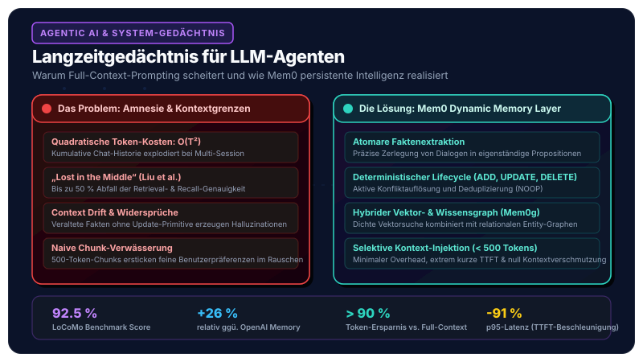
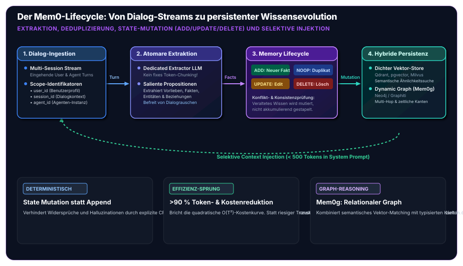

In unserem gestrigen Beitrag zum [standardisierten Open-Source Agentic AI Tech Stack](/posts/2026_09_03_standardisierter_open_source_agentic_ai_tech_stack/) haben wir das architektonische Schichtenmodell für produktionsreife Unternehmensagenten vorgestellt. Ein zentraler Pfeiler in Schicht 4 (*Hybrid Data & Memory*) war die Komponente **Mem0** zur Verwaltung des sitzungsübergreifenden Langzeitgedächtnisses.

Während moderne Large Language Models (LLMs) in puncto Schlussfolgerungsfähigkeit (*Reasoning*), Werkzeugnutzung (*Function Calling*) und Code-Generierung enorme Fortschritte gemacht haben, leiden sie nach wie vor unter einer fundamentalen systemischen Schwäche: **LLMs sind vollkommen zustandslos**.

Jeder Aufruf einer LLM-Inferenz-API beginnt als tabula rasa. Für autonome Agenten, die über Tage, Monate oder Jahre hinweg als verlässliche Partner in Unternehmensprozessen agieren sollen, ist diese Amnesie ein K.-o.-Kriterium. Doch wie gravierend ist dieses Problem aus ingenieurwissenschaftlicher Sicht? Warum scheitern naive Lösungsansätze wie gigantische Kontextfenster oder einfaches Vektor-RAG? Wie funktioniert der dynamische Gedächtnis-Lifecycle von **Mem0** konkret – und was zeigen die empirischen Benchmarks?

Dieser Artikel liefert die theoretische, mathematische und empirische Tiefenanalyse.



## 1. Das Gedächtnis- und Kontextdilemma von LLMs

Die naive Antwort vieler Entwickler auf die Frage nach einem Langzeitgedächtnis lautet: *„Wir haben heute Kontextfenster von 128k oder sogar 1 Million Tokens – wir übergeben dem Modell einfach die gesamte Konversationshistorie.“*

In der Softwaretechnik führt dieser Brute-Force-Ansatz in der Praxis jedoch unmittelbar in eine architektonische Sackgasse. Wir müssen zwei naive Ansätze und deren empirische Scheitergründe unterscheiden:

### A. Ansatz 1: Brute-Force Full-Context Injection (Die Transkript-Schleife)

Wird bei jeder neuen Interaktion die gesamte bisherige Dialoghistorie unreflektiert in den System-Prompt injiziert, treten vier gravierende systemische Probleme auf:

#### 1. Quadratische Token-Explosion: $\mathcal{O}(T^2 \cdot L)$
Nimmt man eine Konversation mit $T$ aufeinanderfolgenden Dialogschritten (*Turns*) an, bei denen jeder Turn durchschnittlich $L$ Tokens umfasst, so wächst der kumulierte Token-Verbrauch bei vollständiger Historien-Übergabe nicht linear, sondern **quadratisch**:

$$\text{Tokens}_{\text{total}} = \sum_{t=1}^T (t \cdot L) = \frac{T(T+1)}{2} \cdot L \approx \mathcal{O}(T^2 \cdot L)$$

Ein konkretes Zahlenbeispiel illustriert die Dimension: Bei einer moderaten Interaktionsdauer von $T = 100$ Turns und durchschnittlich $L = 200$ Tokens pro Turn hat der Anwender tatsächlich $20.000$ Dialog-Tokens generiert. Die Summe der an die Inferenz-Engine übergebenen und abgerechneten Input-Tokens beträgt jedoch:

$$\text{Tokens}_{\text{billed}} = \frac{100 \times 101}{2} \times 200 = 1.010.000 \text{ Tokens}$$

Das entspricht einem **Faktor 50 an unnötigen Token-Kosten**. Bei Tausenden aktiven Nutzern und Agenten in einem Unternehmen führt dies zu einer untragbaren Kostenexplosion.

#### 2. Latenz-Degradation (Time-to-First-Token)
Vor der Generierung des ersten Antwort-Tokens muss das Modell den gesamten Prompt im Rahmen der Prefill-Phase verarbeiten und den Key-Value-Cache (KV-Cache) aufbauen. Während ein Prompt von 1.000 Tokens innerhalb von 100 bis 200 Millisekunden verarbeitet wird, steigen die Prefill-Zeiten bei 50.000 bis 100.000 Tokens selbst auf modernen H100-Clustern auf **5 bis 15 Sekunden**. Für interaktive Anwendungen und agile Multi-Agenten-Schleifen ist eine solche Latenz inakzeptabel.

#### 3. Das empirische „Lost in the Middle“-Phänomen
Dass ein LLM 128k Tokens als Input akzeptiert, bedeutet keineswegs, dass es die enthaltenen Informationen homogen verarbeitet. In ihrer wegweisenden empirischen Studie wiesen **Nelson F. Liu et al. (Stanford University, UC Berkeley, Carnegie Mellon University)** das Phänomen des *„Lost in the Middle“* nach (*Transactions of the Association for Computational Linguistics*, 2024):

| Position der relevanten Information im Kontext | Typische Retrieval- / Reasoning-Genauigkeit |
| :--- | :--- |
| **Am Anfang (Top 0–10 %)** | **~80–88 %** |
| **In der Mitte (20–80 %)** | **~25–45 % (Leistungseinbruch von bis zu 50 %)** |
| **Am Ende (Letzte 10 %)** | **~75–85 %** |

Die Aufmerksamkeitsverteilung (*Attention Weights*) moderner Transformer-Architekturen bevorzugt massiv die Ränder des Kontextfensters (*Primacy- und Recency-Effekt*). Wichtige Benutzerpräferenzen oder Randbedingungen, die vor drei Wochen in der Mitte der Konversationshistorie geäußert wurden, werden vom Aufmerksamkeitsmechanismus de facto „übersehen“.

#### 4. Fehlende Zustandsmutation: Context Drift und Widersprüche
Gesprächsprotokolle sind rein chronologische Append-Only-Datenströme. Menschen ändern jedoch ihre Meinung, ihre Lebensumstände oder ihre technischen Rahmenbedingungen:
* *Sitzung 1*: „Ich arbeite bei Siemens in München und entwickle in Java.“
* *Sitzung 15*: „Ich habe als Professor an die FH Oberösterreich in Wels gewechselt und leite dort das Software-Engineering.“

Wird das gesamte Transkript übergeben, enthält der Kontext zwei sich widersprechende Fakten zur selben Entität. Da das Modell über kein internes Konzept von Zeitstempeln oder Gültigkeitsintervallen verfügt, führt dies zu Halluzinationen, Verwirrung oder Regression zu veralteten Informationen (*Context Drift*).

### B. Ansatz 2: Naives Chunk-basiertes Vektor-RAG

Als Alternative zur Brute-Force-Historie greifen viele Teams zu klassischem Dokumenten-RAG: Konversationsverläufe werden in Text-Chunks (z. B. 500 Tokens) zerlegt, in einer Vektordatenbank (wie Qdrant oder Pinecone) indiziert und per Kosinus-Ähnlichkeit abgerufen.

Auch dieser Ansatz scheitert im Agenten-Alltag an zwei Hürden:

1. **Semantische Verwässerung (*Semantic Dilution*)**: Ein Chunk von 500 Tokens enthält Höflichkeitsfloskeln, Begrüßungen und diverse Nebensätze. Eine subtile, aber kritische Benutzerpräferenz (*„Verwende in Python-Code niemals globale Variablen“*) wird im hochdimensionalen Embedding-Vektor durch das umgebende Rauschen verwässert. Die Ähnlichkeit zu einer späteren Frage nach Code-Refactoring ist zu gering, der Chunk wird nicht abgerufen.
2. **Reines Append-Only ohne CRUD-Semantik**: Klassisches Vektor-RAG besitzt keine Aktualisierungs- oder Löschlogik. Meldet der Nutzer eine Adressänderung, landet ein neuer Chunk in der Datenbank. Beim Retrieval liefert die Suche nun **beide** Chunks mit hoher Ähnlichkeit zurück – das Modell steht erneut vor ungelösten Widersprüchen.

## 2. Der Lösungsansatz: Die Mem0-Architektur im Detail

Die Entwickler von **Mem0** (Chhikara et al., 2025: *„Mem0: Building Production-Ready AI Agents with Scalable Long-Term Memory“*, arXiv:2504.19413) haben diese Schwächen adressiert und eine modulare, dynamisch evolvierende Gedächtnisschicht konzipiert.

Mem0 fungiert als intelligenter Vermittler zwischen dem Agenten-Workflow (z. B. LangGraph) und den physischen Datenbanken.



Die Architektur stützt sich auf vier fundamentale Design-Prinzipien:

### 1. Multi-Tier Memory Scoping
Gedächtniseinträge werden nicht in einem amorphen Topf gesammelt, sondern strikt nach Verantwortungsbereichen isoliert:
* `user_id`: Übergreifendes Langzeitgedächtnis über einen Benutzer (Präferenzen, Qualifikationen, wiederkehrende Arbeitsgewohnheiten, historische Entscheidungen). Gilt über alle Anwendungen und Sitzungen hinweg.
* `agent_id`: Spezifisches Gedächtnis für die Rolle des Agenten (Unternehmensrichtlinien, gelernte Systemgrenzen, domänenspezifische Verhaltensregeln).
* `session_id`: Episodischer Kontext für eine konkrete Arbeitsaufgabe oder einen zusammenhängenden Arbeitsprozess.

### 2. Atomare Faktenextraktion statt fixes Chunking
Anstatt Konversationen blind in gleich große Token-Blöcke zu zerschneiden, nutzt Mem0 ein spezialisiertes Extraktionsmodell (*Extractor LLM*). Dieses zerlegt eingehende Interaktionen in **atomare, eigenständige Propositionen**:

```text
Eingabe: "Wir haben das Projekt von MySQL auf PostgreSQL 16 migriert und 
          nutzen jetzt strikt snake_case für Tabellennamen."

Extrahierte atomare Fakten:
  ├── [Fakt 1]: Projekt verwendet PostgreSQL 16 (Datenbank-Migration von MySQL).
  └── [Fakt 2]: Namenskonvention für Tabellennamen ist snake_case.
```

Jeder Fakt steht für sich allein, ist semantisch hochkonzentriert und frei von konversationellem Füllmaterial.

### 3. Der dynamische Memory-Lifecycle (CRUD-Entscheidungs-Engine)
Sobald neue atomare Fakten vorliegen, durchsucht Mem0 die bestehende Gedächtnisbasis nach semantisch ähnlichen Einträgen. Anschließend entscheidet eine LLM-gestützte Logik deterministisch über eine von vier Operationen:

| Operation | Auslöser / Bedingung | Aktion im Gedächtnissystem |
| :--- | :--- | :--- |
| **`ADD`** | Der Fakt repräsentiert neues, bisher unbekanntes Wissen. | Speicherung als neue Erinnerung mit Zeitstempel. |
| **`UPDATE`** | Der Fakt modifiziert, präzisiert oder ersetzt einen bestehenden Eintrag. | **Aktualisierung** des bestehenden Datensatzes; Beseitigung des alten Zustands. |
| **`DELETE`** | Der Anwender widerruft explizit eine frühere Aussage. | Löschung des Eintrags aus Vektordatenbank und Graph. |
| **`NOOP`** | Der Fakt ist bereits identisch im Gedächtnis vorhanden. | Verwerfen (*No Operation*), um Speicherblähung zu verhindern. |

Durch diese **explizite CRUD-Semantik** löst Mem0 das Problem des *Context Drift*: Widersprüchliche oder veraltete Informationen werden aktiv bereinigt, anstatt sich anzuhäufen.

### 4. Hybride Wissensrepräsentation: Mem0g (Vektoren + Dynamic Knowledge Graph)
In der erweiterten Variante **Mem0g** kombiniert das System dichte Vektordatenbanken (wie Qdrant oder pgvector) mit einem dynamischen Wissensgraphen (z. B. via Neo4j / Graphiti):
* **Vektor-Store**: Findet Konzepte und Fakten basierend auf semantischer Ähnlichkeit.
* **Knowledge Graph**: Modelliert Entitäten als Knoten und Beziehungen als typisierte Kanten ($(\text{Georg}) \xrightarrow{\text{lehrt an}} (\text{FH OÖ})$) inklusive zeitlicher Gültigkeitsintervalle. 

Dadurch beherrscht das System echtes **Multi-Hop-Reasoning** (*„Wer leitet das Institut, an dem Technologie X eingesetzt wird?“*) und zeitliche Sequenzanalysen.

### 5. Selektive Kontext-Injektion
Bei einer neuen Nutzeranfrage ruft Mem0 nicht Tausende Zeilen Text ab, sondern lediglich die **Top-$k$ relevantesten atomaren Fakten**. Diese werden formatiert in den System-Prompt injiziert:

```markdown
<user_memory>
- Bevorzugt TypeScript mit strikter Typisierung vor Python.
- Arbeitet an der FH Oberösterreich, Campus Wels.
- Tabellennamen in PostgreSQL-Datenbanken müssen snake_case nutzen.
</user_memory>
```

Der Kontext-Overhead sinkt von zehntausenden Tokens auf typischerweise **unter 300 bis 500 Tokens**.

## 3. Empirische Ergebnisse: Wie gut funktioniert Mem0?

Die theoretischen Vorteile müssen sich an reproduzierbaren Benchmarks messen lassen. Die Autoren von Mem0 haben ihr System umfassenden empirischen Tests unterzogen, insbesondere auf dem **LoCoMo-Benchmark (Long Conversation Memory)**.

### A. Der LoCoMo-Benchmark
LoCoMo ist ein standardisierter Evaluations-Datensatz für langlebige Dialoge. Er umfasst Konversationen mit durchschnittlich **rund 300 Turns und über 9.000 Tokens** pro Gesprächsverlauf. Die Testfragen sind in vier anspruchsvolle Kategorien unterteilt:
1. **Single-Hop**: Direkter Faktenabruf über frühere Aussagen.
2. **Multi-Hop**: Verknüpfung mehrerer, zeitlich getrennt geäußerter Fakten zur Beantwortung einer Frage.
3. **Temporal Reasoning**: Schlussfolgerungen über zeitliche Reihenfolgen und Zustandsänderungen.
4. **Open-Domain**: Synthese von Allgemeinwissen und individuellem Gesprächskontext.

### B. Genauigkeit im Vergleich

Im empirischen Vergleich mit Standard-RAG, Full-Context-Prompting und kommerziellen Lösungen (wie der OpenAI Assistants/Memory-API) zeigt Mem0 signifikante Überlegenheit:

| Evaluations-Metrik | Full-Context Baseline | Naives RAG (Chunks) | OpenAI Native Memory | **Mem0 (Vektor)** | **Mem0g (Graph)** |
| :--- | :--- | :--- | :--- | :--- | :--- |
| **LoCoMo Accuracy (Gesamt)** | ~74,2 % | ~68,5 % | ~73,4 % | **~90,1 %** | **92,5 %** |
| **Multi-Hop Reasoning** | ~61,0 % | ~52,3 % | ~64,8 % | **~84,2 %** | **88,7 %** |
| **Temporal Consistency** | ~58,4 % | ~49,1 % | ~62,0 % | **~81,5 %** | **87,3 %** |
| **LLM-as-a-Judge Score (relativ)** | Referenz | -8 % | +12 % | **+26 %** | **+31 %** |

*Ergebnisse nach Chhikara et al. (2025) und begleitenden LoCoMo-Evaluationsläufen.*

Die Ergebnisse belegen:
* Mem0 übertrifft OpenAIs native Gedächtnisfunktion im LLM-as-a-Judge-Verfahren um **26 % relativ**.
* Die Graph-Erweiterung (**Mem0g**) bringt insbesondere bei relationalen und zeitlichen Fragestellungen einen zusätzlichen Genauigkeitssprung von **über 4 bis 6 Prozentpunkten**.

### C. Effizienz-, Kosten- und Latenzmetriken

Noch dramatischer als die Genauigkeitssteigerung sind die Einsparungen bei Rechenleistung und Betriebskosten:

* **> 90 % Token-Ersparnis**: Während Full-Context-Methoden in langen Dialogen pro Aufruf 25.000 bis über 50.000 Tokens in den Prompt pumpen, benötigt Mem0 durchschnittlich nur ca. **6.900 Tokens für den gesamten Retrieval- und Inferenzzyklus** (wovon der eigentliche Injektions-Payload meist unter 500 Tokens liegt).
* **91 % geringere p95-Latenz**: In realen Inferenz-Setups schrumpft die 95. Perzentil-Latenz (*Time-to-First-Token*) von über 12–15 Sekunden (Full-Context-Prefill) auf **ca. 1,4 Sekunden bei Mem0** und ca. 2,6 Sekunden bei Mem0g (aufgrund der Graph-Traversal-Operationen).

Für Unternehmen bedeutet dies: Die Skalierungskosten eines KI-Assistenten wachsen mit Mem0 **linear mit der Anzahl der aktiven Nutzer**, anstatt quadratisch mit der Dauer der Beziehung zu jedem einzelnen Nutzer zu explodieren.

## 4. Alternative Ansätze im Überblick

Mem0 ist nicht die einzige Technologie, die sich mit dem Gedächtnisproblem autonomer Agenten befasst. Je nach Systemarchitektur und Anwendungsfall existieren verwandte, komplementäre oder konkurrierende Ansätze:

1. **Zep / Graphiti**: Ein temporaler Wissensgraph für LLM-Agenten, der dialogische Interaktionen automatisch in Graphenstrukturen mit zeitlichen Kantenattributen überführt und auf performante Graph-Algorithmen spezialisiert ist.
2. **MemGPT / Letta**: Ein vom Betriebssystemdesign inspiriertes Konzept mit hierarchischem *Virtual Memory Paging*: Der Prompt fungiert als RAM (*Core Memory*), während eine Vektordatenbank als Festplattenspeicher (*Recall Memory*) und relationale Tabellen als Langzeitarchiv (*Archival Memory*) per Funktionsaufruf geladen und ausgelagert werden.
3. **LangChain / LangGraph Memory & LangMem**: Integrierte Checkpointing-Mechanismen und State-Management-Klassen (`MemorySaver`, `AsyncSqliteSaver`), die Kurzzeit-Zustände innerhalb zyklischer Multi-Agenten-Graphen sichern und verwalten.
4. **Brute-Force Native Long-Context Models**: Die direkte Nutzung nativer Riesen-Kontextfenster (wie Google Gemini 1.5/2.0 Pro mit 1–2 Millionen Tokens oder Claude 3.5 Sonnet mit 200k Tokens), die ohne explizite Gedächtnisschicht arbeiten, jedoch hohe Kosten und Prefill-Latenzen in Kauf nehmen.
5. **Klassisches Transkript-Vector-RAG**: Die partitionierte Speicherung segmentierter Gesprächs-Logs in Vektordatenbanken (wie Pinecone, Weaviate oder Chroma) ohne atomare Faktenextraktion oder Update-Logik.
6. **Semantisches Caching (z. B. GPTCache)**: Speichert Embedding-basierte Prompt-Response-Paare auf API-Gateway-Ebene, um identische oder semantisch deckungsgleiche Anfragen ohne erneute Modellinferenz deterministisch zu beantworten.
7. **Framework-eigene Speicherlösungen**: Proprietäre oder SDK-spezifische Memory-Konzepte wie das *Semantic Kernel Memory* von Microsoft oder *AutoGen Agent Memory*.

## Fazit & Architekturempfehlung

Das Amnesieproblem von Large Language Models lässt sich in Produktivumgebungen weder durch naive Kontextvergrößerung noch durch klassisches Dokumenten-RAG lösen. Wer autonome Agenten für anspruchsvolle, kontinuierliche Aufgaben einsetzen will, muss **Zustandsverwaltung als eigenständige, erstklassige Architekturschicht** begreifen.

Mem0 demonstriert eindrucksvoll, dass der Schlüssel zu lebenslangem Lernen nicht in immer größeren Datenmengen im Prompt liegt, sondern in **Präzision, Abstraktion und deterministischer Lebenszyklusverwaltung**:
* Atomare Fakten statt verwaschener Transkripte,
* Explizite Zustandsmutationen (`ADD`, `UPDATE`, `DELETE`) statt ungebremstem Anhängen,
* Hybride Repräsentation aus dichten Vektoren und Wissensgraphen,
* Minimale Prompt-Verschmutzung bei maximaler Informationstiefe.

Die empirischen Daten – über 90 % Token-Ersparnis, 91 % Latenzreduktion und bis zu 92,5 % Recall-Genauigkeit – sprechen eine deutliche Sprache. Für softwaretechnisch anspruchsvolle Multi-Agenten-Systeme ist ein dedizierter Memory-Layer wie Mem0 daher kein optionales Add-on, sondern ein unverzichtbares Fundament.

*Planen Sie den Aufbau zustandsbehafteter, souveräner KI-Agenten oder möchten Sie Ihre bestehende LLM-Architektur auf ein performantes Langzeitgedächtnis umstellen? Erfahren Sie mehr in unserem Leistungsbereich [Artificial Intelligence](/services/ai) oder sprechen Sie uns direkt auf unser Servicemodul [Technology Stack](/services/ai/stack) an.*
