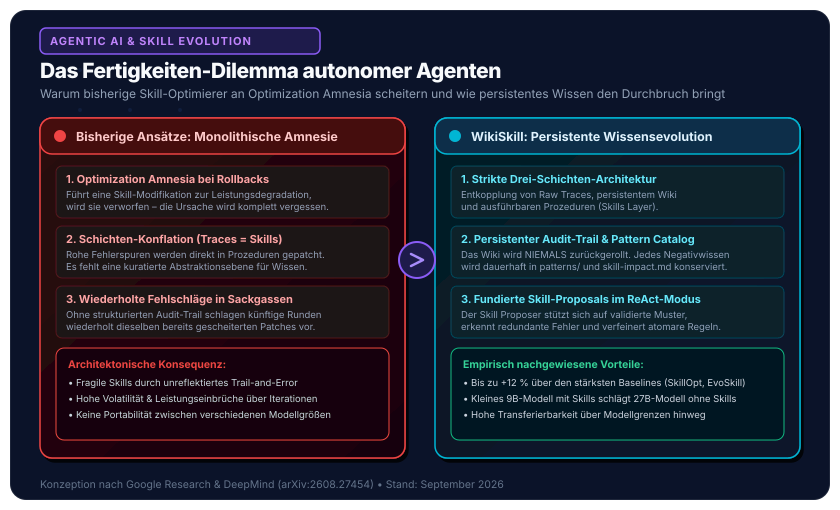
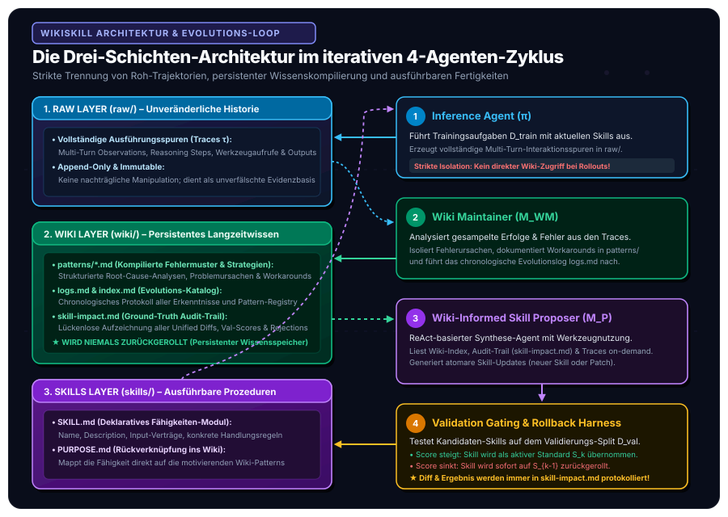

In unseren vorangegangenen Beiträgen zum [standardisierten Open-Source Agentic AI Tech Stack](/posts/2026_09_03_standardisierter_open_source_agentic_ai_tech_stack/) und zum [sitzungsübergreifenden Langzeitgedächtnis via Mem0](/posts/2026_09_04_langzeitgedaechtnis_llm_agenten_mem0/) haben wir die Fundamente moderner Unternehmensagenten skizziert. Dabei wurde eine fundamentale Zweiteilung des Agentengedächtnisses deutlich: Während Systeme wie Mem0 das *deklarative und episodische Gedächtnis* über Benutzer und Konversationskontexte verwalten, erfordern autonome Problemlöser eine völlig andere Kategorie von Wissen: **prozedurale Fertigkeiten (*Agent Skills*)** – also domänenspezifische Handlungsanweisungen, Tool-Chains, Validierungsroutinen und Heuristiken.

Bislang standen Software-Architekten vor einem Dilemma: Manuelle Skill-Entwicklung skaliert nicht, da menschliche Entwickler unmöglich sämtliche Randfälle antizipieren können. Erste Versuche automatisierter Skill-Evolution (wie EvoSkill, Trace2Skill oder SkillOpt) scheitern jedoch regelmäßig an einem Phänomen, das die Forschung als **„Optimization Amnesia“** bezeichnet: Erkenntnisse aus Fehlversuchen bleiben in isolierten Trajektorien-Logs verstreut und werden bei verworfenen Modifikationen schlicht vergessen.

Mit der Veröffentlichung von **WikiSkill** (*„WikiSkill: Compiling Agent Experience into Persistent Knowledge for Skill Evolution“*, Tang et al., Google Research & Virginia Tech, August 2026, [arXiv:2608.27454](https://arxiv.org/abs/2608.27454)) liegt nun ein architektonisches Paradigma vor, das dieses Problem an der Wurzel packt. Inspiriert von Andrej Karpathys Leitidee des *LLM Wiki* entkoppelt WikiSkill rohe Ausführungserfahrungen, kumulatives Wissen und ausführbare Fertigkeiten in einer **Drei-Schichten-Architektur**.

Dieser Artikel liefert die ingenieurwissenschaftliche Analyse: Welches systemische Problem lösen Ansätze wie WikiSkill? Wie funktioniert die Architektur im Detail? Was zeigen die empirischen Benchmarks – und welche alternativen Paradigmen existieren am Markt?



## 1. Das Problem: Das Fertigkeiten-Dilemma & „Optimization Amnesia“

Um die Tragweite von WikiSkill zu verstehen, muss man die Grenzen klassischer Anpassungsstrategien für Large Language Models (LLMs) im agentischen Umfeld betrachten.

### A. Warum parametrisches Feintuning für Agent-Skills ungeeignet ist

Traditionell wurden Modelle durch Supervised Fine-Tuning (SFT) oder Reinforcement Learning (RLHF/DPO) an neue Domänen angepasst. In der Praxis autonomer Agenten stößt dieser parametrische Ansatz jedoch auf drei K.-o.-Kriterien:
1. **Catastrophic Forgetting & Verwaschung:** Das Einstudieren spezieller API-Verträge oder Arbeitsabläufe über Gradienten-Updates beschädigt häufig die allgemeine Reasoning-Fähigkeit des Modells.
2. **Mangelnde Auditierbarkeit:** In regulierten Industrieumgebungen muss transparent nachvollziehbar sein, *welche* Handlungsregel ein Agent befolgt hat. Gewichte in einem neuronalen Netz sind eine intransparente Black-Box.
3. **Zykluszeiten & Kosten:** Ein Retraining oder Feintuning bei jedem geänderten Schnittstellen-Endpunkt oder Geschäftslogik-Update ist wirtschaftlich nicht tragfähig.

Aus diesem Grund hat sich in modernen Systemen der Standard modularer, dateisystembasierter Fähigkeiten etabliert: **Agent Skills** (wie das von Anthropic und Google vorangetriebene `SKILL.md`-Format). Ein Skill bündelt Anweisungen, Workflows, Validierungsregeln und Skripte in einem klar strukturierten Verzeichnis, das vom Agenten zur Laufzeit deklarativ eingelesen wird.

### B. Das Dilemma automatisierter Skill-Evolution

Da das manuelle Verfassen von Skills für Hunderte Werkzeuge zeitaufwendig und fehleranfällig ist, entstanden automatisierte Evolutions-Frameworks. Ihr Grundprinzip: Ein Agent führt Aufgaben auf einem Trainingsdatensatz aus, ein Optimizer-Modell analysiert die erfolgreichen und gescheiterten Ausführungsspuren (*Traces*) und formuliert Modifikationen an den Skill-Dateien.

In der Praxis leiden bisherige Frameworks (wie *EvoSkill*, *Trace2Skill* oder *SkillOpt*) jedoch unter drei gravierenden strukturellen Schwächen:

```
Bisheriger monolithischer Ansatz (Amnesie-Gefahr):
[Rohe Trajektorien τ] ──(Direktes Patching)──> [Kandidaten-Skill S'] ──(Validierung)
                                                          │
                                                    [Score sinkt?]
                                                          │
                                                          ▼
                                            [ROLLBACK: S' wird verworfen!]
                                            ❌ Fehleranalyse & Negativwissen
                                               sind für immer verloren!
```

#### 1. Optimization Amnesia durch strikte Rollbacks
Zur Qualitätssicherung setzen professionelle Frameworks ein *Validation Gating* ein: Führt ein vorgeschlagener Skill-Patch auf einem Validierungsdatensatz zu einer Verschlechterung der Erfolgsquote, wird der Patch verworfen und der vorherige Skill-Zustand wiederhergestellt (*Rollback*). 
Das fatale Nebenprodukt: **Mit dem Rollback wird auch die gesamte Analyse des Fehlschlags vernichtet.** Das System vergisst, *warum* der Eingriff gescheitert ist, welche Randbedingung übersehen wurde und welche API-Inkompatibilität aufgetreten ist.

#### 2. Schichten-Konflation (Conflation of Traces, Knowledge, and Procedures)
Bisherige Ansätze versuchen, aus unstrukturierten, teils tausende Tokens langen Ausführungsprotokollen direkt prozeduralen Code oder Handlungsanweisungen zu synthetisieren. Es fehlt eine Zwischenschicht, die beobachtete Phänomene generalisiert, kausale Zusammenhänge strukturiert und verallgemeinerbare Fehlermuster von einmaligen Ausführungsartefakten trennt.

#### 3. Wiederkehrende Sackgassen (Recurrent Blind Alleys)
Weil es keinen lückenlosen, versionsunabhängigen Audit-Trail über verworfene Vorschläge gibt, tendieren Optimizer-Agenten in späteren Runden dazu, nahezu identische oder leicht variierte Patches erneut vorzuschlagen, die bereits in früheren Iterationen gescheitert sind. Die Optimierung divergiert oder stagniert in lokalen Minima.

## 2. Der konkrete Lösungsansatz: Die WikiSkill-Architektur

Die Kernidee von WikiSkill basiert auf einem Gedanken, den **Andrej Karpathy (2026)** unter dem Begriff *„LLM Wiki“* formulierte: Anstatt flüchtige Kontextfenster immer wieder mit Rohdaten zu überfluten, müssen Sprachmodelle ihre Erfahrungen kontinuierlich in eine strukturierte, kumulative und persistent wachsende Wissensbasis kompilieren.

WikiSkill formalisiert dieses Paradigma für die Evolution von Agentenfähigkeiten durch eine strikte **Drei-Schichten-Wissensarchitektur** und einen koordinierten **4-Agenten-Evolutionszyklus**.



### A. Die Drei-Schichten-Architektur (*Three-Layer Knowledge Architecture*)

Der Arbeitsbereich des Agentensystems wird in drei voneinander entkoppelte Schichten unterteilt:

#### 1. Raw Layer (`raw/`)
* **Charakteristik:** Unveränderlich (*Immutable*) und Append-Only.
* **Inhalt:** Vollständige, detaillierte Ausführungstraces $\tau_i = (o_1, a_1, \dots, o_T, a_T)$ aller Trainingsaufgaben. Sie protokollieren die exakten multi-turn Interaktionen des Inferenz-Agenten, inklusive Reasoning-Gedankengängen (*Chain-of-Thought*), Werkzeugaufrufen (*Tool Calls*), Parametern, Environment-Rückmeldungen und finalen Ausgaben.
* **Zweck:** Dient als unverfälschbare Evidenzbasis für nachgelagerte Diagnose-Agenten.

#### 2. Wiki Layer (`wiki/`)
* **Charakteristik:** **Persistent und kumulativ – wird niemals zurückgerollt!**
* **Inhalt:**
  * `patterns/*.md`: Strukturierte Markdown-Dokumente, die jeweils ein spezifisches Fehlermuster (*Failure Mode*) oder eine erfolgreiche Lösungsstrategie beschreiben. Jedes Muster enthält eine Root-Cause-Analyse, Kontextbedingungen und konkrete Handlungs-Workarounds.
  * `index.md`: Katalog aller identifizierten Muster mit semantischer Kategorisierung.
  * `logs.md`: Chronologisches Protokoll der Erkenntnisse über alle Iterationsrunden hinweg.
  * `skill-impact.md`: Ein programmatisch geführter, objektiver Prüfpfad (*Audit Trail*). Hier protokolliert das Harness nach jeder Validierungsrunde die genaue Unified-Diff des Skill-Vorschlags, den erzielten Validierungsscore und das Akzeptanzurteil (`Accepted` vs. `Rejected`).
* **Zweck:** Bereitstellung von Langzeitbewusstsein. Der Optimierer weiß exakt, welche Hypothesen bereits getestet wurden, welche Modifikationen gescheitert sind und welche Fehlerbilder persistent auftreten.

#### 3. Skills Layer (`skills/`)
* **Charakteristik:** Ausführbar (*Executable*), modular und mutationsfähig.
* **Inhalt:** Die aktiven Fertigkeiten $S = \{s_1, \dots, s_M\}$. Jede Fähigkeit resideiert in einem eigenen Verzeichnis mit zwei Kerndateien:
  * `SKILL.md`: Die eigentliche prozedurale Spezifikation mit YAML-Frontmatter (eindeutiger Name, Beschreibung), Anwendungsbedingungen, präzisen Schritt-für-Schritt-Instruktionen und Code-Mustern.
  * `PURPOSE.md`: Eine explizite Referenzmatrix, die die prozeduralen Regeln des Skills direkt mit den motivierenden Mustern im Wiki (`wiki/patterns/*.md`) verknüpft.

### B. Das mathematische Problem-Setup

Formal lässt sich die iterative Skill-Evolution wie folgt definieren:

Sei $\mathcal{D} = \{(x_i, y_i)\}_{i=1}^N$ ein Datensatz von Aufgaben mit Eingaben $x_i$ und Ground-Truth-Antworten $y_i$. Der Datensatz wird disjunkt in Training $\mathcal{D}_{\text{train}}$, Validierung $\mathcal{D}_{\text{val}}$ und Test $\mathcal{D}_{\text{test}}$ partitioniert.

Ein Agent $\pi$ operiert mit Werkzeugen $\mathcal{U}$ und dem aktiven Skill-Set $S_k$. Seine Interaktion erzeugt eine Trajektorie $\tau_i \sim \pi(x_i; S_k)$, deren finale Antwort $\hat{y}_i$ über eine domänenspezifische Bewertungsfunktion evaluiert wird:

$$f(\hat{y}_i, y_i) \in [0, 1]$$

Die Gesamtgüte auf einem Datensplit $\mathcal{D}_{\text{split}}$ entspricht dem Erwartungswert:

$$\mathcal{R}(\mathcal{T}_{\text{split}}) = \frac{1}{|\mathcal{D}_{\text{split}}|} \sum_{(x_i, y_i) \in \mathcal{D}_{\text{split}}} f(\hat{y}_i, y_i)$$

Im Zustand der Iteration $k$ wird das Gesamtsystem durch das Tupel $(S_k, W_k)$ repräsentiert, wobei $S_k$ die prozeduralen Skills und $W_k$ das persistente Wiki darstellen. Ausgehend von $(S_0, W_0) = (\emptyset, \emptyset)$ zielt der Evolutionsprozess darauf ab, die finale Test-Performance $\mathcal{R}(\mathcal{T}_{\text{test}})$ auf ungesehenen Aufgaben zu maximieren.

### C. Der koordinierte 4-Agenten-Evolutionszyklus

In jeder Evolutionsrunde $k$ durchläuft WikiSkill vier exakt aufeinander abgestimmte Phasen:

#### 1. Inferenz-Rollout mit dem Inference Agent ($\pi$)
Der Inferenz-Agent führt die Aufgaben aus $\mathcal{D}_{\text{train}}$ unter Verwendung der aktuellen Fähigkeiten $S_{k-1}$ aus. Die vollständigen Instruktionen der Skills werden direkt in den System-Prompt injiziert, um Retrieval-Fehler als Störfaktor auszuschließen.
> **Architektonische Randbedingung:** Der Inferenz-Agent erhält während des Trainingsrollouts **keinen Zugriff auf die Wiki-Ebene**. Warum diese strikte Isolation essenziell ist, belegt die spätere Ablationsstudie eindrucksvoll.

#### 2. Muster-Konsolidierung durch den Wiki Maintainer ($\mathcal{M}_{\text{WM}}$)
Nach Abschluss der Rollouts wird eine geschichtete Stichprobe (*Stratified Sample*) aus erfolgreichen und fehlgeschlagenen Traces an den **Wiki Maintainer** übergeben. Dieser agiert als erfahrener Systemanalytiker:
* Er isoliert die Ursachen von Fehlern (*Root-Cause Analysis*).
* Er extrahiert funktionierende Heuristiken aus erfolgreichen Läufen.
* Er erstellt neue Muster unter `wiki/patterns/` oder aktualisiert bestehende Dokumente über inkrementelle Text-Patches.
* Er aktualisiert den Katalog `index.md` und protokolliert die Synthese in `logs.md`.

#### 3. Hypothesen- und Skill-Generierung durch den Skill Proposer ($\mathcal{M}_{\text{P}}$)
Der **Skill Proposer** ist ein autonomer ReAct-Agent (*Reasoning + Acting*). Um eine Überlastung des Kontextfensters zu vermeiden, erhält er initial lediglich:
1. Den aktuellen Wiki-Index $\mathcal{I}(W'_k)$,
2. Die historische Erfolgsmatrix (`wiki/skill-impact.md`),
3. Eine kompakte Zusammenfassung aller Trainingsresultate (Pass/Fail-Status).

Über Werkzeuge (`read_file`) inspiziert der Proposer gezielt diejenigen Wiki-Muster und Roh-Traces, die für die drängendsten Fehlerbilder relevant sind. Basierend auf dieser fundierten Wissensbasis formuliert er einen **atomaren Änderungsvorschlag** $P_k$: entweder das Erstellen eines neuen Skills oder ein präzises Diff auf einen bestehenden Skill.

#### 4. Validation Gating & Rollback Harness
Der Vorschlag wird im Workspace angewendet: $S'_k = \text{Apply}(S_{k-1}, P_k)$. Anschließend evaluiert das Test-Harness die Kandidaten-Skills $S'_k$ auf dem Validierungsdatensatz $\mathcal{D}_{\text{val}}$.

Die Übernahme-Entscheidung $a_k$ folgt einer strikten Ungleichung:

$$a_k = \begin{cases} \text{Accepted}, & \text{falls } \mathcal{R}(\mathcal{T}_{\text{val}, k}) > \mathcal{R}_{\text{best}} \\ \text{Rejected}, & \text{andernfalls} \end{cases}$$

* **Fall 1 (Accepted):** Der Score steigt. $S_k = S'_k$ wird der neue Standard, und $\mathcal{R}_{\text{best}} \leftarrow \mathcal{R}(\mathcal{T}_{\text{val}, k})$.
* **Fall 2 (Rejected):** Der Score stagniert oder fällt ab. Das Skill-Set wird unmittelbar auf den vorherigen Stand zurückgerollt: $S_k = S_{k-1}$.

**Der entscheidende Unterschied zu früheren Ansätzen:**
Das Wiki $W_k$ wird **niemals** zurückgerollt! Stattdessen hängt das Harness programmatisch einen neuen Eintrag an `wiki/skill-impact.md` an:

$$W_k \leftarrow \text{Update}(W'_k, P_k, \mathcal{R}(\mathcal{T}_{\text{val}, k}), a_k)$$

Damit ist der gescheiterte Eingriff samt seiner Diff und der Fehlersymptomatik unlöschbar dokumentiert. Der Skill Proposer wird in Iteration $k+1$ diesen Fehler nicht wiederholen.

## 3. Empirische Daten zur Effektivität des WikiSkill-Ansatzes

Die Autoren von Google Research haben WikiSkill einer rigorosen empirischen Überprüfung unterzogen. Die Experimente umfassen fünf anspruchsvolle Benchmarks und fünf moderne Sprachmodelle aus drei verschiedenen Modellfamilien.

### A. Experimentelles Setup

#### 1. Benchmarks
* **LiveMathematicianBench (LiveMath):** Mathematisches Schließen auf Expertenniveau mit Beweisskizzen.
* **SealQA:** Komplexe Websuche mit dynamischer Informationsaggregation.
* **SpreadSheetBench (SpreadSheet):** Mehrstufige Tabellenkalkulation und Datenmanipulation via Code.
* **OfficeQA:** Frage-Antwort-Systeme über extrem lange Dokumentenkontexte mit hohem Navigationsaufwand.
* **ALFWorld:** Interaktive, verkörperte (*Embodied*) Agenten-Entscheidungen in textbasierten Spielumgebungen.

#### 2. Evaluierte Modelle
* **Gemini-3.5-Flash** (Google DeepMind)
* **Qwen-3.5-4B-Instruct** (Alibaba Cloud / Qwen Team)
* **Qwen-3.5-9B-Instruct**
* **Qwen-3.6-27B**
* **Gemma-4-31B-It** (Google)

#### 3. Verglichene Baselines
* **No-Skill:** Ausführung ohne zusätzliche prozedurale Fertigkeiten.
* **Trace2Skill (Ni et al., 2026):** Extraktion von Lektionen aus Traces ohne separate Wissensschicht.
* **EvoSkill (Alzubi et al., 2026):** Führt eine kumulierte Historie früherer Vorschläge, vermischt jedoch Logs mit Prozeduren.
* **SkillOpt (Yang et al., 2026):** Deep-Learning-inspirierte Skill-Optimierung mit Text-Lernraten und rejected-step feedback.

### B. Hauptergebnisse & Performance-Vergleich

Tabelle 1 fasst die durchschnittliche Testleistung über alle Benchmarks hinweg zusammen (Mittelwerte aus 3 unabhängigen Durchläufen mit gepaartem Bootstrap-Test bei $p < 0{,}05$):

| Inferenz-Modell | No-Skill | Trace2Skill | EvoSkill | SkillOpt | **WikiSkill** | $\Delta$ zur stärksten Baseline |
| :--- | :---: | :---: | :---: | :---: | :---: | :---: |
| **Qwen-3.5-4B** | 26.2 % | 31.8 % | 33.4 % | 35.2 % | **38.5 %** | **+3.3 %** |
| **Qwen-3.5-9B** | 29.9 % | 38.4 % | 41.2 % | 42.3 % | **47.4 %** | **+5.1 %** |
| **Qwen-3.6-27B** | 39.4 % | 48.6 % | 51.1 % | 53.3 % | **63.3 %** | **+10.0 %** |
| **Gemma-4-31B** | 38.8 % | 45.9 % | 46.8 % | 49.7 % | **55.5 %** | **+5.8 %** |
| **Gemini-3.5-Flash** | 44.5 % | 50.1 % | 51.7 % | 51.7 % | **63.7 %** | **+12.0 %** |

Die Ergebnisse offenbaren drei bemerkenswerte Phänomene:

#### 1. Konsistente Überlegenheit über alle Domänen
WikiSkill schlägt jede bisherige Skill-Evolutionsmethode über sämtliche Modelle hinweg signifikant. Während Baselines wie EvoSkill und SkillOpt auf einzelnen Datensätzen volatil reagieren (EvoSkill verschlechterte beispielsweise Gemma-4-31B auf LiveMath von 33,9 % auf 29,8 %; SkillOpt verschlechterte Gemini-3.5-Flash auf SealQA von 29,4 % auf 28,2 %), liefert WikiSkill **in nahezu allen Konfigurationen monotone Leistungssteigerungen**.

Besonders drastisch zeigen sich die Zuwächse in komplexen Reasoning- und Tool-Domänen:
* **Gemini-3.5-Flash auf LiveMath:** Sprung von **33.0 % auf 72.6 %** (+39.6 Punkte).
* **Gemini-3.5-Flash auf SpreadSheet:** Steigerung von **50.5 % auf 76.6 %** (+26.1 Punkte).
* **Qwen-3.6-27B auf SpreadSheet:** Steigerung von **28.5 % auf 69.4 %** (+40.9 Punkte).
* **Qwen-3.6-27B auf ALFWorld:** Steigerung von **52.8 % auf 77.6 %** (+24.8 Punkte).

#### 2. Skill-Evolution komplementiert Modell-Skalierung
Innerhalb der Qwen-Familie wächst der relative Nutzen von WikiSkill mit der Leistungsfähigkeit des Basismodells:

$$\Delta_{\text{Qwen-4B}} = +12{,}3 \% \quad \longrightarrow \quad \Delta_{\text{Qwen-9B}} = +17{,}5 \% \quad \longrightarrow \quad \Delta_{\text{Qwen-27B}} = +23{,}9 \%$$

Größere Modelle verfügen über das erforderliche Instruktionsverständnis, um nuancierte prozedurale Leitplanken exakt umzusetzen.

#### 3. Evolved Skills als Skalierungs-Ausgleich
Gleichzeitig zeigt sich, dass hochwertige prozedurale Skills fehlende Modellparameter kompensieren können:
* **Qwen-3.5-9B mit WikiSkill erreicht 47.4 %** Gesamterfolg – und übertrifft damit das dreimal größere Modell **Qwen-3.6-27B ohne Skills (39.4 %)** um Längen!
* Selbst das kompakte **Qwen-3.5-4B mit WikiSkill (38.5 %)** schließt nahezu zur Baseline des 27B-Modells auf.

### C. Modellübergreifender Skill-Transfer (*Cross-Model Transfer*)

Ein zentrales Versprechen modularer Agent Skills ist ihre Portabilität. In Experimenten untersuchten Tang et al., was passiert, wenn Fähigkeiten, die von Modell A evolviert wurden, zur Inferenzzeit von Modell B ausgeführt werden:

| Quellmodell (Skill-Evolvierer) | Zielmodell (Inferenz-Ausführung) | Benchmark | Baseline (No-Skill) | Self-Evolved | **Transferred Skill** |
| :--- | :--- | :--- | :---: | :---: | :---: |
| **Qwen-3.6-27B** | Qwen-3.5-9B | SpreadSheet | 24.3 % | 33.6 % | **50.5 %** |
| **Qwen-3.6-27B** | Gemma-4-31B | LiveMath | 33.9 % | 56.7 % | **73.7 %** |
| **Qwen-3.5-4B** | Gemma-4-31B | LiveMath | 33.9 % | 56.7 % | **73.1 %** |
| **Qwen-3.5-4B** | Gemma-4-31B | ALFWorld | 44.1 % | 64.6 % | **66.9 %** |
| **Qwen-3.5-4B** | Gemini-3.5-Flash | SpreadSheet | 50.5 % | 76.6 % | **18.1 % (Negativer Transfer)** |

Hieraus lassen sich zwei entscheidende ingenieurtechnische Erkenntnisse ableiten:

1. **Skill-Discovery $\neq$ Skill-Execution:** Ein starkes Quellmodell kann hochgradig generalisierbare Lösungsstrategien entdecken, die schwächere Modelle befähigen, weit über ihrem normalen Niveau zu agieren (Qwen-9B springt auf SpreadSheet von 33,6 % mit eigenen Skills auf 50,5 % mit 27B-Skills).
2. **Die Gefahr negativen Transfers bei kleinen Modellen:** Wenn ein 4B-Modell Skills evolviert, neigt es dazu, kleinteilige Workarounds zu kodieren (z. B. strikte Einzeilen-Python-Befehle oder defensive Typkonvertierungen), um seine eigenen Rechenfehler zu umgehen. Übergibt man diese restriktiven Skills an ein High-End-Modell wie Gemini-3.5-Flash auf SpreadSheet, bricht dessen Leistung von 50,5 % auf 18,1 % ein – der restriktive Skill hindert das große Modell daran, elegante End-to-End-Skripte auszuführen.

### D. Die entscheidenden Ablationsstudien

Um die Kausalität der Wiki-Schicht zweifelsfrei nachzuweisen, führten die Autoren kontrollierte Ablationen mit Gemini-3.5-Flash durch:

| Konfiguration | Skill Proposer hat Wiki-Zugriff? | Inferenz-Agent hat Wiki-Zugriff? | Durchschnittlicher Benchmark-Score |
| :---: | :---: | :---: | :---: |
| Baseline ohne Wiki | ❌ Nein | ❌ Nein | 48.7 % |
| Wiki für Inferenz | ❌ Nein | ✅ Ja | 52.1 % |
| **WikiSkill Standard** | **✅ Ja** | **❌ Nein** | **63.7 % (+15.0 %)** |
| Vollzugriff | ✅ Ja | ✅ Ja | 60.9 % (-2.8 %) |

Zwei zentrale Befunde sind für Systemarchitekten von herausragender Bedeutung:

1. **Der persistente Wissensspeicher ist der Hebel (+15.0 Punkte):** Erhält der Skill Proposer Zugriff auf das kumulative Wiki samt Audit-Trail, springt die Leistung von 48,7 % auf 63,7 %. Ohne Wiki operiert der Optimierer mit fragmentierter Historie und läuft in dieselben Sackgassen.
2. **Warum Inferenz-Agenten keinen Wiki-Zugriff haben dürfen:** Erhält der Inferenz-Agent während der Trainingsrollouts direkten Lesezugriff auf das Wiki, **sinkt** die finale Qualität der entwickelten Skills von 63,7 % auf 60,9 % (auf LiveMath sogar von 72,6 % auf 64,8 %). Der Grund: Der Inferenz-Agent bedient sich zur Aufgabenlösung opportunistisch direkt aus den Roh-Mustern des Wikis. Dadurch entstehen unvollständige Trajektorien, die dem Skill Proposer das klare Signal nehmen, welche Handlungsanweisungen zwingend in den kanonischen Skill (`SKILL.md`) überführt werden müssen!

## 4. Systematische Übersicht alternativer Ansätze

Um den WikiSkill-Ansatz in der Forschungs- und Entwicklungslandschaft präzise zu verorten, liefert die folgende Übersicht eine strukturierte Kategorisierung konkurrierender und komplementärer Paradigmen. Entsprechend dem Fokus dieser Analyse werden diese Ansätze hier lediglich zur Abgrenzung aufgeführt und nicht weiter vertieft:

```
Übersicht alternativer Optimierungs- und Gedächtnisparadigmen:
│
├── 1. Reine Kontext- & Prompting-Verfahren
│   ├── In-Context Learning (ICL) mit Trajektorien-Historien
│   └── Generalisierte Prompt-Optimierer (z. B. GEPA, DSPy, OPRO)
│
├── 2. Parametrische Modell-Adaption
│   ├── Supervised Fine-Tuning (SFT) auf Aufgabentrajektorien
│   └── Reinforcement Learning mit Belohnungsmodellen (RLHF, DPO, PPO)
│
├── 3. Unstrukturierte episodische & semantische Agenten-Speicher
│   ├── Episodische Fakten-Datenbanken (z. B. Mem0, Zep)
│   └── Reflexions- und Trial-Speicher (z. B. Reflexion, ExpeL, Generative Agents)
│
├── 4. Bisherige dateisystembasierte Skill-Evolutionsmethoden
│   ├── Trace2Skill (Ni et al., 2026)
│   ├── EvoSkill (Alzubi et al., 2026)
│   └── SkillOpt (Yang et al., 2026)
│
└── 5. Ganzheitliche Harness- & Retrieval-Systeme
    ├── Agent-Harness-Optimierer (z. B. Meta-Harness, HarnessX)
    └── Dynamische Skill-Retrieval- & Routing-Systeme (z. B. SkillRet)
```

1. **In-Context Learning & Few-Shot Trajektorien-Injektion:** Das unreflektierte Übergeben vergangener Interaktionsspuren direkt in das Prompt-Fenster des Modells (führt zu den bekannten Latenz-, Token- und Attention-Problemen).
2. **Generalisierte automatische Prompt-Optimierer (z. B. GEPA, DSPy, OPRO):** Methoden, die Systemprompts über Meta-Prompts oder Gradienten-Surrogate iterativ verfeinern, jedoch keine strukturierten Werkzeug- und Skill-Dateisysteme verwalten.
3. **Parametrisches Feintuning & RL (SFT, DPO, PPO):** Permanentes Einschreiben von Mustern in die Gewichte des neuronalen Netzes (hoher Rechenaufwand, Black-Box-Problematik, mangelnde Flexibilität bei API-Änderungen).
4. **Episodische & semantische Gedächtnisspeicher (z. B. Mem0, Reflexion, ExpeL):** Systeme, die deklarative Nutzerfakten oder textuelle Selbstreflexionen speichern, jedoch keine versionskontrollierten, modularen Handlungsanweisungen nach festen Schnittstellenverträgen generieren.
5. **Konventionelle Skill-Evolutionsmethoden (EvoSkill, Trace2Skill, SkillOpt):** Bisherige State-of-the-Art-Methoden zur iterativen Skill-Generierung, die jedoch unter Schichten-Konflation und der oben analysierten *Optimization Amnesia* leiden.
6. **Agent-Harness-Optimierung (z. B. Meta-Harness, HarnessX):** Frameworks, die nicht primär den prozeduralen Inhalt von Skills mutieren, sondern die umgebende Systemarchitektur (Tools, Agenten-Topologien und Kontrollflüsse) adaptieren.
7. **Skill-Retrieval & Routing (z. B. SkillRet):** Vektor- oder graphbasierte Mechanismen, die aus einer riesigen Bibliothek bestehender Skills den passenden für die aktuelle Aufgabenstellung auswählen (komplementär zur qualitativen Skill-Evolution).

## 5. Fazit & Ausblick für die Softwaretechnik

Die Ergebnisse der WikiSkill-Studie markieren einen fundamentalen Wendepunkt im Entwurf autonomer KI-Systeme. Für Software-Architekten und Ingenieure lassen sich drei Kernlektionen festhalten:

1. **Erfahrung ist nicht gleich Fertigkeit:** Rohe Ausführungsspuren dürfen niemals ungefiltert in prozedurale Instruktionen fließen. Die Etablierung einer kuratierten, persistenten Zwischenschicht – des **Wikis** – ist der Schlüssel zur Vermeidung von Optimierungsamnesie.
2. **Verworfenes Wissen ist wertvolles Wissen:** Der größte Hebel für langfristige Stabilität liegt in der Dokumentation des Scheiterns. Ein System, das seine negativen Validierungsresultate in einem maschinenlesbaren Prüfpfad (`skill-impact.md`) konserviert, konvergiert signifikant schneller und stabiler als blinde Trial-and-Error-Schleifen.
3. **Entkopplung schlägt Brute-Force:** Hochwertig evolvierte Skills ermöglichen es kompakten Open-Source-Modellen (wie Qwen-9B), monolithische Großmodelle ohne Skills im industriellen Werkzeugeinsatz zu deklassieren – bei einem Bruchteil der Inferenzkosten und voller On-Premise-Datensouveränität.

Die Zukunft agentischer Systeme gehört nicht immer größeren Kontextfenstern, sondern der disziplinierten, schichtenbasierten Wissenskompilierung.
