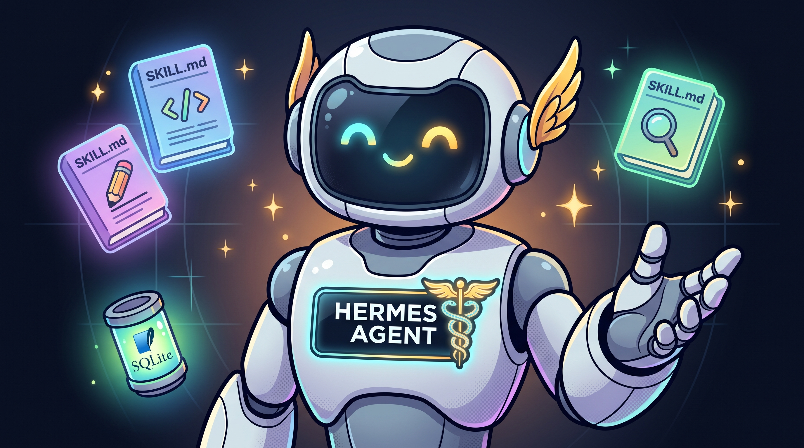
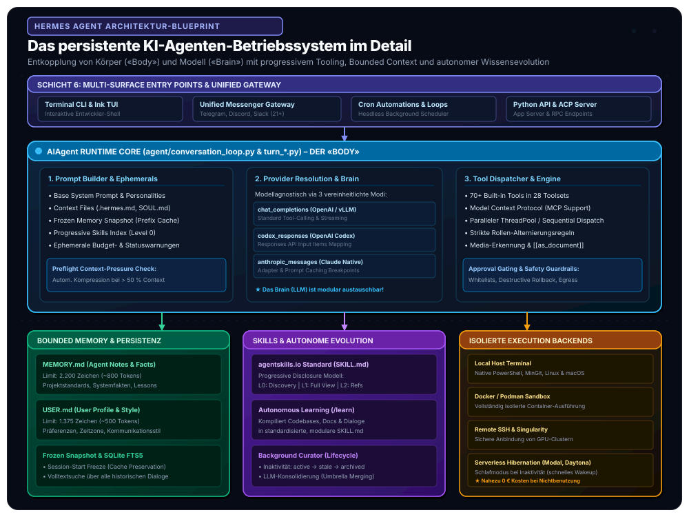
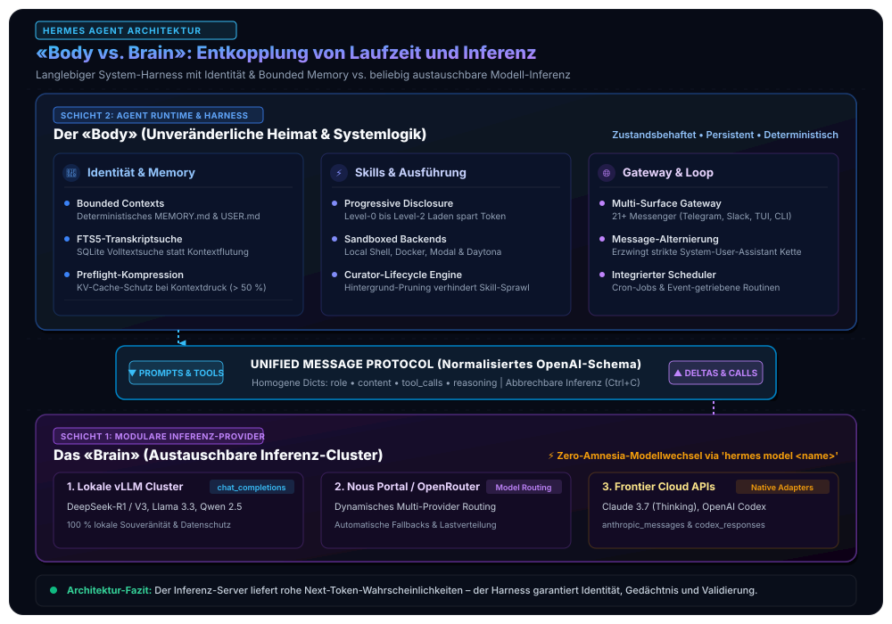
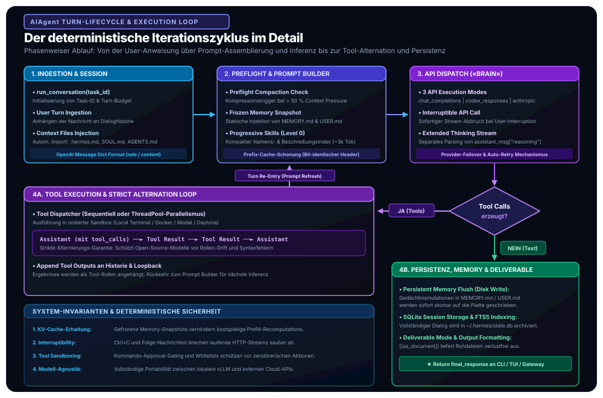
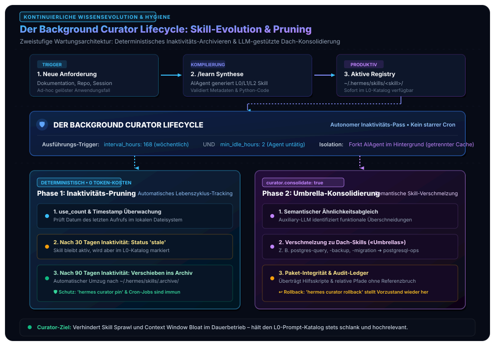

In unserer Artikelserie zu souveränen, produktionsreifen Unternehmens-KI-Systemen haben wir die architektonischen Leitplanken für moderne Agenten schrittweise vertieft: Ausgehend von unserem [standardisierten Open-Source Agentic AI Tech Stack](/posts/2026_09_03_standardisierter_open_source_agentic_ai_tech_stack/) über die mathematische und empirische Analyse des [sitzungsübergreifenden Langzeitgedächtnisses via Mem0](/posts/2026_09_04_langzeitgedaechtnis_llm_agenten_mem0/) bis hin zur [persistenten Wissensevolution und Vermeidung von Optimization Amnesia via WikiSkill](/posts/2026_09_06_wikiskill_persistente_wissensevolution_agent_skills/).

Ein zentrales Postulat unseres Referenzmodells lautet: **Ein Inferenz-Server liefert lediglich Next-Token-Wahrscheinlichkeiten – er ist kein Agent.** Um aus rohen Sprachmodellen verlässliche, langlebige Software-Akteure zu formen, bedarf es einer dedizierten Laufzeitumgebung in **Schicht 2 (Agent Runtime & Skills)**.

Bislang dominierten in der Praxis zwei problematische Extreme: Entweder starre, proprietäre Chatbot-Silos und Coding-Copiloten, die fest an eine Cloud-API gekoppelt sind, oder improvisierte Python-Skripte, die bei wachsender Interaktionsdauer unweigerlich an Kontextüberlauf, Speicherfragmentierung und mangelnder Fehlerbehandlung ersticken. Bereits in unseren früheren Experimenten zu [lokalen KI-Agenten und strukturierter Inferenz](/posts/2026_05_31_local_ai_agents_web_llm/) zeigte sich, dass deterministische Entscheidungszyklen ein striktes Zusammenspiel von Validierungsverträgen und Zustandsisolation verlangen.

Mit dem von **Nous Research** entwickelten **Hermes Agent** liegt nun ein quelloffenes, autarkes „Agenten-Betriebssystem“ vor, das genau diese Lücke schließt. Dieser Beitrag analysiert die Software-Architektur, den Turn-Lifecycle der Kern-Engine, das Zusammenspiel von Bounded Memory und FTS5-Transkriptsuche sowie das Zusammenspiel von standardisierten Skills und Hintergrund-Kuratierung.



Bevor wir in die feingranularen Ausführungszyklen einsteigen, veranschaulicht das folgende Referenzmodell die sechs Subsysteme der Gesamtlösung:



## 1. Die fundamentale Entwurfsphilosophie: «Body vs. Brain»

Herkömmliche Agenten-Frameworks verschmelzen das ausführende Programm eng mit den Eigenheiten eines bestimmten Modellanbieters. Ändert der Anbieter seine Funktionsaufruf-Syntax oder dreht an den System-Prompt-Gewichten, bricht die umgebende Logik zusammen. Ebenso fatal ist der umgekehrte Fall: Wird ein Agenten-Skript auf ein neues Modell umgestellt, gehen oft mühevoll akkumulierte Kontexte, Arbeitsroutinen und Verhaltensweisen verloren.

Hermes Agent begegnet diesem architektonischen Dilemma mit einer radikalen Trennung von **«Body» (Körper)** und **«Brain» (Gehirn)**:
* Der **Body** ist der langlebige, deterministische Laufzeit-Harness. Er verwaltet die Identität, kapselt Bounded Contexts (`MEMORY.md`, `USER.md`), indiziert vergangene Konversationen in SQLite (FTS5), lädt progressive Skills nach Bedarf und wickelt die Multi-Surface-Kommunikation mit über 21 Messaging-Plattformen ab.
* Das **Brain** ist eine austauschbare, rein funktionale Inferenzressource. Es konsumiert normalisierte Nachrichten und erzeugt Streaming-Deltas oder Tool-Aufrufe – ohne eigenen persistenten Zustand.
* Die **Protokollbrücke** entkoppelt beide Welten über ein homogenes OpenAI-Dictionary-Format (`role`, `content`, `tool_calls`, `reasoning`).

Diese Trennung garantiert echte Modellagnostik: Ein Anwender kann über den einfachen Befehl `hermes model <name>` zur Laufzeit zwischen einem lokalen 8B-vLLM-Knoten, einem Nous-Portal-Router oder einer Frontier-Cloud-API (Claude 3.7, Codex) wechseln, ohne dass der Agent seine Identität, seine gelernten Skills oder sein Gedächtnis verliert (**Zero Amnesia**).



### Der Körper als unveränderliche Heimat
Der **Body** stellt die langlebige Software-Infrastruktur dar. Hier residieren:
* Die **Persönlichkeit und Systemkonfiguration** (`config.yaml`, `SOUL.md`, `AGENTS.md`),
* Das **Gedächtnis** über Benutzer und Umgebung (`~/.hermes/memories/`),
* Die **kuratierte Skill-Bibliothek** (`~/.hermes/skills/`),
* Die **Scheduler-Routinen** (integrierte Cron-Dienste und Inaktivitäts-Trigger),
* Die **Kommunikations-Endpunkte** (ein einheitlicher Gateway-Prozess für über 21 Messaging-Plattformen).

### Das Gehirn als austauschbare Inferenz-Komponente
Das **Brain** ist eine reine Rechenressource. Hermes Agent abstrahiert Modellanbieter über drei standardisierte Inferenzmodi, die zur Laufzeit transparent aufgelöst werden:

| API-Ausführungsmodus | Zielsysteme / Provider | Client-Klasse | Besonderheiten & Protokoll |
| :--- | :--- | :--- | :--- |
| **`chat_completions`** | Lokales vLLM, OpenRouter, Nous Portal, OpenAI | `openai.OpenAI` | Standardisiertes Function Calling, Streaming-Deltas, OpenAI Message Schema |
| **`codex_responses`** | OpenAI Codex / Responses API | `openai.OpenAI` | Native Serialisierung in Responses-API Input Items |
| **`anthropic_messages`** | Anthropic Claude 3.5 / 3.7 | `anthropic.Anthropic` | Nativer Adapter, Tool-Use-Blöcke & Prompt Caching Breakpoints |

Ganz gleich, welches Backend konfiguriert ist: Vor und nach jedem Inferenzschritt normalisiert die Engine alle Nachrichten in ein homogenes, internes Format (`role`, `content`, `tool_calls`, `reasoning`). Der Anwender kann mit einem einfachen Konsolenbefehl (`hermes model`) von einem lokalen 8B-Open-Weights-Modell auf einen 70B-Inferenz-Knoten oder eine Cloud-Inferenz umschalten, **ohne dass der Agent seine Identität, seine gelernten Arbeitsweisen oder seine Erinnerungen verliert**.

## 2. Der Agent Loop & Turn-Lifecycle im Detail

Das Herzstück der Ausführung ist die Klasse `AIAgent`. Während frühere Versionen oft als monolithische Klassen realisiert wurden, folgt die moderne Architektur von Hermes Agent einer granularen Dekomposition: Die Fassade delegiert an `agent/conversation_loop.py`, während die einzelnen Iterationsphasen in modular isolierten Modulen (`agent/turn_*.py`) gekapselt sind.



Ein vollständiger Interaktionszyklus (*Turn Lifecycle*) durchläuft folgende Phasen:

### Phase 1: Ingestion & Kontext-Druckprüfung (*Preflight*)
Trifft eine Benutzeranweisung über die CLI, das Terminal User Interface (Ink TUI) oder das Messaging-Gateway ein, hängt `run_conversation()` die Nachricht an den bisherigen Dialogverlauf an.

Vor dem eigentlichen Modellaufruf führt das System einen **Preflight Compression Check** durch:
* Übersteigt der aktuelle Kontext **50 % des modellabhängigen Kontextfensters**, meldet der `context_compressor` Handlungsbedarf.
* Ältere Werkzeugausgaben und redundante Zwischenschritte werden deterministisch gekürzt oder via Auxiliary-Modell verlustarm verdichtet, um ein Überlaufen des Context Windows während mehrstufiger Tool-Chains präventiv auszuschließen.

### Phase 2: Assemblierung des System-Prompts (`prompt_builder.py`)
Der effektive System-Prompt wird hierarchisch zusammengesetzt:
1. **Basis-Direktiven:** Rolle, Formatierungsanweisungen und Verhaltensregeln.
2. **Projekt-Kontext:** Automatischer Import lokaler Konfigurationsdateien (`.hermes.md`, `AGENTS.md`, `CLAUDE.md`, `.cursorrules`).
3. **Gefrorene Gedächtnisblöcke:** Deterministische Injektion von `MEMORY.md` und `USER.md`.
4. **Progressiver Skill-Katalog:** Kompakte Level-0-Metadatenübersicht aller verfügbaren Fertigkeiten.
5. **Ephemere Zustandslayer:** Dynamische Statuswarnungen (verbleibendes Iterationsbudget, Kontextdruck), die nur für den unmittelbaren nächsten Schritt gelten und nicht in der Historie persistiert werden.

### Phase 3: Interruptible API Inferenz
Der Modellaufruf erfolgt über einen abbrechbaren Worker (`_interruptible_api_call`). Sendet der Nutzer via Tastaturkürzel (`Ctrl+C`) oder über einen Chat-Kanal eine Folgeinstruktion, bricht der laufende HTTP-Stream unverzüglich ab. Das Modell verharrt nicht in teuren Endlosschleifen, sondern nimmt die Richtungsänderung sofort auf.

Besitzt das Modell erweiterte Denkfähigkeiten (*Reasoning / Extended Thinking*), werden diese Gedankengänge im Feld `reasoning` separat erfasst und über Callbacks gestreamt, ohne das Tool-Calling-Format zu korrumpieren.

### Phase 4: Strikte Alternierungsregeln (*Message Alternation*)
Viele Open-Source-Modelle reagieren extrem instabil, wenn das Rollenprotokoll verletzt wird. Hermes Agent erzwingt im Dialoggraphen eine mathematisch strikte Alternierung:

$$\text{System} \longrightarrow \text{User} \longrightarrow \text{Assistant} \longrightarrow \text{User} \longrightarrow \dots$$

Trifft eine Werkzeuganforderung ein, gilt das deterministische Unterprotokoll:

$$\text{Assistant}_{(\text{tool\_calls})} \longrightarrow \text{Tool}_{(\text{call\_id}_1)} \longrightarrow \dots \longrightarrow \text{Tool}_{(\text{call\_id}_n)} \longrightarrow \text{Assistant}$$

* Zwei aufeinanderfolgende `Assistant`-Nachrichten sind **unzulässig**.
* Zwei aufeinanderfolgende `User`-Nachrichten werden automatisch zu einem Turn verschmolzen.
* Jeder `Tool`-Payload muss zwingend über seine eindeutige `tool_call_id` mit dem auslösenden `Assistant`-Block korrelieren.

### Phase 5: Parallele Werkzeugausführung & Persistenz
Sind die Parameter valide, führt der `ToolDispatcher` die Aufrufe entweder sequentiell oder bei voneinander unabhängigen Operationen nebenläufig über einen `ThreadPool` aus. Nach Abschluss des Zyklus:
1. Werden etwaige Gedächtnismutationen atomar auf die Festplatte geschrieben.
2. Wird die gesamte Konversation in der SQLite-Datenbank transaktional gesichert.
3. Erkennt das System generierte Mediendateien im Output und liefert diese nativ als Bild oder via `[[as_document]]`-Direktive als Rohdatei aus.

## 3. Das Speicher- und Gedächtniskonzept: Bounded Memory & FTS5-Transkripte

In unserer Untersuchung zum [sitzungsübergreifenden Langzeitgedächtnis via Mem0](/posts/2026_09_04_langzeitgedaechtnis_llm_agenten_mem0/) haben wir dargelegt, warum unbegrenzte Kontexthistorien zu einer quadratischen Token-Explosion $\mathcal{O}(T^2 \cdot L)$ und gravierender Latenzdegradation führen. 

Hermes Agent implementiert ein zweistufiges, komplementäres Gedächtnismodell: einen **strikt begrenzten, gecachten Sofortkontext** für die aktive Arbeit und eine **volltextindizierte Transkript-Persistenz** für historische Recherchen.

```
~/.hermes/
├── memories/
│   ├── MEMORY.md          # 2.200 Chars (~800 Tokens)  – System-, Projekt- & Umgebungswissen
│   └── USER.md            # 1.375 Chars (~500 Tokens)  – Benutzerpräferenzen & Kommunikationsstil
└── state.db               # SQLite 3 mit FTS5-Volltextindex über sämtliche historische Sitzungen
```

### Das Frozen-Snapshot-Pattern zur KV-Cache-Schonung
Ein gravierendes Problem dynamischer Prompts ist das Brechen des *Key-Value-Prefix-Caches* moderner Inferenz-Engines (wie vLLM PagedAttention oder Anthropic Prompt Caching). Wird der System-Prompt mitten in der Sitzung durch eine neue Gedächtniszeile mutiert, muss der gesamte KV-Cache ab Token 0 neu berechnet werden.

Hermes Agent löst dies durch das **Frozen-Snapshot-Prinzip**:
* Beim Start einer Sitzung werden `MEMORY.md` und `USER.md` von der Festplatte gelesen und als unveränderlicher Block in den System-Prompt montiert.
* Schreibt der Agent während der Sitzung eine Notiz via `memory(action="add")`, wird diese **sofort physisch auf der Festplatte persistiert**, aber **nicht** in den laufenden System-Prompt injiziert!
* Der Prompt-Prefix bleibt über die gesamte Session hinweg byteweise identisch. Erst bei der nächsten Sitzung wird der aktualisierte Snapshot geladen.

### Die Bounded-Memory-Spezifikation

Um Prompt-Verwässerung zu verhindern, unterliegen die beiden Speicherdateien harten Zeichengrenzen:

| Datei | Zweck & Semantik | Obergrenze | Typischer Umfang |
| :--- | :--- | :--- | :--- |
| **`MEMORY.md`** | Systemfakten, Projektkonventionen, Pfade, Tool-Eigenheiten, Lessons Learned | **2.200 Zeichen** (~800 Tokens) | 8–15 kompakte Sektionen |
| **`USER.md`** | Rolle, Zeitzone, Code-Stilpräferenzen, Kommunikationsgewohnheiten, No-Gos | **1.375 Zeichen** (~500 Tokens) | 5–10 präzise Leitsätze |

### Deterministische CRUD-Semantik via Substring Matching
Der Agent verwaltet diesen Speicher aktiv über das Werkzeug `memory`:
* `add`: Fügt eine neue Beobachtung hinzu (mit automatischer Deduplizierung).
* `replace`: Ersetzt einen bestehenden Eintrag mittels eindeutigem Teilstring-Matching (`old_text="dark mode"`).
* `remove`: Löscht veraltetes Wissen.

Läuft der Speicher über die Kapazitätsgrenze, bricht das System nicht stillschweigend ab, sondern wirft einen strukturierten Fehler zurück, der den Agenten zur sofortigen Konsolidierung zwingt:

```json
{
  "success": false,
  "error": "Memory at 2,100/2,200 chars. Adding this entry (250 chars) would exceed the limit. Consolidate now: use 'replace' to merge overlapping entries into shorter ones or 'remove' stale entries, then retry.",
  "usage": "2,100/2,200"
}
```

### Verlustfreie Transkriptsuche mit SQLite FTS5
Für Wissen, das über die 2.200 Zeichen hinausgeht, verlässt sich Hermes Agent nicht auf fehleranfällige LLM-Zusammenfassungen. Alle Sitzungen werden vollständig in SQLite gespeichert. Über das Tool `session_search` führt der Agent mithilfe der **FTS5-Volltext-Engine** performante BM25-Suchen über Monate zurückliegende Unterhaltungen aus:

$$\text{Score}(D, Q) = \sum_{q \in Q} \text{IDF}(q) \cdot \frac{f(q, D) \cdot (k_1 + 1)}{f(q, D) + k_1 \cdot \left(1 - b + b \cdot \frac{|D|}{\text{avgdl}}\right)}$$

Der Agent erhält unverfälschte Originalnachrichten zurück und kann innerhalb gefundener Sitzungen vor- und zurückblättern. Für unternehmensweite Wissensgraphen und ontologisches Reasoning bietet Hermes zudem offene Adapter für externe Gedächtnisprovider wie [Mem0](/posts/2026_09_04_langzeitgedaechtnis_llm_agenten_mem0/) oder Honcho.

## 4. Das Skills-System & Progressive Disclosure nach `agentskills.io`

Statische Systemprompts, die hunderte Werkzeugdefinitionen auf einmal enthalten, überlasten das Context Window und verwirren das Modell. Hermes Agent implementiert daher den herstellerunabhängigen **[agentskills.io](https://agentskills.io)-Standard**.

Fertigkeiten residieren dateibasiert unter `~/.hermes/skills/` und folgen dem **Progressive-Disclosure-Muster**:

```
Level 0: skills_list()          ──► [{name, description, category}, ...]   (~3.000 Tokens)
Level 1: skill_view(name)       ──► Vollständiges SKILL.md                 (on-demand)
Level 2: skill_view(name, path) ──► Spezifische Referenzdateien/Skripte    (on-demand)
```

1. **Level 0 (Discovery):** Im System-Prompt liegt lediglich ein kompakter Index aller Skill-Namen und Kurzbeschreibungen ($\le 60$ Zeichen). Der Token-Footprint bleibt minimal.
2. **Level 1 (Aktivierung):** Erst wenn eine Aufgabe eine bestimmte Fertigkeit erfordert (oder der Anwender den Slash-Befehl `/axolotl` eingibt), liest der Agent die Datei `SKILL.md` ein.
3. **Level 2 (Deep Dive):** Umfangreiche Referenzdokumente, Skripte oder Schemata in Unterordnern (`references/`, `scripts/`, `templates/`) werden erst geladen, wenn eine konkrete Detailfrage dies verlangt.

### Anatomie einer standardkonformen `SKILL.md`

```yaml
---
name: vllm-cluster-ops
description: Betrieb, Skalierung und Monitoring lokaler vLLM-Inferenzknoten
version: 1.2.0
platforms: [linux]
metadata:
  hermes:
    tags: [inference, vllm, devops]
    category: mlops
    requires_toolsets: [terminal]
    fallback_for_toolsets: [openrouter]
    config:
      - key: vllm.endpoint
        description: URL des internen Inferenz-Clusters
        default: "http://10.0.1.100:8000"
---

# vLLM Cluster Operations

## When to Use
Verwenden, wenn Durchsatzmetriken, GPU-VRAM-Fragmentierung (PagedAttention)
oder Modell-Updates auf internen Inferenzknoten analysiert werden müssen.

## Procedure
1. Cluster-Gesundheit abfragen via `curl $VLLM_ENDPOINT/health`.
2. VRAM-Auslastung der Beschleuniger via `nvidia-smi` über das Terminal prüfen.
3. Logdateien auf Prefill-Engpässe und Batch-Drosselungen analysieren.

## Pitfalls
- Führe niemals Benchmarks während aktiver Produktionsspitzen durch.
- Achte bei Tensor-Parallelismus auf korrekte NUMA-Node-Zuweisung.
```

### Bedingte Aktivierung & Fallback-Skills
Ein herausragendes architektonisches Detail ist die **konditionale Skill-Aktivierung**:
Über Attribute wie `fallback_for_toolsets` können freie oder lokale Werkzeuge als automatische Rückfallebene definiert werden. Fehlt beispielsweise ein bezahlter API-Schlüssel für eine externe Such-Engine (z. B. Firecrawl), blendet das System automatisch den Fallback-Skill für lokale DuckDuckGo-Suchen ein. Steht der API-Schlüssel zur Verfügung, bleibt der Fallback unsichtbar.

## 5. Autonome Wissensevolution: `/learn` und der Curator

In unserem Artikel zu [WikiSkill und persistenter Wissensevolution](/posts/2026_09_06_wikiskill_persistente_wissensevolution_agent_skills/) haben wir dargelegt, dass agentische Systeme kontinuierlich aus Erfahrung lernen müssen, ohne bei Fehlversuchen in *Optimization Amnesia* zu verfallen.

Hermes Agent implementiert diesen evolutionären Lernzyklus auf zwei Ebenen:
1. **Aktive Wissenskompilierung (`/learn`):** Ermöglicht dem Agenten, aus Rohdaten, Code-Repositories, Dokumentationen oder erfolgreichen Dialogverläufen eigenständig neue, standardkonforme Skills zu generieren.
2. **Automatisierte Bibliotheks-Kuratierung (Der Curator):** Verhindert das unkontrollierte Wuchern redundanter, veralteter Fähigkeiten (*Skill Sprawl*).



### Wie der Curator arbeitet
Der Curator ist kein starrer Cronjob, sondern ein **intelligenter Inaktivitäts-Pass**:
* Er feuert nur, wenn seit dem letzten Lauf ausreichend Zeit vergangen ist (`interval_hours: 168`, d. h. wöchentlich) **und** der Agent mindestens zwei Stunden untätig war (`min_idle_hours: 2`).
* Er forkt eine leichtgewichtige Instanz von `AIAgent` im Hintergrund mit eigener Prompt-Cache-Isolation, sodass laufende Benutzersitzungen unbeeinflusst bleiben.

### Phase 1: Deterministisches Lifecycle-Pruning (Kostenlos)
Ohne teure LLM-Aufrufe überwacht das System den Nutzungszähler (`use_count`) und den letzten Zugriffszeitstempel jeder Fertigkeit:
* Fertigkeiten, die 30 Tage nicht genutzt wurden, erhalten das Attribut `stale`.
* Fertigkeiten, die 90 Tage inaktiv waren, werden automatisch in den Archivordner `~/.hermes/skills/.archive/` verschoben.
* **Sicherheitsnetz:** Pünktlich über Cron-Jobs getaktete Skills sowie manuell geschützte Fähigkeiten (`hermes curator pin <name>`) sind vor jeder automatischen Verschiebung immun.

### Phase 2: LLM-gestützte Konsolidierung (Umbrella Merging)
Wird in der Konfiguration `curator.consolidate: true` aktiviert, analysiert ein Auxiliary-Modell die Gesamtheit aller selbst erstellten Skills. Entdeckt das Modell drei isolierte Skills für `postgres-query`, `postgres-backup` und `postgres-migration`, verschmilzt der Curator diese zu einer konsistenten Dach-Fertigkeit `postgresql-operations`. 

Dabei gilt das Gebot der **Paket-Integrität**: Sämtliche Hilfsskripte, Referenzdateien und relativen Pfade werden umgezogen und im Audit-Ledger protokolliert. Ein vollständiger Rollback ist über `hermes curator rollback` jederzeit möglich.

### Vergleich: Hermes Curator vs. Google WikiSkill

Im direkten Vergleich mit der [Google WikiSkill-Architektur](/posts/2026_09_06_wikiskill_persistente_wissensevolution_agent_skills/) zeigen sich interessante architektonische Parallelen und Differenzen:

| Kriterium | Hermes Agent (Curator) | Google WikiSkill (arXiv:2608.27454) |
| :--- | :--- | :--- |
| **Architektur-Modell** | Pragmatische 2-Ebenen-Struktur (`skills/` + `.archive/`) | Strikte 3-Schichten-Entkopplung (`raw/`, `wiki/`, `skills/`) |
| **Evolutions-Trigger** | Ereignisgesteuert (`/learn`) & Inaktivitäts-Wartung | Formaler iterativer 4-Agenten-Trainingszyklus |
| **Umgang mit Fehlern** | Pruning & Konsolidierung über Audit-Ledger | Persistente Dokumentation von Negativwissen in `skill-impact.md` |
| **Amnesie-Prävention** | `pin`-Kommandos, Archiv-Sicherungsnetze & Snapshots | Strukturelles Rollback-Verbot für den Wiki-Layer |
| **Einsatzfokus** | Kontinuierliche Produktivumgebungen & Server-Workspaces | Rigorose, automatisierte Benchmark- & Skill-Synthese |

Während WikiSkill primär für automatisierte Optimierungsschleifen auf Trainingsdatensätzen konzipiert ist, brilliert der Hermes Curator in der **langfristigen Betriebspraxis**: Er verhindert, dass ein produktiver Agent nach monatelangem Dauereinsatz an Tausenden veralteten Ad-hoc-Skripten erstickt.

## 6. Multi-Surface Gateway & Sichere Ausführungsumgebungen

Ein autonomer Agent entfaltet seinen vollen Wert erst, wenn er dort erreichbar ist, wo Menschen und Systeme kommunizieren.

### Das 21+ Messaging Gateway
Hermes Agent verfügt über ein integriertes Gateway, das aus einem einzigen Prozess heraus native Konnektoren für **über 21 Kommunikationskanäle** bereitstellt – darunter Telegram, Discord, Slack, WhatsApp, Signal, Matrix und E-Mail:
* **Persistente Sitzungskontinuität:** Ein Dialog kann im Büro über die Terminal-CLI begonnen, unterwegs auf dem Smartphone via Telegram fortgeführt und am Desktop-Client finalisiert werden.
* **Intelligente Medienauslieferung:** Sendet der Agent ein Diagramm oder eine Tabelle, erkennt das Gateway den Dateipfad und übermittelt das Dokument nativ in den Chat. Über die Steueranweisung `[[as_document]]` wird verhindert, dass Messenger hochauflösende Screenshots durch aggressive Bildkompression unlesbar machen.

### Isolierte Execution Backends
Werkzeuge, die Shell-Befehle ausführen oder Code interpretieren, dürfen Unternehmensserver nicht unkontrolliert gefährden. Hermes Agent unterstützt sieben modular austauschbare Ausführungs-Backends:

1. **Local Terminal:** Direkte Ausführung auf dem Host-System (mit nativer Unterstützung für Windows PowerShell, macOS und Linux).
2. **Docker / Podman Sandbox:** Vollständig isolierte Container-Instanzen mit restriktiven Netzwerk- und Dateisystemrichtlinien.
3. **Remote SSH & Singularity:** Sichere Delegation rechenintensiver Operationen an dedizierte High-Performance- und GPU-Cluster.
4. **Serverless Hibernation (Modal & Daytona):** Die Arbeitsumgebung des Agenten friert bei Inaktivität ein und taut bei neuen Befehlen binnen Millisekunden wieder auf. **Ergebnis:** Nahezu null Betriebskosten bei Nichtbenutzung.

Für sensible Enterprise-Szenarien integriert Hermes zudem den **Iron-Proxy** – eine Egress-Firewall, die externe API-Aufrufe überwacht und vertrauliche Zugangsdaten (*Secrets*) per Injection erst unmittelbar am Netzwerkausgang einfügt, sodass sie im Kontextfenster des Modells zu keinem Zeitpunkt im Klartext auftauchen.

## Fazit: Die Blaupause für souveräne Enterprise-Agenten

Der **Hermes Agent** von Nous Research liefert den überzeugenden Praxisbeweis dafür, wie ein modernes KI-Agenten-Betriebssystem aufgebaut sein muss. Er überwindet das Dilemma zwischen fragilen Chatbot-Skripten und proprietären Vendor-Lock-ins durch stringente Softwaretechnik:

1. **Echte Souveränität durch Body-Brain-Entkopplung:** Austauschbare Modelle bei vollständiger Bewahrung von Identität, Werkzeugen und Gedächtnis.
2. **Effizienz durch Bounded Context & Prefix Caching:** Harte Speicherlimits für `MEMORY.md` und `USER.md` in Verbindung mit Frozen Snapshots schonen den KV-Cache und verhindern Token-Explosionen.
3. **Strukturierte Fähigkeiten nach offenen Standards:** Progressive Disclosure via `agentskills.io` hält das Context Window sauber und fokussiert.
4. **Nachhaltige Wissensevolution:** Der Background Curator etabliert einen robusten Lebenszyklus, der Skills pflegt, konsolidiert und vor Wucherung schützt.

Innerhalb unseres [standardisierten Open-Source Agentic AI Tech Stacks](/posts/2026_09_03_standardisierter_open_source_agentic_ai_tech_stack/) bildet Hermes Agent damit das ideale Bindeglied in Schicht 2, um High-Throughput-Inferenz ([vLLM](/tags/vllm/)) und deklarative Multi-Agenten-Graphen ([LangGraph](/tags/langgraph/)) mit der realen Unternehmens- und Tool-Welt zu verknüpfen.

*Möchten Sie autonome, souveräne Agenten-Laufzeiten in Ihrer Organisation etablieren oder Ihre bestehenden Workflows auf den agentskills.io-Standard migrieren? Informieren Sie sich in unserem Leistungsbereich [Artificial Intelligence](/services/ai/) oder vereinbaren Sie ein persönliches Fachgespräch zu unserem Servicemodul [Technology Stack](/services/ai/stack/).*
