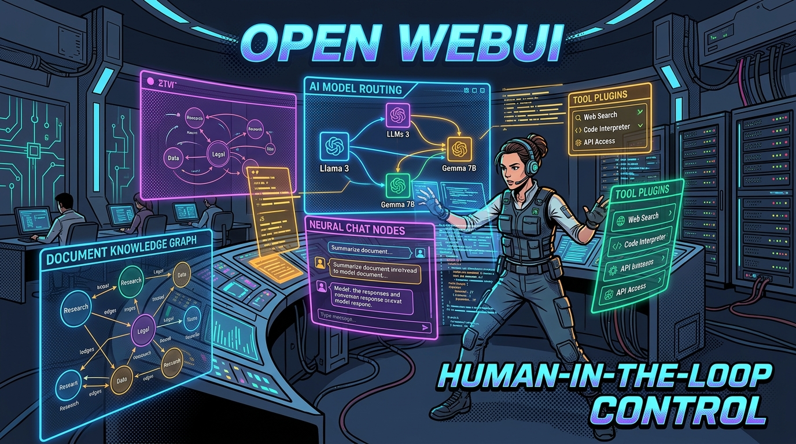
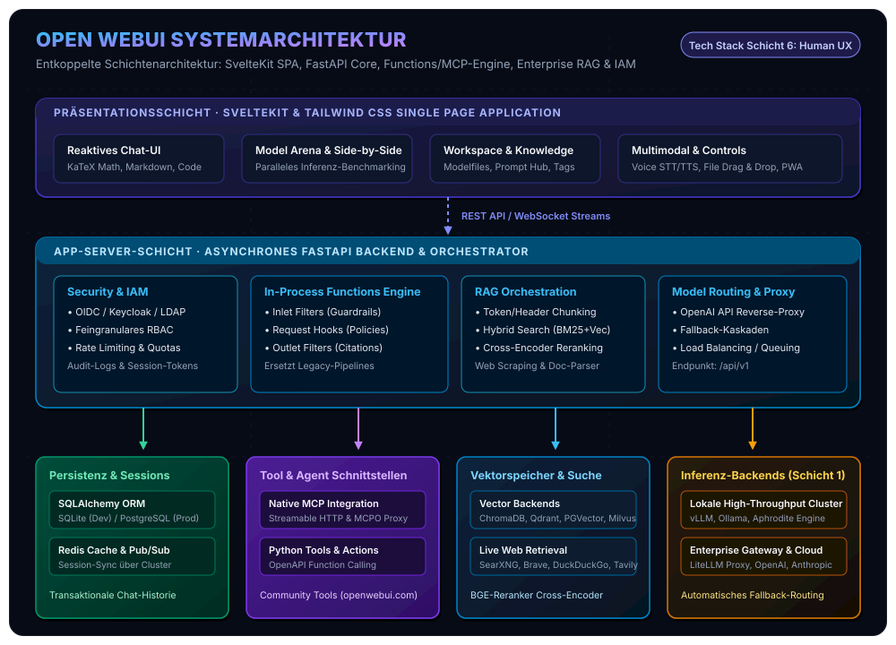
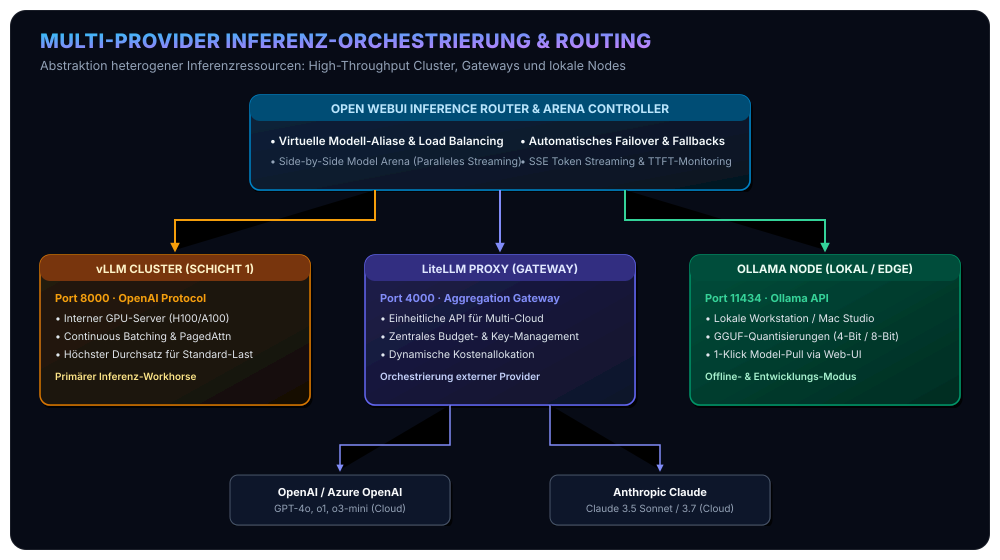
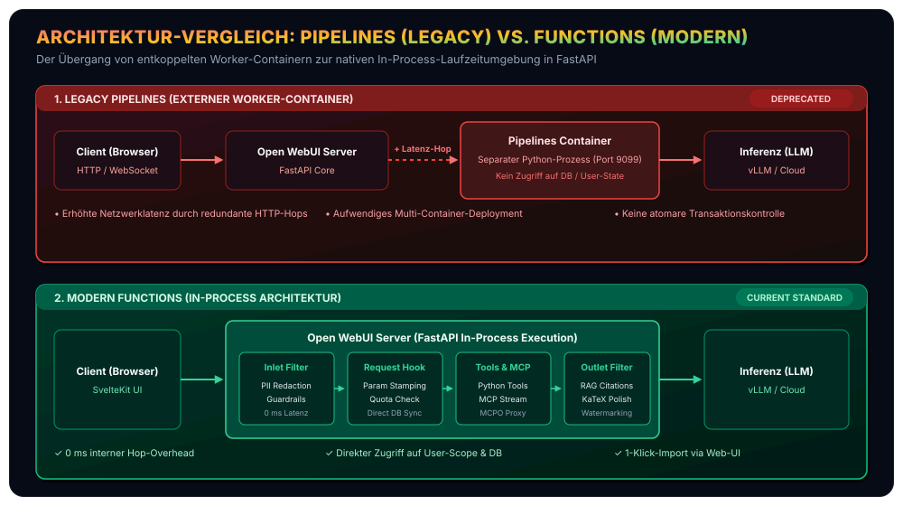
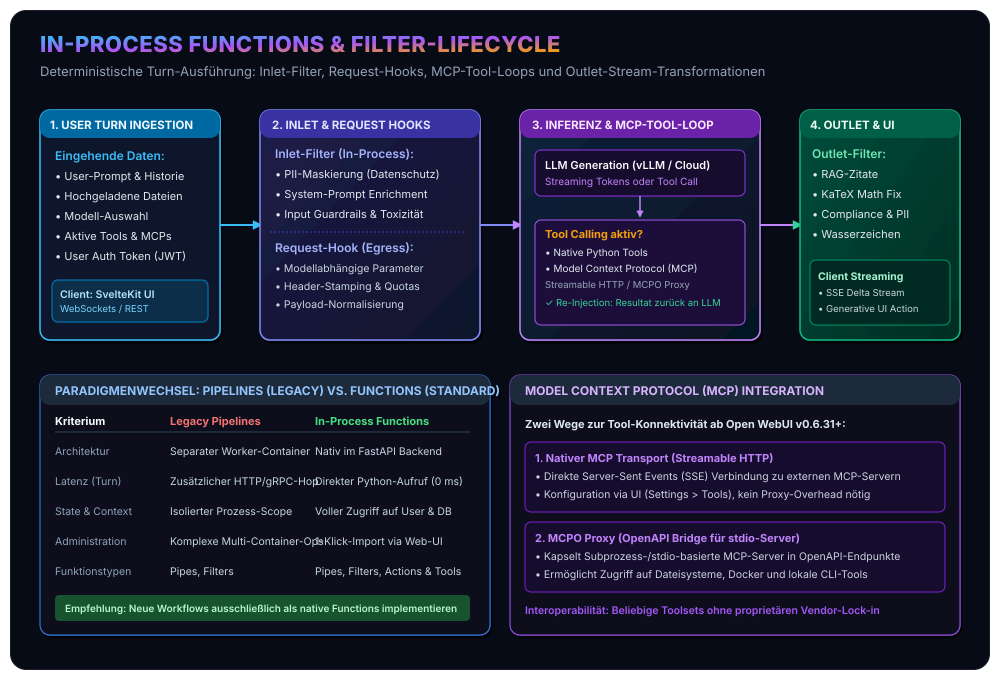
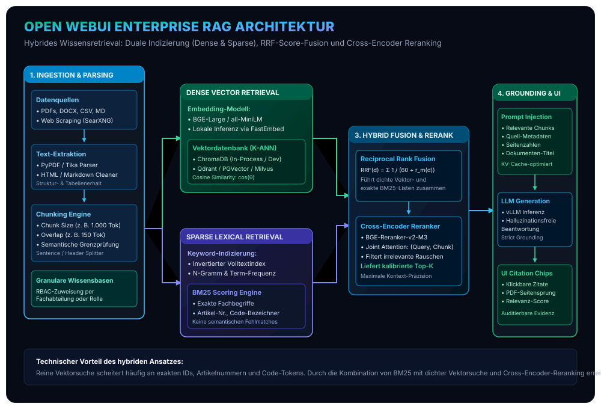
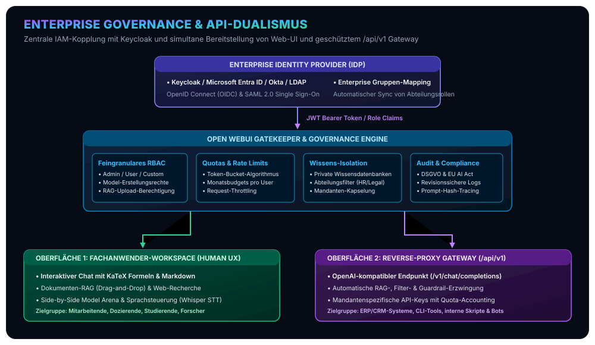

In unserer Artikelserie zur Konzeption und Realisierung souveräner, agentischer Unternehmens-KI haben wir die technischen Schichten moderner Architekturen systematisch analysiert: Ausgehend von unserem [standardisierten Open-Source Agentic AI Tech Stack](/posts/2026_09_03_standardisierter_open_source_agentic_ai_tech_stack/) über das mathematisch fundierte [sitzungsübergreifende Langzeitgedächtnis via Mem0](/posts/2026_09_04_langzeitgedaechtnis_llm_agenten_mem0/) und die [kontinuierliche Wissensevolution via WikiSkill](/posts/2026_09_06_wikiskill_persistente_wissensevolution_agent_skills/) bis hin zur [Body-Brain-Entkopplung und Bounded-Memory-Laufzeit des Hermes Agent](/posts/2026_09_07_hermes_agent_architektur_und_funktionsweise/).

Bislang stand vor allem das Zusammenspiel von Inferenz-Engines ([vLLM](/tags/vllm)), deklarativen Graphen ([LangGraph](/tags/langgraph)) und autonomen Agenten im Fokus. Doch die architektonisch anspruchsvollste Backend-Infrastruktur verfehlt ihre Wirkung in Organisationen, wenn der Zugang auf kryptische Terminal-Konsolen, Entwickler-Skripte oder proprietäre Cloud-Clients beschränkt bleibt. Bereits in unseren ersten Analysen zu [lokalen KI-Agenten und strukturierter Inferenz](/posts/2026_05_31_local_ai_agents_web_llm/) zeigte sich deutlich: **Souveräne KI benötigt eine ergonomische, sichere und vollumfänglich kontrollierbare Mensch-Maschine-Schnittstelle.**

Genau diese Lücke schließt **Open WebUI** als **Schicht 6 (Human-in-the-Loop Interaktion & Workspace Control)** unseres Referenzstacks. Ursprünglich als schlanke Oberfläche für Ollama konzipiert, hat sich das Projekt zu einer modularen, hochgradig erweiterbaren Plattform für Unternehmen, Universitäten und Entwicklerteams entwickelt.

Dieser Beitrag liefert eine umfassende softwaretechnische Analyse von Open WebUI: Wir untersuchen die Entkopplung von SvelteKit-Frontend und FastAPI-Backend, den architektonischen Wandel von Legacy-Pipelines zu nativen In-Process Functions, die Mechanik der hybriden RAG-Engine mit Cross-Encoder-Reranking, Enterprise-Governance via [Keycloak](/tags/keycloak) sowie die typischen Anwendergruppen und Praxisdomänen.



Bevor wir die internen Kommunikationspfade und Filter-Zyklen im Detail zerlegen, visualisiert das folgende Architekturmodell das Gesamtsystem:



## 1. Systemarchitektur & Entwurfsprinzipien

Auf Systemebene folgt Open WebUI einem konsequent entkoppelten, zustandslosen Schichtenmodell. Im Gegensatz zu vielen monolithischen Chatbot-Lösungen, die Anwendungslogik und Webserver eng an eine konkrete Python-Inferenz-Bibliothek binden, fungiert Open WebUI als **autonomer Aggregator und Vermittler** zwischen Anwendern, Dokumentenkollektionen, Berechtigungssystemen und heterogenen Inferenz-Clustern.

### Frontend: Reaktive SvelteKit Single Page Application (SPA)
Die Präsentationsschicht basiert auf **SvelteKit**, **TypeScript** und **Tailwind CSS**:
* **Kompilierte Reaktivität:** Im Unterschied zu virtuellen DOM-Diffing-Ansätzen übersetzt der Svelte-Compiler Zustandsänderungen in chirurgisch präzise DOM-Updates. Dies gewährleistet selbst bei hochfrequenten Token-Streams und umfangreichen Konversationsverläufen eine flüssige Darstellung mit minimalem Client-Overhead.
* **Typografische Exzellenz:** Mathematische Ausdrücke werden über **KaTeX** latenzfrei gerendert. Codeblöcke erhalten voll ausgestattetes Syntax-Highlighting, Kopierfunktionen und native Render-Flächen für Web-Artefakte (HTML/SVG/JS).
* **Multimodale Ein-/Ausgabe:** Native Integration von Web-Speech-APIs sowie Whisper-Konnektoren zur Spracheingabe (STT) und Sprachausgabe (TTS), Drag-and-Drop-Uploads für beliebige Dokumenttypen und progressive Web-App-Fähigkeiten (PWA) für mobile Endgeräte.

### Backend: Asynchroner FastAPI ASGI-Server
Das Backend ist als asynchrone Python-Anwendung auf Basis von **FastAPI** und **Uvicorn** implementiert:
* **Nicht-blockierende E/A:** Sämtliche Kommunikationskanäle zu Modell-Backends, Vektordatenbanken und externen APIs sind über Python `asyncio` abgewickelt. Langlaufende Token-Generierungen blockieren keine Worker-Threads für parallele Nutzeranfragen.
* **Server-Sent Events (SSE) & WebSockets:** Token-Streams werden in Echtzeit über SSE an den Client propagiert, während Statusaktualisierungen und kollaborative Ereignisse über WebSockets synchronisiert werden.
* **Unified Packaging:** Obwohl Frontend und Backend getrennt entwickelt werden, assembliert die Build-Pipeline die kompilierte SvelteKit-SPA als statische Assets direkt in das Python-Package (`open-webui`). Dadurch kann das Gesamtsystem als kompaktes Docker-Image oder unkompliziert via `pip install open-webui` ausgeliefert werden.

### Persistenz- und Skalierungs-Topologie
Zur Speicherung von Benutzerkonten, Konversationshistorien, Prompt-Vorlagen und Zugriffsrechten setzt das Backend auf **SQLAlchemy ORM** mit **Alembic-Migrationen**:

| Betriebsszenario | Primärdatenbank | Session- & State-Cache | Vektordatenbank (RAG) | Typische Topologie |
| :--- | :--- | :--- | :--- | :--- |
| **Lokale Workstation / Labor** | SQLite 3 (integriert) | In-Memory | ChromaDB (lokal/embedded) | Single Docker Container |
| **Enterprise / Multi-Replica** | PostgreSQL 16+ | Redis Cluster (Pub/Sub) | Qdrant / PGVector / Milvus | Kubernetes Pods hinter Traefik/NGINX |

In verteilten Produktionsumgebungen agiert das FastAPI-Backend vollständig **stateless**: Mehrere Container-Instanzen teilen sich eine zentrale PostgreSQL-Datenbank und synchronisieren WebSocket-Ereignisse über einen gemeinsamen Redis-Bus. Ein vorgeschalteter Reverse-Proxy (z. B. NGINX oder Traefik) verteilt die Last gleichmäßig über alle Knoten.

## 2. Inferenz-Abstraktion & Multi-Provider-Orchestrierung

Eine der herausragenden Stärken von Open WebUI ist die vollständige Entkopplung von proprietären Schnittstellen. Die Plattform subsumiert interne und externe Inferenz-Ressourcen unter einer einheitlichen Verwaltungsebene.



### Native Ollama- und OpenAI-kompatible Protokolle
Open WebUI implementiert duale Provider-Treiber:
1. **Ollama API:** Direkte Anbindung lokaler oder netzwerkweiter Ollama-Instanzen inklusive Modell-Download (`pull`), Löschung, Tagging und VRAM-Statusabfragen direkt aus der Weboberfläche.
2. **OpenAI-kompatible Endpunkte:** Universelle Integration für jeden Inferenz-Server, der dem OpenAI-Standard (`/v1/chat/completions`, `/v1/models`) folgt. Dadurch lassen sich Hochdurchsatz-Cluster auf Basis von [vLLM](/tags/vllm), Aphrodite Engine, TGI oder API-Gateways wie LiteLLM nahtlos als Modell-Ressourcen einbinden.

### Multi-Model Arena & Paralleles Benchmarking
Für fundierte Modellentscheidungen bietet Open WebUI eine integrierte **Side-by-Side Arena**:
* Anwender können zwei oder mehr Modelle simultan mit demselben Prompt adressieren.
* Die Antworten werden in Echtzeit nebeneinander gestreamt.
* Latenzen (Time to First Token – TTFT), Generierungsdurchsatz (Tokens pro Sekunde) und inhaltliche Qualität lassen sich unter identischen Parametern vergleichend bewerten.

### Intelligentes Routing & Fallback-Kaskaden
Administratoren können virtuelle Modell-Aliase definieren, die im Hintergrund dynamische Fallback-Regeln ausführen. Fällt beispielsweise ein primärer interner GPU-Knoten aus oder ist die Warteschlange überlastet, leitet der Core-Router den Request automatisch und transparent auf ein sekundäres lokales Backup-Modell oder eine gesicherte Cloud-Instanz um.

## 3. Das Erweiterbarkeits-Paradigma: Native Functions, Filter-Lifecycle & MCP

Ein häufig missverstandener Bereich von Open WebUI ist die Evolution seiner Erweiterungsarchitektur. Während frühe Versionen auf externe Container (*Pipelines*) setzten, definiert heute das **in-process Functions-Framework** den Industriestandard der Plattform.

### Der Paradigmenwechsel: Von Legacy-Pipelines zu nativen Functions



Früher erforderte jede benutzerdefinierte Pipeline einen separaten Hilfs-Container. Dieser Ansatz brachte gravierende Nachteile mit sich: erhöhte Latenz durch redundante HTTP-Hops, aufwendige Netzwerk-Konfigurationen und keinen direkten Zugriff auf den internen Anwendungszustand (Benutzerrollen, Datenbank-Objekte).

Mit dem modernen **Functions-System** werden Python-Module direkt innerhalb des FastAPI-Laufzeitkontexts ausgeführt. Administratoren können Funktionscode direkt über das Web-Dashboard importieren, versionieren und mit feingranularen Schaltern aktivieren.



### Der 4-Phasen-Filter-Lifecycle

Die Filter-Pipeline von Open WebUI kapselt jeden Benutzer-Turn in deterministische Verarbeitungsphasen:

#### Phase 1: Inlet-Filter (`inlet`)
Wird ausgeführt, sobald der Benutzer-Turn im Backend eintrifft, noch bevor Kontext oder Werkzeuge geladen werden:
* **Datenschutz & PII-Maskierung:** Automatische Anonymisierung von IBANs, Sozialversicherungsnummern, E-Mail-Adressen oder vertraulichen Projektnamen via Regex oder Named Entity Recognition (NER).
* **Input-Guardrails:** Erkennung und Abwehr von Prompt-Injections, Jailbreak-Mustern und unzulässigen Inhalten.
* **Dynamische Kontext-Injektion:** Anreicherung des Prompts mit tagesaktuellen Metadaten, Benutzerattributen oder Standortdaten.

```python
class Filter:
    def __init__(self):
        self.valves = None

    async def inlet(self, body: dict, __user__: dict) -> dict:
        """Inlet-Hook zur PII-Maskierung vor der Modellübergabe"""
        messages = body.get("messages", [])
        if messages:
            last_message = messages[-1]["content"]
            # Sensible Daten bereinigen
            sanitized = re.sub(r"\b[A-Z]{2}\d{2}[A-Z0-9]{12,30}\b", "[IBAN_REDACTED]", last_message)
            messages[-1]["content"] = sanitized
            body["messages"] = messages
        return body
```

#### Phase 2: Request-Hook (`request`)
Greift unmittelbar vor dem Absenden der HTTP-Payload an das Inferenz-Backend:
* Erzwingung modellspezifischer Hyperparameter (z. B. `temperature`, `top_p`, `max_tokens`).
* Einfügen mandantenspezifischer Egress-Header oder Tracking-Tags für nachgelagerte Gateways wie LiteLLM.

#### Phase 3: Tool-Execution & MCP-Loop
Signalisiert das Sprachmodell während der Generierung einen Werkzeugaufruf (`tool_calls`), fängt der Open WebUI Core diesen ab:
* Lokale Python-Funktionen werden deterministisch ausgeführt.
* **Native Model Context Protocol (MCP) Integration:** Seit Version 0.6.31+ unterstützt Open WebUI das [Model Context Protocol](https://modelcontextprotocol.io) nativ über **Streamable HTTP**. Werkzeuge, Datenbankschnittstellen und API-Adapter, die als MCP-Server deklariert sind, können direkt über das Interface angebunden werden.
* **MCPO Proxy Bridge:** Für externe MCP-Server, die auf Subprozess-Basis (`stdio`) operieren, stellt das Projekt den **MCPO-Proxy** (MCP-to-OpenAPI) bereit. Dieser übersetzt stdio-Aufrufe in saubere OpenAPI-Endpunkte, sodass beliebige MCP-Ökosysteme ohne Protokollbrüche nutzbar sind.
* Die Werkzeugausgabe wird in den Konversationsgraphen eingepflegt und an das LLM zurückgeführt, bis die finale Antwort generiert ist.

#### Phase 4: Outlet-Filter (`outlet`)
Verarbeitet den fertig generierten Modell-Output vor der Auslieferung an den Client:
* **Zitierungs-Aufbereitung:** Automatische Validierung und Verlinkung von RAG-Quellen.
* **KaTeX-Korrektur:** Glättung inkonsistenter LaTeX-Syntax für mathematische Formeln.
* **Wasserzeichen & Compliance-Banner:** Automatischer Ausweis von Modellversion, Generierungszeitstempel und Vertraulichkeitsstufen.

## 4. Enterprise RAG-Engine: Multimodales Chunking, Hybridsuche & Reranking

Retrieval-Augmented Generation (RAG) gehört zu den Kernfunktionen von Open WebUI. Fachanwender können Dokumente per Drag-and-Drop in den Chat ziehen oder in thematischen **Wissensdatenbanken (Knowledge Bases)** strukturieren.



### Ingestion & Intelligentes Chunking
Beim Upload von Dateien (PDF, DOCX, CSV, Markdown, Code) durchläuft der Inhalt eine standardisierte Parsing-Pipeline:
1. **Dokumenten-Extraktion:** Strukturierte Extraktion von Fließtext, Tabellen und Hierarchien.
2. **Chunking-Strategie:** Konfigurierbare Segmentierung nach Token-Anzahl (z. B. 1.000 Tokens) mit variablem Überlappungsfenster (Overlap, z. B. 150 Tokens), um semantische Brüche an Satz- oder Absatzgrenzen zu vermeiden.

### Duale Indizierung: Vektoren treffen auf Volltext
Klassische RAG-Implementierungen scheitern in der Praxis häufig an spezifischen Fachbegriffen, Teilenummern oder juristischen Aktenzeichen, da dichte Vektoren (Dense Embeddings) semantische Nachbarschaften abbilden, aber exakte Term-Treffer verwässern. Open WebUI begegnet diesem Problem durch eine **duale Indizierungsstrategie**:

1. **Dichte Vektorsuche (Dense Retrieval):**
   * Berechnung semantischer Einbettungsvektoren via lokaler Sentence-Transformers (z. B. `BAAI/bge-large-en-v1.5` oder `all-MiniLM-L6-v2` über FastEmbed) oder via Remote-Embedding-APIs.
   * Speicherung in ChromaDB (Standard) oder hochskalierbaren Enterprise-Vektordatenbanken wie **Qdrant**, **PGVector** oder **Milvus**.
   * Ähnlichkeitsmessung via Cosinus-Ähnlichkeit:
   $$\cos(\theta) = \frac{\mathbf{u} \cdot \mathbf{v}}{\|\mathbf{u}\| \|\mathbf{v}\|}$$

2. **Lexikalische Suche (Sparse Retrieval via BM25):**
   * Paralleler Aufbau eines invertierten Index über die Dokument-Chunks.
   * Exakte Erfassung seltener Terme und Fachwörter nach dem probabilistischen BM25-Scoring:
   $$\text{Score}(D, Q) = \sum_{q \in Q} \text{IDF}(q) \cdot \frac{f(q, D) \cdot (k_1 + 1)}{f(q, D) + k_1 \cdot \left(1 - b + b \cdot \frac{|D|}{\text{avgdl}}\right)}$$

### Reciprocal Rank Fusion (RRF) & Cross-Encoder Reranking
Um aus beiden Quellen das optimale Trefferergebnis zu aggregieren, setzt die Engine ein zweistufiges Fusions- und Reranking-Verfahren ein:

#### Stufe 1: Reciprocal Rank Fusion (RRF)
Die separaten Ranglisten aus Vektor- und BM25-Suche werden ohne heuristische Gewichtungsfehler mathematisch fusioniert:

$$\text{RRF}(d \in D) = \sum_{m \in M} \frac{1}{k + r_m(d)}$$

Hierbei repräsentiert $M = \{\text{dense}, \text{sparse}\}$ die Retrieval-Methoden, $r_m(d)$ den Rang des Dokuments $d$ im jeweiligen System und $k$ eine Glättungskonstante (typischerweise $k = 60$).

#### Stufe 2: Cross-Encoder Reranking
Die Top-Kandidaten aus der RRF-Stufe werden anschließend durch ein **Cross-Encoder-Modell** (z. B. `BAAI/bge-reranker-v2-m3`) bewertet. Im Gegensatz zu Bi-Encodern, die Query und Chunk separat einbetten, führt der Cross-Encoder eine gemeinsame Aufmerksamkeitsberechnung (*Joint Self-Attention*) über das Token-Paar durch:

$$s_i = \sigma\left(\mathbf{w}^T \cdot \text{Transformer}([CLS] \circ Q \circ [SEP] \circ D_i)\right)$$

Das Modell liefert eine kalibrierte Relevanzwahrscheinlichkeit $s_i \in [0, 1]$. Chunks mit geringem semantischem Bezug werden herausgefiltert. Nur die präzisesten Textfragmente gelangen in das Context Window des LLM. Das Ergebnis: **Maximale Präzision, minimale Token-Verschwendung und drastische Reduktion von Halluzinationen.**

## 5. Enterprise Governance, RBAC & API-Gateway-Funktionalität

In regulierten Unternehmensumgebungen darf eine KI-Plattform kein isoliertes Datensilo darstellen. Open WebUI integriert umfassende Sicherheits- und Administrationsmerkmale.



### Identitätsmanagement & Feingranulares RBAC
* **Single Sign-On (SSO):** Standardisierte Anbindung an **Keycloak**, Microsoft Entra ID (Azure AD), Okta oder Google Workspace via OpenID Connect (OIDC) und OAuth2.
* **Gruppen- & Rollen-Mapping:** Über OIDC-Token-Claims können Unternehmensrollen automatisch auf Open WebUI-Berechtigungen gemappt werden.
* **Feingranulare Rechtevergabe:** Administratoren steuern dediziert, welche Nutzergruppen Modelle instanziieren, Dokumente in Wissensdatenbanken hochladen, Werkzeuge entwickeln oder externe Webrecherchen ausführen dürfen.

### Quota-Management & Kostenkontrolle
Um Überlastungen oder Budgetüberschreitungen zu verhindern, implementiert Open WebUI:
* Tägliche und monatliche Token- und Request-Limits pro Benutzer oder Rolle.
* Modell-Whitelisting: Teure Frontier-Modelle können auf leitende Angestellte oder Forschungsleiter beschränkt werden, während der Belegschaft effiziente lokale [vLLM](/tags/vllm)-Modelle zur Verfügung stehen.
* Vollständige Audit-Protokollierung aller Abfragen zur Erfüllung von Compliance-Richtlinien nach DSGVO und EU AI Act.

### Der Reverse-Proxy-Modus (`/api/v1`)
Ein herausragendes, oft unterschätztes Architekturmerkmal ist die Fähigkeit von Open WebUI, selbst als **OpenAI-kompatibles API-Gateway** zu fungieren. Unter dem Pfad `/api/v1/chat/completions` können interne Software-Systeme, Skripte oder Drittapplikationen Abfragen an Open WebUI stellen. 

Dabei greifen **vollautomatisch alle im System hinterlegten Schutzmechanismen**:
* Benutzer-Authentifizierung via API-Key,
* Zuweisung hinterlegter Wissensdatenbanken (RAG),
* Ausführung der aktiven In-Process Filter (PII-Maskierung, Guardrails),
* Token-Accounting und Audit-Logging.

Damit avanciert Open WebUI von einer reinen Web-Oberfläche zu einer **zentralen Kontroll- und Sicherheitsschicht für die gesamte Organisation**.

## 6. Typische Anwender und praxisrelevante Anwendungsbereiche

Aufgrund seiner hohen Modularität und Robustheit adressiert Open WebUI ein breites Spektrum an Nutzergruppen und Einsatzszenarien. Im Folgenden untersuchen wir die vier wichtigsten Anwendungsdomänen:

### 1. Enterprise & Fachabteilungen (Souveräner Unternehmens-Arbeitsplatz)
Unternehmen stehen vor der Herausforderung, ihren Mitarbeitenden moderne generative KI-Werkzeuge bereitzustellen, ohne Geschäftsgeheimnisse, Kundendaten oder geistiges Eigentum an externe Cloud-Provider zu verlieren.

* **Szenario:** Einführung eines internen „Company Copilot“ im eigenen Rechenzentrum oder einer europäischen Cloud.
* **Rollenbasierte Wissenssilos:** 
  * Die *Rechtsabteilung* nutzt kuratierte Wissensdatenbanken mit Vertragswerken, Compliance-Richtlinien und Gerichtsentscheidungen.
  * Das *Personalwesen (HR)* analysiert Arbeitsverträge und Betriebsvereinbarungen über private, isolierte RAG-Instanzen.
  * Der *Einkauf* gleicht Lieferantengebote mit Rahmenverträgen ab.
* **Compliance-Vorteil:** Durch die Kopplung mit [Keycloak](/tags/keycloak) und lokalen vLLM-Clustern bleibt die Datenhoheit zu 100 % im Unternehmen gewahrt. Kein Byte verlässt das Firmennetzwerk.

### 2. Hochschullehre & Akademische Forschung (Beispiel: FH Oberösterreich)
Im universitären Umfeld prallen heterogene Anforderungen aufeinander: Hunderte Studierende benötigen Zugang zu modernen Sprachmodellen für Lehrveranstaltungen und Programmierübungen, während Forschungsgruppen sensible Primärdaten analysieren.

* **Szenario:** Zentrales KI-Portal für Campus-Wels und die Fakultäten der FH OÖ.
* **Souveräne Lehr-Unterstützung:** 
  * Bereitstellung von Open-Weights-Modellen (z. B. Llama 3.3, Mistral, Qwen 2.5) auf institutsweiten GPU-Servern.
  * Studierende erhalten einen DSGVO-konformen KI-Zugang für Recherchen und Programmierübungen ohne individuelle Kosten oder Registrierungszwänge bei kommerziellen Anbietern.
  * Dozierende hinterlegen Vorlesungsskripte, Übungsbeispiele und Prüfungskataloge als Kurs-Wissensbasen. Die integrierte KaTeX-Engine ermöglicht die fehlerfreie Darstellung komplexer mechatronischer und mathematischer Formeln.
* **Forschungsschutz:** Bei der Auswertung vertraulicher Kooperationsprojekte mit Industriepartnern garantiert der On-Premises-Betrieb von Open WebUI, dass unveröffentlichte Forschungsdaten und Patententwürfe vollständig vor fremdem Zugriff geschützt bleiben.

### 3. Software Engineering, DevOps & MLOps
Für Entwickler- und Data-Science-Teams fungiert Open WebUI als interaktive Entwicklungs- und Evaluierungsumgebung.

* **Szenario:** Systematisches Prompt-Engineering, Tool-Testing und Modell-Validierung.
* **Modell-Benchmarking in der Arena:** Entwickler vergleichen verschiedene Quantisierungsstufen (z. B. FP8 vs. AWQ vs. GGUF) desselben Basismodells auf lokaler Hardware hinsichtlich Antwortgüte und Inferenzgeschwindigkeit.
* **MCP- und Funktions-Entwicklung:** Testen neuer Agenten-Werkzeuge und externer Datenbankschnittstellen über die Weboberfläche, bevor diese in autonome Hintergrund-Agenten wie den [Hermes Agent](/posts/2026_09_07_hermes_agent_architektur_und_funktionsweise/) überführt werden.
* **Synthetische Datengenerierung:** Strukturierte Erstellung von Trainings- und Testdatensätzen durch parallele Abfragen mit vordefinierten System-Prompts.

### 4. Hochregulierte Branchen, Verwaltung & Gesundheitswesen
Organisationen im Gesundheitswesen, Bankensektor oder der öffentlichen Verwaltung unterliegen strengsten regulatorischen Auflagen (ISO 27001, TISAX, Patientendatenschutz).

* **Szenario:** Vollständig autarker **Air-Gapped-Betrieb**.
* **Keine externen Abhängigkeiten:** Open WebUI lässt sich komplett ohne Internetverbindung in isolierten Hochsicherheitsnetzen betreiben. Sämtliche Abhängigkeiten (Assets, Schriftarten, Embedding-Modelle, Vektorindizes) residieren lokal.
* **Klinische & juristische Assistenz:** Strukturierte Zusammenfassung umfangreicher Krankenakten, OP-Berichte oder behördlicher Aktenberge mit verifizierbaren Quellen-Zitaten via Hybrid-RAG. Der integrierte Audit-Trail dokumentiert jede Interaktion nachvollziehbar.

## Fazit & Einordnung in den Agentic AI Tech Stack

**Open WebUI** ist weit mehr als eine gefällige Weboberfläche: Es ist die **architektonisch ausgereifte Kontroll- und Kollaborationsplattform**, die den [standardisierten Open-Source Agentic AI Tech Stack](/posts/2026_09_03_standardisierter_open_source_agentic_ai_tech_stack/) erst für Menschen und Organisationen nutzbar macht.

Im Zusammenspiel unserer sechs Schichten schließt sich der Kreis:
1. **Schicht 1 (Inferenz):** [vLLM](/tags/vllm) liefert die rohe, hochperformante Next-Token-Berechnung.
2. **Schicht 2 (Laufzeit & Skills):** Der [Hermes Agent](/posts/2026_09_07_hermes_agent_architektur_und_funktionsweise/) und [WikiSkills](/posts/2026_09_06_wikiskill_persistente_wissensevolution_agent_skills/) orchestrieren langlebige autonome Problemlösungszyklen.
3. **Schicht 3 (Workflows):** [LangGraph](/tags/langgraph) steuert komplexe Multi-Agenten-Prozesse.
4. **Schicht 4 (Gedächtnis):** [Mem0](/posts/2026_09_04_langzeitgedaechtnis_llm_agenten_mem0/) stellt das sitzungsübergreifende episodische Gedächtnis bereit.
5. **Schicht 5 (Gateway & IAM):** [Keycloak](/tags/keycloak) und LiteLLM sichern Zugriff und Identität.
6. **Schicht 6 (Human-in-the-Loop):** **Open WebUI** vereint all diese Komponenten in einer ergonomischen, sicheren Oberfläche für Fachanwender, Forschende und Entwickler.

Durch den Paradigmenwechsel hin zu **In-Process Functions**, die native Unterstützung des **Model Context Protocol (MCP)** und die ingenieurtechnische Perfektionierung des **hybriden RAG mit Cross-Encoder Reranking** beweist Open WebUI, dass Open-Source-Lösungen proprietären Cloud-Diensten in Usability, Sicherheit und architektonischer Tiefe mindestens ebenbürtig sind.

*Möchten Sie eine datensouveräne Open WebUI-Umgebung in Ihrem Unternehmen oder Ihrer Bildungseinrichtung etablieren, an Keycloak anbinden oder mit Ihren internen Wissensdatenbanken verknüpfen? Informieren Sie sich in unserem Leistungsbereich [Artificial Intelligence](/services/ai) oder vereinbaren Sie ein persönliches Fachgespräch zu unserem Servicemodul [Technology Stack](/services/ai/stack).*
