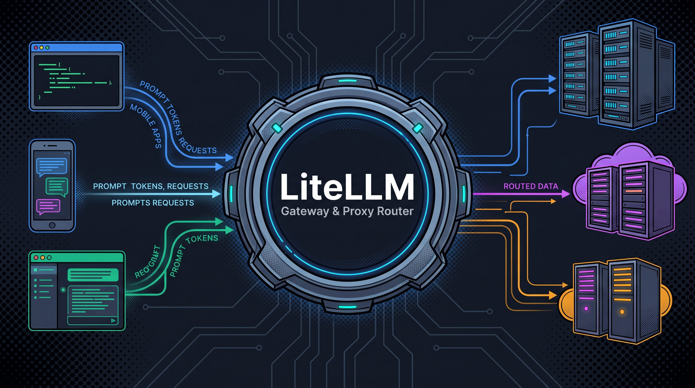
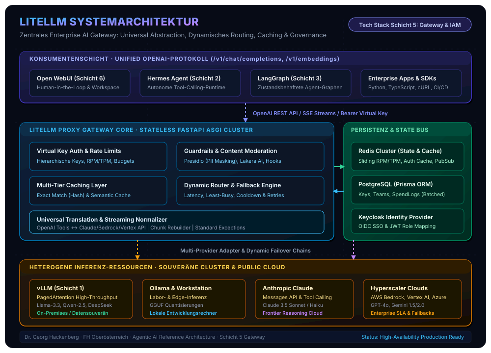
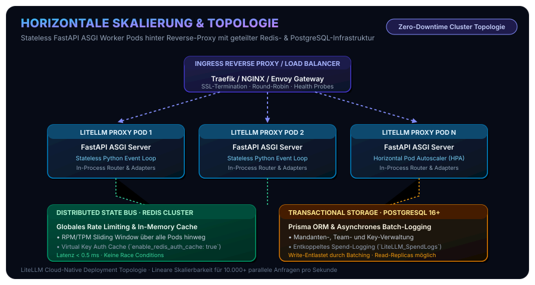
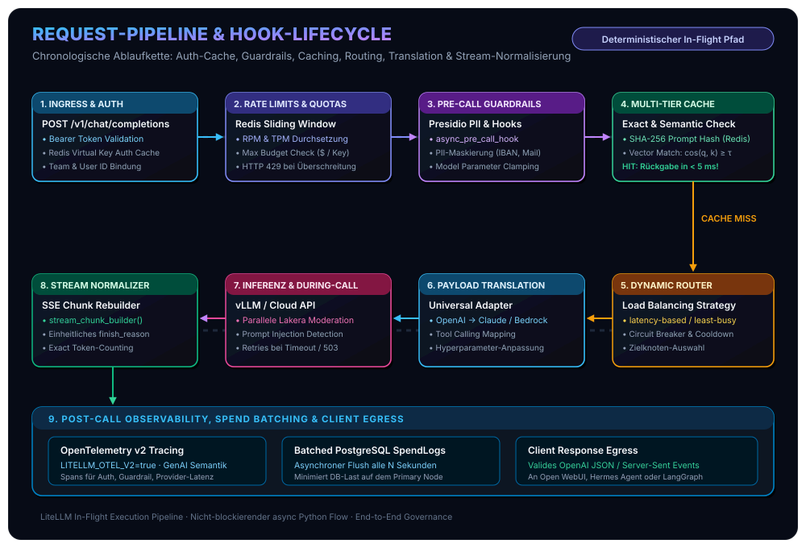
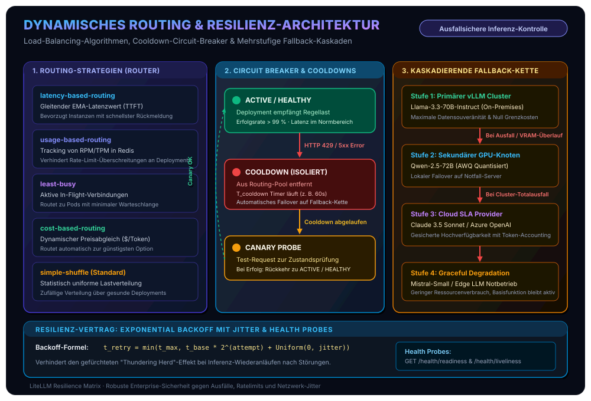
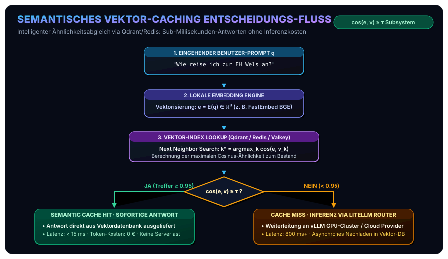
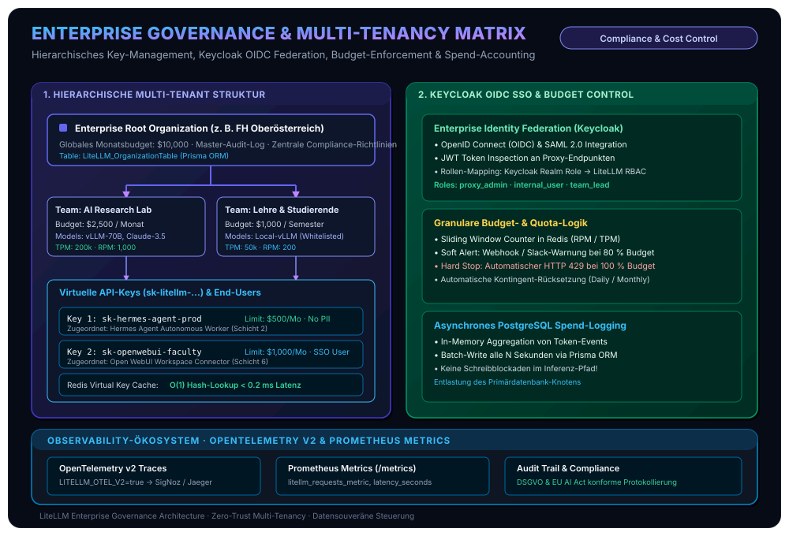
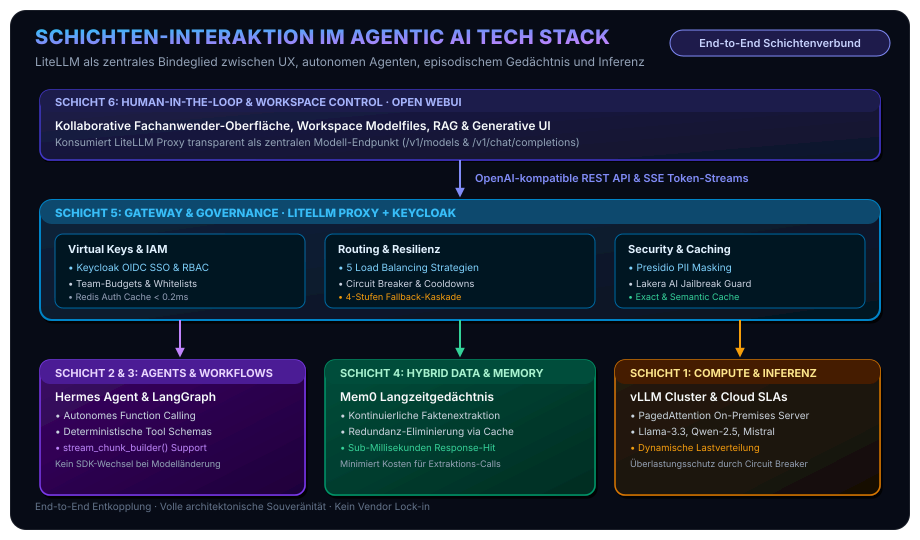

In unserer fortlaufenden Artikelserie zur systematischen Konzeption und Realisierung souveräner Unternehmens-KI haben wir die Schichten moderner Architekturen schrittweise von Grund auf analysiert: Aufbauend auf unserem [standardisierten Open-Source Agentic AI Tech Stack](/posts/2026_09_03_standardisierter_open_source_agentic_ai_tech_stack/) untersuchten wir das mathematisch fundierte [sitzungsübergreifende Langzeitgedächtnis via Mem0](/posts/2026_09_04_langzeitgedaechtnis_llm_agenten_mem0/), die [kontinuierliche Wissensevolution via WikiSkill](/posts/2026_09_06_wikiskill_persistente_wissensevolution_agent_skills/), die [Body-Brain-Entkopplung und Bounded-Memory-Laufzeit des Hermes Agent](/posts/2026_09_07_hermes_agent_architektur_und_funktionsweise/) sowie die kollaborative [Human-in-the-Loop Interaktionsschicht via Open WebUI](/posts/2026_09_08_open_webui_architektur_und_funktionsweise/).

Bereits in unseren ersten Arbeiten zu [lokalen KI-Agenten und strukturierter Inferenz](/posts/2026_05_31_local_ai_agents_web_llm/) und den Prinzipien von [Mindful IT und Calm Computing](/posts/2026_09_02_mindful_it_calm_computing_software_architektur/) wurde ein elementarer Grundsatz deutlich: **Robuste, langlebige Softwaresysteme erfordern strikte Entkopplung und deterministische Fehlertoleranz an allen Netzwerk- und Schnittstellengrenzen.**

In der Realität von Enterprise- und Forschungsumgebungen herrscht jedoch oft das Gegenteil: Mehrere autonome Agenten ([Hermes Agent](/posts/2026_09_07_hermes_agent_architektur_und_funktionsweise/), [LangGraph](/tags/langgraph/)-Pipelines), interaktive Oberflächen ([Open WebUI](/posts/2026_09_08_open_webui_architektur_und_funktionsweise/)) und interne Fachanwendungen greifen unkoordiniert auf heterogene Inferenz-Ressourcen zu. Lokale Hochdurchsatz-Cluster auf Basis von [vLLM](/tags/vllm/) konkurrieren mit Cloud-APIs von Anthropic, OpenAI, AWS Bedrock oder Google Vertex AI. 

Werden diese Systeme über direkte Punkt-zu-Punkt-Verbindungen verdrahtet, entstehen gravierende systemische Risiken:
* **API-Fragmentierung:** Jeder Provider erzwingt eigene Schnittstellen-Dialekte, Authentifizierungsmechanismen, Tool-Calling-Schemata und Fehlerformate.
* **Kaskadierende Ausfälle:** Überlastungen lokaler GPU-Server (HTTP 503) oder Rate-Limits externer Provider (HTTP 429) führen zu unkontrollierten Programmabbrüchen in laufenden Agentenzyklen.
* **Kosten- und Governance-Vakuum:** Ohne zentrale Kontrollinstanz verpuffen Budgets unbemerkt; feingranulares Accounting nach Kostenstellen oder Teams ist unmöglich.
* **Vendor Lock-in:** Codebasen binden sich an herstellerspezifische SDKs und verlieren die technologische Souveränität.

Genau diese Herausforderung adressiert **LiteLLM** als **Schicht 5 (Gateway & Governance)** unseres Referenzstacks. Als universeller Übersetzer, intelligenter Load-Balancer, Multi-Tier-Cache und Zero-Trust-Governance-Hub bildet LiteLLM das unverzichtbare Bindeglied zwischen Konsumenten und heterogenen Inferenz-Clustern.



Bevor wir die internen Transformationsmechanismen und Routing-Algorithmen im Detail zerlegen, visualisiert das folgende Architekturmodell das Gesamtsystem:



## 1. Systemarchitektur & Entwurfsprinzipien

Auf Systemebene unterscheidet LiteLLM zwischen zwei Betriebsmodi: einer leichtgewichtigen **Python-Bibliothek (SDK)** für embedded Programmierung und dem eigenständigen, produktionsreifen **LiteLLM Proxy Server**. Im Enterprise-Stack bildet der Proxy Server das Herzstück der Inferenz-Infrastruktur.

### Dualität: Python SDK vs. Standalone Proxy Gateway
1. **Python SDK (`litellm.completion`, `acompletion`, `Router`):**
   Erlaubt es Entwicklern, innerhalb von Python-Anwendungen (wie dem [Hermes Agent](/posts/2026_09_07_hermes_agent_architektur_und_funktionsweise/)) mit einem einheitlichen Aufruf über 100 LLMs anzusprechen. Alle modellspezifischen Parameter werden im Speicher in standardisierte Pydantic-Objekte gewandelt.
2. **LiteLLM Proxy Gateway (FastAPI ASGI Server):**
   Ein als Docker-Container oder Kubernetes-Deployment betriebener HTTP-Service. Er exponiert eine vollständig **OpenAI-kompatible REST-API** (`/v1/chat/completions`, `/v1/embeddings`, `/v1/models`), übernimmt die Authentifizierung über virtuelle Keys, verwaltet verteilte Rate-Limits, schützt durch In-Flight Guardrails und protokolliert Kosten in einer zentralen Datenbank.

### Zustandslosigkeit & Horizontale Skalierbarkeit
Das FastAPI-Backend von LiteLLM ist konsequent **stateless** konzipiert. Eingehende Anfragen halten keinen Zustand im Arbeitsspeicher des Worker-Prozesses. Dies erlaubt den Betrieb beliebig vieler paralleler Proxy-Instanzen hinter einem Standard-Reverse-Proxy (NGINX, Traefik oder Envoy):



### Die Persistenz- und State-Topologie
Um Hochverfügbarkeit und feingranulare Abrechnung im Cluster sicherzustellen, stützt sich LiteLLM auf eine zweigeteilte Persistenzschicht:

| Persistenz-Tier | Technologie | Primäre Aufgaben & Datenstrukturen | Latenzanforderung |
| :--- | :--- | :--- | :--- |
| **Distributed State Bus & Cache** | **Redis Cluster** (oder Valkey) | • Sliding Window Counter für RPM/TPM-Rate-Limits<br>• Virtual Key Auth Cache (`enable_redis_auth_cache`)<br>• Exact-Match Response Caching (SHA-256 Hashes)<br>• Worker-Heartbeats (`LiteLLM_ProxyWorkerHeartbeat`) | $< 1\,\text{ms}$ (In-Memory) |
| **Relational Data Store** | **PostgreSQL 16+** (via Prisma ORM) | • Mandanten-Hierarchie (Organisationen, Teams, User)<br>• Virtuelle API-Keys (`LiteLLM_VerificationToken`)<br>• Model-Whitelists und Budget-Regeln<br>• Asynchron gebatchte Spend-Logs (`LiteLLM_SpendLogs`) | Asynchron gebatcht (Write-entlastet) |

Durch das Aktivieren des **Redis Virtual Key Auth Cache** (`enable_redis_auth_cache: true`) wird die PostgreSQL-Datenbank vom transaktionalen Lese-Overhead befreit: Autorisierungstoken und zugehörige Budgets werden mit kurzer TTL direkt im Redis-Speicher validiert. Bei Tausenden parallelen Anfragen pro Sekunde verhindert dies zuverlässig Datenbank-Bottlenecks.

## 2. Universal Translation & Normalization Engine

Das architektonische Meisterstück von LiteLLM ist seine universelle Übersetzungs- und Normalisierungs-Engine. Konsumenten senden stets standardisierte OpenAI-Payloads; LiteLLM übersetzt diese zur Laufzeit verlustfrei in den spezifischen Dialekt des adressierten Zielsystems und normalisiert die Antwort.



### Protokoll- und Payload-Transformation
Die folgende Übersicht illustriert, wie LiteLLM die divergenten Datenmodelle führender LLM-Provider auf das OpenAI-Referenzmodell abbildet:

| Funktionsbereich | OpenAI Referenz-Standard | Anthropic Claude API | AWS Bedrock (Converse API) | Google Vertex AI / Gemini |
| :--- | :--- | :--- | :--- | :--- |
| **Endpunkt** | `/v1/chat/completions` | `/v1/messages` | `converse` / `converse_stream` | `generateContent` |
| **System Prompt** | `{"role": "system", ...}` | `system: "..."` (Top-Level Parameter) | `system: [{"text": "..."}]` | `systemInstruction: {"parts": [...]}` |
| **Tool Calling** | `tools: [{"type": "function", "function": {...}}]` | `tools: [{"name": "...", "input_schema": {...}}]` | `toolConfig: {"tools": [{"toolSpec": {...}}]}` | `tools: [{"functionDeclarations": [...]}]` |
| **Tool Ausführung** | `tool_calls: [{"id": "...", "type": "function", ...}]` | `content: [{"type": "tool_use", "id": "...", ...}]` | `content: [{"toolUse": {"toolUseId": "...", ...}}]` | `candidates[0].content.parts[0].functionCall` |
| **Token Metriken** | `prompt_tokens`, `completion_tokens` | `input_tokens`, `output_tokens` | `usage: {inputTokens, outputTokens}` | `usageMetadata: {promptTokenCount, ...}` |

### Streaming-Normalisierung & Chunk Rebuilding
Bei gestreamten Antworten via **Server-Sent Events (SSE)** senden unterschiedliche Backends hochgradig inkonsistente Chunks. Anthropic emittiert beispielsweise separate `content_block_start`-, `content_block_delta`- und `message_stop`-Events, während OpenAI textuelle Fragmente in `choices[0].delta.content` liefert.

LiteLLM fängt diese Streams ab und vereinheitlicht sie in standardkonforme OpenAI-SSE-Events:
```
data: {"id":"chatcmpl-xyz","choices":[{"delta":{"content":"Hallo"},"finish_reason":null}]}
```

Besonders kritisch ist dies beim **Streaming von Tool Calls**: Ein Modell generiert komplexe JSON-Argumente über Dutzende Tokens hinweg fragmentiert. LiteLLM implementiert hierfür den `stream_chunk_builder()`:
* Die Engine akkumuliert die eintreffenden Teilstücke deterministisch.
* Für Clients, die unvollständige JSON-Fragmente nicht inkrementell parsen können, rekonstruiert LiteLLM syntaktisch valide Tool-Call-Objekte.
* Gleichzeitig unterstützt die Engine *Fine-Grained Tool Streaming*, sodass moderne Agenten wie der [Hermes Agent](/posts/2026_09_07_hermes_agent_architektur_und_funktionsweise/) Werkzeugaufrufe latenzoptimiert verarbeiten können.

### Einheitliche Exception-Hierarchie
Nichts gefährdet die Stabilität autonomer Agenten mehr als unvorhersehbare Exception-Typen. Ein Verbindungsfehler zu einem lokalen [vLLM](/tags/vllm/)-Server wirft eine `aiohttp.ClientConnectorError`, Azure antwortet mit HTTP 429 und einem `Retry-After`-Header, während AWS Bedrock eine `ThrottlingException` via Boto3 generiert.

LiteLLM harmonisiert alle denkbaren Providerfehler in eine deterministische Python-Ausnahmehierarchie:
* `litellm.exceptions.RateLimitError` (HTTP 429)
* `litellm.exceptions.ContextWindowExceededError` (HTTP 400 bei Prompt-Überlänge)
* `litellm.exceptions.AuthenticationError` (HTTP 401 / 403)
* `litellm.exceptions.ServiceUnavailableError` (HTTP 503 / Provider-Überlastung)
* `litellm.exceptions.BudgetExceededError` (Interner Schwellenwert erreicht)

Dadurch können übergeordnete Orchestrierungsschichten wie [LangGraph](/tags/langgraph/) oder [Hermes](/posts/2026_09_07_hermes_agent_architektur_und_funktionsweise/) generische Retry- und Ausnahme-Behandlungsroutinen implementieren, ohne providerspezifischen Code vorzuhalten.

## 3. Dynamisches Routing, Lastverteilung & Resilienz-Strategien

In Hochlastumgebungen genügt es nicht, Anfragen starr an einen einzelnen Inferenz-Knoten weiterzuleiten. Der LiteLLM Router bildet eine dynamische Steuerebene, die Lasten intelligent verteilt und Ausfälle transparent kompensiert.



### Die fünf Load-Balancing-Strategien
LiteLLM unterstützt fünf spezialisierte Routing-Strategien, die per Konfiguration für Modellgruppen definiert werden können:

1. **`latency-based-routing`:**
   Routet Anfragen dynamisch an dasjenige Deployment, das aktuell die geringste Latenz (Time to First Token – TTFT) aufweist. LiteLLM berechnet hierzu für jeden Knoten $i$ einen gleitenden exponentiellen Mittelwert (Exponential Moving Average – EMA) der Antwortzeiten:
   $$L_t^{(i)} = \alpha \cdot L_{\text{current}}^{(i)} + (1 - \alpha) \cdot L_{t-1}^{(i)}$$
   wobei $\alpha \in (0, 1]$ den Glättungsfaktor darstellt. Fällt ein lokaler GPU-Knoten unter starker Last ab, leitet der Router neue Anfragen automatisch auf schnellere Knoten um.

2. **`usage-based-routing`:**
   Überwacht in Redis die aggregierten Tokens pro Minute (TPM) und Requests pro Minute (RPM) aller Deployments. Die nächste Anfrage wird dem Deployment mit der prozentual geringsten Auslastung bezogen auf dessen Provider-Kontingent zugewiesen.

3. **`least-busy`:**
   Ermittelt in Echtzeit die Anzahl aktiver, unvollendeter HTTP-Verbindungen (*In-Flight Requests*) pro Deployment. Anfragen fließen dorthin, wo die geringste Warteschlangenbildung herrscht.

4. **`cost-based-routing`:**
   Gleicht die hinterlegte Preismatrix ab und routet Anfragen prioritär auf das kostengünstigste gesunde Deployment (z. B. Bevorzugung lokaler vLLM-Cluster mit Grenzkosten von 0 € gegenüber Cloud-APIs).

5. **`simple-shuffle` (Default):**
   Statistisch uniforme Zufallsverteilung über alle als gesund markierten Deployments.

### Circuit Breaker & Cooldown-Zustandsautomat
Tritt bei einem Backend-Knoten ein schwerwiegender Fehler auf (HTTP 429, 500, 502, 503 oder Verbindungs-Timeout), greift der integrierte **Circuit Breaker**:
* **Cooldown Transition:** Das betroffene Deployment wird augenblicklich als ungesund markiert und für eine konfigurierbare Zeitspanne $T_{\text{cooldown}}$ (z. B. 60 Sekunden) vollständig aus dem Routing-Pool entfernt.
* **Canary Probing:** Nach Ablauf von $T_{\text{cooldown}}$ schickt LiteLLM eine Testanfrage (Canary Request). Wird dieser Request erfolgreich beantwortet, wechselt der Knoten zurück in den Zustand `ACTIVE / HEALTHY`. Scheitert er erneut, verdoppelt sich das Cooldown-Intervall exponentiell.

### Kaskadierende Fallback-Ketten
Reicht ein Retry auf demselben Deployment nicht aus, aktiviert LiteLLM kaskadierende Fallback-Ketten (*Failover Chains*). In der Praxis konfigurieren wir für geschäftskritische Systeme eine vierstufige Resilienz-Hierarchie:

```yaml
model_list:
  # Primäres lokales vLLM-Cluster (Souverän, On-Premises)
  - model_name: enterprise-gpt
    litellm_params:
      model: openai/meta-llama/Llama-3.3-70B-Instruct
      api_base: http://vllm-cluster-primary.internal:8000/v1
      api_key: dummy
      rpm: 1200
      tpm: 600000

  # Sekundärer lokaler GPU-Knoten (Backup Hardware)
  - model_name: vllm-backup
    litellm_params:
      model: openai/Qwen/Qwen2.5-72B-Instruct-AWQ
      api_base: http://vllm-cluster-secondary.internal:8000/v1
      api_key: dummy

  # Hyperscaler Cloud Fallback (Höchste Verfügbarkeit via Anthropic)
  - model_name: cloud-claude-fallback
    litellm_params:
      model: anthropic/claude-3-5-sonnet-20241022
      api_key: os.environ/ANTHROPIC_API_KEY

router_settings:
  routing_strategy: latency-based-routing
  num_retries: 3
  timeout: 30
  cooldown_time: 60
  fallbacks:
    - enterprise-gpt: ["vllm-backup", "cloud-claude-fallback"]
```

### Exponential Backoff mit Jitter
Wiederholungsversuche werden nach dem *Full Jitter Algorithm* verzögert, um Resonanzkatastrophen und den gefürchteten "Thundering Herd"-Effekt nach Server-Neustarts zu verhindern:

$$t_{\text{retry}} = \min\left(t_{\text{max}}, t_{\text{base}} \cdot 2^{\text{attempt}} + \text{Uniform}(0, \text{jitter})\right)$$

## 4. Multilevel Caching: Von Exact-Match bis Semantic Caching

Inferenz auf großen Sprachmodellen ist rechenintensiv und latenzbehaftet. In typischen Enterprise-Workflows wiederholen sich Prompts jedoch überraschend häufig: Identische System-Prompts, wiederkehrende RAG-Kontexte oder standardisierte Support-Anfragen. LiteLLM integriert ein mehrstufiges Caching-System, das Latenzen auf unter 5 Millisekunden senkt und Token-Kosten eliminiert.

### Exact-Match Response Caching
Beim exakten Caching erzeugt LiteLLM einen kryptografischen Hash (typischerweise SHA-256) über die kanonische Repräsentation der Anfrage:
$$H = \text{SHA256}(\text{model} \parallel \text{messages} \parallel \text{temperature} \parallel \text{tools})$$

* Der Hash dient als Schlüssel in einem schnellen Speicher (In-Memory, Redis, DynamoDB oder S3).
* Bei einem **Cache-Hit** wird die zuvor generierte Modellantwort unmittelbar zurückgeliefert.
* Token-Kosten: **0 €**. Time-to-First-Token: **$< 5\,\text{ms}$**.

### Semantisches Vektor-Caching
Klassische Hash-Verfahren versagen, wenn Nutzer semantisch identische Fragen mit leicht variierendem Wortlaut stellen (z. B. *"Wie reise ich zur FH Wels an?"* vs. *"Anfahrtsbeschreibung Campus Wels"*).

Für diese Szenarien schaltet LiteLLM ein **Semantic Cache Subsystem** vor, das auf einer Vektordatenbank (z. B. [Qdrant](/tags/neo4j/), Redis mit RediSearch oder Valkey) operiert:



1. Der Prompt $q$ wird über ein schlankes lokales Embedding-Modell (z. B. `all-MiniLM-L6-v2`) in einen dichten Vektor $\mathbf{e} = E(q) \in \mathbb{R}^d$ überführt.
2. Im Vektorindex wird der ähnlichste gespeicherte Cache-Eintrag $\mathbf{v}_{k^*}$ ermittelt.
3. Übersteigt die Cosinus-Ähnlichkeit einen strikt kalibrierten Schwellenwert $\tau$ (typischerweise $\tau \ge 0.95$), gilt die Anfrage als semantischer Treffer:
   $$\cos(\mathbf{e}, \mathbf{v}_{k^*}) = \frac{\mathbf{e} \cdot \mathbf{v}_{k^*}}{\|\mathbf{e}\| \|\mathbf{v}_{k^*}\|} \ge \tau$$
4. Die hinterlegte Antwort wird ausgeliefert, ohne das ressourcenhungrige Frontier-Modell aufzurufen.

## 5. Enterprise Governance, Security & Multi-Tenancy

In regulierten Industrieunternehmen, Behörden und Universitäten darf der Zugriff auf Sprachmodelle nicht unkontrolliert erfolgen. LiteLLM implementiert eine vollständige Zero-Trust-Governance- und Multi-Tenancy-Matrix.



### Hierarchisches Key-Management
LiteLLM strukturiert Berechtigungen in einer sauberen Vier-Ebenen-Hierarchie:
$$\text{Organization} \longrightarrow \text{Team} \longrightarrow \text{End-User} \longrightarrow \text{Virtual Key}$$

Jeder **virtuelle API-Key** (`sk-litellm-...`) kann mit granularen Attributen versehen werden:
* **Harte und weiche Budgets:** Festlegung eines Maximalbetrags (z. B. 500 €/Monat) mit automatischen Warnschwellen (Soft Alert per Webhook bei 80 %, harter Abbruch bei 100 %).
* **Rate-Limits:** Strikte Beschränkung auf $N$ Requests pro Minute (RPM) und $M$ Tokens pro Minute (TPM).
* **Modell-Whitelisting:** Ein Entwicklerteam für studentische Übungen erhält ausschließlich Zugriff auf lokale [vLLM](/tags/vllm/)-Modelle; teure Frontier-Modelle (wie Claude 3.5 Sonnet oder GPT-4o) bleiben für autorisierte Forschungsprojekte reserviert.
* **Ablaufdaten (TTL):** Automatische Entwertung temporärer Schlüssel nach Projektende.

### In-Flight Guardrails: Microsoft Presidio & Lakera AI
LiteLLM erlaubt die nahtlose Einbettung von Sicherheitsprüfungen direkt in den Request- und Response-Lifecycle über die `guardrails`-Konfiguration:

#### 1. Microsoft Presidio (Automatisierte PII-Maskierung)
Vor der Weiterleitung an ein externes Modell analysiert Presidio den Prompt auf personenbezogene Daten (PII/PHI) wie Kreditkartennummern, E-Mail-Adressen oder IBANs und ersetzt diese durch neutrale Platzhalter (`[REDACTED_IBAN]`):

```yaml
guardrails:
  - guardrail_name: "enterprise-pii-masking"
    litellm_params:
      guardrail: presidio
      mode: "pre_call"
      pii_entities_config:
        IBAN_CODE: "MASK"
        EMAIL_ADDRESS: "MASK"
        PHONE_NUMBER: "MASK"
```

#### 2. Lakera AI (Prompt-Injection & Threat Detection)
Um Angriffe wie Jailbreaks oder Prompt Injections abzuwehren, kann Lakera AI im Modus `during_call` parallel zur Inferenz ausgeführt werden. Erkennt Lakera eine bösartige Payload, wird der Stream sofort abgebrochen und ein Sicherheitsalarm ausgelöst, ohne zusätzliche Latenz im Gutfall zu verursachen.

### Identity Federation mit Keycloak (OIDC SSO)
Für das Management-Dashboard und die administrative Steuerung integriert sich LiteLLM nativ mit Enterprise-Identity-Providern wie **Keycloak**, Microsoft Entra ID oder Okta via **OpenID Connect (OIDC)** und **OAuth2**:

* **Single Sign-On (SSO):** Mitarbeiter und Administratoren authentifizieren sich über das zentrale Firmenkonto.
* **JWT Token Validation:** API-Anfragen können alternativ zu virtuellen Keys mit Keycloak-signierten JSON Web Tokens (JWT) autorisiert werden.
* **Rollen-Mapping:** Keycloak Realm-Rollen (`app-admin`, `ai-researcher`, `student`) werden über OIDC-Claims automatisch auf LiteLLM-Rollen (`proxy_admin`, `team_lead`, `internal_user`) gemappt.

## 6. Observability, Spend Tracking & OpenTelemetry v2

Um gesetzliche Vorgaben nach DSGVO und EU AI Act zu erfüllen und Budgets transparent zuzuordnen, bietet LiteLLM eine tief integrierte Observability-Architektur.

### Asynchron gebatchtes Spend-Accounting
Das synchrone Schreiben von Nutzungsdaten in eine relationale Datenbank nach jedem einzelnen LLM-Turn führt unter Hochlast unweigerlich zu Datenbank-Engpässen. LiteLLM löst dies durch **asynchron gebatchte Spend-Logs**:
1. Eingehende Token-Events werden im Arbeitsspeicher aggregiert.
2. In regelmäßigen Zeitintervallen (z. B. alle 5 Sekunden) oder bei Erreichen einer Batch-Größe schreibt ein Hintergrund-Worker die Daten gesammelt via Prisma ORM in die Tabelle `LiteLLM_SpendLogs`.
3. Bei extremen Lese-/Schreiblasten unterstützt LiteLLM **Database Read Replicas** (`DATABASE_URL_READ_REPLICA`), sodass analytische Dashboard-Abfragen niemals die Transaktionsintegrität der Primärdatenbank beeinträchtigen.

### OpenTelemetry v2 Integration
Durch Setzen von `LITELLM_OTEL_V2=true` aktiviert der Proxy die moderne OpenTelemetry-v2-Engine:
* **GenAI Semantic Conventions:** Traces folgen dem offiziellen OpenTelemetry-Standard für generative KI.
* **End-to-End Tracing:** Ein einziger Trace umfasst den gesamten Lebenszyklus einer Anfrage – vom Eintreffen am Gateway über Auth-Check, Guardrail-Evaluation, Router-Entscheidung bis hin zur Netto-Inferenzzeit am Provider.
* **Export-Vielfalt:** Traces und Metriken werden standardisiert an OpenTelemetry-Kollektoren, SigNoz, Jaeger, Datadog oder Prometheus (`/metrics`) gestreamt.

## 7. Praxiseinsatz im Gesamtsystem: Das Zusammenspiel der Schichten

Wie fügt sich LiteLLM nun konkret in die übrigen Schichten unseres Open-Source Agentic AI Stacks ein? Die folgende Übersicht zeigt die nahtlose Integration:



### 1. Open WebUI als Frontend-Konsument
In [Open WebUI](/posts/2026_09_08_open_webui_architektur_und_funktionsweise/) tragen Administratoren nicht Dutzende einzelne Inferenz-Server ein, sondern konfigurieren schlicht eine einzige Modellquelle: den LiteLLM Proxy Endpunkt `http://litellm-proxy:4000/v1`. 

Open WebUI sieht daraufhin einen kuratierten, konsistenten Modellkatalog (`/v1/models`). Modellwechsel, Fallbacks bei Serverausfällen und Budgetgrenzen werden vollständig von LiteLLM im Hintergrund orchestriert, ohne dass Fachanwender mit Verbindungsfehlern konfrontiert werden.

### 2. Deterministische Agenten-Inferenz (Hermes & LangGraph)
Autonome Agenten wie der [Hermes Agent](/posts/2026_09_07_hermes_agent_architektur_und_funktionsweise/) oder komplexe Multi-Agenten-Graphen in [LangGraph](/tags/langgraph/) erfordern absolute Zuverlässigkeit beim **Function Calling**. Bricht ein Provider mitten in einem ReAct-Reasoning-Loop wegen Überlastung ab, fängt LiteLLM den Fehler ab, schaltet auf den Backup-Knoten um und liefert dem Agenten das Ergebnis im identischen OpenAI-Schema. Der Agent bemerkt den Infrastruktur-Wechsel nicht.

### 3. Effizienz im Langzeitgedächtnis (Mem0)
Bei der kontinuierlichen Faktenextraktion in [Mem0](/posts/2026_09_04_langzeitgedaechtnis_llm_agenten_mem0/) fallen Tausende kleiner Inferenzaufrufe an. Durch den im LiteLLM integrierten **Exact-Match Cache** werden redundante Extraktions-Prompts mit identischen System-Instruktionen latenzfrei aus dem Redis-Speicher beantwortet, was den Durchsatz des Gesamtsystems drastisch steigert.

## Fazit & Einordnung in den Agentic AI Tech Stack

**LiteLLM** ist die architektonische Schaltzentrale, die einem modernen KI-Ökosystem Stabilität, Souveränität und Wirtschaftlichkeit verleiht. Ohne ein leistungsfähiges Gateway degenerieren Multi-Modell-Architekturen zu unwartbaren, fehleranfälligen Insellösungen.

Im Zusammenspiel unseres [standardisierten Open-Source Agentic AI Tech Stacks](/posts/2026_09_03_standardisierter_open_source_agentic_ai_tech_stack/) übernimmt LiteLLM die Schlüsselrolle der **Schicht 5 (Gateway & Governance)**:

1. **Schicht 1 (Inferenz):** [vLLM](/tags/vllm/) liefert rohen Hochdurchsatz via PagedAttention.
2. **Schicht 2 (Laufzeit & Skills):** Der [Hermes Agent](/posts/2026_09_07_hermes_agent_architektur_und_funktionsweise/) und [WikiSkills](/posts/2026_09_06_wikiskill_persistente_wissensevolution_agent_skills/) stellen autonome Problemlösungsfähigkeiten bereit.
3. **Schicht 3 (Workflows):** [LangGraph](/tags/langgraph/) orchestriert zustandsbehaftete Multi-Agenten-Graphen.
4. **Schicht 4 (Gedächtnis):** [Mem0](/posts/2026_09_04_langzeitgedaechtnis_llm_agenten_mem0/) sichert das sitzungsübergreifende episodische Wissen.
5. **Schicht 5 (Gateway & Governance):** **LiteLLM Proxy + [Keycloak](/tags/keycloak/)** garantieren universelle Abstraktion, intelligentes Load-Balancing, Multilevel-Caching und strikte Enterprise-Sicherheit.
6. **Schicht 6 (Human UX):** [Open WebUI](/posts/2026_09_08_open_webui_architektur_und_funktionsweise/) bietet Fachanwendern eine ergonomische, kollaborative Kontrollfläche.

Durch den Einsatz von LiteLLM entkoppeln Organisationen ihre Anwendungslogik vollständig von den Launen einzelner Modellanbieter. Sie schaffen die Grundlage für eine echte Multi-Provider-Strategie, bei der Open-Source-Modelle on-premises mit ausgewählten Cloud-Diensten in einem sicheren, ausfallsicheren und auditierbaren Verbund kooperieren.

*Möchten Sie ein datensouveränes KI-Gateway mit LiteLLM und Keycloak in Ihrem Unternehmen oder Ihrer Hochschule etablieren, lokale vLLM-Cluster anbinden oder granulare Budget- und Guardrail-Konzepte umsetzen? Informieren Sie sich in unserem Leistungsbereich [Artificial Intelligence](/services/ai/) oder vereinbaren Sie ein persönliches Fachgespräch zu unserem Servicemodul [Technology Stack](/services/ai/stack/).*
