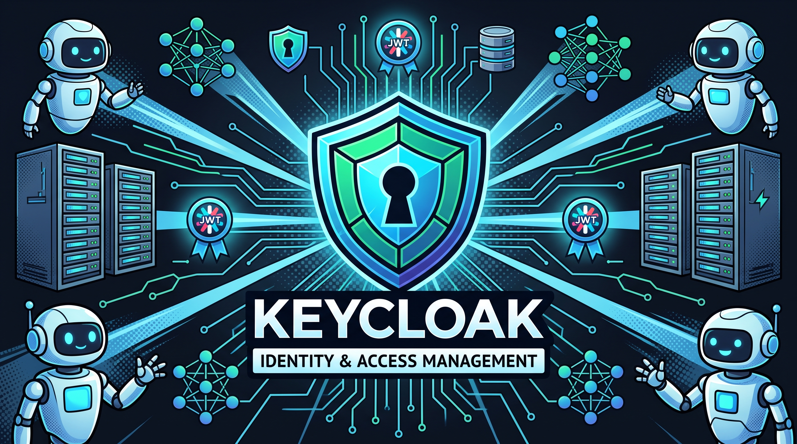
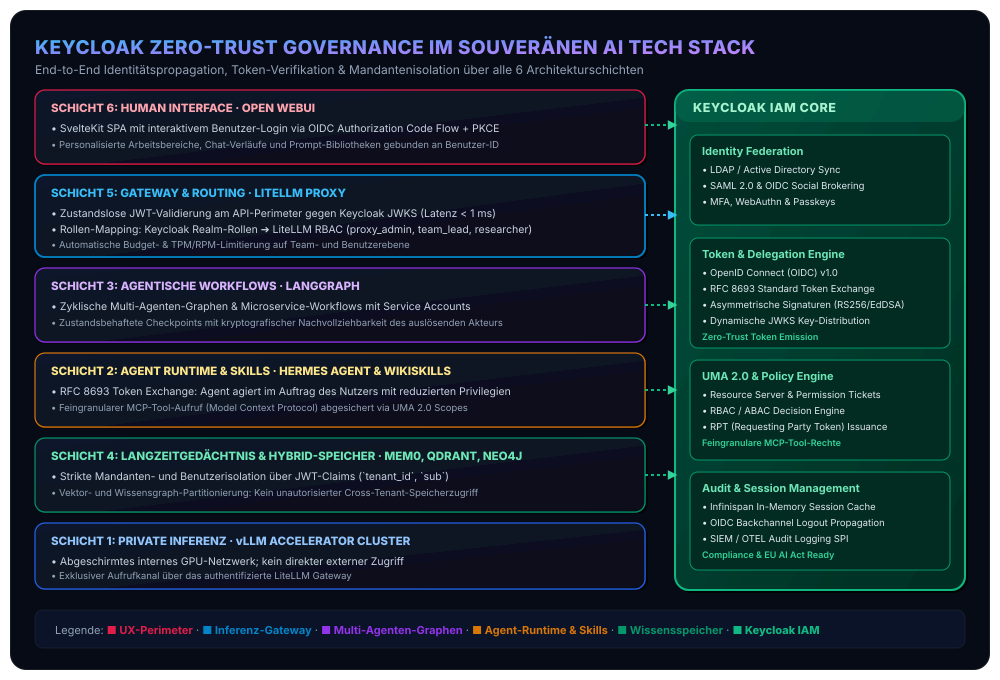
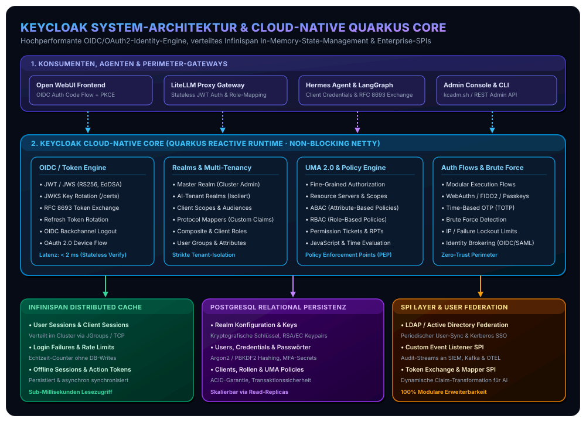
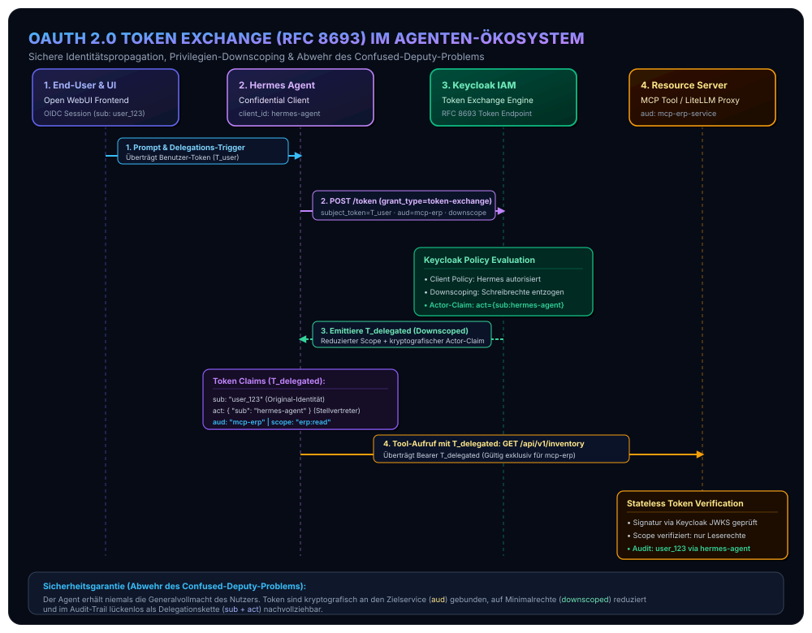
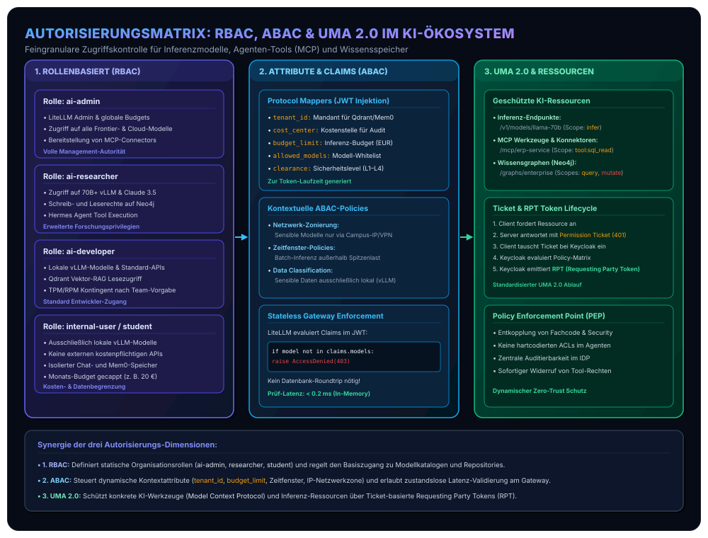
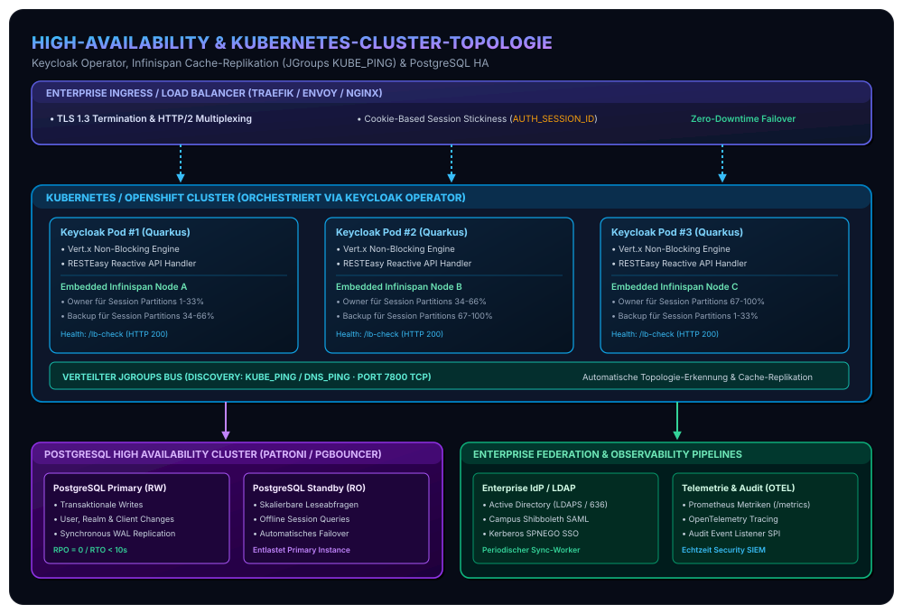
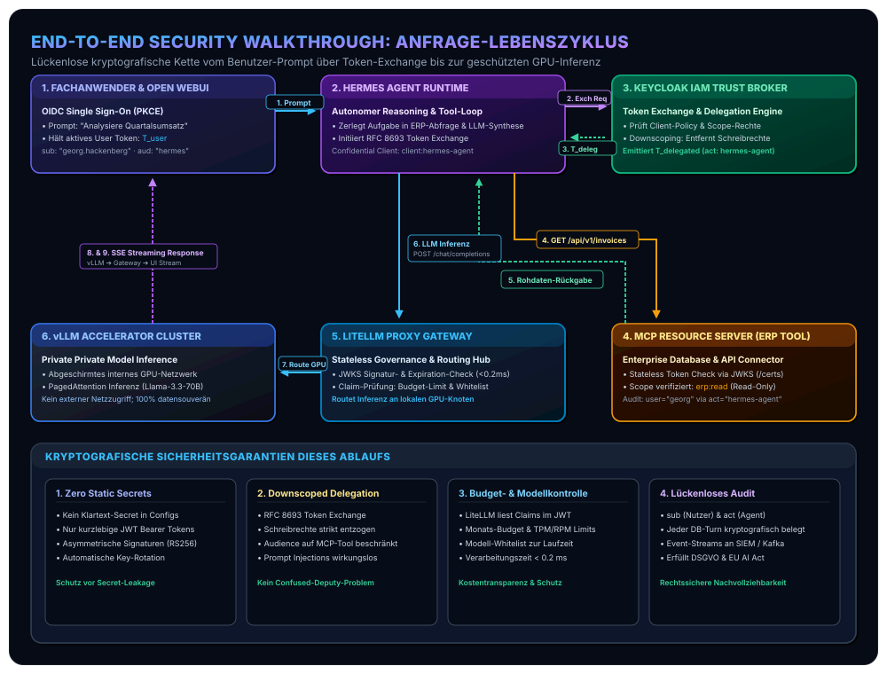

In unserer fortlaufenden Beitragsreihe zur systematischen Konzeption und ingenieurwissenschaftlichen Realisierung souveräner Unternehmens-KI haben wir die funktionalen Kernkomponenten moderner Plattformen schrittweise analysiert: Ausgehend vom [standardisierten Open-Source Agentic AI Tech Stack](/posts/2026_09_03_standardisierter_open_source_agentic_ai_tech_stack/) untersuchten wir das mathematisch formalisierte [sitzungsübergreifende Langzeitgedächtnis via Mem0](/posts/2026_09_04_langzeitgedaechtnis_llm_agenten_mem0/), die [kontinuierliche Wissensevolution via WikiSkill](/posts/2026_09_06_wikiskill_persistente_wissensevolution_agent_skills/), die [Body-Brain-Entkopplung und Bounded-Memory-Laufzeit des Hermes Agent](/posts/2026_09_07_hermes_agent_architektur_und_funktionsweise/), die kollaborative [Human-in-the-Loop Interaktionsschicht via Open WebUI](/posts/2026_09_08_open_webui_architektur_und_funktionsweise/) sowie das universelle Modell-Routing, Caching und Inferenz-Gateway via [LiteLLM](/posts/2026_09_09_litellm_architektur_und_funktionsweise/).

Bereits in unseren Grundlagenarbeiten zu [lokalen KI-Agenten und strukturierter Inferenz](/posts/2026_05_31_local_ai_agents_web_llm/) und den Architekturleitlinien von [Mindful IT und Calm Computing](/posts/2026_09_02_mindful_it_calm_computing_software_architektur/) wurde ein fundamentales Postulat hervorgehoben: **Je mehr Autonomie, Werkzeugzugriff und Handlungskompetenz softwarebasierten KI-Agenten eingeräumt wird, desto strikter und kompromissloser müssen Identitäts-, Authentifizierungs- und Autorisierungsgrenzen an jedem Perimeter des Systems gezogen werden.**

In vielen heutigen Pilotprojekten und unreflektierten Enterprise-Deployments herrscht jedoch ein eklatantes Sicherheitsvakuum:
* **Statische Master-API-Keys:** Autonome Agenten und Pipelines operieren mit allmächtigen Service-Tokens, die im Klartext in Umgebungsdateien hinterlegt sind und bei Kompromittierung unbegrenzten Datenzugriff erlauben.
* **Das Confused-Deputy-Problem:** Ein Agent erhält im Auftrag eines Endnutzers eine komplexe Problemstellung, nutzt jedoch zur Tool-Ausführung seine eigenen, überprivilegierten Systemrechte. Böswillige Prompt Injections führen so unmittelbar zu Datenexfiltration oder unberechtigten Transaktionen.
* **Fehlende Mandanten- und Rollenisolation:** Vektordatenbanken ([Qdrant](/tags/neo4j)), relationale Persistenzschichten ([PostgreSQL](/tags/software-architecture)) und Graph-Datenbanken ([Neo4j](/tags/knowledge-graphs)) können Anfragen aus Web-Interfaces oft nicht verlässlich einem verifizierten Endnutzer zuordnen.
* **Audit- und Compliance-Lücken:** Gesetzliche Vorgaben nach DSGVO und EU AI Act verlangen die lückenlose, kryptografisch nachweisbare Nachvollziehbarkeit jeder automatisierten Entscheidung und jedes Datenbankzugriffs.

Genau an dieser Nahtstelle greift **Keycloak** als **Schicht 5 (Gateway, Identity & Access Management)** unseres Referenzmodells ein. Als hochgradig performanter, cloud-nativer Open-Source-Identity-Provider (IdP) standardisiert Keycloak moderne Authentifizierungs- und Autorisierungs-Flows (OAuth 2.0, OpenID Connect, SAML 2.0, UMA 2.0). 



Bevor wir die internen Protokollabläufe und Token-Transformationsmechanismen im Detail analysieren, visualisiert das folgende Architekturmodell die Einbettung von Keycloak in die Gesamttopologie unseres Stacks:



## 1. Keycloak im Kontext des souveränen AI Tech Stacks

In unserem sechsgliedrigen Referenzstack agiert Keycloak nicht als isolierter Authentifizierungsserver, sondern als **universelle Vertrauensanker-Instanz (Trust Broker)**, der Mensch-zu-Maschine-, Maschine-zu-Maschine- und Maschine-zu-Ressource-Transaktionen kryptografisch absichert:

1. **Mensch-zu-System (Schicht 6 · [Open WebUI](/posts/2026_09_08_open_webui_architektur_und_funktionsweise/)):**
   Fachanwender, Forscher und Studierende melden sich über standardisierte Single-Sign-On-Verfahren (SSO) an. Open WebUI delegiert die Authentifizierung via OpenID Connect (OIDC) Authorization Code Flow mit PKCE vollständig an Keycloak. Passwörter oder biometrische Merkmale berühren die Web-UI zu keinem Zeitpunkt.
2. **Gateway-Absicherung (Schicht 5 · [LiteLLM Proxy](/posts/2026_09_09_litellm_architektur_und_funktionsweise/)):**
   LiteLLM validiert eintreffende Requests zustandslos anhand der von Keycloak asymmetrisch signierten JSON Web Tokens (JWT). Über Keycloak Protocol Mappers werden Rollen, Team-Zugehörigkeiten und Budgetgrenzen direkt in den Token injiziert.
3. **Agenten-Delegation & Token Exchange (Schichten 2 & 3 · [Hermes Agent](/posts/2026_09_07_hermes_agent_architektur_und_funktionsweise/) & [LangGraph](/tags/langgraph)):**
   Wenn ein autonomer Agent im Auftrag eines Nutzers Werkzeuge ausführt (via [Model Context Protocol – MCP](/services/ai/integration) oder Google [WikiSkills](/posts/2026_09_06_wikiskill_persistente_wissensevolution_agent_skills/)), tauscht er das Benutzer-Token nach **RFC 8693** in ein downscoped, auditiertes Agenten-Token um.
4. **Mandantensichere Persistenz (Schicht 4 · [Mem0](/posts/2026_09_04_langzeitgedaechtnis_llm_agenten_mem0/), Qdrant, Neo4j):**
   Speicherabfragen auf Langzeit-Fakten oder Knowledge Graphs werden anhand der im JWT transportierten Claims (`tenant_id`, `sub`, `department`) auf Partitionsebene gefiltert.
5. **Compute-Isolation (Schicht 1 · [vLLM](/tags/vllm)):**
   Die GPU-Inferenzcluster operieren in einem abgeschirmten Zero-Trust-Netzwerk ohne öffentlichen Zugang. Zugriff erhält ausschließlich das von Keycloak autorisierte LiteLLM Gateway.

## 2. Systemarchitektur & Cloud-Native Quarkus Runtime

Mit der Veröffentlichung von Keycloak 17 vollzog das Projekt den wegweisenden architektonischen Wechsel von der klassischen WildFly-Plattform zur modernen **Quarkus Cloud-Native Java Runtime**. Für containerisierte KI-Umgebungen auf Basis von Kubernetes oder Docker bedeutet dies drastisch reduzierte Kaltstartzeiten (wenige Sekunden statt Minuten) und einen bis zu 60 % geringeren Arbeitsspeicherbedarf.



### Der reaktive Netty-Core
Das Herzstück der Quarkus-basierten Keycloak-Distribution bildet ein asynchroner, nicht-blockierender I/O-Kern auf Basis von **Eclipse Vert.x** und **Netty**. Eingehende HTTP/2- und HTTP/1.1-Verbindungen werden auf Event-Loops entgegengenommen:
* **RESTEasy Reactive:** REST-Endpunkte (`/realms/{realm}/protocol/openid-connect/...`) verarbeiten Token-Anfragen ohne thread-basiertes Blocking.
* **Worker-Thread-Pool:** Zeitintensive kryptografische Operationen (wie Argon2id- oder PBKDF2-Passworthashing) sowie transaktionale Datenbankabfragen werden kontrolliert an den internen Worker-Pool übergeben, wodurch der Event-Loop stets reaktionsfähig bleibt.

### Die Persistenz- und Cache-Topologie
Um enterprise-typische Anforderungen an Hochverfügbarkeit und Sub-Millisekunden-Latenzen zu erfüllen, setzt Keycloak auf eine zweistufige Persistenzarchitektur:

| Schicht | Technologie | Primäre Aufgaben & Datenstrukturen | Konsistenzmodell |
| :--- | :--- | :--- | :--- |
| **Distributed In-Memory Cache** | **Infinispan** (via JGroups TCP) | • Aktive User Sessions (`authenticationSessions`)<br>• Login-Failure-Counter & Brute-Force-Tracking<br>• Action Tokens & Einmal-Codes (`authorization_code`)<br>• Realm-, Client- und Rollen-Metadaten-Cache | Eventual Consistency (verteilt mit Replikationsfaktor $N=2$) |
| **Relational Data Store** | **PostgreSQL 16+** (via Agroal & Hibernate) | • Realm-Konfigurationen und kryptografische Keys<br>• User-Accounts, Credentials & MFA-Secrets<br>• Rollendefinitionen, Client Scopes & Mappers<br>• Persistierte Offline-Sessions (Long-Lived Tokens) | Strikte ACID-Transaktionalität |

Durch das Caching von Realm- und Client-Metadaten im Infinispan-Speicher kann Keycloak eingehende OIDC-Discovery-Aufrufe (`/.well-known/openid-configuration`) und JWKS-Schlüsselabrufe (`/protocol/openid-connect/certs`) vollständig aus dem Arbeitsspeicher bedienen.

## 3. Kernabstraktionen & Multi-Tenancy

Das Konfigurationsmodell von Keycloak basiert auf klaren softwaretechnischen Abstraktionen, die eine saubere Mandantentrennung im KI-Ökosystem garantieren.

### Realm-Isolation: Master vs. AI-Tenant-Realms
Ein **Realm** (Reich/Mandantenraum) stellt eine vollständig isolierte Sicherheitsdomäne dar:
* **Master Realm:** Dient ausschließlich der administrativen Verwaltung des Keycloak-Clusters. Hier existieren nur Administratoren; er beherbergt niemals Endanwender oder KI-Clients.
* **AI-Tenant Realms (`enterprise-ai`, `fh-ooe-campus`):** Eigene Sicherheitsdomänen für Unternehmensabteilungen oder Organisationen. Jeder Realm verwaltet seine eigenen Benutzer, Rollen, Clients, kryptografischen RSA/EC-Schlüsselpaare und Identitäts-Provider-Verknüpfungen.

### Client-Klassifizierung im AI Tech Stack
In Keycloak ist jeder Service, der Authentifizierung anfordert oder Ressourcen schützt, als **Client** registriert:

1. **Public Clients (Frontend / Browser):**
   Verwendet für [Open WebUI](/posts/2026_09_08_open_webui_architektur_und_funktionsweise/). Da Client-Secrets in browserseitigen Single-Page-Applications (SPA) nicht geheim gehalten werden können, verbietet Keycloak hier statische Secrets und erzwingt zwingend **Proof Key for Code Exchange (PKCE)** nach RFC 7636.
2. **Confidential Clients (Backend-Services):**
   Verwendet für [LiteLLM Proxy](/posts/2026_09_09_litellm_architektur_und_funktionsweise/), den [Hermes Agent](/posts/2026_09_07_hermes_agent_architektur_und_funktionsweise/) Runtime-Dienst und [LangGraph](/tags/langgraph)-Orchestrierungs-Knoten. Diese Services laufen in sicheren Serverumgebungen und authentifizieren sich über kryptografisch starke Client-Credentials (`client_secret` oder mTLS Client Certificates).
3. **Bearer-Only / Resource Servers:**
   Microservices und Model Context Protocol (MCP) Server, die selbst keine Tokens ausstellen, sondern lediglich eingehende Bearer Tokens validieren und Ressourcen schützen.

### Protocol Mappers & Dynamische Claims-Injektion
Ein zentraler Mehrwert von Keycloak für unseren AI Stack sind **Protocol Mappers**. Sie reichern die erzeugten JWTs mit dynamischen Attributen an, die von nachgelagerten Schichten zur Laufzeit ausgewertet werden:

```json
{
  "exp": 1789045200,
  "iat": 1789041600,
  "iss": "https://auth.company.internal/realms/enterprise-ai",
  "aud": ["litellm-gateway", "mcp-service"],
  "sub": "4b68e92a-3c12-4e89-a21a-637bb3098e91",
  "preferred_username": "georg.hackenberg",
  "email": "georg.hackenberg@fh-ooe.at",
  "realm_access": {
    "roles": ["ai-researcher", "default-roles-enterprise-ai"]
  },
  "tenant_id": "fh-ooe-wels",
  "cost_center": "DEPT_INFORMATICS_742",
  "budget_limit_eur": 250.00,
  "allowed_models": ["vllm/*", "claude-3-5-sonnet", "gpt-4o"],
  "clearance_level": "RESTRICTED_RESEARCH"
}
```

Durch diese Claims-Injektion weiß [LiteLLM](/posts/2026_09_09_litellm_architektur_und_funktionsweise/) unmittelbar nach der Signaturprüfung, welches Budget gilt und welche Modelle freigeschaltet sind, ohne eine synchrone REST-Anfrage an ein Abrechnungssystem stellen zu müssen.

## 4. Authentifizierungs- & Delegations-Flows im Agenten-Zeitalter

Klassische Web-Architekturen beschränken sich auf die Anmeldung von Menschen. In einem agentischen KI-System interagieren jedoch Menschen, autonome Software-Agenten und verteilte Werkzeuge dynamisch miteinander. Keycloak orchestriert hierfür drei essenzielle Protokollabläufe:

### 1. Authorization Code Flow mit PKCE (Mensch-zu-UI)
Der Goldstandard für interaktive Webanwendungen wie [Open WebUI](/posts/2026_09_08_open_webui_architektur_und_funktionsweise/):
1. Der Browser generiert ein kryptografisches Geheimnis, den *Code Verifier* $V \in \{0, 1\}^{256}$, und leitet den *Code Challenge* $C = \text{BASE64URL}(\text{SHA256}(V))$ ab.
2. Open WebUI leitet den Nutzer an Keycloak weiter (`/auth?response_type=code&client_id=open-webui&code_challenge=C&code_challenge_method=S256`).
3. Der Nutzer authentifiziert sich (Passwort, WebAuthn/Passkey, Firmen-LDAP).
4. Keycloak sendet einen kurzlebigen Authorization Code zurück an die Callback-URL.
5. Open WebUI tauscht den Code zusammen mit dem originalen $V$ am Token-Endpunkt gegen ID-Token, Access-Token und Refresh-Token ein. Keycloak verifiziert $C \stackrel{?}{=} \text{SHA256}(V)$ und stellt die Token aus.

### 2. Client Credentials Flow (Autonome System-Pipelines)
Hintergrund-Dienste, wie zeitgesteuerte RAG-Indexierungs-Pipelines oder automatisierte [LangGraph](/tags/langgraph)-Graphen, agieren ohne menschlichen Interaktionspartner. Sie authentifizieren sich direkt über den OAuth 2.0 Client Credentials Flow:
$$\text{Hermes Service} \xrightarrow{\text{POST /token (client\_id, client\_secret)}} \text{Keycloak} \xrightarrow{\text{JWT Access Token}} \text{Hermes Service}$$

### 3. OAuth 2.0 Token Exchange (RFC 8693) & Agenten-Delegation
Das gravierendste Sicherheitsproblem agentischer Architekturen ist das **Confused-Deputy-Problem**: Wenn der [Hermes Agent](/posts/2026_09_07_hermes_agent_architektur_und_funktionsweise/) im Auftrag von *Georg* ein internes Werkzeug (z. B. eine SQL-Datenbankabfrage via MCP) aufrufen soll, darf er Georgs mächtiges Master-Token nicht unmodifiziert an Drittsysteme weiterleiten. Das Drittsystem könnte Georgs Identität missbrauchen, um andere Services zu kompromittieren.

Die Lösung bildet der in Keycloak produktionsreif integrierte **Standard Token Exchange nach RFC 8693**:



#### Der mathematisch-formale Ablauf des Token Exchange:
1. **Delegations-Trigger:** Open WebUI übergibt dem Hermes Agent die Aufgabe zusammen mit dem aktuellen Benutzer-Token $T_{\text{user}}$ mit Scopes $S_{\text{full}} = \{\text{openid}, \text{ai:chat}, \text{db:read}, \text{db:write}, \text{admin}\}$.
2. **Exchange Request:** Der Hermes Agent sendet einen Token-Exchange-Request an Keycloak:
   ```http
   POST /realms/enterprise-ai/protocol/openid-connect/token HTTP/1.1
   Host: auth.company.internal
   Content-Type: application/x-www-form-urlencoded

   grant_type=urn:ietf:params:oauth:grant-type:token-exchange
   &client_id=hermes-agent-runtime
   &client_secret=sec_99481a...
   &subject_token=eyJhbGciOiJSUzI1Ni...
   &subject_token_type=urn:ietf:params:oauth:token-type:access_token
   &audience=mcp-sql-database
   &scope=db:read
   &requested_token_type=urn:ietf:params:oauth:token-type:access_token
   ```
3. **Keycloak Policy Enforcement:**
   * Keycloak validiert die Client-Credentials des Hermes Agenten.
   * Keycloak prüft, ob die Client-Policy dem Hermes Agenten gestattet, Token für die Ziel-Audience `mcp-sql-database` einzutauschen.
   * Keycloak vollzieht ein **Downscoping**: Schreibrechte (`db:write`) werden strikt entfernt; das neue Token enthält nur die Schnittmenge $S_{\text{downscoped}} = S_{\text{requested}} \cap S_{\text{user}} = \{\text{db:read}\}$.
4. **Token-Ausstellung mit Actor Claim:**
   Das emittierte Token $T_{\text{agent}}$ transportiert die kryptografische Delegationskette über den standardisierten `act`-Claim:
   ```json
   {
     "sub": "georg.hackenberg",
     "act": {
       "sub": "client:hermes-agent-runtime"
     },
     "aud": "mcp-sql-database",
     "scope": "db:read",
     "exp": 1789042200
   }
   ```
5. **Verifikation am MCP-Server:**
   Der SQL-Connector prüft die Signatur. Im Audit-Log wird transparent protokolliert: *„Abfrage ausgeführt für Nutzer georg.hackenberg über Stellvertreter hermes-agent-runtime.“* 

Ein böswilliger Versuch des Agenten, schreibende SQL-Befehle (`DROP TABLE`) abzusetzen, scheitert unmittelbar an den kryptografischen Scopes des Tokens.

## 5. Feingranulare Autorisierung: RBAC, ABAC & UMA 2.0

Authentifizierung stellt lediglich fest, *wer* eine Anfrage stellt. Autorisierung entscheidet, *was* der Anfragende tun darf. Im AI Tech Stack kombinieren wir über Keycloak drei Dimensionen der Zugriffskontrolle:



### 1. Rollenbasierte Zugriffskontrolle (RBAC)
Keycloak unterscheidet zwischen globalen **Realm Roles** und dienstspezifischen **Client Roles**:
* `ai-admin`: Vollzugriff auf Inferenz-Routing, globale Team-Budgets und GPU-Cluster-Management.
* `ai-researcher`: Zugriff auf unzensierte 70B+ Modelle, Cloud-Frontier-APIs, Schreibzugriff auf Wissensgraphen ([Neo4j](/tags/neo4j)).
* `ai-developer`: Standard-Modelle, Lesezugriff auf RAG-Collections in [Qdrant](/tags/neo4j), Entwicklungstools.
* `internal-user` / `student`: Strikte Beschränkung auf lokale [vLLM](/tags/vllm)-Modelle, Monats-Tokenbudget gecappt auf 20 €.

### 2. Attributbasierte Zugriffskontrolle (ABAC)
Rollen allein sind oft zu starr. ABAC ermöglicht dynamische, kontextsensitive Richtlinienentscheidungen:
* **Time-Based Policies:** Batch-Inferenz-Jobs von Agenten dürfen nur außerhalb der Kernarbeitszeiten (z. B. 20:00 – 06:00 Uhr) ausgeführt werden.
* **Network / IP Policies:** Zugriff auf sensible interne Forschungsmodelle wird verweigert, wenn die Anfrage nicht aus dem Universitätsnetz oder über autorisiertes WireGuard-VPN erfolgt.
* **Data Classification Level:** Ein Dokument mit dem Tag `CONFIDENTIAL_FINANCE` darf nur von LLM-Instanzen verarbeitet werden, deren Inferenz nachweislich On-Premises ohne Cloud-Egress stattfindet.

### 3. User-Managed Access (UMA 2.0) für Model Context Protocol (MCP) Tools
Für die Absicherung sensibler Unternehmensressourcen (ERP-APIs, CRM-Konnektoren, Dateisysteme) fungieren MCP-Server als **UMA 2.0 Resource Servers**:
1. Der Agent versucht, eine geschützte Funktion aufzurufen (`POST /mcp/erp/invoices`).
2. Der Resource Server blockiert die Anfrage mit **HTTP 401 Unauthorized** und liefert ein kryptografisches **Permission Ticket** zurück.
3. Der Agent reicht dieses Ticket bei Keycloak am Token-Endpunkt ein.
4. Keycloak evaluiert die hinterlegten Richtlinien (Rollen, Attribute, Zustimmung des Ressourcenbesitzers).
5. Bei Erfolg stellt Keycloak ein **Requesting Party Token (RPT)** aus, mit dem der Agent die Funktion final ausführen kann.

## 6. Token-Lebenszyklus, Kryptografie & Hochlast-Performance

Ein häufiges Missverständnis beim Einsatz von Identity-Providern ist die Sorge vor Performanzeinbußen. In Echtzeit-Inferenz-Pipelines, in denen jede Millisekunde Latenz zählt, darf die Sicherheitsüberprüfung keinen spürbaren Overhead verursachen.

### Zustandslose Signaturprüfung via JWKS (JSON Web Key Set)
Keycloak und unser API-Gateway [LiteLLM](/posts/2026_09_09_litellm_architektur_und_funktionsweise/) eliminieren Datenbank-Roundtrips durch **stateless JWT validation**:

1. **Einmaliger Schlüsselaustausch:** Beim Start lädt LiteLLM den öffentlichen Schlüsselkatalog von Keycloak über den Endpoint `https://auth.company.internal/realms/enterprise-ai/protocol/openid-connect/certs` und puffert ihn im lokalen Speicher.
2. **Lokale Kryptografie:** Trifft ein HTTP-Request mit Bearer Token ein, verifiziert LiteLLM die Signatur asymmetrisch im Arbeitsspeicher:
   $$\text{Verify}_{\text{PK}}(\text{Payload}, \text{Signature}) \stackrel{?}{=} \text{True}$$
3. **Schlüsselrotation ohne Downtime:** Wechselt Keycloak periodisch seine Signaturschlüssel (z. B. alle 90 Tage), signalisiert der JWT-Header über den Parameter `kid` (Key ID) den Schlüsselwechsel. LiteLLM aktualisiert seinen In-Memory-Cache transparent im Hintergrund.
4. **Gemessene Latenz:** Die rein lokale Signatur- und Claims-Prüfung benötigt auf modernen Prozessoren **$< 0.2\,\text{ms}$** – der Verarbeitungs-Overhead für Sicherheits-Governance ist vernachlässigbar.

### Asymmetrische Kryptografie: RS256 vs. EdDSA
Während traditionelle Deployments auf RSA mit 2048 bzw. 4096 Bit (`RS256`) setzen, unterstützt das moderne Keycloak auf Quarkus elliptische Kurvenverfahren wie **EdDSA (Ed25519)** und **ES256**:
* **Kürzere Tokens:** Reduziert die HTTP-Header-Größe um über 70 %, was insbesondere bei mobilen Verbindungen Bandbreite spart.
* **Höhere Recheneffizienz:** Ed25519-Signaturprüfungen sind um den Faktor 3–5 schneller als RSA-4096-Operationen.

### OIDC Backchannel Logout & Revocation
Verlässt ein Mitarbeiter das Unternehmen oder wird ein Agenten-Token kompromittiert, reicht das Abwarten der Token-Ablaufzeit ($T_{\text{exp}}$, typischerweise 5–15 Minuten) im Enterprise-Kontext nicht aus. 

Keycloak implementiert den **OpenID Connect Back-Channel Logout (RFC 7662 / OIDC Core)**:
* Wird eine Session in der Keycloak Admin Console terminiert, sendet Keycloak parallel asynchrone HTTP-POST-Logout-Tokens an alle registrierten Clients ([Open WebUI](/posts/2026_09_08_open_webui_architektur_und_funktionsweise/), [LiteLLM](/posts/2026_09_09_litellm_architektur_und_funktionsweise/)).
* Die Clients invalidieren ihre lokalen Session-Caches augenblicklich; laufende Agenten-Zyklen des betroffenen Nutzers werden innerhalb von Millisekunden gestoppt.

## 7. High-Availability & Kubernetes Operator

Für unternehmenskritische 24/7-Infrastrukturen muss Keycloak redundant und ausfallsicher betrieben werden. In Produktionsumgebungen erfolgt das Deployment standardisiert über den offiziellen **Keycloak Kubernetes Operator**.



### Cluster-Discovery mit JGroups & KUBE_PING
In Kubernetes-Clustern besitzen Pods dynamische IP-Adressen. Das klassische IP-Multicast-Verfahren scheitert in virtualisierten Cloud-Netzwerken. Keycloak nutzt daher **JGroups mit `KUBE_PING` bzw. `DNS_PING`**:
* Die Keycloak-Pods fragen über die Kubernetes-API oder einen Headless Service die IPs aller aktiven Pods mit dem Label `app=keycloak` ab.
* Über Port `7800/TCP` bauen die Pods ein vollvermaschtes P2P-Netzwerk auf.
* Tritt ein neuer Pod dem Deployment bei (Horizontal Pod Autoscaler), synchronisiert der Infinispan-Cluster die Cache-Partitionen automatisch ohne Dienstunterbrechung.

### Zero-Downtime Session Stickiness
Um unnötigen Cache-Replikations-Traffic zwischen den Knoten zu minimieren, setzt der Ingress-Controller (Traefik oder NGINX) ein Cookie-basiertes Routing ein:
* Beim ersten Login setzt Keycloak das Cookie `AUTH_SESSION_ID=<session-id>.<node-id>`.
* Nachfolgende Anfragen desselben Nutzers werden vom Ingress direkt an denjenigen Pod weitergeleitet, der als primärer Owner der Session im Infinispan-Cluster fungiert.
* Fällt ein Pod aus, übernimmt der definierte Backup-Pod die Session transparent. Der Nutzer bemerkt keinen Sitzungsverlust.

## 8. Praxiseinsatz im Gesamtsystem: Ein End-to-End Walkthrough

Um das nahtlose Ineinandergreifen aller Komponenten zu demonstrieren, betrachten wir den Lebenszyklus einer geschützten Benutzeranfrage in unserem AI Tech Stack:



### Die Sicherheitsgarantien dieses Ablaufs:
1. **Kein Klartext-Secret im Umlauf:** Kein einziger statischer API-Key ist in Konfigurationsdateien exponiert.
2. **Minimale Rechtevergabe:** Der Hermes Agent verfügt während des ERP-Aufrufs über keinerlei Schreibrechte; selbst bei erfolgreicher Prompt Injection ist das Manipulieren von Finanzdaten kryptografisch unmöglich.
3. **Budgetkontrolle in Echtzeit:** LiteLLM liest das Monatsbudget direkt aus den Keycloak-Claims des Tokens und bricht die Inferenz ab, falls das Kontingent der Fakultät erschöpft ist.
4. **Lückenloses Audit:** Sowohl der MCP-Server als auch LiteLLM protokollieren die Kombination aus auslösendem Endnutzer (`sub`) und ausführendem Software-Agenten (`act`).

## Fazit & Einordnung in den Sovereign AI Tech Stack

**Keycloak** ist weit mehr als eine Login-Maske: Im modernen KI-Ökosystem ist es das **zentrale Nervensystem für Vertrauen, Identitäts-Governance und Least-Privilege-Zugriffskontrolle**. Ohne ein leistungsfähiges, standardkonformes IAM-System lassen sich generative Sprachmodelle und autonome Agenten in regulierten Unternehmen, Industrie 4.0 und wissenschaftlichen Einrichtungen schlicht nicht rechtskonform und sicher betreiben.

Im Zusammenspiel unseres [standardisierten Open-Source Agentic AI Tech Stacks](/posts/2026_09_03_standardisierter_open_source_agentic_ai_tech_stack/) bildet Keycloak das perfekte Fundament für alle weiteren Module:
* **Schicht 1 (Inferenz):** [vLLM](/tags/vllm) liefert rohe GPU-Beschleunigung – hermetisch abgeriegelt im internen Netz.
* **Schicht 2 (Laufzeit & Skills):** Der [Hermes Agent](/posts/2026_09_07_hermes_agent_architektur_und_funktionsweise/) und declarative [WikiSkills](/posts/2026_09_06_wikiskill_persistente_wissensevolution_agent_skills/) nutzen RFC 8693 Token Exchange für sichere Werkzeugausführung.
* **Schicht 3 (Workflows):** [LangGraph](/tags/langgraph) steuert zustandsbehaftete Graphen über dedizierte Service Accounts.
* **Schicht 4 (Gedächtnis):** [Mem0](/posts/2026_09_04_langzeitgedaechtnis_llm_agenten_mem0/), Qdrant und [Neo4j](/tags/neo4j) partitionieren Wissen anhand von Keycloak Tenant-Claims.
* **Schicht 5 (Gateway & IAM):** **Keycloak + [LiteLLM](/posts/2026_09_09_litellm_architektur_und_funktionsweise/)** bilden das unüberwindbare Sicherheits- und Governance-Doppel für Routing, Caching und Identity Federation.
* **Schicht 6 (Human UX):** [Open WebUI](/posts/2026_09_08_open_webui_architektur_und_funktionsweise/) bietet Fachanwendern eine ergonomische Schnittstelle mit nahtlosem OIDC Single Sign-On.

Mit dieser geschlossenen Open-Source-Architektur demonstrieren wir, dass technologische Souveränität, modernste Agenten-Autonomie und kompromisslose Enterprise-Sicherheit keine Widersprüche sind, sondern sich in einem wohlstrukturierten Softwaredesign gegenseitig verstärken.

*Planen Sie den Aufbau einer souveränen, DSGVO-konformen KI-Infrastruktur in Ihrem Unternehmen oder Ihrer Forschungseinrichtung? Benötigen Sie Unterstützung bei der Anbindung von Keycloak an bestehende Active Directory/LDAP-Systeme, der Integration von Token-Exchange-Verfahren für autonome Agenten oder der Härtung von Inferenz-Gateways? Informieren Sie sich in unserem Leistungsbereich [Artificial Intelligence](/services/ai) oder vereinbaren Sie ein individuelles Fachgespräch zu unseren Servicemodulen [Technology Stack](/services/ai/stack) und [System Integration](/services/ai/integration).*
