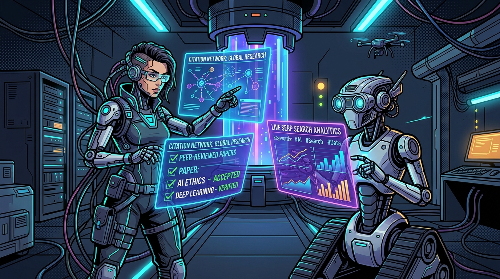
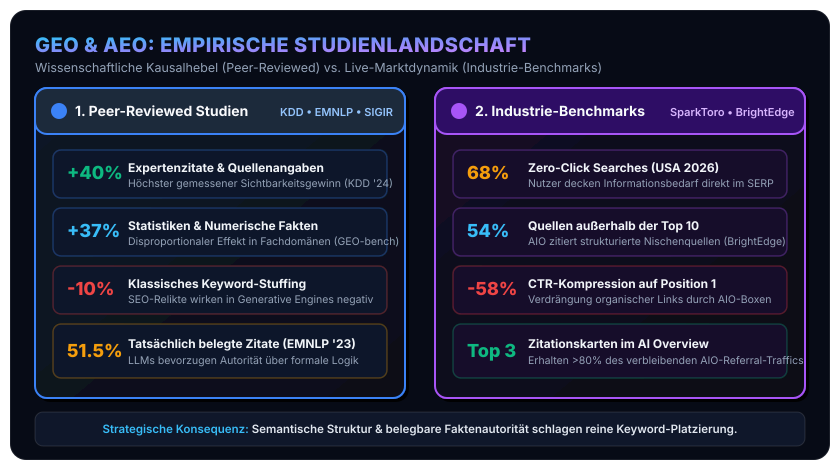

In unserem [vorherigen Beitrag vom 11. August 2026](/posts/2026_08_11_seo_geo_aeo_aio_optimierung) haben wir die theoretischen Grundlagen und die technische Umsetzung für die vier Dimensionen moderner Websichtbarkeit vorgestellt: **SEO**, **GEO**, **AEO** und **AIO**. Wir haben dargelegt, wie sich Websites durch Standards wie `llms.txt`, strukturierte JSON-LD Schemas und „Answer-First“-Architekturen für RAG-Systeme und KI-Agenten rüsten lassen.

In der SEO- und Tech-Branche wird jedoch viel behauptet, wenn neue Buzzwords auftauchen. Häufig vermischen sich verifizierte Kausalitäten mit spekulativem Marketing-Folklore. Um fundierte architektonische und strategische Entscheidungen zu treffen, brauchen wir **harte empirische Daten**.

In diesem Artikel ziehen wir Bilanz über den aktuellen wissenschaftlichen und industriellen Erkenntnisstand. Dabei unterscheiden wir strikt zwischen **Peer-Reviewed Publikationen** (akademisch geprüfte Forschung) und **Non-Peer-Reviewed Publikationen** (Industriereporte und Tool-Benchmarks). Abschließend bewerten wir Methodik, Datenqualität und Glaubwürdigkeit beider Quellen.

## 1. Peer-Reviewed Publikationen: Wissenschaftliche Kausalanalysen

Der Goldstandard der Informatik und Information Retrieval (IR) Forschung zeichnet sich durch offengelegte Datensätze, kontrollierte Versuchsaufbauten und den anonymen Begutachtungsprozess (*Peer Review*) aus. In den letzten drei Jahren haben renommierte Konferenzen (wie ACM SIGKDD, EMNLP und ACM SIGIR) wegweisende Arbeiten zu den Wirkmechanismen generativer Suchsysteme hervorgebracht.

### A. KDD 2024: Die GEO-Pionierstudie (Princeton, Georgia Tech, Allen AI, IIT Delhi)
Die Arbeit [„GEO: Generative Engine Optimization“ von Aggarwal et al. (KDD 2024)](https://arxiv.org/abs/2311.09735) gilt als die wissenschaftliche Geburtsstunde der systematischen GEO-Forschung. Die Autoren führten mit **GEO-bench** einen kontrollierten Benchmark über **10.000 reale Suchanfragen** aus neun unterschiedlichen Wissensdomänen durch und testeten neun Inhaltsmodifikationsstrategien gegenüber generativen Suchsystemen (u. a. Perplexity, Bing Chat und GPT-basierten RAG-Engines).

Die wichtigsten empirischen Befunde:
* **Massiver Sichtbarkeitsgewinn durch Quellen und Zitate (+40%)**: Die Integration von wörtlichen Expertenzitaten (*Cite Sources / Expert Quotations*) führte im Schnitt zu einem Sichtbarkeitsanstieg von bis zu 40% in den synthetisierten Antworten.
* **Statistische & numerische Evidenz (+37%)**: Das Anreichern von Texten mit konkreten quantitativen Daten, Kennzahlen und Messwerten steigerte die Zitationswahrscheinlichkeit um rund 37%.
* **Autoritative Quellenbelege (+33%)**: Explizite Quellenreferenzen und Verlinkungen auf Primärquellen wurden von RAG-Ranking-Modellen überproportional honoriert.
* **Keyword-Stuffing ist tot bis schädlich (-10% bis 0%)**: Klassische SEO-Tricks wie das wiederholte Einstreuen von Schlüsselbegriffen erbrachten in generativen Systemen keinerlei Mehrwert und führten in mehreren Modellen sogar zu einer Abstrafung der Inhaltsrelevanz.
* **Starke Domänenabhängigkeit**: Während technische und naturwissenschaftliche Abfragen extrem stark auf Zahlen und Zitate reagierten, erforderten historische oder philosophische Themen primär eine hohe stilistische Flüssigkeit (*Fluency Optimization*).

### B. EMNLP 2023: Das Verifizierbarkeits-Dilemma generativer Engines (Stanford University)
In [„Evaluating Verifiability in Generative Search Engines“ untersuchten Liu, Zhang und Liang (Stanford University, Findings of EMNLP 2023)](https://aclanthology.org/2023.findings-emnlp.467/) die Zuverlässigkeit von Perplexity AI, Bing Chat, You.com und Neeva. Die Forscher analysierten manuell und automatisiert, ob die von generativen Suchmaschinen generierten Behauptungen tatsächlich durch die beigefügten Quell-Links gestützt wurden.

Das ernüchternde Ergebnis:
* **Nur 51.5%** der generierten Aussagen waren vollständig durch die verlinkten Quellen belegt.
* **74.5%** der Zitate wiesen zumindest eine partielle semantische Relevanz zur getroffenen Aussage auf.
* **Der systematische Bias**: Generative Suchsysteme nutzen Retrieval-Pipelines, die stark auf semantische Ähnlichkeit (Cosine-Similarity in Embedding-Räumen) und stilistische Autorität anspringen – eine formallogische Wahrheitsprüfung findet im Ingestion-Moment nicht statt. Wer syntaktisch präzise, faktenorientierte Absätze bereitstellt, wird zitiert, unabhängig davon, ob das LLM den Kontext im Detail versteht.

### C. SIGIR 2026: Disruption des Suchverhaltens & Blickfeldverschiebung
Auf der ACM SIGIR 2026 wurden zwei entscheidende Studien zu Google AI Overviews und LLM-gestützter Suche vorgestellt:
1. **[Grossman et al. (SIGIR 2026) – „How Generative AI Disrupts Search“](https://arxiv.org/abs/2604.27790)**: Eine empirische Untersuchung von 11.500 Nutzerabfragen zeigte, dass bei Informationsanfragen in über 51% der Fälle ein generativer AI Overview ausgespielt wurde. Die Autoren wiesen nach, dass die Quellenauswahl der KI-Übersicht drastisch von den organischen Top-10-Ergebnissen abweicht: Nur bei **45–55% der Zitate** gab es eine Überschneidung mit den führenden organischen URLs. Zudem erwiesen sich generative Antworten als fragil gegenüber minimalen syntaktischen Umformulierungen der Suchanfrage (*Query Perturbation*).
2. **[Allawati et al. (SIGIR 2026) – „An Eye Tracking Study: Are AI Overviews Changing Search Behavior?“](https://www.microsoft.com/en-us/research/publication/an-eye-tracking-study-are-ai-overviews-changing-search-behavior/)**: Im Labor-Eye-Tracking wurde dokumentiert, dass das historische „Goldene Dreieck“ der Google-SERP (die Fixierung auf die ersten drei organischen blauen Links) aufgebrochen ist. Nutzer fokussieren ihre visuelle Aufmerksamkeit primär auf die generative Antwortbox über dem Falz. Dies beschleunigt den Trend zur passiven Informationsaufnahme drastisch.

## 2. Non-Peer-Reviewed Publikationen: Industrie- und Praxis-Benchmarks

Parallel zur akademischen Forschung erheben SEO-Software-Anbieter und Digital-Intelligence-Plattformen kontinuierlich Live-Telemetriedaten auf Millionen von SERP-Seiten. Diese Daten spiegeln das reale Marktgeschehen wider, unterliegen jedoch anderen methodischen Rahmenbedingungen.

| Datenquelle / Report | Untersuchte Stichprobe | Zentrale empirische Kernaussage | Relevanz für Web-Engineering |
| :--- | :--- | :--- | :--- |
| **[SparkToro & Similarweb / Datos](https://sparktoro.com/blog/2024-zero-click-search-study/)** (2024–2026) | &gt;1 Milliarde Google-Suchanfragen (USA &amp; EU) | **Zero-Click-Rate steigt auf 68.01%** (2024: 60.45%). Bei Vorhandensein von AI Overviews bricht die CTR der Top-1-Organik um **58%** ein. | Traditioneller Referral-Traffic sinkt; die bloße Markennennung im Fließtext der KI wird zur primären Währung. |
| **[BrightEdge Generative Parser](https://www.brightedge.com/resources/weekly-ai-search-insights)** (Longitudinal-Studie) | Millionen Keywords über diverse Vertikalen | **54% der AIO-Quellenzitate liegen außerhalb der organischen Top-10**. Extreme Branchenunterschiede (Health &gt;60% AIO-Anteil, B2B Tech ~30%, E-Commerce &lt;15%). | Nischen-Websites mit hoher thematischer Autorität können Platzhirsche in KI-Antworten überholen. |
| **[Authoritas AIO Research](https://www.authoritas.com/seo-ai-research-whitepapers)** | Tausende transaktionale und informationelle SERPs | **Top-3-Zitationskarten** im sichtbaren AIO-Karussell binden über **80%** des verbleibenden Klickvolumens. | Wenn zitiert, muss der Content in den ersten 1–3 Snippets auftauchen, um Klicks zu generieren. |
| **[SE Ranking](https://seranking.com) &amp; [Ziptie.dev](https://ziptie.dev)** | 100.000 kommerzielle &amp; informative Suchbegriffe | Enorme zeitliche Volatilität. Hohe Konzentration auf strukturierte Aggregatoren, Wikipedia, Reddit und gut strukturierte Fachpublikationen. | Stabilität von Rankings existiert in AIOs nicht; kontinuierliches Ingestion-Monitoring ist Pflicht. |

### Zusammenschau der empirischen Befunde

Stellt man die wissenschaftlich isolierten Kausalhebel den makroökonomischen Live-Telemetriedaten der Suchmaschinen gegenüber, wird das Spannungsfeld zwischen Optimierungspotenzial und Marktrealität unmittelbar greifbar: Während akademische Benchmarks präzise quantifizieren, *mit welchen inhaltlichen Anpassungen* man in generativen Antworten zitiert wird, belegen die Industriedaten, *welche gravierenden Konsequenzen* die Verdrängung klassischer Suchergebnisse für den organischen Webtraffic mit sich bringt.

Bevor wir aus diesen Zahlen handfeste architektonische Konsequenzen für das Web-Engineering ableiten, müssen wir die beiden Datenwelten methodisch auf Herz und Nieren prüfen.

## 3. Methoden- und Glaubwürdigkeitskritik: Peer-Reviewed vs. Industrie

Um diese Daten strategisch richtig zu gewichten, müssen wir die jeweilige Methodik kritisch hinterfragen. Weder akademische Studien noch Industriereporte liefern ein ungetrübtes Bild.

### Qualitätsdimension 1: Interne Validität & Kausalität
* **Peer-Reviewed (Hoch)**: Studien wie KDD '24 isolieren Variablen sauber. Durch kontrollierte A/B-Modifikationen identischer Basistexte im *GEO-bench* lässt sich zweifelsfrei belegen, dass das Hinzufügen von Statistiken den Ausschlag für den Sichtbarkeitsgewinn gibt – und nicht zufällige PageSpeed-Schwankungen oder Backlink-Profile.
* **Industrie (Mittel bis Gering)**: Industriebenchmarks beobachten Korrelationen im freien Feld (*Wild Field Data*). Wenn Seiten mit hoher Wortanzahl häufiger zitiert werden, bedeutet dies nicht zwingend, dass LLMs lange Texte bevorzugen – es kann schlicht daran liegen, dass längere Texte mehr Entitäten abdecken.

### Qualitätsdimension 2: Aktualität & Feedback-Schleifen
* **Peer-Reviewed (Träge, Latenz 6–18 Monate)**: Der wissenschaftliche Begutachtungsprozess dauert Monate. In dieser Zeit aktualisieren OpenAI, Google und Anthropic ihre Retrieval- und Reranking-Modelle mehrfach. Ein KDD-Paper von 2024 beschreibt mitunter Modellversionen, die im Produktiveinsatz bereits durch Mixture-of-Experts-Architekturen ersetzt wurden.
* **Industrie (Extrem hoch, Real-Time)**: Tools wie BrightEdge erfassen Algorithmen-Updates von Google (z. B. AI-Overview-Rollouts in neuen Ländern) innerhalb von Tagen. Für operative Taktiken sind diese Daten unersetzlich.

### Qualitätsdimension 3: Unabhängigkeit & Commercial Bias
* **Peer-Reviewed (Hoch)**: Transparente Offenlegung von Interessenskonflikten, kein Zwang zum Produktverkauf.
* **Industrie (Vorsicht geboten – Systemischer Incentive-Bias)**: SEO-Software-Anbieter (wie Semrush, BrightEdge, Authoritas) leben davon, dass Unternehmen Angst vor Sichtbarkeitsverlusten haben. Meldungen wie *„60% CTR-Einbruch!“* sind exzellentes Marketing für den Verkauf teurer Enterprise-Monitoring-Suiten. Zahlen müssen stets bereinigt um PR-Dramatisierung betrachtet werden.

### Qualitätsdimension 4: Datenzugang & Reproduzierbarkeit
* **Peer-Reviewed (Offen)**: Repositories, Datensätze und Prompts stehen auf GitHub oder arXiv zur Verfügung.
* **Industrie (Proprietäre Black-Box)**: Keyword-Sets und Sampling-Verfahren bleiben Geschäftsgeheimnis. Oft sind die Datensätze stark auf US-amerikanische, kaufkräftige B2B-/B2C-Keywords verzerrt.

## 4. Was bedeutet das für die Praxis? Synthese & Handlungsempfehlungen

Führt man die rigorose Kausalevidenz der akademischen Welt mit den Marktbeobachtungen der Industrie zusammen, ergibt sich ein klares Bild. Unsere im ersten Artikel vorgestellten Architekturentscheidungen werden durch die empirischen Befunde exakt bestätigt:

### 1. Zahlen, Daten und Zitate schlagen Prosa
Die KDD-Studie beweist, dass LLM-Reranker statistische Dichte mit Autorität gleichsetzen. 
* **Umsetzung**: Reine Floskeln („Wir sind führend in...“) durch konkrete Messwerte, Benchmarks und Vergleiche ersetzen. Auf Detailseiten prägnante Tabellen mit nachprüfbaren Werten platzieren.

### 2. Das Ende des Klick-Fischens: Marken- und Entitätenaufbau
Angesichts von 68% Zero-Click-Suchanfragen ist die Annahme naiv, jeder Suchende würde die eigene Website besuchen. 
* **Umsetzung**: Das Ziel moderner AEO/GEO-Optimierung ist nicht mehr nur der Link-Klick, sondern die **unmissverständliche Verankerung als Primärquelle im generierten Text**. Dies gelingt durch semantisch eindeutiges Schema.org-Markup (`sameAs`, `author`, `publisher`), sodass die KI den Autor zweifelsfrei namentlich zuordnet.

### 3. Answer-First sichert die ersten drei Karussell-Plätze
Da 54% der AIO-Quellen nicht aus der organischen Top-10 stammen, haben schlanke, präzise Seiten eine enorme Hebelwirkung – sofern sie direkt auf den Punkt kommen.
* **Umsetzung**: Jede Inhaltsseite muss in den ersten 50–70 Wörtern die Kernantwort liefern (Definitions-Snippet). Wer die Antwort erst nach drei Absätzen Einleitung versteckt, wird von Chunking-Algorithmen aussortiert.

### 4. Maschinenlesbare APIs (`llms.txt`) reduzieren Token-Kosten
Da KI-Crawler (wie GPTBot und ClaudeBot) unter strikten Rechenzeit- und Token-Budgets operieren, priorisieren sie Webseiten, die strukturierte, saubere Markdown-Repräsentationen anbieten. Eine schlanke `/llms.txt` und `/llms-full.txt` ermöglicht es RAG-Pipelines, Inhalte ohne HTML-Parser-Rauschen aufzunehmen.

## 5. Fazit

Die empirische Datenlage räumt mit den Mythen der Suchmaschinenoptimierung im KI-Zeitalter auf. Sichtbarkeit in Generative Engines ist kein Zufallsprodukt und gehorcht nicht den alten SEO-Gesetzen von Keyword-Dichte und Linkaufbau. 

Wer im KI-Zeitalter zitiert werden will, muss **semantische Präzision**, **quantitative Belege** und **maschinenlesbare Standards** liefern. Die Wissenschaft liefert uns das kausale Verständnis; die Industrie liefert uns das Echtzeit-Radar. Die Kombination aus beiden ist der Schlüssel für eine zukunftssichere Web-Architektur.
