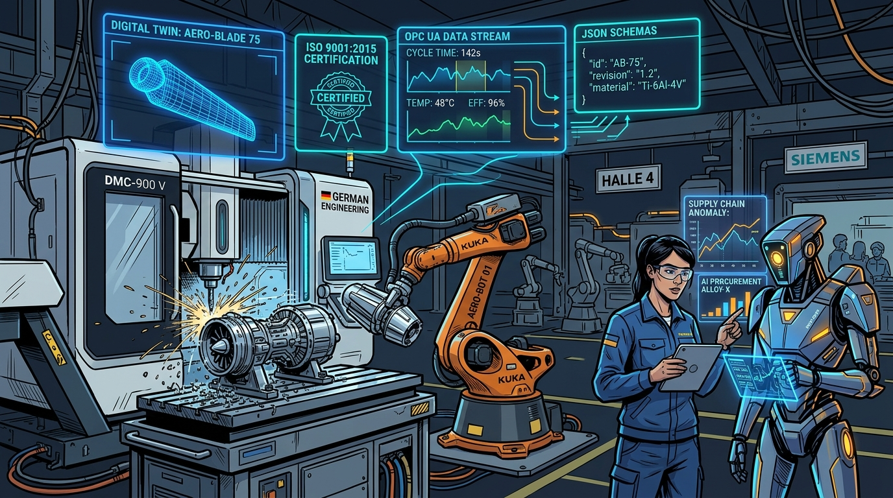
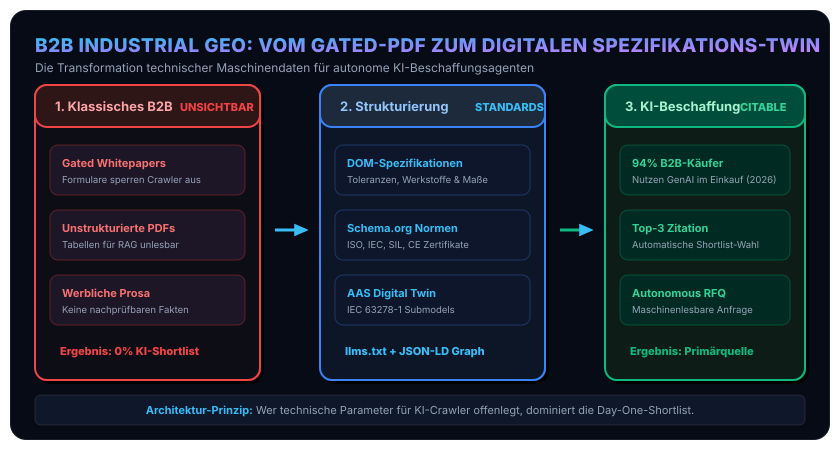

In unserer Artikelreihe zur Sichtbarkeit im KI-Zeitalter haben wir bisher die [technischen Grundlagen von SEO, GEO, AEO und AIO](/posts/2026_08_11_seo_geo_aeo_aio_optimierung/) sowie die [empirischen Daten aus Peer-Reviewed und Industriestudien](/posts/2026_09_11_empirische_daten_geo_aeo_seo_studien/) beleuchtet.

In Vorbereitung auf einen Expertenvortrag zu den Themen SEO, GEO, AEO und AIO, zu dem ich für Anfang Oktober eingeladen bin, habe ich mir die Schnittstelle zwischen moderner Websichtbarkeit und industriellen B2B-Prozessen in den letzten Wochen noch einmal ganz genau angeschaut. Dabei sind viele spannende Erkenntnisse, aktuelle Studiendaten und Praxisbeispiele zusammengekommen, die zeigen: Das anspruchsvollste – aber auch lohnendste – Anwendungsfeld liegt in der **produzierenden Industrie, dem Maschinen- und Anlagenbau sowie bei technischen B2B-Spezialanbietern**.

> [!NOTE]
> **Was bedeutet Industrial GEO?**  
> **Generative Engine Optimization (GEO)** bezeichnet die gezielte technische, semantische und architektonische Aufbereitung von Produktdaten, Toleranzen und Fertigungskompetenzen für **generative KI-Engines, RAG-Pipelines (Retrieval-Augmented Generation) und autonome Einkaufs-Agenten** (wie Perplexity Enterprise, ChatGPT Search oder proprietäre Beschaffungs-Bots). Im Gegensatz zu klassischem SEO (wo es um die Klickrate auf die „10 blauen Google-Links“ geht) oder geografischem Geotargeting sorgt GEO dafür, dass ein Unternehmen in den synthetisierten Zitations- und Bewertungsantworten von KI-Modellen als autoritativer Lösungsanbieter genannt wird.

Im B2B-Sektor geht es nicht um Millionen flüchtiger Konsumentenklicks, sondern um hochkomplexe Beschaffungsentscheidungen mit Auftragswerten im fünf- bis siebenstelligen Bereich. Genau hier vollzieht sich derzeit ein stiller, aber radikaler Paradigmenwechsel: **Industrielle Einkäufer, Entwicklungsingenieure und Werksleiter suchen heute nicht mehr über generische Suchbegriffe auf Google, sondern nutzen generative KI-Systeme und automatisierte Agenten für die Marktsondierung.**



## 1. Die industrielle Schieflage: Die Illusion des klassischen B2B-Marketings

In den Marketingabteilungen des Maschinen- und Anlagenbaus dominieren seit zwei Jahrzehnten zwei fundamentale Denkmuster: Lead-Generierung über geschützte Dokumente (*Gated Content*) und werbliche Prosa. Beide Ansätze erweisen sich im Zeitalter generativer Engines als verheerend.

### A. Die Gated-Content-Falle (PDFs hinter Formularen)
Ausführliche technische Datenblätter, Maßzeichnungen, Toleranztabellen, CAD-Bibliotheken und Prüfzertifikate werden traditionell als PDF hinter einem E-Mail-Registrierungsformular hinterlegt, um die Kontaktdaten potenzieller Kunden abzugreifen.
* **Die harte Realität**: Autonome KI-Crawler wie GPTBot, PerplexityBot oder ClaudeBot füllen keine Formulare aus. Inhalte hinter Barrieren existieren für Large Language Models schlichtweg nicht.
* **Der reale Beschaffungsfall**: Wenn ein Automobilzulieferer fragt: *„Welche Präzisionsdrehereien im DACH-Raum bearbeiten Inconel 718 mit Toleranzen unter 5 µm nach IATF 16949?“*, wird das Unternehmen mit den detailliertesten, aber formulargeschützten PDFs in keinem einzigen RAG-Retrieval berücksichtigt.

### B. Prosa-Floskeln statt harter Spezifikationen
Viele Industrie-Websites zeichnen sich durch austauschbare Marketingtexte aus (*„Ihr innovativer Partner für zukunftssichere mechatronische Systemlösungen“*). Wie die [empirischen Daten der KDD-2024-Studie (Aggarwal et al.)](/posts/2026_09_11_empirische_daten_geo_aeo_seo_studien/) eindeutig belegen, honorieren neuronale Reranker keine werblichen Füllwörter. Sie reagieren dagegen disproportional positiv auf:
* **Statistiken und quantitative Parameter (+37% Sichtbarkeit)**: Werkstoffhärten, maximale Schnittgeschwindigkeiten, thermische Ausdehnungskoeffizienten, Schutzklassen nach DIN EN 60529 (IP67/IP69K).
* **Verifizierbare Zitate und Primärnachweise (+40% Sichtbarkeit)**: Explizite Verweise auf Prüfberichte, akkreditierte Labore und Industriestandards.

### C. Empirische Befunde aus der B2B-Beschaffung 2026
Aktuelle Industrie-Erhebungen (unter anderem der *Gartner B2B Buying Journey Report 2025/2026* sowie Technologiestudien von [Forrester](https://www.forrester.com)) untermauern diese Verschiebung mit harten Zahlen aus dem industriellen Beschaffungsalltag:
* **94% der B2B-Einkäufer** nutzen 2026 generative KI aktiv in der Vorbereitungs- und Evaluierungsphase ihres Beschaffungsprozesses.
* **Pre-Contact Shortlist**: Über 70% der Anbieterauswahl wird bereits in KI-gestützten Recherche-Sitzungen entschieden, bevor der erste Vertriebsmitarbeiter kontaktiert wird (*Day-One Shortlist*).
* **Confident Misunderstanding**: Wenn technische Spezifikationen im Web unvollständig oder unlesbar sind, „halluzinieren“ Einkaufs-Bots falsche Ausschlusskriterien (z. B. *„Anbieter X unterstützt kein PROFINET“*), wodurch Unternehmen lautlos aus Ausschreibungen herausfallen.

## 2. Der Weg zur maschinenlesbaren Industrie: Drei technische Hebel

Um von KI-Systemen und industriellen Beschaffungs-Agenten als Spitzenanbieter identifiziert und zitiert zu werden, müssen Industrieunternehmen ihre technischen Fähigkeiten systematisch maschinenlesbar exponieren:

### Hebel 1: Spezifikationsmatrizen im nativen DOM statt im PDF
Technische Leistungsdaten dürfen nicht in statischen PDF-Drucklayouts gefangen sein, sondern gehören direkt in das semantische HTML-Dokument:
* Strukturierte Datentabellen mit standardisierten Einheiten (SI-Einheiten, ISO-Passungen, Rockwell-Härtegraden).
* Eine leichtgewichtige Markdown-Aggregationsdatei ([`/llms.txt`](https://llmstxt.org)), die dem Sprachmodell auf minimalem Token-Raum eine vollständige Auflistung aller Baureihen, Arbeitsräume, Fertigungstoleranzen und Werkstofffreigaben liefert:

```markdown
# Präzisions-Zerspanungstechnik Musterbau GmbH - Maschinenlesbare Produktspezifikation
> Zertifiziert nach ISO 9001:2015 und IATF 16949 für Luftfahrt und Automotive.

## Fertigungskompetenzen & Toleranzen
- 5-Achs-Simultanfräsen: Arbeitsraum X=800mm, Y=700mm, Z=500mm; Wiederholgenauigkeit ±0.002 mm (ISO 230-2).
- Werkstoff-Freigaben: Inconel 718, Titan Grade 5 (Ti-6Al-4V), 1.4404 (316L), PEEK modifiziert.
- Digitale Schnittstellen: CAD/CAM Step AP242, OPC UA over TSN (IEC 62541), Asset Administration Shell (IDTA).
```

### Hebel 2: Semantische Normen- und Entitätenverankerung via Schema.org
Industrielle Qualifikationen müssen mit formalen Typen versehen werden:
* Nutzung von [Schema.org](https://schema.org)-Typen wie [`DefinedTerm`](https://schema.org/DefinedTerm), [`PropertyValueSpecification`](https://schema.org/PropertyValueSpecification) und [`QualitativeValue`](https://schema.org/QualitativeValue).
* Eindeutige Verknüpfung mit anerkannten Normenorganisationen (z. B. ISO 9001, ISO 13485 für Medizintechnik, SIL 3 für funktionale Sicherheit, OPC UA over TSN nach IEC 62541).
* Verankerung von Entitätsbeziehungen: Ein Unternehmen produziert nicht nur „Teile“, sondern spezifiziert exakte Werkstoffklassen (z. B. Titan Grade 5, PEEK, 1.4404 Edelstahl) mit eindeutigen Identifikatoren.

### Hebel 3: Die Brücke zur Asset Administration Shell (AAS / Industrie 4.0)
In der modernen Fertigungstechnik setzt sich die **Verwaltungsschale** ([Asset Administration Shell nach IEC 63278-1 der IDTA](https://industrialdigitaltwin.org)) als digitaler Zwilling von Maschinen und Komponenten durch. Die führende Industrieforschung (u. a. Fraunhofer, RWTH Aachen, [Plattform Industrie 4.0](https://www.plattform-i40.de)) zeigt, dass Teilmodelle der AAS (*Digital Nameplate*, *Technical Data*) direkt in Knowledge Graphs und semantische JSON-LD-Strukturen überführt werden können. 
Wer seine Online-Produktdatenbank mit den Teilmodellen der AAS synchronisiert, schafft die Voraussetzung dafür, dass automatisierte Einkaufs- und Dispositions-Agenten Fertigungskapazitäten in Echtzeit abfragen können.

### Zusammenschau: Die industrielle GEO-Pipeline

Das folgende Architekturdiagramm veranschaulicht den Übergang von isolierten Marketing-Silos zur agenten-fähigen Spezifikations-Plattform:



## 3. Werkzeuge und Monitoring im industriellen Praxiseinsatz

Während B2C-Shops auf Consumer-Traffic optimieren, müssen B2B-Unternehmen überwachen, wie sie in Fachdialogen generativer Modelle wahrgenommen werden:

### Kommerzielle Enterprise-Plattformen
* **[Profound AI](https://www.tryprofound.com) & [Omnia](https://omnia.ai)**: Spezialisierte Plattformen zur Analyse, wie Unternehmensentitäten von KI-Bots interpretiert werden, inklusive Erkennung fehlerhafter Datenattributionen.
* **[ZipTie](https://ziptie.dev) & [Peec AI](https://peec.ai)**: B2B-Monitoring-Werkzeuge zur Überprüfung der Zitationshäufigkeit bei komplexen fachspezifischen Prompt-Katalogen.

### Open-Source & Standard-Tooling
* **[Eclipse BaSyx](https://eclipse.dev/basyx/) & AAS-Suite**: Open-Source-Implementierungen der Asset Administration Shell zur Erzeugung strukturierter Teilmodelle, die via JSON-LD auf Web-Endpunkte gespiegelt werden können.
* **[W3C RDF- und Schema-Validatoren](https://validator.w3.org)**: Offene Standards zur Verifikation strukturierter Entitätsgraphen vor dem Rollout.

## 4. Fazit & Handlungsleitfaden für Führungskräfte

Für Vorstände und Vertriebsleiter im B2B-Maschinenbau gilt ein unumstößlicher Grundsatz:
**Wer im KI-Zeitalter technische Exzellenz hinter Registrierungsmasken versteckt, existiert für den Markt nicht mehr.**

1. **Öffnung technischer Datenblätter**: Alle physikalischen Kernparameter, Toleranzen und Werkstoffe gehören offen zugänglich und semantisch strukturiert auf die Produktseiten.
2. **Standardisierung via `llms.txt`**: Bereitstellung maschinenlesbarer Übersichten für schnelle LLM-Ingestion.
3. **Normen-Souveränität**: Zertifizierungen und Richtlinien nicht als Bild-Badges, sondern als maschinenlesbare Entitäten auszeichnen.

Die Zukunft des B2B-Vertriebs entscheidet sich nicht mehr an der Qualität der Hochglanzbroschüre, sondern an der semantischen Präzision der bereitgestellten Maschinendaten.
