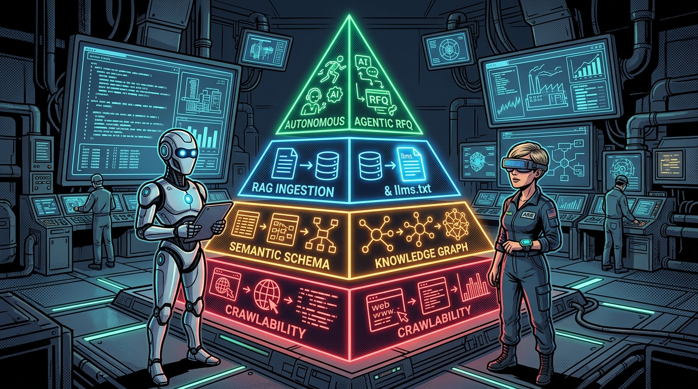
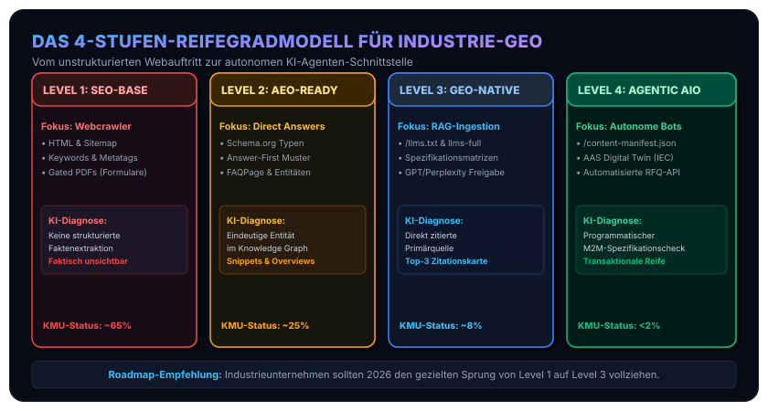

In unseren vorangegangenen Beiträgen haben wir die [technischen Grundlagen von SEO, GEO, AEO und AIO](/posts/2026_08_11_seo_geo_aeo_aio_optimierung/), die [empirische Studienlage zu Zitationshebeln](/posts/2026_09_11_empirische_daten_geo_aeo_seo_studien/) sowie die [spezifischen Hürden des industriellen B2B-Marketings](/posts/2026_09_12_b2b_industrial_geo_maschinenlesbare_industrie/) analysiert.

Wenn Führungskräfte, Werksleiter und IT-Verantwortliche im Maschinen- und Anlagenbau vor der Frage stehen, wie sie ihren Webauftritt für das Zeitalter generativer Systeme aufstellen sollen, fehlt es oft an Orientierung: Wo steht das eigene Unternehmen heute? Welche Investitionen bringen echten Wettbewerbsvorteil, und welche Maßnahmen sind rein kosmetische Beschäftigungstherapie?

Um diesen Transformationsprozess messbar und auditierbar zu machen, habe ich ein **vierstufiges GEO-Reifegradmodell für Industrieunternehmen** entwickelt. Es soll als pragmatischer Leitfaden dienen, um den aktuellen Status quo der eigenen Web-Architektur zu bestimmen und den Weg zur zukunftsfähigen KI-Sichtbarkeit schrittweise zu planen.

## Was zeichnet das vierstufige GEO-Reifegradmodell für Industrieunternehmen aus?

Das GEO-Reifegradmodell für Industrieunternehmen klassifiziert Webpräsenzen in vier aufeinander aufbauende Entwicklungsstufen: von klassischer SEO-Crawlability (Level 1) über semantische Knowledge-Graph-Verankerung (Level 2) und RAG-optimierte Markdown-Ingestion via `llms.txt` (Level 3) bis zur vollautonomen Interaktion mit KI-Einkaufsagenten über standardisierte Manifeste und AAS-Schnittstellen (Level 4).

### Die vier Reifegrade im direkten Vergleich

| Reifegrad | Primäre Zielgruppe | Technologischer Fokus | Typische Fehlerquelle | Zitations- und Business-Effekt |
| :--- | :--- | :--- | :--- | :--- |
| **Level 1: SEO-Baseline** | Klassische Such-Crawler (Googlebot) | HTML5, Responsivität, Basis-Metadaten | Gated PDFs hinter Kontaktformularen | Faktisch unsichtbar für generative RAG-Systeme |
| **Level 2: AEO-Ready** | Direct Answer Engines & Featured Snippets | Schema.org JSON-LD, Answer-First Teaser, FAQs | Isolierte Keywords ohne Entitäten | Direkte Faktenzitate in Google AI Overviews |
| **Level 3: GEO-Standard** | Generative KI-Suchsysteme (Perplexity, ChatGPT) | Native DOM-Tabellen, `llms.txt`, Bot-Freigaben | Pauschales Blockieren autorisierter KI-Bots | Primärquellen-Status in synthetisierten Antworten (+40%) |
| **Level 4: Agentic AIO** | Autonome Einkaufs- & Engineering-Agenten | Maschinenlesbare Manifeste, AAS (IEC 63278-1) | Manuelle E-Mail-Anfrageprozesse | Automatisierte RFQs und programmatische Machbarkeitsprüfung |

### Level 1: Das klassische Web-Fundament (SEO-Baseline)
* **Zielgruppe**: Herkömmliche Suchmaschinen-Crawler (Googlebot, Bingbot).
* **Fokus**: Mobile Responsivität, schnelle Ladezeiten, Meta-Descriptions, semantisches HTML5 (`<h1>`–`<h6>`) und Basis-Keywords.
* **Typischer Industrie-Status**: Großformatige Werbebilder, Prosa-Slogans (*„Präzision in Perfektion“*), technische Spezifikationen und Zertifikate als herunterladbare PDFs hinter Kontaktformularen (*Gated Content*).
* **Diagnose**: Im Zeitalter generativer Engines faktisch **unsichtbar für KI-gestützte Einkäufer-Recherchen**. RAG-Systeme können PDFs hinter Barrieren nicht parsen und weisen dem Unternehmen mangels harter Fakten keine semantische Relevanz zu.

### Level 2: Semantische Entitäten & Antwortbereitschaft (AEO-Ready)
* **Zielgruppe**: Direct Answer Engines, Featured Snippets und Sprachassistenten (Fokus: punktuelle Faktenextraktion).
* **Fokus**:
  - Typisiertes [Schema.org](https://schema.org) Markup ([`Organization`](https://schema.org/Organization), [`Product`](https://schema.org/Product), [`TechArticle`](https://schema.org/TechArticle), [`DefinedTerm`](https://schema.org/DefinedTerm)).
  - Answer-First-Muster: Prägnante 40- bis 60-Wörter-Kernaussagen direkt unter technischen Zwischenüberschriften (z. B. *„Welche maximale Wiederholgenauigkeit erreicht das Linearführungssystem X?“*).
  - Strukturierte FAQs mit [`FAQPage`](https://schema.org/FAQPage)-Schema für typische Integrations-, Toleranz- und Wartungsfragen.
* **Diagnose**: Das Unternehmen wird von Suchmaschinen als eindeutige Entität im Knowledge Graph verankert. In Google AI Overviews tauchen erste Zitate auf, wenn isolierte Faktenfragen beantwortet werden.

### Level 3: RAG-optimierte Ingestion (GEO-Standard)
* **Zielgruppe**: Generative KI-Suchsysteme (Perplexity, ChatGPT Search, Claude, Gemini; Fokus: mehrstufige RAG-Synthese und Zitations-Reasoning).
* **Fokus**:
  - Bereitstellung nativer Markdown-Aggregationsdateien ([`/llms.txt`](https://llmstxt.org) und `/llms-full.txt`) für token-effiziente Ingestion durch Web-LLMs.
  - Tabellarische Spezifikationsmatrizen im nativen DOM (Werkstoffe, Toleranzklassen nach ISO 2768, Schutzarten nach IP69K).
  - Saubere Freigabe autorisierter KI-User-Agents (GPTBot, PerplexityBot, ClaudeBot) in der `robots.txt`.
* **Diagnose**: Das Unternehmen wird von RAG-Pipelines als **autoritative Primärquelle** erkannt. Bei komplexen technischen Lösungsvergleichen wird die Marke in den ersten 1–3 Zitationskarten empfohlen (+40% Sichtbarkeitseffekt).

### Level 4: Autonome Agenten-Interaktion (Agentic AIO)
* **Zielgruppe**: Autonome KI-Einkaufs- und Engineering-Agenten.
* **Fokus**:
  - Maschinenlesbare Manifest-Schnittstellen (wie ein zentrales `/content-manifest.json` als strukturierter JSON-Katalog aller abfragbaren Datenpunkte) und standardisierte OpenAPI-Endpunkte.
  - Digitale Typenschilder und Verknüpfung mit Teilmodellen der [Asset Administration Shell (AAS nach IEC 63278-1 der IDTA)](https://industrialdigitaltwin.org).
  - Automatisierte Vorqualifikation: KI-Agenten können die Machbarkeit eines Bauteils (Arbeitsraum, Achsen, Legierung) programmatisch gegen die Web-Schnittstelle prüfen.
* **Diagnose**: Transaktionale Exzellenz. Das Unternehmen generiert qualifizierte Anfragen (*Requests for Quotation*) vollautomatisiert über Machine-to-Machine-Schnittstellen.

### Visuelle Zusammenschau des Reifegradmodells

Das folgende Diagramm fasst die vier Entwicklungsstufen, ihren technologischen Fokus und den geschätzten industriellen Reifegrad im DACH-Raum zusammen:

## Wie führen Industrieunternehmen einen 15-Minuten-GEO-Audit durch?

Führungskräfte und IT-Teams können den aktuellen Reifegrad ihrer Organisation mit vier gezielten Prüfschritten innerhalb einer Viertelstunde bestimmen:

1. **Der Formulartest (Crawlability)**: Sind die Kernfähigkeiten (welche Werkstoffe, Verfahrwege, Genauigkeiten, Normen) als unverschlüsselter Text im HTML-Code abrufbar – oder müssen Nutzer erst ein Kontaktformular ausfüllen? *(Bestehen = Level 2)*
2. **Der Entitätstest (Knowledge Graph)**: Wenn Sie ChatGPT oder Perplexity fragen: *„Welche ISO-Zertifizierungen und Kernprodukte bietet [Unternehmensname] an?“* – stammen die Quellen von Ihrer eigenen Website oder von Dritt-Portalen? *(Eigene Website = Level 2/3)*
3. **Der Ingestion-Check (`llms.txt`)**: Rufen Sie `ihre-domain.de/llms.txt` auf. Erscheint ein strukturiertes Markdown-Manifest mit Ihren Spezifikationen – oder ein 404-Fehler? *(Manifest vorhanden = Level 3)*
4. **Der Robots-Check**: Steht in Ihrer `robots.txt` ein pauschales `Disallow: /` für KI-Bots? Viele IT-Abteilungen blockieren GPTBot aus Gewohnheit und wundern sich, warum die Produkte in ChatGPT Search nicht auftauchen. *(Expliziter Allow = Level 3)*

## Welche strategische Roadmap führt von Level 1 zu Level 3?

Der Übergang von einer traditionellen Website zu einer KI-optimierten Industrie-Plattform erfordert keinen teuren Relaunch des CMS, sondern lässt sich in drei pragmatischen Schritten umsetzen:

* **Sprint 1 (Quick Wins)**: `robots.txt` bereinigen, `/llms.txt` bereitstellen, Kernzertifikate als `DefinedTerm` in JSON-LD auszeichnen.
* **Sprint 2 (Content Refactoring)**: Wichtigste Datenblätter aus PDFs extrahieren und als semantische Datentabellen im HTML-Layout verankern. Answer-First-Teaser (40–60 Wörter) über jeden Produktbereich legen.
* **Sprint 3 (Agenten-Readiness)**: Content-Manifest (`/content-manifest.json`) generieren und AAS-Kompatibilität für die Zukunft vorbereiten.

## Häufig gestellte Fragen (FAQ)

### Warum reicht klassische SEO für Industrieunternehmen nicht mehr aus?
Weil B2B-Einkäufer und Ingenieure zunehmend generative KI-Systeme für die Anbietervorauswahl nutzen. Klassische Suchmaschinen liefern Linklisten, während generative RAG-Pipelines direkt synthetisierte Empfehlungen ausgeben. Fehlen strukturierte Daten und offene Spezifikationen, wird das Unternehmen in der KI-Recherche nicht berücksichtigt.

### Was ist der Unterschied zwischen Level 2 (AEO) und Level 3 (GEO)?
Level 2 (Answer Engine Optimization) konzentriert sich auf die punktuelle Faktenextraktion für Featured Snippets und Sprachassistenten über Schema.org. Level 3 (Generative Engine Optimization) optimiert für mehrstufiges Reasoning in LLMs durch vollständige Spezifikationsmatrizen im nativen DOM und strukturierte Ingestion-Dateien wie `/llms.txt`.

### Müssen für Level 3 alle vertraulichen Konstruktionsdaten veröffentlicht werden?
Nein. Es geht ausschließlich um qualifizierende Beschaffungs- und Fertigungsparameter wie Toleranzklassen, Werkstofffreigaben, Zertifizierungen und Bauraumabmessungen, die auch in öffentlichen Datenblättern stehen. Proprietäres Konstruktionswissen bleibt geschützt.

Mit dieser Roadmap wird die Web-Präsenz vom statischen digitalen Prospekt zum aktiven Beschaffungskanal im Zeitalter künstlicher Intelligenz. Für weiterführende Details siehe auch unsere empirische Analyse zu [GEO-Zitationshebeln](/posts/2026_09_11_empirische_daten_geo_aeo_seo_studien/), unsere Abhandlung zu [B2B Industrial GEO](/posts/2026_09_12_b2b_industrial_geo_maschinenlesbare_industrie/) sowie die Analyse zur Reduktion mentaler Störlasten in [Kognitive Ergonomie & UX: Psychologie moderner IT-Systeme](/posts/2026_09_01_psychologie_der_modernen_informationstechnologie/).

