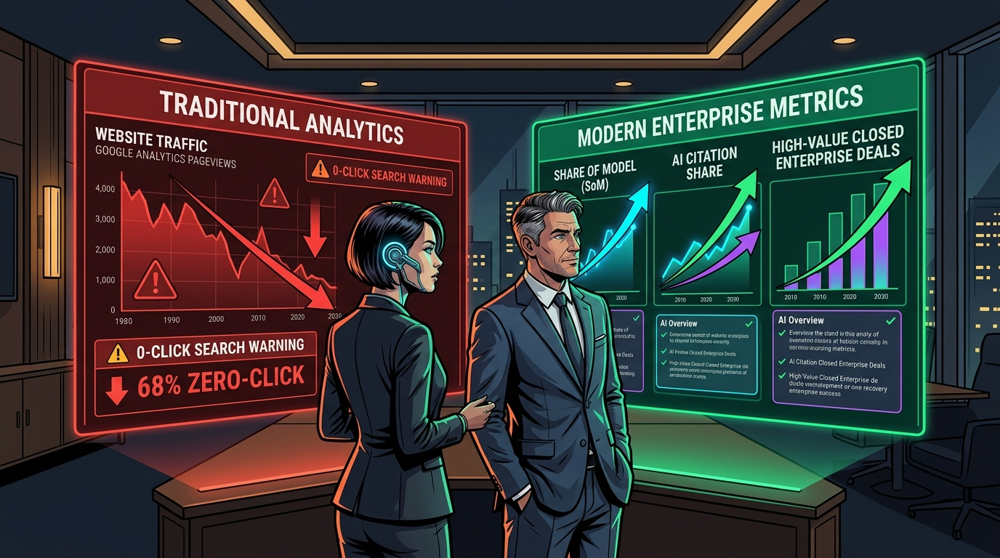
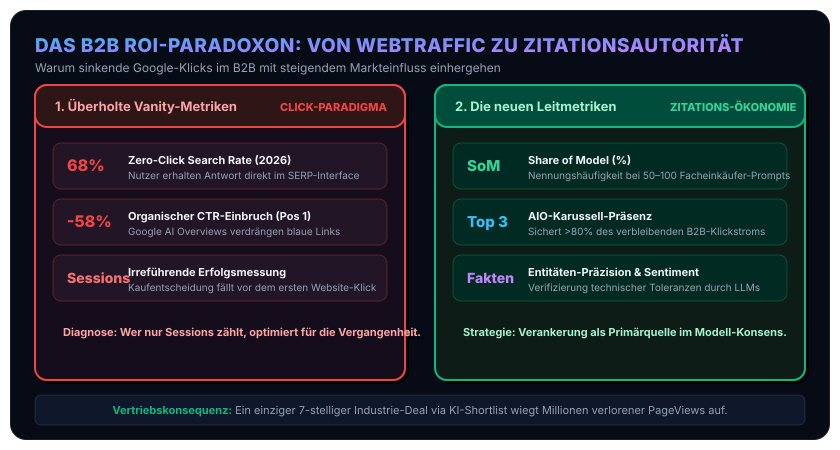

In klassischen Marketing- und Vertriebsberichten des industriellen B2B-Sektors drehte sich das Controlling jahrzehntelang um dieselben Standardkennzahlen: Website-Sitzungen (*Sessions*), Seitenaufrufe (*PageViews*), Klickraten (*CTR*) und Konversionen über digitale Kontaktformulare.

Wer diese Metriken heute im Vorstand präsentiert, erlebt ein beunruhigendes Phänomen: Die traditionellen Website-Klicks stagnieren oder brechen zweistellig ein. Doch der Grund dafür ist keineswegs mangelndes Kundeninteresse, sondern eine fundamentale Strukturverschiebung im Suchverhalten:

* Wie die [empirischen Marktdaten unserer Analyse](/posts/2026_09_11_empirische_daten_geo_aeo_seo_studien) sowie der [SparkToro Zero-Click-Studie (Fishkin et al.)](https://sparktoro.com/blog/2024-zero-click-search-study/) belegen, enden bereits heute über **68% aller Google-Suchanfragen ohne Klick** (*Zero-Click Searches*).
* Werden Google AI Overviews oder Perplexity-Direktantworten ausgespielt, bricht der Klickstrom auf traditionelle organische Spitzenplatzierungen (Position 1) um **58%** ein.
* Einkäufer, Betriebsleiter und Entwicklungsingenieure erhalten ihre Antwort direkt im Interface des Sprachmodells – sie besuchen die Website des Herstellers gar nicht erst.

Für Geschäftsführer und Vertriebsleiter entsteht daraus das **B2B ROI-Paradoxon**: **Der gemessene organische Web-Traffic sinkt, während das Unternehmen in der realen industriellen Beschaffungswelt dennoch massive Marktanteile gewinnen kann – vorausgesetzt, es dominiert die Zitations-Ökonomie.**

## 1. Die Illusion traditioneller Web-Metriken im Maschinenbau

Warum sind Google Analytics und PageViews für technische Investitionsgüter heute weitgehend blind?

### A. Der „Konsum vor Ort“ (In-SERP Decision)
Wenn ein Einkäufer in Perplexity oder ChatGPT Search eingibt: *„Welche Anbieter im süddeutschen Raum fertigen nach ISO 13485 Reinraum-Spritzgussteile mit optischen Toleranzen?“*, listet die KI die drei führenden Spezialisten mitsamt Maschinenparks und Zertifizierungsstatus direkt auf. 
In diesem Augenblick ist die Entscheidung über die Aufnahme in die Ausschreibungs-Shortlist (*Day-One Shortlist*) gefallen. Das Web-Analyse-Tool des Herstellers registriert genau: **null Besuche**.

### B. Entkoppelte Conversion-Pfade
Im B2B-Anlagenbau kauft niemand per Mausklick im Webshop. Die reale Konversion findet Wochen oder Monate später statt – über eine direkte E-Mail an die Geschäftsführung, eine Ausschreibungseinladung oder ein Gespräch auf einer Fachmesse mit den Worten: *„Wir haben in unserer KI-Marktanalyse gesehen, dass Ihre Fertigungslinie diese Toleranzen garantiert.“* 

Wer Optimierungsmaßnahmen ausschließlich an kurzfristigen Klickzahlen misst, schaltet das Marketing genau an der Stelle ab, an der es den größten Hebel entfaltet.

## 2. Die neuen Leitmetriken für die Zitations-Ökonomie

Um den Return on Investment (ROI) von SEO-, GEO- und AEO-Initiativen im industriellen B2B-Umfeld belastbar zu quantifizieren, müssen Controlling und Marketing auf drei neue Steuerungsgrößen umstellen:

### Metrik 1: Share of Model (SoM) / Citation Share
* **Definition**: Wie hoch ist der prozentuale Anteil, zu dem das eigene Unternehmen bei einem definierten Katalog von 50 bis 100 repräsentativen Branchen-Prompts (z. B. typische Einkäuferfragen zu Fertigungsverfahren, Normen und Werkstoffen) in ChatGPT, Perplexity, Claude und Gemini als empfohlene Lösung genannt wird?
* **Messmethodik**: Automatisierte wöchentliche oder monatliche Test-Läufe, die standardisierte Prompts an die LLM-APIs senden und die Nennungshäufigkeit im direkten Vergleich zu den drei Hauptwettbewerbern protokollieren.

### Metrik 2: Entitäten-Präzision & Sentiment-Konsistenz
* **Definition**: Werden die technischen Parameter und Kernkompetenzen von den KI-Modellen sachlich korrekt wiedergegeben?
* **Der kritische Faktor**: Ein Zitat nützt wenig, wenn das Modell auf veraltete Daten zurückgreift und behauptet: *„Firma X fertigt nur bis 500 mm Drehdurchmesser“*, obwohl die Kapazität längst auf 1.200 mm erweitert wurde. Ein kontinuierliches Entitäten-Audit stellt sicher, dass RAG-Modelle die tatsächlichen Leistungsgrenzen abbilden.

### Metrik 3: Top-3-Präsenz im AI-Overview-Karussell
* Wie die [Authoritas-](https://www.authoritas.com/seo-ai-research-whitepapers) und [BrightEdge-Forschungsdaten](https://www.brightedge.com/resources/weekly-ai-search-insights) belegen, binden die ersten drei Zitationskarten in generativen Antwortboxen über **80% des verbleibenden Referral-Traffics**.
* Ziel ist es daher nicht mehr, 50 verschiedene Keywords auf Position 7 zu halten, sondern bei den geschäftskritischen Kerntechnologien in den Top-3-Zitationskarten der generativen Engines verankert zu sein.

### Visuelle Gegenüberstellung: Klick-Paradigma vs. Zitations-Ökonomie

Das folgende Diagramm fasst das ROI-Paradoxon zusammen und stellt überholte Vanity-Metriken den neuen wertschöpfenden Steuerungsgrößen gegenüber:

## 3. Kommerzielle Tools und Implementierungsstrategien

Für das operative Monitoring von Share of Model und Zitationsanteilen stehen heute spezialisierte Lösungen zur Verfügung:

### Enterprise-Plattformen
* **[Profound AI](https://www.tryprofound.com) & [Omnia](https://omnia.ai)**: Führende Plattformen zur kontinuierlichen Überwachung von Zitationsanteilen, Marken-Sentiment und Bot-Crawl-Aktivitäten über alle relevanten Sprachmodelle hinweg.
* **[ZipTie](https://ziptie.dev) & [Peec AI](https://peec.ai)**: Schlanke Werkzeuge für B2B-Teams zum Aufbau eigener Prompt-Kataloge und zum automatisierten Benchmarking gegenüber Wettbewerbern.

### Pragmatischer Einstieg ohne Großbudget
Industrieunternehmen müssen nicht sofort fünfstellige Software-Lizenzen erwerben. 
Der Einstieg gelingt mit einem standardisierten **Golden-Prompt-Set**:
1. Definieren Sie gemeinsam mit dem technischen Vertrieb 20 konkrete Fragen, die ein Neukunde vor einer Ausschreibung stellen würde.
2. Führen Sie diese Prompts monatlich in neutralen Browser-Sessions über ChatGPT Plus, Perplexity Pro und Google Gemini durch.
3. Protokollieren Sie in einer einfachen Matrix: Werden wir genannt? Mit welcher Begründung? Welche Quellen zieht die KI heran?

## 4. Fazit & Kernbotschaft für Vorstände und Vertriebsleiter

Für die strategische Ausrichtung von Industrie- und B2B-Unternehmen lässt sich die wirtschaftliche Konsequenz auf einen prägnanten Grundsatz verdichten:

> *„Wer im B2B-Zeitalter generativer Systeme nur Website-Klicks zählt, optimiert für eine aussterbende Währung. Die neue Leitwährung heißt Zitations-Autorität und Modell-Konsens.“*

Ein einziger siebenstelliger Industrieauftrag, der zustande kommt, weil ein Einkaufs-Bot Ihr Unternehmen auf die Shortlist gesetzt hat, wiegt hunderttausende verlorene Website-Klicks auf. Wer seine Daten heute maschinenlesbar strukturiert, investiert nicht in SEO-Kosmetik, sondern in die digitale Existenzberechtigung seines Vertriebs.
