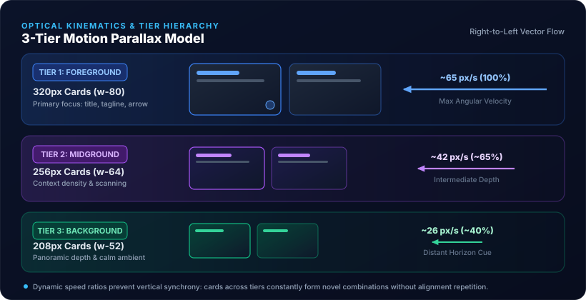
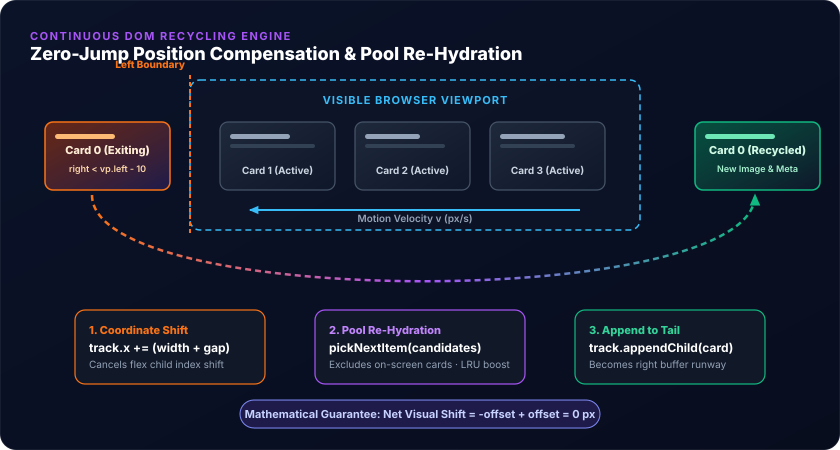

When visitors arrive at a personal technical portfolio or academic website, they are typically greeted by a static hero section followed by a conventional chronological list. While this works well for highlighting the latest few entries, it leaves a vast repository of historical depth unseen. Over the past twenty years, my website has accumulated more than 170 distinct illustrated articles, open-source projects, university course curricula, consulting architectures, interactive physics simulations, and scientific research domains.

Traditional carousels or looping marquees suffer from well-known UX problems: they repeat the same dozen items in an endless loop, ignore what the visitor has already seen, and lack visual depth. 

To solve this, we designed and engineered a **living, 3-tier parallax Content Gallery** directly beneath the homepage hero section. In this post, I want to explore the engineering and mathematical principles behind this component: from optical kinematics and row velocity ratios to zero on-screen duplication guarantees, dynamic archive pooling, and a two-factor probabilistic selection algorithm backed by `localStorage`.

## 1. Kinematics & Visual Hierarchy: Optical Motion Parallax

Rather than creating a single horizontal slider or a uniform grid, the gallery is structured into **three distinct horizontal tiers** moving continuously from right to left. 

In human visual perception, **motion parallax** is a primary depth cue: objects closer to the observer sweep across the visual field at a higher angular velocity than objects situated further away. We applied this principle directly to the layout by coupling **card scale, content fidelity, and linear speed**:

| Tier | Role | Card Dimensions | Base Velocity | Relative Speed | Content Fidelity |
| :--- | :--- | :--- | :--- | :--- | :--- |
| **Row 1** | Foreground | `w-64 sm:w-72 md:w-80` (320px) | ~65 px/s | 100% | Title, Subtitle / Tagline, Directional Hint |
| **Row 2** | Midground | `w-52 sm:w-60 md:w-64` (256px) | ~42 px/s | ~65% | Compact Title, One-line Tagline |
| **Row 3** | Background | `w-40 sm:w-48 md:w-52` (208px) | ~26 px/s | ~40% | Subtle Title only |



### Why this sizing and velocity ratio works
1. **Focus Separation**: Row 1 captures primary attention with generous 16:9 canvas areas, crisp typography, and an interactive hover indicator. Row 2 offers density and scanning speed. Row 3 provides ambient, horizon-like movement that gives the entire viewport a cinematic sense of depth.
2. **Visual Rhythm**: Because each tier travels at a different velocity (~65, ~42, and ~26 px/s), cards in different rows constantly shift relative to each other. Vertically aligned repetitions never form, creating an organic, fluid visual tapestry.
3. **Pure Artwork Aesthetic**: We explicitly removed textual category badges, colored outlines, and decorative emoji icons from the cards. Each card relies on a uniform dark glass border (`border-white/10 light:border-slate-200/80`), subtle hover elevation, and a dark scrim gradient. This ensures the illustrations and technical screenshots take center stage without visual clutter.

## 2. The Conveyor Belt: Zero-Jump Continuous DOM Recycling

Most looping web marquees duplicate their entire DOM tree (e.g., `Sequence A` and `Sequence B`) and run a static CSS `@keyframes transform: translate3d(-50%, 0, 0)` loop. While simple, this approach has fatal limitations:
- It can only ever loop the exact same fixed set of cards.
- It cannot inject fresh content dynamically from a large archive pool.
- Seamlessly updating items mid-flight without jarring visual shifts is notoriously difficult.

To overcome this, we implemented a **continuous client-side DOM conveyor belt** driven by `requestAnimationFrame`.



### The Mathematics of Frictionless Recycling
Each track maintains a virtual horizontal coordinate `track.x`. On every frame, the scroller calculates the delta time $dt$ and moves the track:

$$\text{track.x} \leftarrow \text{track.x} - \text{track.speed} \cdot dt$$

$$\text{track.style.transform} = \text{translate3d}(\text{track.x}, 0, 0)$$

When the first child element of a track has completely scrolled past the left edge of the gallery viewport (`cardRect.right < vpRect.left - 10`):

1. We measure the element's full footprint:
   $$\text{offset} = \text{firstCard.offsetWidth} + \text{track.gap}$$
2. We instantly adjust the track position in the same synchronous frame execution:
   $$\text{track.x} \leftarrow \text{track.x} + \text{offset}$$
3. We select a new content item from our archive pool and re-hydrate the DOM node:
   - Update `href` and `data-id`
   - Update `img.src` and `img.alt`
   - Update `title` and `tagline` text nodes
4. We move the element to the end of the flex container:
   ```javascript
   track.el.appendChild(firstCard);
   ```

Because removing `firstCard` from index 0 shifts the remaining flex children to the left by `offset`, and adding `offset` to `track.x` shifts the entire container to the right by the exact same amount, **the two shifts cancel each other out with mathematical precision ($0\text{ px}$ net change)**. 

To the user's eye, the visible cards continue moving at an uninterrupted 60/120 fps. Meanwhile, the recycled card quietly re-enters from far beyond the right viewport edge displaying an entirely fresh article.

## 3. Dynamic Archive Pooling & Zero On-Screen Duplication

Rather than selecting a dozen arbitrary favorites at build time, our Astro page template aggregates the **entire site archive**:

```typescript
// src/pages/index.astro
const categoryBuckets = [
  postGalleryItems,                      // 120+ illustrated technical articles
  projectGalleryItems,                   // 12 standalone platforms & tools
  courseGalleryItems,                    // 8 university courses
  [...serviceGalleryItems, ...moduleGalleryItems], // Solution architectures
  visualizationGalleryItems,             // Graph network simulations
  interestGalleryItems                   // Core research domains
];
```

Every asset is pre-optimized into WebP format (~640x360) via Astro's `getImage` pipeline and packed into a compact JSON catalog embedded directly into the page (~25 KB).

### The In-Use Set: Eliminating Duplicate Cards
One of the most distracting flaws in multi-track sliders is seeing the exact same article or project appear in two rows at the same time.

Our recycling engine eliminates this by maintaining an **In-Use Set**:

```typescript
// Collect all IDs currently active across all tracks
const inUseIds = new Set<string>();
viewport.querySelectorAll<HTMLElement>('.gallery-card[data-id]').forEach(c => {
  if (c !== firstCard && c.dataset.id) {
    inUseIds.add(c.dataset.id);
  }
});

// Candidate pool strictly excludes anything currently on screen or queued
const candidates = catalog.filter(item => !inUseIds.has(item.id));
```

With approximately 45 total cards distributed across the three tracks and a catalog of over 170 items, the candidate pool always retains more than 120 distinct items. Duplicate cards across rows are mathematically impossible.

## 4. The Two-Factor Probabilistic Selection Engine

How should the engine choose which item to display next when a card is recycled? A purely uniform random selection would be naive:
- It would frequently re-display items the visitor saw just thirty seconds ago.
- It would fail to prioritize newly published research and modern platforms over articles written in 2009.
- It would offer no guarantee that unvisited items are ever discovered.

To resolve this, we engineered a **two-factor weighted probability algorithm**:

$$\text{Weight}_i = f_{\text{pub}}(\text{age}_i) \times f_{\text{display}}(\Delta t_{\text{seen}}, i)$$

### Factor 1: Publication Recency Decay
We want to highlight newer articles while keeping classic foundational posts discoverable. We use a graceful rational decay function:

$$f_{\text{pub}}(\text{age}) = \frac{1}{1 + 0.25 \cdot \text{age}_{\text{years}}}$$

- A post published in **2026** ($\text{age} \approx 0$) receives $f_{\text{pub}} \approx 1.0$.
- An article from **2022** ($\text{age} \approx 4$) receives $f_{\text{pub}} \approx 0.50$.
- A foundational post from **2009** ($\text{age} \approx 17$) receives $f_{\text{pub}} \approx 0.19$.

Recent content is approximately $5\times$ more likely to appear, yet the 2009 archive is never starved.

### Factor 2: LocalStorage LRU Display History
To give the gallery a "memory", the client records impression timestamps in `localStorage` under `gh_gallery_impressions`:

```typescript
let seenLedger: Record<string, number> = loadSeenLedger();
```

When calculating candidate weights, the display factor $f_{\text{display}}$ acts as an intelligent governor:

1. **Unseen Content Boost ($12.0\times$)**: If an item has never been displayed to this user (`!seenLedger[id]`), its weight is multiplied by $12.0$. Unread content is propelled to the front of the queue.
2. **Strict Cooldown Penalty ($0.05\times$)**: If an item was displayed within the last 12 minutes, its weight drops to $0.05$ (a 95% suppression). This ensures an item that just scrolled off the left edge will not reappear a minute later.
3. **Smooth Weight Recovery**: As time passes beyond 12 minutes, the suppression decays linearly back to baseline ($1.0$) over the following 48 minutes:

$$f_{\text{display}} = \min\left(1.0,\; 0.05 + 0.95 \cdot \frac{\Delta t_{\text{min}} - 12}{48}\right)$$

```typescript
function pickNextItem(
  catalog: GalleryItem[],
  inUseIds: Set<string>,
  seenLedger: Record<string, number>
): GalleryItem {
  let candidates = catalog.filter(item => !inUseIds.has(item.id));
  if (candidates.length === 0) candidates = catalog;

  const now = Date.now();
  const weights: number[] = [];
  let totalWeight = 0;

  for (const item of candidates) {
    const ageYears = Math.max(0, (now - item.pubDate) / (1000 * 60 * 60 * 24 * 365.25));
    const contentFactor = 1 / (1 + 0.25 * ageYears);

    const lastSeen = seenLedger[item.id];
    let displayFactor = 1.0;
    if (!lastSeen) {
      displayFactor = 12.0; // Unseen boost
    } else {
      const minutesSinceSeen = (now - lastSeen) / 60000;
      if (minutesSinceSeen < 12) {
        displayFactor = 0.05; // Cooldown
      } else {
        displayFactor = Math.min(1.0, 0.05 + 0.95 * ((minutesSinceSeen - 12) / 48));
      }
    }

    const weight = contentFactor * displayFactor;
    weights.push(weight);
    totalWeight += weight;
  }

  // Weighted roulette wheel selection
  let random = Math.random() * totalWeight;
  for (let i = 0; i < candidates.length; i++) {
    random -= weights[i];
    if (random <= 0 || i === candidates.length - 1) {
      return candidates[i];
    }
  }
  return candidates[0];
}
```

## 5. Performance, Ergonomics, and Accessibility

A continuous visual animation must be respectful of device resources and user control:

1. **Hover & Keyboard Focus Pausing**: Hovering anywhere inside the viewport or navigating cards via `Tab` (`:focus-within`) immediately pauses the animation so users can read descriptions or click links without chasing moving targets.
2. **Accessible Control Button**: An explicit Pause/Resume button with `aria-pressed` states allows users who prefer static layouts to freeze the gallery permanently.
3. **Tab Visibility Throttling**: When the user switches tabs, `document.visibilityState === 'hidden'` suspends the loop. Upon returning, delta time $dt$ is reset to avoid large calculation jumps.
4. **`prefers-reduced-motion` Compliance**: If the user has requested reduced motion in their operating system, the JavaScript loop is bypassed entirely. The CSS switches the tracks into native horizontal snap-scrolling containers:

```css
@media (prefers-reduced-motion: reduce) {
  .gallery-viewport {
    mask-image: none;
    -webkit-mask-image: none;
  }
  .gallery-track {
    transform: none !important;
    overflow-x: auto;
    scroll-snap-type: x mandatory;
    width: 100%;
    padding-inline: 1rem;
  }
  .gallery-card {
    scroll-snap-align: start;
  }
}
```

5. **Edge Masking**: Subtle CSS gradient masks (`mask-image: linear-gradient(to right, transparent 0%, black 5%, black 95%, transparent 100%)`) gracefully feather the cards into the viewport borders on both edges, preventing harsh clipping.

## Conclusion

Modern portfolio and technical websites do not need to choose between static, lifeless layouts and resource-heavy, repetitive 3D canvases. 

By marrying **optical motion kinematics** with a **mathematically seamless DOM recycling loop**, and driving content selection via **client-side LRU display history**, we created a gallery that feels perpetually fresh, never repeats on screen, and brings twenty years of engineering projects into view effortlessly.
