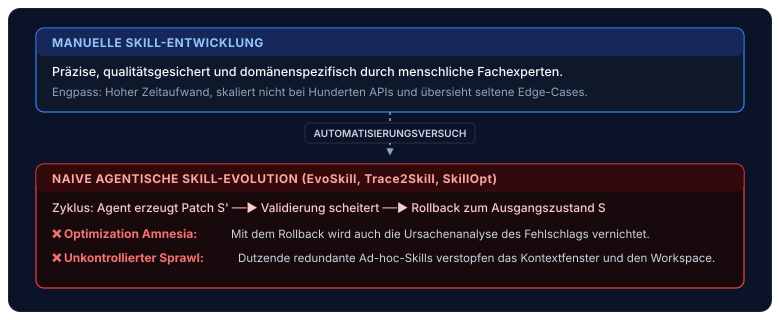
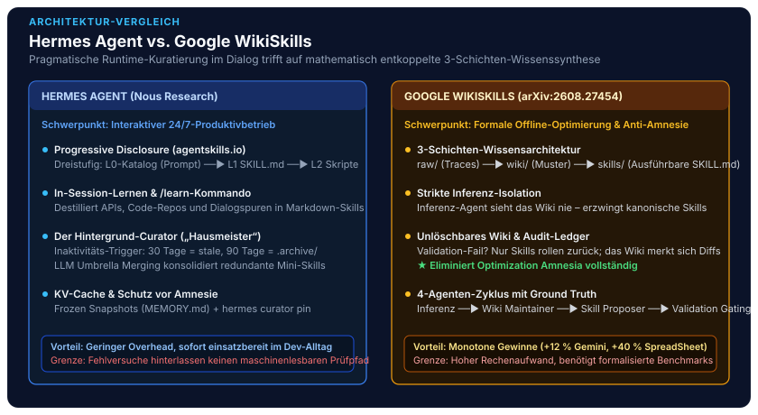
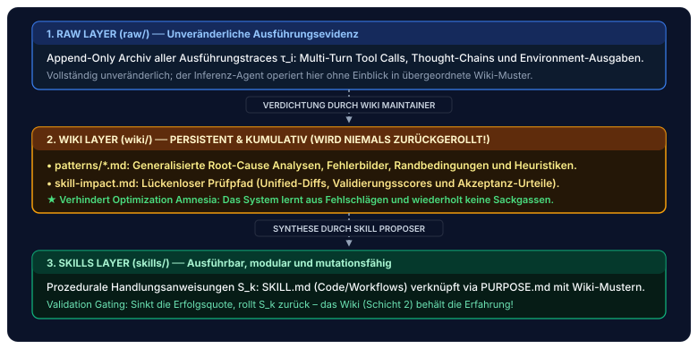
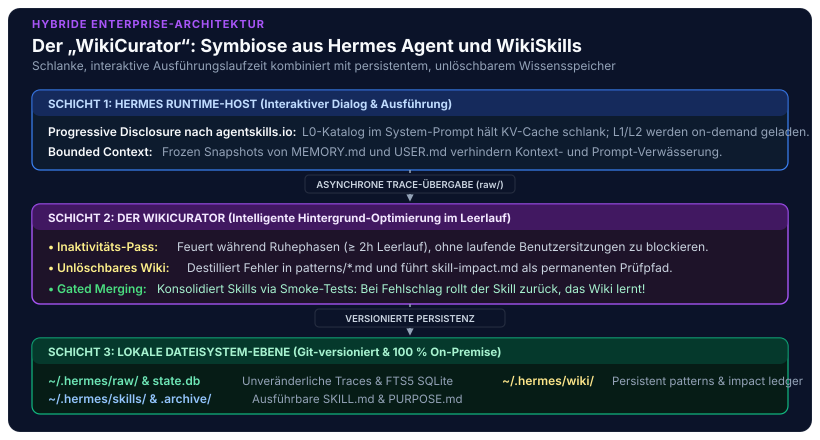

In unserer Beitragsreihe zur Realisierung souveräner Unternehmens-KI haben wir schrittweise die Architektur moderner Agentensysteme beleuchtet: vom [standardisierten Open-Source Agentic AI Tech Stack](/posts/2026_09_03_standardisierter_open_source_agentic_ai_tech_stack/) über das mathematisch fundierte [sitzungsübergreifende Langzeitgedächtnis via Mem0](/posts/2026_09_04_langzeitgedaechtnis_llm_agenten_mem0/), die kollaborative [Interaktionsschicht via Open WebUI](/posts/2026_09_08_open_webui_architektur_und_funktionsweise/), das hochperformante Routing via [LiteLLM](/posts/2026_09_09_litellm_architektur_und_funktionsweise/) bis zur [Enterprise Identity Governance via Keycloak](/posts/2026_09_10_keycloak_architektur_und_funktionsweise/). Bereits in unseren frühen Experimenten zu [lokalen KI-Agenten und zustandsloser Inferenz](/posts/2026_05_31_local_ai_agents_web_llm/) wurde jedoch eine fundamentale Wahrheit deutlich: **Ein Modell ohne kontinuierliche Wissensevolution verharrt auf dem Stand seines Trainingsdaten-Snapshots.**

Während einfache Chatbots rein deklarative Fakten konsumieren, müssen autonome Industrie- und Entwicklungsagenten komplexe, mehrstufige Handlungsroutinen beherrschen – sogenannte **Agent Skills**. Doch wie lernen Agenten neue Fertigkeiten, wie optimieren sie bestehende Werkzeuge und wie verhindern sie, dass sie bei Fehlern in teure Sackgassen laufen?

Genau an dieser Schnittstelle prallen derzeit zwei wegweisende, aber grundverschiedene Philosophien aufeinander:
1. **Der pragmatische Runtime-Ansatz:** Die standardmäßig im **Hermes Agent** von **Nous Research** implementierte Skill-Evolution via In-Session-Synthese, `/learn`-Befehl und dem intelligenten Hintergrund-**Curator**, den wir in unserer [Tiefenanalyse des Hermes Agent](/posts/2026_09_07_hermes_agent_architektur_und_funktionsweise/) vorgestellt haben.
2. **Der rigorose Wissens-Kompilierungsansatz:** Die von **Google Research & Virginia Tech** publizierte **WikiSkill**-Architektur (*Tang et al., August 2026, [arXiv:2608.27454](https://arxiv.org/abs/2608.27454)*) – ein formales wissenschaftliches Forschungsmuster (kein proprietärer Google-Dienst), dessen mathematische Grundlagen und Anti-Amnesie-Konzepte wir in unserer [Untersuchung zur persistenten Wissensevolution](/posts/2026_09_06_wikiskill_persistente_wissensevolution_agent_skills/) analysiert haben.

Dieser Beitrag stellt beide Paradigmen in einen direkten softwaretechnischen Vergleich: Wo liegen die Stärken und Schwächen? Wie gehen beide Systeme mit Fehlern um? Und wie sieht eine praxistaugliche Enterprise-Synthese aus?


## 1. Das Kernproblem: Warum statische Skills nicht ausreichen

Um den Entwurfsraum beider Frameworks zu verstehen, müssen wir uns vor Augen führen, warum klassische Methoden der Modell- und Prompt-Adaption für prozedurale Fähigkeiten versagen.

Traditionell stehen Software-Ingenieuren drei Anpassungsmechanismen zur Verfügung:

1. **Parametrisches Feintuning (SFT / RL):** Das permanente Einschreiben von Tool-Aufrufen in die Gewichte des neuronalen Netzes führt regelmäßig zu *Catastrophic Forgetting*, verwässert das allgemeine Reasoning des Modells und ist bei wöchentlich wechselnden Schnittstellen-Verträgen ökonomisch untragbar.
2. **In-Context Few-Shot Prompting:** Das dynamische Injizieren vergangener Ausführungsspuren (*Traces*) in den System-Prompt führt zu quadratischem Token-Wachstum $\mathcal{O}(T^2 \cdot L)$, bricht den Inferenz-Prefix-Cache (KV-Cache) und leidet unter dem *Lost-in-the-Middle*-Phänomen.
3. **Dateisystembasierte Agent Skills (`SKILL.md`):** Die Kapselung von Handlungsanweisungen, Parametern, Bash-Routinen und Validierungsregeln in modularen Markdown-Dokumenten nach Standards wie [agentskills.io](https://agentskills.io) hat sich als dominierender Industriestandard durchgesetzt.

Doch auch dateibasierte Skills lösen das Evolutionsproblem nicht von selbst:



Hier setzen die beiden Denkschulen an:
* **Hermes Agent** fragt: *„Wie kann ein langlebiger Agent im kontinuierlichen Produktivbetrieb nützliche Skills im Dialog aufschnappen, strukturieren und seinen Arbeitsbereich sauber halten, ohne den Anwender mit Administrationsaufwand zu belasten?“*
* **Google WikiSkill** fragt: *„Wie können wir den Optimierungsprozess mathematisch formalisieren, Schichten-Konflation auflösen und garantieren, dass kein einziger gescheiterter Versuch jemals vergessen wird?“*

## 2. Die Skill Evolution im Hermes Agent (Nous Research)

Die von Nous Research entwickelte Architektur des **Hermes Agent** zeichnet sich durch ihre radikale **Body-Brain-Entkopplung** und ihren Fokus auf reale, interaktive Multi-Surface-Umgebungen aus.



### A. Dateibasierte Kapselung nach `agentskills.io`
Im Hermes Agent sind Fähigkeiten nicht im Code vergraben, sondern liegen als lesbare Verzeichnisse unter `~/.hermes/skills/`. Jedes Verzeichnis enthält eine kanonische `SKILL.md` mit YAML-Frontmatter:

```yaml
name: industrial-plc-modbus-diag
description: Diagnose und Registerabfrage für Modbus-TCP SPS-Steuerungen
version: 1.1.0
metadata:
  hermes:
    tags: [ot, modbus, industrial-systems]
    category: operations
    requires_toolsets: [terminal]
```

Um den KV-Cache und das Kontextfenster zu schonen, folgt das System dem **Progressive-Disclosure-Prinzip**:
* **Level 0 (Discovery):** Im System-Prompt liegt nur ein kompakter JSON-Katalog aller Skill-Namen und Kurzbeschreibungen ($< 60$ Zeichen).
* **Level 1 (Aktivierung):** Erst wenn der Agent eine Aufgabe löst, die den Skill erfordert (oder der Anwender `/industrial-plc-modbus-diag` aufruft), wird der vollständige Inhalt geladen.
* **Level 2 (Deep Dive):** Untergeordnete Skripte (`scripts/`) oder Schnittstellenschemata (`references/`) werden nur bei konkretem Bedarf nachgeladen.

### B. In-Session Evolution und der `/learn`-Befehl
Der Hermes Agent kann Fertigkeiten auf zwei Wegen erlernen und verfeinern:

1. **Autonome In-Session Synthese:** Bewältigt der Agent eine komplexe Aufgabe über eine Abfolge von Werkzeugaufrufen und Zwischenreflexionen erfolgreich, kann er eigenständig `hermes skill create <name>` aufrufen und die erprobte Sequenz als neue `SKILL.md` persistieren.
2. **Kompilierung via `/learn`:** Über den interaktiven Slash-Befehl `/learn` übergibt der Anwender unstrukturierte Quellen (z. B. ein Verzeichnis mit Python-Skripten, API-Swagger-Dateien, PDF-Handbücher oder Support-Notizen). Der Agent analysiert das Material, extrahiert standardisierte Vorbedingungen, Schritt-für-Schritt-Prozeduren und Fehlerbehandlungsroutinen und legt einen sauberen Skill an.

### C. Der Hintergrund-Curator: Lebenszyklus & Anti-Sprawl
Das herausragende Merkmal der Standard-Implementierung ist der **Curator**. Ohne aktives Housekeeping würde ein autonomer Agent nach einigen Wochen an Hunderten redundanter oder veralteter Skills ersticken (*Skill Sprawl*).

Der Curator operiert als intelligenter Inaktivitäts-Pass:
* **Bedingte Ausführung:** Er läuft nur, wenn das Intervall (`interval_hours: 168`, d. h. wöchentlich) abgelaufen ist **und** das Gesamtsystem seit mindestens zwei Stunden ungenutzt im Leerlauf verweilt (`min_idle_hours: 2`). Er blockiert niemals die interaktive Arbeit des Benutzers.
* **Deterministisches Lifecycle-Pruning (Kostenfrei):** Anhand von Metadaten überwacht das System den Nutzungszähler (`use_count`) und den letzten Zugriffszeitstempel:
  * Keine Nutzung in 30 Tagen $\longrightarrow$ Status wird auf `stale` gesetzt.
  * Keine Nutzung in 90 Tagen $\longrightarrow$ Skill wird automatisch in `~/.hermes/skills/.archive/` verschoben.
* **Human-in-the-Loop Sicherungsnetz:** Kritische Kernfähigkeiten können vom Benutzer oder Administrator über `hermes curator pin <name>` dauerhaft geschützt werden. Gepinnte Skills werden niemals automatisch archiviert, bleiben für den Agenten jedoch les- und editierbar.
* **LLM-gestützte Dach-Konsolidierung (*Umbrella Merging*):** Erkennt der Curator semantisch überlappende Einzelfähigkeiten (z. B. `s7-read`, `s7-write` und `s7-alarm`), verschmilzt ein Hintergrund-LLM diese zu einem modularen Dach-Skill `siemens-s7-operations` und führt ein transaktionales Rollback-Ledger (`hermes curator rollback`).

Für experimentelle Forschungszwecke stellt Nous Research ergänzend das Repository `hermes-agent-self-evolution` bereit, das Skills über Offline-Trajektorien via **DSPy** (ein Framework zur algorithmischen Optimierung von LLM-Prompts) und genetische Prompt-Optimierung (**GEPA** – *Genetic Evolutionary Prompt Adaptation*) gegen Test-Rubriken verfeinert.

## 3. Der Google WikiSkills-Ansatz (arXiv:2608.27454)

Während der Hermes Agent als pragmatischer Begleiter für den Live-Betrieb konzipiert ist, nähert sich das Autorenteam um Tang et al. (Google Research & Virginia Tech) dem Problem aus der Perspektive der **formalen Fehlertoleranz und empirischen Optimierungstheorie**.

### A. Das Phänomen der „Optimization Amnesia“
Bisherige automatische Skill-Evolutions-Frameworks (wie *Trace2Skill*, *EvoSkill* oder *SkillOpt*) evaluieren Skill-Modifikationen $S'_k$ auf einem Validierungsdatensatz $\mathcal{D}_{\text{val}}$. Verbessert der Patch die Erfolgsquote $\mathcal{R}(\mathcal{T}_{\text{val}})$, wird er übernommen; verschlechtert er sie, greift das **Validation Gating** und löst einen Rollback auf $S_{k-1}$ aus:

$$a_k = \begin{cases} \text{Accepted}, & \text{falls } \mathcal{R}(\mathcal{T}_{\text{val}, k}) > \mathcal{R}_{\text{best}} \\ \text{Rejected}, & \text{andernfalls} \end{cases}$$

Die verheerende Nebenwirkung klassischer Systeme: **Mit dem Rollback des Skills wird auch die gesamte Fehleranalyse des gescheiterten Versuchs gelöscht!** Das System verfällt in **Optimization Amnesia**. In späteren Runden schlagen nachgelagerte Optimierer dieselben fehlerhaften Modifikationen erneut vor, da sie kein Gedächtnis über vergangene Misserfolge besitzen.

### B. Die Drei-Schichten-Architektur (*Three-Layer Knowledge Architecture*)
Inspiriert von Andrej Karpathys Konzept des *LLM Wiki* entkoppelt WikiSkill rohe Ausführungserfahrungen, kumulatives Wissen und ausführbare Fertigkeiten in drei streng getrennte Ebenen:



### C. Der koordinierte 4-Agenten-Zyklus
Jede Evolutionsrunde $k$ durchläuft vier spezialisierte Rollen:

1. **Inference Agent ($\pi$):** Führt Trainingsaufgaben aus. **Wesentliche architektonische Randbedingung:** Der Inferenz-Agent hat *keinen* Zugriff auf die Wiki-Ebene! Die Ablationsstudien der Autoren belegen: Hätte der Inferenz-Agent Lesezugriff auf das Wiki, würde er Ad-hoc-Workarounds direkt aus dem Wiki anwenden. Dadurch entstünden unvollständige Traces, und der Optimierer erhielte kein klares Signal, welche Regeln zwingend in den kanonischen Skill (`SKILL.md`) gehören.
2. **Wiki Maintainer ($\mathcal{M}_{\text{WM}}$):** Analysiert eine geschichtete Stichprobe aus erfolgreichen und fehlgeschlagenen Traces, isoliert Kausalursachen und aktualisiert die Markdown-Muster unter `wiki/patterns/`.
3. **Skill Proposer ($\mathcal{M}_{\text{P}}$):** Ein ReAct-Agent, der auf Basis des Wikis und des historischen Prüfpfads (`skill-impact.md`) gezielt atomare Skill-Patches formuliert. Da er den gesamten Misserfolgs-Katalog kennt, wiederholt er keine historischen Fehler.
4. **Validation Gating & Rollback Harness:** Evaluiert die neuen Skills $S'_k$. Sinkt der Score, rollt das Harness die Datei `SKILL.md` zurück – hängt die Diff und die Fehlersymptome jedoch **unlöschbar an `wiki/skill-impact.md` an**.

## 4. Direkter Systemvergleich: Gegenüberstellung beider Paradigmen

Die folgende Matrix stellt die beiden Systeme über alle ingenieurtechnisch relevanten Dimensionen gegenüber:

| Vergleichsdimension | Hermes Agent (Nous Research) | Google WikiSkills (arXiv:2608.27454) |
| :--- | :--- | :--- |
| **Primäres Entwurfsziel** | Langlebiger Produktivbegleiter & 24/7-Serverlaufzeit | Formale, automatisierte Offline-Skill-Optimierung |
| **Architektur-Schichten** | **2 Ebenen:** Aktive Skills (`skills/`) + Archiv (`.archive/`) | **3 Schichten:** `raw/` (Traces), `wiki/` (Wissen), `skills/` (Prozedur) |
| **Evolutions-Trigger** | Ereignisgesteuert (`/learn`), Inaktivitäts-Pass (Curator) | Formaler, iterativer 4-Agenten-Trainingsloop |
| **Amnesie-Prävention** | `pin`-Befehl, Archivierung statt Löschung, Git-Commits | **Strukturelles Rollback-Verbot** für die Wiki-Ebene |
| **Dokumentation von Negativwissen** | Implizit im Session-Verlauf & FTS5-Transkriptspeicher | Explizit & maschinenlesbar in `wiki/skill-impact.md` |
| **Token-Ökonomie zur Laufzeit** | **Progressive Disclosure** (Level 0 Index im Prompt $\to$ Level 1/2 Detail bei Abruf) | Vollständige Prompt-Injektion aller aktiven Skills |
| **KV-Cache-Schutz** | **Frozen Snapshots** (`MEMORY.md` & `USER.md` bleiben konstant) | Keine spezifische KV-Cache-Optimierung im Trajektorien-Loop |
| **Human-in-the-Loop** | Voll integriert (CLI, Telegram, Discord, Pinning, Chat) | Vollautomatisch (Test-Harness mit Ground-Truth-Metrik) |
| **Typische Performance-Gewinne** | Kontinuierliche Bereinigung, verhindert Token-Explosion | **Monotone Zuwächse:** Bis zu +12 % Gemini, +40 % SpreadSheet |
| **Ressourcenaufwand** | Minimal (läuft lokal, Pruning ist deterministisch & kostenlos) | Hoch (Multi-Turn Re-Evaluierung vieler Trainingsaufgaben) |

### Detaillierte Analyse der Differenzen

#### 1. Runtime-Pragmatismus vs. Formale Validierung
Der Hermes Agent ist darauf optimiert, *jetzt* mit dem Entwickler zu arbeiten. Wenn ein Ingenieur dem Agenten sagt: *„Nutze für unsere Siemens-SPS ab jetzt immer den DB10-Block für Alarme“*, verarbeitet der Agent dies via `/learn` oder speichert es in `MEMORY.md`. Ein formaler Validierungsdatensatz existiert im Firmenalltag selten.

WikiSkill hingegen verlangt eine formal definierte Testsuite mit Ground-Truth-Labels. Wo diese existiert (wie in standardisierten Datenanalyse-, Mathe- oder API-Workflows), erzielt WikiSkill dramatische Leistungssteigerungen, die kein einfacher Chat-Agent durch Ad-hoc-Prompting erreichen kann:
* **Gemini-3.5-Flash auf LiveMath:** Sprung von **33.0 % auf 72.6 %** (+39.6 Punkte).
* **Gemini-3.5-Flash auf SpreadSheetBench:** Steigerung von **50.5 % auf 76.6 %** (+26.1 Punkte).
* **Qwen-3.6-27B auf SpreadSheetBench:** Steigerung von **28.5 % auf 69.4 %** (+40.9 Punkte).

#### 2. Der Umgang mit Negativwissen (Negative Experience)
Hier liegt die fundamentale softwaretechnische Überlegenheit von WikiSkill: Wenn der Hermes Curator zwei Skills zusammenführt oder ein Benutzer einen Skill manuell anpasst, gibt es keine maschinenlesbare Historie darüber, *welche Codezeile zu welchem API-Timeout geführt hat*. Scheitert ein Versuch im Hermes Agent, wird die Datei geändert – der Grund für das Scheitern verbleibt allenfalls als unstrukturierter Text in den SQLite-FTS5-Transkripten.

WikiSkill trennt die prozedurale Handlungsanweisung (`skills/`) strikt vom diagnostischen Verständnis (`wiki/patterns/`) und dem Prüfpfad (`wiki/skill-impact.md`). Selbst wenn ein vorgeschlagener Skill-Patch krachend scheitert, geht die Lektion nicht verloren: Das Wiki wächst kumulativ, und der Skill Proposer lernt, welche Bibliotheksaufrufe inkompatibel sind.

#### 3. Token-Ökonomie und Prompt-Architektur
Hier wiederum brilliert der Hermes Agent: WikiSkill injiziert in seinen Experimenten alle aktiven Skills vollständig in den Prompt des Inferenz-Agenten. Bei 10 oder 20 komplexen Skills explodiert der Token-Verbrauch vor jedem einzelnen Schritt. 

Hermes Agent beweist mit dem **[agentskills.io](https://agentskills.io)-Standard**, dass echte Enterprise-Skalierung nur über **Progressive Disclosure** funktioniert: Solange ein Skill nicht aktiv adressiert wird, konsumiert er lediglich eine einzige Zeile im Level-0-Katalog (~30 Tokens).

## 5. Die Synthese-Architektur: „WikiCurator“ für souveräne Enterprise-Agenten

Für anspruchsvolle Unternehmensplattformen sollten Architekten die beiden Ansätze nicht als Konkurrenten betrachten, sondern als **zwei Seiten derselben Medaille**.

In unserem Referenzmodell des [standardisierten Open-Source Agentic AI Tech Stacks](/posts/2026_09_03_standardisierter_open_source_agentic_ai_tech_stack/) lässt sich aus beiden Konzepten eine überlegene hybride Architektur formen: **Der „WikiCurator“**.



### Wie der WikiCurator im industriellen Betrieb arbeitet:

1. **Ausführungsschicht (Hermes Agent Body):**
   - Der Agent agiert als leichtgewichtiger, robuster Host-Prozess mit Multi-Surface-Anbindung (Terminal, Open WebUI, Messenger).
   - Skills werden im Format `agentskills.io` mit dreistufigem Progressive Disclosure vorgehalten.
   - Bounded Context (`MEMORY.md` und `USER.md`) garantiert absolute Invarianz des System-Prompt-Prefixes für vLLM- und LiteLLM-KV-Caches.

2. **Diagnose- und Wissensschicht (Wiki-Ebene nach Tang et al.):**
   - Jeder Ausführungs-Turn schreibt seine rohen Traces asynchron in ein lokales Append-Only-Verzeichnis `~/.hermes/raw/`.
   - Der Hintergrund-Curator wird um das **Wiki-Maintainer-Modul** erweitert: Während der nächtlichen Inaktivitätsphasen durchforstet er fehlgeschlagene Werkzeugaufrufe und Tool-Timeouts.
   - Erkenntnisse werden in `~/.hermes/wiki/patterns/` konsolidiert.

3. **Gating & Anti-Amnesia Ledger:**
   - Erstellt der Agent via `/learn` oder im Rahmen einer Konsolidierung neue Fähigkeiten, werden diese gegen eine hinterlegte Smoke-Test-Suite validiert.
   - Scheitert die Validierung, greift der Rollback des Skills – die Diff und der Trace-Report werden jedoch im Prüfpfad `~/.hermes/wiki/skill-impact.md` dauerhaft verewigt.
   - **Ergebnis:** Null Amnesie bei maximaler Token- und Laufzeit-Effizienz!

## Fazit: Die Evolution des Agenten-Gedächtnisses

Die Entwicklung autonomer KI-Agenten vollzieht derzeit denselben Reifeprozess, den die Softwaretechnik vor Jahrzehnten durchlief: von improvisierten Spaghetti-Skripten hin zu modularer Schichtenarchitektur, formalen Schnittstellenverträgen und lückenloser Versionskontrolle.

Die beiden hier analysierten Systeme markieren diesen Wendepunkt:

1. **Nous Research** hat mit dem **Hermes Agent** das Fundament für alltagstaugliche, ressourcenschonende Agenten-Laufzeiten gelegt. Der Background Curator beweist, dass kontinuierliches Housekeeping essenziell ist, um autonome Systeme vor Selbstüberflutung zu schützen.
2. **Google Research** hat mit **WikiSkill** das theoretische Fundament geliefert, um die verhängnisvolle *Optimization Amnesia* zu überwinden. Die Trennung von flüchtigen Traces, persistentem Diagnosewissen und ausführbaren Prozeduren ist das zukunftsweisende Paradigma für alle selbstoptimierenden Systeme.

Unternehmen, die heute souveräne KI-Agenten aufbauen, sollten weder auf die Laufzeit-Pragmatik des Hermes Agent noch auf die Wissensdisziplin von WikiSkill verzichten. Die Zukunft gehört der symbiotischen Verknüpfung beider Welten.

### Weiterführende Ressourcen & Relevante Beiträge

* **Grundlagen & Tech Stack:**
  * [Standardisierter Open-Source Agentic AI Tech Stack: Referenzarchitektur für souveräne Unternehmensanwendungen](/posts/2026_09_03_standardisierter_open_source_agentic_ai_tech_stack/)
  * [Sitzungsübergreifendes Langzeitgedächtnis für LLM-Agenten: Mem0-Architektur und Praxisbewertung](/posts/2026_09_04_langzeitgedaechtnis_llm_agenten_mem0/)
* **Deep Dives zu den Frameworks:**
  * [Persistente Wissensevolution für autonome Agenten: Die WikiSkill-Architektur (arXiv:2608.27454)](/posts/2026_09_06_wikiskill_persistente_wissensevolution_agent_skills/)
  * [Architektur und Funktionsweise des Hermes Agent: Body-Brain-Entkopplung und Curator-Lifecycle](/posts/2026_09_07_hermes_agent_architektur_und_funktionsweise/)
* **Infrastruktur & Enterprise-Integration:**
  * [Human-in-the-Loop Interaktion via Open WebUI](/posts/2026_09_08_open_webui_architektur_und_funktionsweise/)
  * [LiteLLM als universelles KI-Gateway und Inferenz-Router](/posts/2026_09_09_litellm_architektur_und_funktionsweise/)
  * [Enterprise Identity Federation & Token Exchange via Keycloak](/posts/2026_09_10_keycloak_architektur_und_funktionsweise/)
  * [Lokale KI-Agenten im Browser via WebLLM und WebGPU](/posts/2026_05_31_local_ai_agents_web_llm/)

*Möchten Sie adaptive Agenten-Fähigkeiten nach offenen Standards in Ihrer IT-Landschaft etablieren oder Ihre bestehenden LLM-Workflows auf ein persistentes Wissensmanagement umstellen? Entdecken Sie unsere Beratungs- und Implementierungsangebote im Bereich [Artificial Intelligence](/services/ai/) oder vereinbaren Sie einen Architektur-Workshop in unserem Modul [Technology Stack](/services/ai/stack/).*
