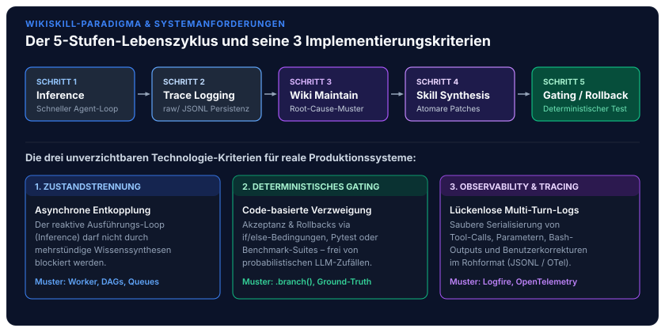
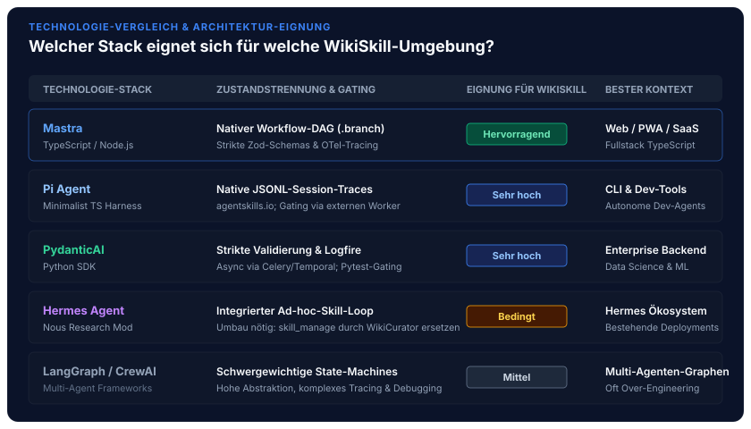

In unserer Beitragsreihe zur softwaretechnischen Realisierung souveräner Agentensysteme haben wir die Bausteine moderner KI-Plattformen schrittweise erschlossen: vom [standardisierten Open-Source Agentic AI Tech Stack](/posts/2026_09_03_standardisierter_open_source_agentic_ai_tech_stack/) über das sitzungsübergreifende [Langzeitgedächtnis via Mem0](/posts/2026_09_04_langzeitgedaechtnis_llm_agenten_mem0/), die kollaborative [Interaktionsschicht via Open WebUI](/posts/2026_09_08_open_webui_architektur_und_funktionsweise/), das hochperformante Routing via [LiteLLM](/posts/2026_09_09_litellm_architektur_und_funktionsweise/) bis zur [Enterprise Identity Governance via Keycloak](/posts/2026_09_10_keycloak_architektur_und_funktionsweise/). Nachdem wir in der theoretischen Fundierung die [persistente Wissensevolution nach Google WikiSkill](/posts/2026_09_06_wikiskill_persistente_wissensevolution_agent_skills/) sowie den [Vergleich zwischen Hermes Agent und WikiSkills](/posts/2026_09_16_skill_evolution_hermes_agent_vs_google_wikiskills/) analysiert haben, stehen Software-Architekten vor der entscheidenden Umsetzungsfrage: **Welche technologische Basis eignet sich am besten, um das WikiSkill-Muster in realen Produktionssystemen verlässlich in Code zu gießen?**

Das von Tang et al. (*Google Research & Virginia Tech, August 2026, [arXiv:2608.27454](https://arxiv.org/abs/2608.27454)*) formalisierte WikiSkill-Paradigma bricht mit improvisierten In-Session-Prompts: Anstatt flüchtige Kontextfenster immer wieder mit Versuch-und-Irrtum-Routinen zu fluten, werden Ausführungserfahrungen asynchron in ein unlöschbares Wissensarchiv kompiliert. Doch Theorie und Praxis klaffen oft auseinander. Wer versucht, dieses 5-Stufen-Muster mit klassischen Chatbot-Frameworks abzubilden, stößt rasch an fundamentale Grenzen.

Dieser Architektur-Leitfaden definiert die unverzichtbaren Systemkriterien für WikiSkill-Runtimes, unterzieht die fünf maßgeblichen Technologie-Stacks einer softwaretechnischen Eignungsprüfung und gibt konkrete Stack-Empfehlungen für Web-, CLI- und Enterprise-Szenarien.


## 1. Die drei fundamentalen Kriterien für WikiSkill-Runtimes

Um den iterativen Evolutionszyklus ($\text{Inference} \rightarrow \text{Trace Logging} \rightarrow \text{Wiki Maintenance} \rightarrow \text{Skill Synthesis} \rightarrow \text{Gating/Rollback}$) stabil und deterministisch zu betreiben, muss die zugrunde liegende Software-Architektur drei Kernkriterien erfüllen. Fehlt auch nur eines dieser Kriterien, bricht die Wissensevolution in sich zusammen.



### Kriterium 1: Zustandstrennung (State Separation & Asynchronie)

Der interaktive Ausführungs-Loop (*Inference Agent*) muss streng von der rechenintensiven Wissenssynthese entkoppelt sein.
* **Das Problem:** Ein Inferenz-Agent muss dem Benutzer oder der aufrufenden Pipeline in Millisekunden antworten können. Würde der Agent während des Dialogs versuchen, Dutzende vergangene Trajektorien zu aggregieren, Ursachenanalysen (*Root-Cause Analyses*) anzustellen oder Testsuiten auszuführen, stünde das System sekunden- oder minutenlang still.
* **Die Anforderung:** Die Runtime muss asynchrone Hintergrund-Worker, Queues oder entkoppelte DAG-Pipelines nativ unterstützen. Der Ausführungs-Loop schreibt lediglich persistente Traces weg, während spezialisierte Hintergrund-Agenten (*Wiki Maintainer*, *Skill Proposer*) erst in Leerlaufphasen aktiv werden.

### Kriterium 2: Deterministisches Gating (Code-basierte Verzweigungslogik)

Die Entscheidung, ob ein neu synthetisierter Skill $S'_k$ in den aktiven Katalog übernommen oder verworfen wird, darf niemals dem Urteil eines Sprachmodells überlassen werden.
* **Das Problem:** LLM-basierte Selbstbewertungen (*LLM-as-a-Judge*) leiden unter Bestätigungsfehlern (*Sycophancy*) und stochastischen Schwankungen. Ein Modell neigt dazu, seine eigenen Code-Vorschläge auch dann für fehlerfrei zu halten, wenn sie fundamentale API-Verträge verletzen.
* **Die Anforderung:** Die Technologie muss verlässliche, programmgesteuerte Verzweigungslogik (`if/else`, deterministische Test-Harnesses, Regressions-Suites, Benchmark-Auswertungen) bereitstellen. Verschlechtert ein Skill-Patch die Ground-Truth-Metrik, muss die Runtime einen deterministischen Rollback auf Dateisystemebene auslösen und den Grund zeitgleich unlöschbar in `wiki/skill-impact.md` festschreiben.

### Kriterium 3: Observability & Trace-Handling

Die Qualität der Wissensbasis im Wiki hängt direkt von der Vollständigkeit und Granularität der erfassten Ausführungsspuren ab.
* **Das Problem:** Schneidet ein Framework Tool-Aufrufe unvollständig mit, kürzt stdout/stderr-Fehlermeldungen ab oder verwirft Benutzerkorrekturen, fehlt dem Wiki Maintainer die kausale Evidenzbasis, um wiederkehrende Fehlermuster (*Failure Modes*) präzise zu diagnostizieren.
* **Die Anforderung:** Sauberes, strukturiertes Logging aller Multi-Turn-Interaktionen – inklusive Tool-Calls, Parametern, Bash-Outputs, Umgebungsvariablen und Benutzerkorrekturen – im maschinenlesbaren Rohformat (z. B. Append-Only JSONL oder OpenTelemetry Spans).

## 2. Der Technologie-Vergleich im Überblick

Auf Basis dieser Kriterien haben wir fünf prominente technologische Grundlagen untersucht, die heute für den Aufbau agentischer Systeme in Betracht gezogen werden:



| Technologische Basis | Kern-Charakteristik | Implementierungs-Aufwand für WikiSkill | Eignung für WikiSkill | Typisches Einsatzfeld |
| :--- | :--- | :--- | :--- | :--- |
| **Mastra (TypeScript)** | Workflow- & Agent-Framework mit nativer Graph-/Branch-Logik und Telemetrie. | **Niedrig bis Mittel:** Gating-Loop lässt sich 1:1 als typisierter DAG-Workflow abbilden. | **Hervorragend** | Moderner Web-Stack, PWAs, interaktive Dashboards & SaaS |
| **Pi Harness (TypeScript)** | Minimalistischer CLI-Coding-Agent (4 Primitiven, JSONL-Session-Logs, Unix-Philosophie). | **Mittel:** Inference ist fertig; Wiki-Maintainer & Gating docken als externe Worker an. | **Sehr hoch** | Terminal-, CLI- und autonome Entwickler-Assistenten |
| **PydanticAI (Python)** | Typisiertes Agenten-SDK mit strikter Schema-Validierung und Logfire-Tracing. | **Mittel:** Exzellent für Schema-Treue, erfordert aber manuelles Orchestrieren der Hintergrund-Jobs. | **Sehr hoch** | Enterprise-Backend, Data-Science & ML-Pipelines |
| **Hermes Agent (Nous)** | Fertiger interaktiver Agent mit integriertem Ad-hoc-Skill-Loop (`agentskills.io`). | **Hoch (Refactoring):** Monolithisches Tool `skill_manage` muss deaktiviert und umgeleitet werden. | **Bedingt** | Bestehende Nous-Research-Installationen & Migrationsprojekte |
| **LangGraph / CrewAI** | Schwergewichtige Multi-Agenten- & Graph-Frameworks. | **Mittel bis Hoch:** Mächtige State-Machines, aber hohe Abstraktionsdichte und Debugging-Overhead. | **Mittel** | Hochkomplexe Multi-Agenten-Netze (oft Over-Engineering für WikiSkill) |

## 3. Detaillierte Bewertung der Technologie-Stacks

### 1. Mastra (TypeScript / Node.js)

Mastra verbindet den flexiblen Agenten-Loop mit einer zustandsbehafteten, deterministischen Workflow-Engine. Anstatt den Kontrollfluss dem Zufall des Sprachmodells zu überlassen, wird der Ablauf programmgesteuert in Code definiert.

#### Vorteile:
* **Native Gating-Primitive:** Das entscheidende WikiSkill-Feature – die deterministische Verzweigung nach Benchmark- und Regressionstests – ist in Mastra über `.step()`, `.then()` und `.branch()` ein elementarer Kernbaustein.
* **End-to-End Type Safety:** Sämtliche Datenstrukturen – von den rohen Tool-Traces über Wiki-Diffs bis hin zu den Skill-Metadaten – lassen sich via Zod typisieren und direkt mit einem TypeScript-Frontend (React, Next.js, Astro) teilen.
* **Integrierte Observability:** System-Traces, Token-Metriken und Tool-Ein-/Ausgaben werden automatisch via OpenTelemetry persistiert und stehen dem Wiki-Maintainer sofort strukturiert zur Verfügung.

```typescript
// Beispiel: Deterministisches WikiSkill-Gating als Mastra-Workflow
import { createWorkflow, createStep } from '@mastra/core';
import { z } from 'zod';

export const wikiSkillEvolutionWorkflow = createWorkflow({
  name: 'wikiskill-evolution',
  triggerSchema: z.object({ traceDirectory: z.string() })
})
  .step(analyzeTracesAndSynthesizeStep)
  .step(runValidationBenchmarkStep)
  .branch({
    // Deterministisches Gating: Keine LLM-Entscheidung!
    condition: (data) => data.validationScore >= data.baselineScore,
    then: acceptAndCommitSkillStep,
    else: rollbackSkillAndLogAuditTrailStep
  });
```

#### Nachteile:
* Jünger als das traditionelle Python-KI-Ökosystem; weniger vorgefertigte wissenschaftliche Evaluierungs-Harnesses out-of-the-box.

#### Bester Kontext:
Entwickler-Teams, die Full-Stack-Webapplikationen, Progressive Web Apps (PWAs) oder SaaS-Produkte bauen und den gesamten Stack von der Benutzeroberfläche bis zum Agenten-Hintergrund in einer einheitlichen, typsicheren TypeScript-Codebasis halten wollen.

### 2. Pi Agent (Minimalistischer TS-Harness)

Pi setzt auf absolute architektonische Reduktion nach der Unix-Philosophie: ein winziger, präziser System-Prompt, vier fundamentale System-Tools (`read`, `write`, `edit`, `bash`) und deterministische Session-Dateien direkt auf der Festplatte.

#### Vorteile:
* **Keine Framework-Magie:** Volle Transparenz über den Prompt- und Tool-Loop; keine versteckten Abstraktionsschichten, die das Debugging erschweren.
* **Native Traces:** Schreibt jede Interaktion als saubere, unkomprimierte JSONL-Datei auf die Festplatte. Ein Hintergrund-Daemon (*Wiki Maintainer*) muss lediglich das Dateisystem überwachen.
* **Natives Skill-Format:** Versteht standardisierte Markdown-Fähigkeiten nach [agentskills.io](https://agentskills.io) von Haus aus und lässt sich ohne Anpassung mit existierenden Werkzeugsammlungen betreiben.

#### Nachteile:
* Stark auf Terminal-, CLI- und lokale Dateisystem-Operationen fokussiert; kein fertiger REST- oder WebSocket-Layer für verteilte Web-Architekturen.

#### Bester Kontext:
Entwicklung von lokalen CLI-Tools, Dev-Assistenten und Coding-Agenten, die direkt auf Entwickler-Maschinen oder CI-Runnern laufen und dort autonom über Tage hinweg lokale Codebase-Eigenheiten lernen sollen.

### 3. PydanticAI (Python)

PydanticAI behandelt Agenten-Logik wie modernes Backend-Engineering: Dependency Injection, Typisierung und strikte Schema-Validierung stehen im Mittelpunkt.

#### Vorteile:
* **Garantierte Datenstrukturen:** Der Wiki Maintainer liefert exakt typisierte Markdown-Abschnitte und strukturierte Fehler-Klassifikationen; Schema-Verletzungen werden über `ModelRetry` automatisch repariert.
* **Nahtlose Python-Integration:** Direkter, müheloser Zugriff auf das wissenschaftliche Evaluierungs-Ökosystem: Pytest für deterministisches Gating, Pandas für Trajektorien-Statistiken und lokale High-Performance-Inferenz-Runtimes wie vLLM und llama.cpp.
* **Modernes Tracing via Logfire:** Lückenlose Erfassung aller Spans und LLM-Aufrufe mit minimalem Konfigurationsaufwand.

#### Nachteile:
* Bringt keine eigene persistente Workflow-Engine für langlebige Hintergrundjobs mit; die Entkopplung zwischen Inference-Loop und nächtlichem Wiki-Maintainer muss über externe Task-Queues (Celery, Redis, Temporal) orchestriert werden.
* Sprachbruch im Fullstack-Umfeld: Wird das Frontend als React/TypeScript-Applikation realisiert, entsteht ein doppelter Modellierungsaufwand zwischen Pydantic-Schemas und TypeScript/Zod-Typen.

#### Bester Kontext:
Klassische Enterprise-Python-Infrastrukturen, Backend-Pipelines und Szenarien, in denen die Validierungsstufe komplexe Data-Science-Berechnungen oder hardwarenahe Simulationen erfordert.

### 4. Hermes Agent (Der monolithische Umbau)

Der im [Hermes Agent von Nous Research](/posts/2026_09_07_hermes_agent_architektur_und_funktionsweise/) implementierte Skill-Loop zeigt eindrucksvoll, wie mächtig Skill-Akkumulation in interaktiven Umgebungen ist – koppelt diese jedoch primär an den Dialogprozess.

#### Vorteile:
* Man sieht sofort, wie ein fertiges System mit Memory, Progressive Disclosure und Werkzeugverwaltung in der Praxis agiert.
* Ausgereiftes Format nach [agentskills.io](https://agentskills.io) mit Level-0-Katalog im System-Prompt.

#### Nachteile & Refactoring-Bedarf:
* Das Standard-Paradigma widerspricht WikiSkill im Kern: Der Agent schreibt seine eigenen Skills via Tool-Call `skill_manage` direkt im Dialog. Dadurch drohen Amnesie und Schichten-Konflation.
* Um WikiSkill auf Basis von Hermes umzusetzen, muss man das interne Werkzeug `skill_manage` entziehen und den Inaktivitäts-Pass des Curators um ein externes Gating-Harness erweitern – ein Arbeiten gegen die Standard-Architektur des Tools, das wir in unserem [WikiCurator-Konzept](/posts/2026_09_16_skill_evolution_hermes_agent_vs_google_wikiskills/) als hybride Schichten-Entkopplung skizziert haben.

#### Bester Kontext:
Nur relevant, wenn man bereits tief im Nous-Research-Ökosystem verankert ist und eine bestehende Hermes-Installation gezielt um einen nachgelagerten Audit- und Validierungslayer erweitern möchte.

### 5. LangGraph & CrewAI (Multi-Agenten-Schwergewichte)

Sowohl LangGraph als auch CrewAI bieten mächtige Abstraktionen zur Modellierung komplexer Multi-Agenten-Netzwerke mit geteiltem Zustand.

#### Vorteile:
* Mächtige graphbasierte Zustandsmaschinen, die theoretisch beliebige Feedback-Schleifen und menschliche Freigaben (*Human-in-the-Loop*) unterstützen.
* Große Community und zahlreiche Vorlagen für Multi-Agenten-Teams.

#### Nachteile:
* **Hohe Abstraktionsdichte:** Das schlanke 3-Schichten-Prinzip von WikiSkill (`raw/` $\rightarrow$ `wiki/` $\rightarrow$ `skills/`) verliert sich in verschachtelten Graph-Nodes, State-Reducern und Channel-Definitionen.
* **Erhöhter Debugging-Overhead:** Wenn Validierungs-Rollbacks fehlschlagen oder State-Snapshots divergieren, erfordert die Fehlersuche tiefes Verständnis der internen Framework-Mechaniken.
* **Over-Engineering:** Für das klar umrissene WikiSkill-Muster sind die generischen Multi-Agenten-Orchestrierer häufig überdimensioniert.

#### Bester Kontext:
Szenarien, in denen die Wissenssynthese Teil eines weitaus größeren, hochkomplexen Multi-Agenten-Verbunds mit Dutzenden dynamisch interagierenden Spezialagenten ist.

## 4. Entscheidungsleitfaden: Welcher Stack für welches Szenario?

Aus der softwaretechnischen Bewertung leiten sich drei klare Empfehlungen für typische Unternehmens- und Entwicklungs-Szenarien ab:

### 1. Das CLI- & System-Szenario: Pi Agent

Wer einen lokalen, hochgradig autonomen Programmier- und System-Agenten benötigt, wählt **Pi Agent**:
* **Architektur-Setup:** Pi läuft direkt auf der Entwicklermaschine oder dem CI-Server. Jede Interaktion schreibt unveränderliche JSONL-Dateien in ein lokales Verzeichnis.
* **Wiki-Integration:** Ein leichtgewichtiger Cronjob oder Hintergrund-Daemon überwacht die JSONL-Dateien, stößt bei Inaktivität die Root-Cause-Analyse an und validiert vorgeschlagene Skill-Patches gegen die lokale Git-Testsuite.
* **Vorteil:** Maximale Transparenz, minimale Abhängigkeiten und null Framework-Overhead.

### 2. Das Data-Science- & Enterprise-Szenario: PydanticAI

Wer tief in der Python-Infrastruktur verwurzelt ist und höchste Anforderungen an Datenvalidierung stellt, setzt auf **PydanticAI**:
* **Architektur-Setup:** Der Inferenz-Agent bedient Fachanwender oder interne APIs. Traces werden via Logfire oder Kafka asynchron in eine Wissensdatenbank gestreamt.
* **Wiki-Integration:** Ein separater Celery- oder Temporal-Worker führt nachts den Wiki-Maintainer- und Skill-Proposer-Zyklus aus. Als deterministisches Gating fungiert eine dedizierte Pytest-Suite, die reale Geschäftsdaten gegen Ground-Truth-Ergebnisse prüft.
* **Vorteil:** Absolute Typ- und Schema-Sicherheit, automatische Reparatur von Synthese-Fehlern via `ModelRetry` und nahtlose Anbindung an lokale Inferenz-Cluster via LiteLLM und vLLM.

### 3. Das moderne Web- & PWA-Szenario: Mastra (Die Architekturempfehlung)

Für Teams, die eine moderne Webapplikation, eine PWA oder ein interaktives SaaS-Dashboard bauen, ist **Mastra der überlegene Stack**:
* **End-to-End-Konsistenz:** Die asynchrone WikiSkill-Schleife lässt sich dank nativer Workflow-Graphen (`.step()`, `.then()`, `.branch()`) ohne zusätzliche Message-Broker oder externe Task-Queues direkt in derselben Anwendung abbilden.
* **Durchgängige Typsicherheit:** Zod-Schemas fließen nahtlos von der Datenbank über die Agenten-Workflows bis in die React-Komponenten des Benutzer-Dashboards.
* **Transparente Observability:** Das Frontend kann dem Benutzer den gesamten Lebenszyklus in Echtzeit visualisieren: von der Roh-Sitzung über die Wiki-Fehleranalyse bis hin zum bestandenen Regressionstest des neuen Skills.

## Fazit: Pragmatische Disziplin statt Framework-Magie

Die Wahl der richtigen technologischen Basis entscheidet darüber, ob die persistente Wissensevolution in der Produktionspraxis gelingt oder an Schichten-Konflation und unzuverlässigem Gating scheitert.

Drei Grundregeln sollten Entwickler und Architekten beherzigen:
1. **Entkoppeln Sie frühzeitig:** Verarbeiten Sie Traces niemals synchron im interaktiven Ausführungs-Loop.
2. **Vertrauen Sie keinem LLM beim Gating:** Nutzen Sie ausschließlich deterministische Code-Verzweigungen und automatisierte Testsuiten für Akzeptanz- und Rollback-Entscheidungen.
3. **Wählen Sie den Stack passend zum Ökosystem:** Mastra für Fullstack-TypeScript und PWAs, Pi für schlanke CLI-Werkzeuge und PydanticAI für datenintensive Enterprise-Python-Umgebungen.

### Weiterführende Ressourcen & Relevante Beiträge

* **Grundlagen & Tech Stack:**
  * [Standardisierter Open-Source Agentic AI Tech Stack: Referenzarchitektur für souveräne Unternehmensanwendungen](/posts/2026_09_03_standardisierter_open_source_agentic_ai_tech_stack/)
  * [Sitzungsübergreifendes Langzeitgedächtnis für LLM-Agenten: Mem0-Architektur und Praxisbewertung](/posts/2026_09_04_langzeitgedaechtnis_llm_agenten_mem0/)
* **Deep Dives zu den Frameworks & Konzepten:**
  * [Persistente Wissensevolution für autonome Agenten: Die WikiSkill-Architektur (arXiv:2608.27454)](/posts/2026_09_06_wikiskill_persistente_wissensevolution_agent_skills/)
  * [Architektur und Funktionsweise des Hermes Agent: Body-Brain-Entkopplung und Curator-Lifecycle](/posts/2026_09_07_hermes_agent_architektur_und_funktionsweise/)
  * [Skill Evolution im Vergleich: Hermes Agent vs. Google WikiSkills (Das WikiCurator-Muster)](/posts/2026_09_16_skill_evolution_hermes_agent_vs_google_wikiskills/)
* **Infrastruktur & Enterprise-Integration:**
  * [Human-in-the-Loop Interaktion via Open WebUI](/posts/2026_09_08_open_webui_architektur_und_funktionsweise/)
  * [LiteLLM als universelles KI-Gateway und Inferenz-Router](/posts/2026_09_09_litellm_architektur_und_funktionsweise/)
  * [Enterprise Identity Federation & Token Exchange via Keycloak](/posts/2026_09_10_keycloak_architektur_und_funktionsweise/)
  * [Lokale KI-Agenten im Browser via WebLLM und WebGPU](/posts/2026_05_31_local_ai_agents_web_llm/)

*Möchten Sie eine maßgeschneiderte Agentic-AI-Architektur auf Basis von Mastra, PydanticAI oder WikiSkill in Ihrer Organisation aufbauen oder bestehende Tool-Ketten auf eine persistente Wissensevolution umstellen? Entdecken Sie unsere Beratungs- und Implementierungsangebote im Bereich [Artificial Intelligence](/services/ai/) oder vereinbaren Sie einen Architektur-Workshop in unserem Modul [Technology Stack](/services/ai/stack/).*
