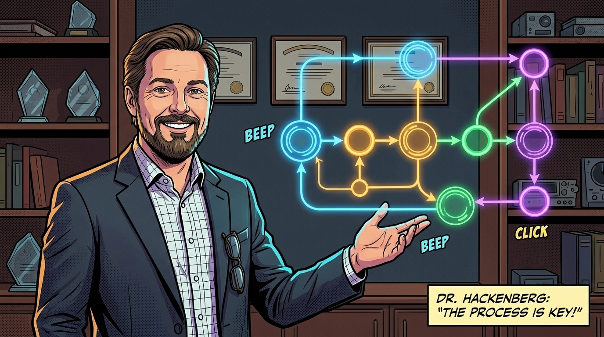
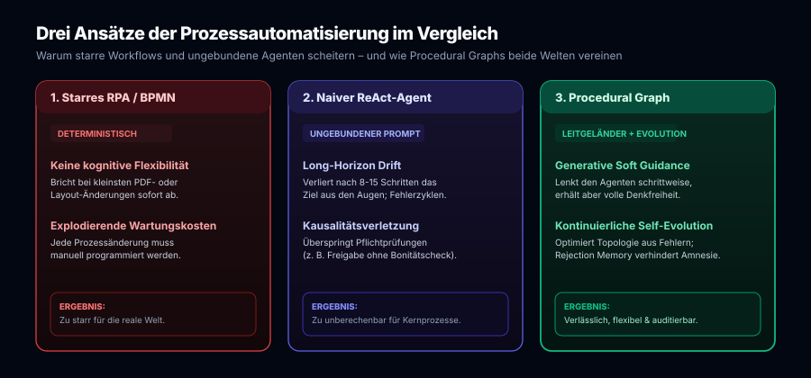
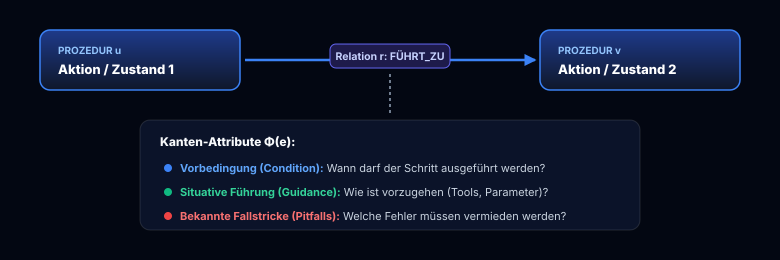
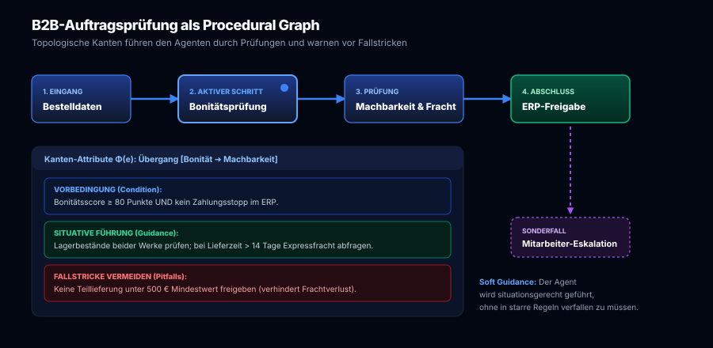
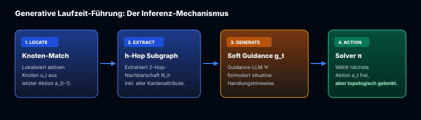
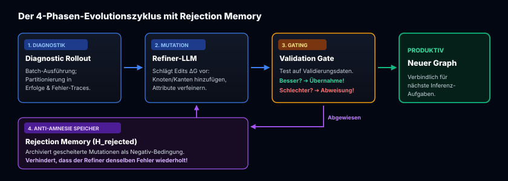
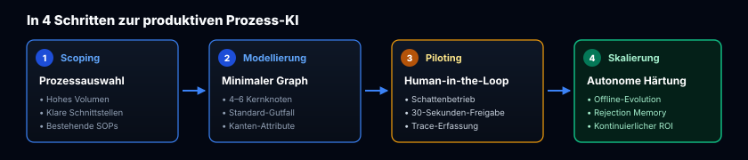

In unserer Beitragsreihe zur praktischen Umsetzung der AI-Transformation in Unternehmen haben wir die technologischen Fundamente moderner Agentensysteme von Grund auf erschlossen: vom [standardisierten Open-Source Agentic AI Tech Stack](/posts/2026_09_03_standardisierter_open_source_agentic_ai_tech_stack/) über das sitzungsübergreifende [Langzeitgedächtnis via Mem0](/posts/2026_09_04_langzeitgedaechtnis_llm_agenten_mem0/), die kollaborative [Interaktionsschicht via Open WebUI](/posts/2026_09_08_open_webui_architektur_und_funktionsweise/) und das hochperformante [Routing via LiteLLM](/posts/2026_09_09_litellm_architektur_und_funktionsweise/) bis zur [Enterprise Identity Governance via Keycloak](/posts/2026_09_10_keycloak_architektur_und_funktionsweise/). 

Auch bei der Handhabung prozeduraler Fähigkeiten (*Agent Skills*) haben wir die Entwicklung intensiv begleitet: von der theoretischen Entkopplung in [Google WikiSkills](/posts/2026_09_06_wikiskill_persistente_wissensevolution_agent_skills/) über den direkten [Architekturvergleich zwischen Nous Research Hermes Agent und WikiSkills](/posts/2026_09_16_skill_evolution_hermes_agent_vs_google_wikiskills/) bis hin zum [Technologie-Leitfaden für Skill-Runtimes](/posts/2026_09_17_architektur_leitfaden_technologische_basis_google_wikiskill/).

Doch wenn es um die **konkrete Einführung von KI-Lösungen in Unternehmen unterschiedlichster Branchen** geht – vom klassischen Maschinen- und Anlagenbau über den technischen Großhandel bis hin zu Logistik, Finanzdienstleistung und Verwaltung –, stoßen Geschäftsführer, CIOs und Prozessverantwortliche regelmäßig auf dieselbe ernüchternde Hürde: **Die PoC-Falle.**

Über 80 % der unternehmensinternen Agenten-Pilotprojekte schaffen nicht den Sprung in den produktiven Dauereinsatz. Der Grund liegt selten an mangelnder Modellleistung, sondern an der Natur **repetitiver Geschäftsprozesse**: Diese Vorgänge dulden keine Halluzinationen, keine vergessenen Freigaben und keinen Kontrollverlust.

Mit dem bahnbrechenden Forschungspapier **„Procedural Graphs: Self-Evolving Execution Structures for LLM Agents“** (*Yuxing Lu, Yicheng Chen, Shanchan Wu, Sercan Ö. Arık – Google Cloud AI Research, September 2026, [arXiv:2609.09153](https://arxiv.org/abs/2609.09153)*) liegt nun die architektonische Antwort vor, auf die die Unternehmenspraxis gewartet hat.

Dieser Artikel analysiert das Framework aus Sicht der betrieblichen AI-Transformation: Welches systemische Problem löst der Ansatz? Wie funktionieren Procedural Graphs mathematisch und operativ? Und wie gelingt es damit, repetitive Routineaufgaben wirtschaftlich, fehlertolerant und mitarbeiterorientiert zu automatisieren?

## 1. Das Dilemma der AI-Transformation bei repetitiven Prozessen

Der Kern einer jeden gewinnbringenden AI-Transformation besteht darin, **wiederkehrende, regelbasierte, aber wissensintensive Routinearbeiten zu automatisieren**. Ziel ist es nicht, Mitarbeiter zu ersetzen, sondern sie von fehleranfälliger administrativer „Datenschaufelei“ zwischen E-Mails, PDF-Formularen, ERP-Masken und Tabellen zu befreien.

Typische Beispiele aus der Unternehmenspraxis finden sich in nahezu jeder Abteilung:
* **Technischer Vertrieb & Innendienst:** Prüfung eingehender Bestellanfragen gegen ERP-Stammdaten, Machbarkeitsprüfung von Lieferzeiten, Validierung von Kundenrabatten und Freigabeerstellung.
* **Einkauf & Beschaffung:** Mehrstufiger Abgleich von Lieferantenangeboten, Prüfung von Staffelpreisen, Einhaltung von Rahmenverträgen und Erstellung von Bestellobligos.
* **Qualitätsmanagement & Reklamation:** Validierung von Schadensmeldungen, Abfrage von Prüfprotokollen, Einordnung in Fehlerklassen und Einleitung von Rückruf- oder Gutschriftprozessen.
* **Finanzwesen & Compliance:** Abgleich von Eingangsrechnungen mit Bestelldaten und Lieferscheinen (*3-Way-Matching*), Prüfung steuerlicher Pflichtangaben und automatisierte Zahlungsfreigabe.

Bislang scheiterte die wirtschaftliche Automatisierung solcher Abläufe an zwei unbefriedigenden Extremen:

### Extrem 1: Das starre Korsett klassischer RPA- und BPMN-Systeme
Robotic Process Automation (RPA) und fest verdrahtete Workflows (BPMN / State Machines) sind vollständig deterministisch programmiert. 
* **Das Problem:** Sobald ein Kunde eine Bestellnummer im E-Mail-Freitext statt im Formularfeld übermittelt, ein PDF ein anderes Layout aufweist oder eine unerwartete Fehlermeldung im ERP-System auftritt, bricht der Workflow abrupt ab.
* **Die wirtschaftliche Folge:** Unternehmen müssen Heere von externen Integratoren oder IT-Spezialisten beschäftigen, um Skripte permanent anzupassen. Die erhoffte Kosten- und Zeitersparnis wird durch exorbitante Wartungskosten aufgefressen.

### Extrem 2: Das unberechenbare „Wild West“ naiver ReAct-Agenten
Auf der anderen Seite versuchten viele Vorreiter, modernste Sprachmodelle in ungebundenen ReAct-Schleifen (*Reasoning + Acting*) auf Unternehmensdaten loszulassen.
* **Das Problem:** Bei kurzen Aufgaben mit zwei bis drei Schritten glänzen diese Agenten. Bei **Long-Horizon-Prozessen** mit 10 bis 25 aufeinander aufbauenden Prüf- und Schnittstellenaktionen tritt jedoch unweigerlich das Phänomen des **Long-Horizon Drift** auf:
  1. *Vergessen von Vorgaben:* Der Agent verliert im wachsenden Token-Kontext das Gesamtziel aus den Augen.
  2. *Verletzung von Prozesskausalitäten:* Er ruft Aktionen in falscher Reihenfolge auf – beispielsweise generiert er eine Auftragsbestätigung, *bevor* die Bonitäts- oder Margenprüfung abgeschlossen ist.
  3. *Repetitive Schleifen:* Bei unvorhergesehenen Tool-Rückmeldungen verharrt der Agent in Endlosschleifen und verbraucht unnötig Token-Budget.
* **Die wirtschaftliche Folge:** Kein verantwortungsvoller Geschäftsführer oder Abteilungsleiter kann einem System die Freigabe erteilen, dessen Ausführungsschritte stochastisch schwanken und haftungsrelevante Compliance-Richtlinien verletzen können.

Genau hier setzt das Konzept der **Procedural Graphs** an: Es bietet ein **formales, topologisches Leitgeländer**, ohne dem Sprachmodell seine situative Denk- und Interpretationsfähigkeit zu rauben.

## 2. Was ist ein Procedural Graph? Standard Operating Procedures als Wissensnetz

Klassische Wissensgraphen (*Knowledge Graphs*) haben die strukturierte Datenhaltung revolutioniert, indem sie deklaratives Faktenwissen zur Beantwortung von *„Was ist ...?“*-Fragen in standardisierte Tripletts organisieren:
$$\text{(Entität, Relation, Entität)} \quad \text{z. B.} \quad (\text{Kunde\_4711}, \text{HAT\_KREDITLIMIT}, 50.000\,\text{EUR})$$

Das Autorenteam von Google Research überträgt dieses mächtige Prinzip nun auf die prozedurale Handlungsebene (*„Was ist als Nächstes zu tun?“*): Ein **Procedural Graph (PG)** ist ein gerichteter, attributierter Graph $\mathcal{G} = (\mathcal{V}, \mathcal{R}, \mathcal{E}, \Phi)$, der das Prozesswissen eines Unternehmens abbildet:
* $\mathcal{V}$ ist die Menge der **abstrakten Prozedur-Knoten**: Ein Knoten repräsentiert einen Geschäftsschritt, einen Tool-Aufruf (ERP, CRM, Mail-Gateway), eine Prüfroutine oder einen Task-Status.
* $\mathcal{R}$ ist das Vokabular der **Übergangsrelationen** (z. B. `FÜHRT_ZU`, `ERFORDERT_PRÜFUNG`, `ESKALIERT_AN`).
* $\mathcal{E}$ ist die Menge der **gerichteten Tripletts** $e = (u, r, v) \in \mathcal{E}$, die festlegen, dass Prozedur $v$ nach Prozedur $u$ unter der Relation $r$ zulässig ist.
* $\Phi$ ist das **Attribut-Mapping**, das jeder Kante ein dreiteiliges Regelwerk zuweist:
  $$\Phi(e) = (\text{condition}, \text{guidance}, \text{pitfalls})$$

### Die Anatomie einer betrieblichen Kante am B2B-Praxisbeispiel
Betrachten wir den Übergang zwischen einer Bonitätsprüfung und der technischen Machbarkeitsprüfung im B2B-Vertrieb:

1. **Vorbedingung (`condition`):**
   > *„Wird nur durchlaufen, wenn der Bonitätsscore $\ge 80$ Punkte beträgt UND im ERP kein Mahnstopp für den Kunden hinterlegt ist.“*
2. **Situative Führung (`guidance`):**
   > *„Frage bei Standardartikeln die Lagerbestände in Werk 1 und Werk 2 ab. Liegt die Gesamtlieferzeit über 14 Arbeitstagen, frage automatisch die Express-Frachtkonditionen über die Speditions-API ab.“*
3. **Bekannte Fallstricke (`pitfalls`):**
   > *„Bestätige unter keinen Umständen Teillieferungen unter dem Mindestauftragswert von 500 EUR, um ungedeckte Frachtnebenkosten zu verhindern.“*

Der unschätzbare Vorteil für Unternehmen: **Das Prozesswissen ist nicht in intransparenten neuronalen Gewichten oder kryptischem Spaghetti-Code vergraben.** Es liegt als lesbarer, visuell auditierbarer Graph vor, den Fachbereichsleiter, Compliance-Beauftragte und Prozessmanager direkt verstehen, diskutieren und validieren können.

## 3. Laufzeit-Führung: Höchste Qualität durch „Soft Guidance“ statt BPMN-Zwang

Das größte Missverständnis bei Workflow-Engines ist der Glaube, dass Regeln zwingend als harte, programmierte Verzweigungen (`if-then-else`) ausgeführt werden müssen. Sobald die reale Welt von der Norm abweicht, führen harte Verzweigungen zum Systemstillstand.

Procedural Graphs wählen einen völlig anderen, eleganteren Weg: **Generative Procedural Guidance zur Inferenzzeit.**

Das Zusammenspiel erfolgt in drei präzisen Einzelschritten:

### Schritt 1: Lokalisierung (*Locate*)
Anhand der letzten durchgeführten Aktion $a_{t-1}$ lokalisiert das System exakt, an welchem Knoten $u_t \in \mathcal{V}$ sich der Agent im Prozess befindet.

### Schritt 2: Topologische Extraktion (*Extract*)
Statt einer naiven Vektorsuche (Top-$k$-RAG), die semantisch ähnliche Textbausteine isoliert zusammenklaubt und dabei kausale Zusammenhänge zerschneidet, extrahiert das Framework die **gerichtete $h$-Hop-Nachbarschaft** $\mathcal{N}_h(u_t)$ (im Paper standardmäßig $h = 2$). Der Agent blickt also genau zwei logische Prozessschritte in die Zukunft.

### Schritt 3: Generierung situativer Führung (*Generate*)
Ein schlankes Guidance-Sprachmodell $\Psi$ übersetzt die topologischen Kantenattribute $\Phi(e)$ und das jüngste Ausführungsfenster $\mathcal{T}_{t-w:t}$ ($w = 3$) in eine prägnante, schrittbezogene Handlungsanweisung $g_t$:
$$g_t = \Psi(q, \mathcal{T}_{t-w:t}, \mathcal{N}_h(u_t))$$

Der eigentliche Problemlöser (*Task Solver*) wählt seine nächste Aktion $a_t$ anschließend unter Berücksichtigung dieser Führung:
$$a_t \sim \pi(a \mid q, \mathcal{T}_t, g_t)$$

### Warum „Soft Guidance“ den ROI rettet
Dieser Ansatz verbindet das Beste aus zwei Welten:
* **Garantierte Leitplanken:** Die Kantenattribute weisen den Agenten unmissverständlich darauf hin, welche Voraussetzungen erfüllt sein müssen und welche Fehler tunlichst zu vermeiden sind.
* **Volle kognitive Agilität:** Der Agent wird nicht starr bevormundet. Trifft eine Kundenanfrage ein, die sprachlich uneindeutig ist oder zwei Optionen gleichzeitig berührt, kann das Modell dank seines allgemeinen Reasonings intelligent reagieren, Rückfragen stellen oder geschickt interpolieren – stets abgesichert durch das topologische Geländer.

## 4. Selbstlernende Prozesse: Evolution ohne Entwickler-Dauereinsatz

Geschäftsprozesse in dynamischen Unternehmen sind niemals statisch. Lieferanten ändern Schnittstellen, Compliance-Vorgaben werden verschärft, und im Tagesgeschäft tauchen Sonderfälle auf, die im ursprünglichen Prozesshandbuch schlicht vergessen wurden.

Klassische Automatisierungslösungen scheitern hier an den enormen Änderungskosten. Das Google-Framework löst dieses Problem durch einen **Offline-Self-Evolution-Loop**, der Prozessgraphen auf Basis realer Ausführungsprotokolle kontinuierlich verfeinert.

### Der Durchbruch gegen „Optimization Amnesia“
In unserem früheren Beitrag zu [Google WikiSkills](/posts/2026_09_06_wikiskill_persistente_wissensevolution_agent_skills/) haben wir das Kernproblem bisheriger Optimierer analysiert: die **Optimization Amnesia**. Wenn ein Modifikationsvorschlag im Validation Gate durchfällt, rollt das System zurück – und vergisst augenblicklich, *warum* der Eingriff gescheitert ist. In späteren Runden schlagen naive Optimierer denselben Fehler immer wieder vor (*Recurrent Blind Alleys*).

Procedural Graphs lösen dieses Dilemma über eine dedizierte **Rejection Memory** $\mathcal{H}_{\text{rejected}}$:
$$\Delta \mathcal{G}_{k+1} \sim \mathcal{M}_{\text{refine}}(\mathcal{G}_{k}, \mathcal{C}_{k+1}, \mathcal{H}_{\text{rejected}})$$

Wird ein Graph-Kandidat vom Validation Gate abgewiesen, werden die vorgeschlagenen Kantenänderungen zusammen mit den Fehlersymptomen dauerhaft im Gedächtnis verankert. In der nächsten Optimierungsrunde dient dieser Fundus als explizite Negativ-Bedingung.

### Heilung lückenhafter Experten-Priors
Ein herausragendes empirisches Ergebnis des Papers (Abschnitt 5.3 und 5.4) ist von unschätzbarem Wert für die Praxis:
* **Start von Null möglich:** Unternehmen müssen vor dem Start kein perfektes 100-seitiges Prozesshandbuch besitzen. Startet man mit einem minimalen Skelett (*Minimal Skeleton Prior*), baut der Evolutions-Loop im Betrieb eigenständig einen Prozessgraphen auf, der handoptimierte Experten-Workflows erreicht oder übertrifft.
* **Reparatur fehlerhafter Vorgaben:** Wurde ein Prozess von menschlichen Experten lückenhaft oder mit fehlerhaften Heuristiken aufgesetzt (*Flawed Expert Prior*), erkennt der Refiner die systematischen Abbrüche in den Trajektorien, kappt fehlerhafte Kanten und fügt die fehlenden Validierungsschritte autonom ein.

## 5. Wirtschaftliche Relevanz: Was bedeuten die Benchmarks für Unternehmen?

Die im Paper dokumentierten empirischen Ergebnisse über sieben Benchmarks und vier führende Modellfamilien (Claude Sonnet 4.6, Gemini 3.1 Pro, Gemini 3.5 Flash, Grok 4.1 Fast) liefern handfeste Argumente für den Business Case.

Besonders zwei Benchmarks spiegeln reale betriebswirtschaftliche Herausforderungen wider:

### 1. EnterpriseArena: Stresstest für komplexe Unternehmensentscheidungen
Der Benchmark **`EnterpriseArena`** (*Han et al., 2026*) simuliert mehrperiodige, betriebswirtschaftliche Entscheidungen unter unvollständigen Informationen, verzögerten Marktrückmeldungen und unvorhergesehenen makroökonomischen Schocks (z. B. plötzliche Zinsänderungen oder Lieferkettenunterbrechungen).
* **Die Realität ungebundener Agenten:** Standard-ReAct-Agenten scheitern hier dramatisch: Bei Krisen treffen sie panische, unkoordinierte Fehlentscheidungen, verfehlen Liquiditätsreserven und führen simulierte Unternehmen in die Zahlungsunfähigkeit.
* **Die Überlegenheit von Procedural Graphs:** Durch die topologische Strukturierung behält der Agent auch nach Dutzenden Zyklen seine strategische Orientierung. Kanten mit expliziten Attributen (`condition: projected runway falls below safety buffer; pitfalls: do not stack a second request while one is pending`) verhindern fatale Fehlallokationen zuverlässig.

### 2. BFCL (Berkeley Function Calling Leaderboard): API-Präzision im Schnittstellen-Dschungel
Im Unternehmensalltag muss ein Agent fehlerfrei mit ERP-Systemen (SAP, Microsoft Dynamics), CRMs (Salesforce) und SQL-Datenbanken kommunizieren. Ein einziger syntaktischer oder logischer API-Fehlaufruf führt zum Prozessabbruch.
* Im BFCL-v3-Benchmark erzielte Procedural Graphs mit **Gemini 3.5 Flash einen Sprung von 58,00 % auf 67,00 % (+9,00 Prozentpunkte)** gegenüber der stärksten Baseline.
* Gegenüber dem ungebundenen ReAct-Standard verringerte sich die Rate an Schnittstellen- und Formatierungsfehlern drastisch, da Kantenattribute als permanenter Parser- und Typisierungs-Filter fungieren.

### Die 3 Hebel für den Return on Investment (ROI)

| ROI-Dimension | Vorher (Manuell / RPA / Naiver Agent) | Mit Procedural Graphs | Betriebswirtschaftlicher Nutzen |
| :--- | :--- | :--- | :--- |
| **Durchlaufzeit (Speed)** | Stunden bis Tage (Liegezeiten auf Mitarbeiter-Schreibtischen) | Sekunden bis wenige Minuten (Echtzeit-Durchlauf) | Schnellere Reaktionszeiten im Vertrieb, höhere Kundenzufriedenheit, schnellere Fakturierung. |
| **Fehlerkosten (Quality)** | 3–8 % manuelle Übertragungs- und Flüchtigkeitsfehler | Nahezu 0 % bei Standardfällen; automatische Eskalation bei Unklarheiten | Vermeidung von Falschlieferungen, Frachtverlusten und vertraglichen Pönalen. |
| **Mitarbeiterbindung (Value)** | Hohe Frustration durch stumpfes Copy-Paste und Formularprüfungen | Konzentration auf Kundenbeziehungen, Verhandlungen und komplexe Sonderfälle | Reduktion von Fluktuation und Krankenständen; Steigerung der Arbeitgeberattraktivität. |

## 6. Strategischer Leitfaden für Führungskräfte: In 4 Schritten zur produktiven Prozess-KI

Wie sollten Geschäftsführer, Abteilungsleiter und IT-Architekten vorgehen, um die Potenziale von Procedural Graphs in der eigenen Organisation pragmatisch zu heben?

### Schritt 1: Identifikation des richtigen Pilotprozesses (*Prozess-Scoping*)
Wählen Sie für den Start weder den simpelsten noch den komplexesten Ausnahme-Prozess. Ideal sind Vorgänge mit:
* hohem wöchentlichem Volumen ($> 100$ Vorgänge),
* klar definierten Datenquellen (z. B. E-Mail-Postfach, ERP-Kundenstamm, Excel-Preislisten),
* bestehenden, schriftlichen Arbeitsanweisungen (SOPs).

### Schritt 2: Modellierung des minimalen Startgraphen (*Minimal Prior*)
Setzen Sie sich mit den Fachexperten zusammen und gießen Sie den Standard-Gutfall in 4 bis 6 Kernknoten. Formulieren Sie die Kantenattribute in natürlicher Sprache: Welche Bedingungen müssen zwingend vorliegen? Welche typischen Fehler passieren neuen Mitarbeitern in der Einarbeitung (`pitfalls`)?

### Schritt 3: Paralleler Schattenbetrieb (*Human-in-the-Loop*)
Lassen Sie den Agenten im ersten Monat parallel zu den Mitarbeitern laufen:
* Der Agent bereitet die Prüfung vor, ermittelt Bestände und entwirft das Ergebnis (z. B. das fertige Angebot im ERP-Entwurf).
* Der erfahrene Mitarbeiter wirft einen 30-Sekunden-Blick darauf und gibt den Vorgang mit einem Klick frei – oder korrigiert ihn.
* Jede manuelle Korrektur fließt als unlöschbarer Diagnose-Trace in die Trainings-Datenbank.

### Schritt 4: Aktivierung der Self-Evolution (*Autonome Härtung*)
Nach jeweils 50 bis 100 verarbeiteten Fällen analysiert der Offline-Refiner die Korrekturen. Er ergänzt automatisch fehlende Zwischenknoten (z. B. für spezielle Zoll- oder Steuerprüfungen) und verfeinert die Handlungsanweisungen auf den Kanten. Innerhalb weniger Wochen reift der Graph zu einem hochspezialisierten, unbestechlichen Unternehmensassistenten heran.

## Fazit: Die Evolution des Unternehmenswissens

Die AI-Transformation der Wirtschaft steht an einem Wendepunkt. Die Phase des unreflektierten Experimentierens mit Chatbots ist vorüber; Unternehmen fordern zu Recht verlässliche, auditierbare Ergebnisse und einen messbaren Return on Investment.

Das Konzept der **Procedural Graphs** (arXiv:2609.09153) liefert das fehlende architektonische Puzzlestück:
1. Es überwindet die **Fragilität starres RPA-Skripte**, indem es die Interpretationskraft moderner Sprachmodelle nutzt.
2. Es eliminiert die **Unberechenbarkeit freier Agenten**, indem es ihnen ein topologisches Sicherheitsgeländer an die Hand gibt.
3. Es beendet das Problem der **Optimization Amnesia**, indem es gescheiterte Anpassungsversuche in einer persistenten Rejection Memory festhält.

Wer heute beginnt, die Standard Operating Procedures seiner Kernprozesse in strukturierte, dynamische Prozessgraphen zu übersetzen, schafft das Fundament für ein souveränes, hochgradig agiles und mitarbeiterfreundliches Unternehmen der nächsten Generation.
