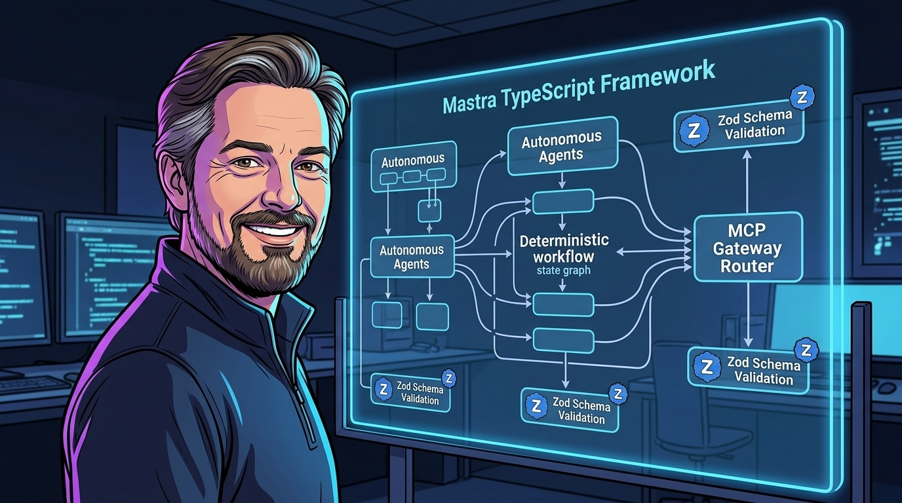
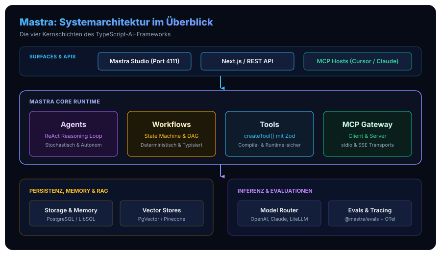
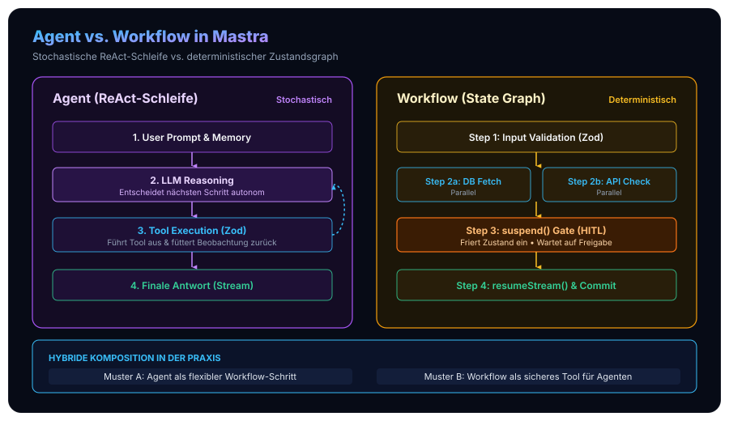
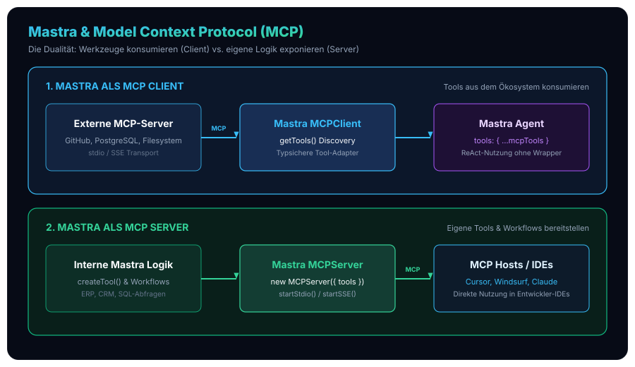

In unserer Beitragsreihe zur praktischen Realisierung moderner KI-Architekturen haben wir die Schichten des [standardisierten Open-Source Agentic AI Tech Stack](/posts/2026_09_03_standardisierter_open_source_agentic_ai_tech_stack/) schrittweise vertieft: vom [sitzungsübergreifenden Langzeitgedächtnis via Mem0](/posts/2026_09_04_langzeitgedaechtnis_llm_agenten_mem0/) über die [Body-Brain-Entkopplung des Hermes Agent](/posts/2026_09_07_hermes_agent_architektur_und_funktionsweise/), das hochperformante [Routing via LiteLLM](/posts/2026_09_09_litellm_architektur_und_funktionsweise/) und die kollaborative [Human-in-the-Loop Interaktion via Open WebUI](/posts/2026_09_08_open_webui_architektur_und_funktionsweise/) bis hin zu den [Procedural Graphs zur Automatisierung repetitiver Geschäftsprozesse](/posts/2026_09_18_procedural_graphs_praxis_automatisierung_repetitiver_prozesse/).

Ein zentrales Thema zieht sich dabei wie ein roter Faden durch die Enterprise-Praxis: **Wie bauen Software-Ingenieure KI-Anwendungen, die deterministisch, wartbar, ausfallsicher und nahtlos in moderne Web- und Backend-Ökosysteme integrierbar sind?**

Bislang war die Entwicklung von Agenten weitgehend von Python dominiert (LangChain, LlamaIndex, CrewAI). Für Entwicklungsteams, deren Kernkompetenz und Infrastruktur auf modernen Web- und Fullstack-Stacks – wie Node.js, Next.js, Fastify oder unserem eigenen [Astro- und TypeScript-Ökosystem](/posts/2026_05_23_website_relaunch_astro_typescript/) – aufbaut, bedeutete dies eine schmerzhafte „Python-Steuer“:
* **Sprachgrenzen und Latenzen:** Agenten mussten als separate Python-Microservices betrieben werden, was zusätzlichen Serialisierungs-Overhead, Netzwerk-Hops und doppelte Typ-Definitionen erzwang.
* **Typunsicherheit an den Schnittstellen:** Python-Runtimes garantieren keine statische Typsicherheit zur Compile-Zeit. Dynamische Payloads führten im Produktionsbetrieb immer wieder zu unbemerkten Laufzeitfehlern bei Werkzeugaufrufen.
* **Wartungsintensive Polyfills:** Reine Python-Ports nach TypeScript (wie LangChain.js) fühlten sich oft unidiomatisch an, schleppten komplexe Abstraktionsschichten mit und ignorierten die Eigenheiten der JavaScript-Event-Loop.

Mit dem quelloffenen Framework **Mastra** ([github.com/mastra-ai/mastra](https://github.com/mastra-ai/mastra)) existiert nun ein von Grund auf für TypeScript entwickeltes, ganzheitliches „Backend-Betriebssystem“ für KI-Agenten und ausfallsichere Workflows.



Dieser Artikel analysiert Mastra aus der Perspektive erfahrener Software-Entwickler: Wie ist das Framework aufgebaut? Wie harmonieren autonome ReAct-Schleifen und deterministische State Machines? Wie funktioniert die native MCP-Integration? Und wie sieht der produktive Code in der Praxis aus?

## 1. Systemarchitektur: Das Backend-Betriebssystem für KI-Anwendungen

Mastra versteht sich nicht bloß als Wrapper um LLM-APIs, sondern als **vollwertige Backend-Laufzeitumgebung**. Während Inferenz-Layer wie das Vercel AI SDK den reinen Netzwerkzugriff auf Sprachmodelle vereinheitlichen, stellt Mastra die darüberliegenden Kontrollstrukturen, Zustandsspeicher, Werkzeugvalidierungen und Evaluationsmechanismen bereit.

Das folgende Architekturmodell veranschaulicht die vier Schichten des Gesamtsystems:



### Die vier Kernschichten im Überblick

1. **Schicht 1: Consuming Surfaces & Developer Interfaces**
   * **Mastra Studio (`mastra dev`):** Eine integrierte Entwickler-Workbench, die lokal auf Port `4111` startet. Sie bietet einen interaktiven visuellen Graph-Editor, Playground-Chats und detailliertes Tracing.
   * **Auto-generated REST & OpenAPI:** Jeder in Mastra registrierte Agent und Workflow wird automatisch als standardkonformer HTTP-Endpunkt exponiert – inklusive interaktiver Swagger-Dokumentation.
   * **MCP-Hosts:** Externe Entwickler-Tools (wie Cursor IDE, Windsurf oder Claude Desktop) können Mastra-Werkzeuge direkt über das Model Context Protocol ansprechen.

2. **Schicht 2: Mastra Core Runtime Engine**
   * Das Herzstück des Frameworks. Hier residiert die zentrale Steuerklasse `Mastra`, die Agenten (`Agent`), deterministische Graphen (`Workflow`), typsichere Werkzeuge (`createTool`) und das MCP-Gateway (`MCPServer`, `MCPClient`) koordiniert.

3. **Schicht 3: Storage, Persistenz & Memory**
   * Abstrahierte Speicheradapter für relationale Datenbanken (PostgreSQL, LibSQL/SQLite) zur transaktionalen Sicherung von Workflow-Snapshots, Konversations-Threads und Vektor-Indizes (`PgVector`, `Pinecone`, `AstraDB`).

4. **Schicht 4: Inferenz-Abstraktion & Evaluations**
   * Modellagnostische Inferenz über Provider wie OpenAI, Anthropic, Google Gemini oder unser lokales Enterprise-Gateway [LiteLLM](/posts/2026_09_09_litellm_architektur_und_funktionsweise/) / [vLLM](/tags/vllm/).
   * Integrierte Evaluierungs-Pipelines (`@mastra/evals`) zur quantitativen Messung von Halluzinationen, Treue (*Faithfulness*) und Relevanz direkt im CI/CD-Zyklus.

### Das zentrale Orchestrierungs-Objekt: `new Mastra()`

In einem typischen Mastra-Projekt fungiert eine zentrale Einstiegsdatei (`src/mastra/index.ts`) als Single Source of Truth. Alle Komponenten werden deklarativ registriert, wodurch TypeScript über das gesamte System hinweg vollständige Autovervollständigung und statische Typprüfung gewährleisten kann:

```typescript
// src/mastra/index.ts
import { Mastra } from '@mastra/core';
import { PostgresStore } from '@mastra/store-pg';
import { PinoLogger } from '@mastra/logger-pino';

import { devOpsAgent } from './agents/devops-agent';
import { orderProcessingWorkflow } from './workflows/order-workflow';

export const mastra = new Mastra({
  agents: {
    devOpsAgent,
  },
  workflows: {
    orderProcessingWorkflow,
  },
  storage: new PostgresStore({
    connectionString: process.env.DATABASE_URL!,
  }),
  logger: new PinoLogger({
    level: process.env.NODE_ENV === 'production' ? 'info' : 'debug',
  }),
});
```

Durch diese zentrale Konfiguration ist der Mastra-Daemon sofort betriebsbereit: Er startet den REST-Server, bindet die Persistenzschicht an und initialisiert die Telemetrie-Spans via OpenTelemetry.

## 2. Stochastische ReAct-Agenten vs. Deterministische Workflows

In unserem Artikel zu den [Procedural Graphs in der Praxis](/posts/2026_09_18_procedural_graphs_praxis_automatisierung_repetitiver_prozesse/) haben wir eines der größten Risiken agentischer Architekturen beleuchtet: den **Long-Horizon Drift**. Lässt man ein LLM in einer ungebundenen ReAct-Schleife (*Reasoning + Acting*) über 15 bis 20 Schritte hinweg frei agieren, steigt die Wahrscheinlichkeit von Zyklen, vergessenen Vorgaben und stochastischen Fehlentscheidungen exponentiell an.

Mastra löst dieses Spannungsfeld durch eine saubere, erstklassige Trennung zweier grundlegender Entwurfsmuster:



### Wann nutzt man `Agent`, wann `Workflow`?

| Kriterium | `Agent` Primitive | `Workflow` Primitive |
| :--- | :--- | :--- |
| **Ausführungsmodell** | Stochastisch, LLM-geführt (ReAct) | Deterministisch, Graph-basiert (DAG / State Machine) |
| **Ablaufpfade** | Dynamisch zur Laufzeit vom Modell bestimmt | Vorab statisch typisiert (`.then()`, `.branch()`, `.parallel()`) |
| **Fehlertoleranz** | Modell versucht selbstständig zu reparieren | Explizite Retry- und Fallback-Richtlinien pro Step |
| **Unterbrechbarkeit** | Meist ephemer im Arbeitsspeicher | **Durable Execution**: Transaktionales `suspend()` & `resumeStream()` |
| **Compliance & Audit** | Schwierig nachvollziehbar | 100 % reproduzierbar und auditierbar |
| **Typischer Einsatzzweck** | Freie Recherche, interaktiver Dialog, Code-Synthese | ERP-Buchungen, SOPs, Genehmigungsketten, 3-Way-Matching |

### Das `Agent`-Primitiv: Autonome ReAct-Schleifen

Ein Mastra-Agent kombiniert Instruktionen, ein Sprachmodell, ein Gedächtnis und eine Sammlung typisierter Werkzeuge. Er analysiert Benutzereingaben, entscheidet autonom über nötige Tool-Aufrufe, konsumiert die Rückgabewerte und iteriert, bis das Ziel erreicht ist:

```typescript
// src/mastra/agents/devops-agent.ts
import { Agent } from '@mastra/core/agent';
import { Memory } from '@mastra/memory';
import { LibSQLStore } from '@mastra/store-libsql';
import { kubernetesTool, metricsTool } from '../tools/infra-tools';

export const devOpsAgent = new Agent({
  name: 'K8s Incident Investigator',
  instructions: `
    Du bist ein spezialisierter Site Reliability Engineer (SRE).
    Untersuche Anomalien in Kubernetes-Clustern strukturiert:
    1. Frage zunächst Pod- und Knoten-Metriken ab.
    2. Identifiziere fehlerhafte Pods (CrashLoopBackOff, OOMKilled).
    3. Fasse Logs zusammen und schlage minimale Korrekturmaßnahmen vor.
    Führe niemals zerstörerische Aktionen ohne Rückfrage aus.
  `,
  model: 'anthropic/claude-3-7-sonnet',
  tools: {
    kubernetes: kubernetesTool,
    metrics: metricsTool,
  },
  memory: new Memory({
    storage: new LibSQLStore({ url: 'file:memories.db' }),
    options: {
      lastMessages: 20, // Bounded Context zur KV-Cache-Schonung
    },
  }),
});
```

*Hinweis:* Genau wie beim [Hermes Agent und dessen Bounded-Memory-Konzept](/posts/2026_09_07_hermes_agent_architektur_und_funktionsweise/) schützt die Begrenzung der `lastMessages` den Token-Kontext vor unkontrollierter Aufblähung und erhält die Recheneffizienz des KV-Caches.

### Das `Workflow`-Primitiv: Typsichere Graphen mit Durable Execution

Ein Mastra-Workflow ist eine gerichtete Zustandsmaschine. Schritte werden mit `createStep()` definiert, wobei jeder Schritt Eingabe- und Ausgabe-Schemas via **Zod** deklariert. Der Compiler erzwingt, dass der Ausgabe-Typ von Schritt $N$ exakt mit dem Eingabe-Typ von Schritt $N+1$ übereinstimmt:

```typescript
// src/mastra/workflows/order-workflow.ts
import { createStep, createWorkflow } from '@mastra/core/workflows';
import { z } from 'zod';

// Schritt 1: Validierung der Bestelldaten
const validateOrderStep = createStep({
  id: 'validate-order',
  inputSchema: z.object({
    orderId: z.string(),
    totalAmountEur: z.number().positive(),
    customerId: z.string(),
  }),
  outputSchema: z.object({
    orderId: z.string(),
    approvedDirectly: z.boolean(),
    requiresManualApproval: z.boolean(),
  }),
  execute: async ({ context }) => {
    const { totalAmountEur, orderId } = context.input;
    // Beträge über 10.000 EUR erfordern manuelle Freigabe
    const requiresManualApproval = totalAmountEur > 10000;
    return {
      orderId,
      approvedDirectly: !requiresManualApproval,
      requiresManualApproval,
    };
  },
});

// Schritt 2: Genehmigungs-Gate mit Suspend (Human-in-the-Loop)
const humanApprovalStep = createStep({
  id: 'human-approval-gate',
  inputSchema: z.object({
    orderId: z.string(),
    requiresManualApproval: z.boolean(),
  }),
  outputSchema: z.object({
    orderId: z.string(),
    approvedByManager: z.boolean(),
  }),
  execute: async ({ context, suspend }) => {
    const { orderId, requiresManualApproval } = context.input;

    if (requiresManualApproval) {
      // Workflow pausieren und Zustand transaktional in DB einfrieren!
      await suspend({
        reason: 'Bestellwert übersteigt 10.000 EUR. Manager-Freigabe ausstehend.',
        orderId,
      });
    }

    return { orderId, approvedByManager: true };
  },
});

// Komposition des Graphen
export const orderProcessingWorkflow = createWorkflow({
  name: 'enterprise-order-processing',
})
  .then(validateOrderStep)
  .then(humanApprovalStep)
  .commit();
```

### Das Human-in-the-Loop Prinzip: `suspend` & `resumeStream`

Klassische Microservices scheitern an asynchronen Genehmigungen: Prozesse können nicht tagelang als blockierende Threads im RAM verharren, ohne bei Deployments oder Server-Neustarts verlorenzugehen.

Mastra implementiert echtes **Durable Execution**:
1. Ruft ein Schritt `await suspend()` auf, serialisiert Mastra den vollständigen Zustand des Workflows in die konfigurierte Datenbank (`PostgresStore`).
2. Der HTTP-Aufruf wird beendet, ohne dass Server-Ressourcen belegt bleiben.
3. Sobald der menschliche Entscheider im Dashboard oder ERP-System die Freigabe erteilt, wird der Workflow reaktiv über die API fortgesetzt:

```typescript
// Fortsetzen des eingefrorenen Workflows nach Manager-Freigabe
const run = await orderProcessingWorkflow.resumeStream({
  runId: 'run-uuid-12345',
  stepId: 'human-approval-gate',
  input: { approvedByManager: true },
});
```

Dieser Mechanismus schlägt eine elegante Brücke zu den Konzepten unserer [Procedural Graphs](/posts/2026_09_18_procedural_graphs_praxis_automatisierung_repetitiver_prozesse/): Unternehmen müssen sich nicht zwischen starrer Automatisierung und unberechenbaren Agenten entscheiden – sie kombinieren deterministische Kontrollgraphen mit situativer menschlicher Kontrolle.

## 3. Typsichere Werkzeuge (`createTool`) & die native MCP-Dualität

Ein notorischer Schwachpunkt vieler Agenten-Frameworks ist die Schnittstelle zu externen Systemen. Werden Tool-Parameter als unstrukturierte JSON-Strings an LLMs übergeben, führen kleinste Schemaabweichungen zum Abbruch.

Mastra setzt hierbei kompromisslos auf **Zod**:
* Aus den Zod-Schemas generiert Mastra automatisch die JSON-Schema-Spezifikation für das Function Calling des Zielmodells.
* Eingehende Argumente werden vor der Übergabe an die `execute`-Funktion strikt validiert.
* Innerhalb von `execute` genießt der Entwickler 100 % statische Typsicherheit ohne manuelle Casts.

```typescript
// src/mastra/tools/sql-query-tool.ts
import { createTool } from '@mastra/core/tools';
import { z } from 'zod';
import { db } from '../db';

export const sqlQueryTool = createTool({
  id: 'execute-safe-query',
  description: 'Führt eine schreibgeschützte SQL-Select-Abfrage auf der Kundendatenbank aus.',
  inputSchema: z.object({
    query: z.string().describe('Die auszuführende SELECT-Abfrage'),
    maxRows: z.number().int().min(1).max(100).default(20),
  }),
  outputSchema: z.object({
    rowCount: z.number(),
    rows: z.array(z.record(z.unknown())),
  }),
  execute: async ({ query, maxRows }) => {
    // Sicherheitsprüfung: Keine schreibenden Operationen
    if (!/^\s*SELECT\b/i.test(query)) {
      throw new Error('Nur SELECT-Abfragen sind in diesem Werkzeug gestattet.');
    }

    const rows = await db.query(query, { limit: maxRows });
    return {
      rowCount: rows.length,
      rows,
    };
  },
});
```

### Die native MCP-Integration: Client & Server

Das von Anthropic initiierte **Model Context Protocol (MCP)** hat sich in kürzester Zeit zum offenen Industriestandard für Tool- und Kontext-Schnittstellen entwickelt. Mastra bietet über das Paket `@mastra/mcp` eine **vollwertige MCP-Dualität**:



### Szenario A: Mastra als MCP-Client (Werkzeuge konsumieren)

Möchte ein Mastra-Agent auf bestehende MCP-Server der Open-Source-Community (z. B. GitHub, Postgres, Slack oder Filesystem) zugreifen, bindet `MCPClient` diese per `stdio` (lokaler Subprozess) oder `SSE` (HTTP-Stream) ein:

```typescript
// src/mastra/mcp-client.ts
import { MCPClient } from '@mastra/mcp';
import { Agent } from '@mastra/core/agent';

export const mcpClient = new MCPClient({
  id: 'enterprise-mcp-hub',
  servers: {
    github: {
      command: 'npx',
      args: ['-y', '@modelcontextprotocol/server-github'],
      env: { GITHUB_PERSONAL_ACCESS_TOKEN: process.env.GITHUB_TOKEN! },
    },
    postgres: {
      url: new URL('http://localhost:3001/sse'), // Remote SSE Server
    },
  },
});

// Werkzeuge abrufen und direkt in Agenten injizieren
const tools = await mcpClient.getTools();

export const gitOpsAgent = new Agent({
  name: 'GitOps Automator',
  instructions: 'Analysiere Pull Requests und erstelle aussagekräftige Reviews.',
  model: 'openai/gpt-4o',
  tools: { ...tools }, // Sämtliche GitHub- und Postgres-MCP-Tools stehen bereit!
});
```

### Szenario B: Mastra als MCP-Server (Eigene Tools bereitstellen)

Umgekehrt können eigene Mastra-Tools und Workflows als MCP-Server exponiert werden. Dadurch stehen Firmen-APIs sofort in Cursor IDE, Windsurf oder der Claude Desktop App zur Verfügung – ohne eine Zeile Integrationscode für die jeweilige Anwendung schreiben zu müssen:

```typescript
// src/mastra/mcp-server.ts
import { MCPServer } from '@mastra/mcp';
import { sqlQueryTool } from './tools/sql-query-tool';

const server = new MCPServer({
  name: 'Corporate Internal Data Hub',
  version: '1.0.0',
  tools: {
    sqlQuery: sqlQueryTool,
  },
});

// Server über Standard-I/O für Desktop-Tools starten
await server.startStdio();
```

## 4. RAG, Gedächtnis & automatisierte Evaluationen

Ein produktionsreifes System erfordert mehr als smarte Prompts: Es verlangt fundiertes Kontextmanagement und kontinuierliche Qualitätsprüfung.

### Semantisches Retrieval (RAG)
Mastra bringt integrierte Vektorabstraktionen (`MastraVector`) mit nativer Unterstützung für `pgvector`, `Pinecone`, `Chroma` und `LibSQL` mit:

```typescript
import { MastraVector } from '@mastra/vector';
import { PgVector } from '@mastra/vector-pg';

const vectorStore = new PgVector({
  connectionString: process.env.DATABASE_URL!,
  tableName: 'knowledge_embeddings',
});

// Semantische Ähnlichkeitssuche
const results = await vectorStore.query({
  vector: embeddingVector,
  topK: 5,
  filter: { category: 'architecture-guidelines' },
});
```

*Verbindung zu unserer Artikelserie:* Während [Mem0 als sitzungsübergreifendes Langzeitgedächtnis](/posts/2026_09_04_langzeitgedaechtnis_llm_agenten_mem0/) auf dynamische Graphen- und Entitätenextraktion spezialisiert ist, eignet sich Mastras RAG-Subsystem ideal für statische Dokumentensammlungen, SOPs und API-Spezifikationen.

### CI/CD-Evaluationen mit `@mastra/evals`

Eines der innovativsten Features von Mastra ist das integrierte Evaluations-Paket. Statt Agenten nach Bauchgefühl zu testen, können Entwickler automatisierte Grader in ihre Unit- und Integrationstests einbinden:

```typescript
import { evaluate } from '@mastra/evals';
import { FaithfulnessScorer, RelevanceScorer } from '@mastra/evals/scorers';

const evalResult = await evaluate({
  agent: devOpsAgent,
  input: 'Welche Pods sind im Namespace default abgestürzt?',
  scorers: [
    new FaithfulnessScorer({ threshold: 0.85 }), // Verhindert Halluzinationen
    new RelevanceScorer({ threshold: 0.90 }),    // Prüft Zielgenauigkeit
  ],
});

console.log(`Evaluations-Score: ${evalResult.score}`);
```

Fällt die Treuequote des Agenten unter den Schwellenwert (z. B. nach einem Modellwechsel oder einer Prompt-Anpassung), bricht die CI/CD-Pipeline ab. Dies verhindert **Optimization Amnesia** und Qualitätsregressionen in geschäftskritischen Umgebungen.

## 5. Developer Experience (DX) & Deployment

Die Qualität eines Frameworks entscheidet sich nicht zuletzt am Entwickler-Workflow. Mastra glänzt durch eine herausragende Developer Experience:

### Mastra Studio: Lokales Debugging mit visueller Transparenz
Mit dem Befehl:
```powershell
npx mastra dev
```
startet das Framework die lokale Entwicklungsumgebung unter `http://localhost:4111`. Entwickler erhalten:
* Eine **grafische Darstellung aller Workflows**, an der Übergänge, Zwischenzustände und Step-Laufzeiten in Echtzeit visualisiert werden.
* Einen **Agenten-Playground**, in dem Prompts getestet, Tool-Aufrufe inspiziert und Tokens gezählt werden können.
* Detaillierte **Trace-Trees**, die genau aufschlüsseln, wie viele Millisekunden die Vektorabfrage, das Prompt-Building und die LLM-Inferenz beansprucht haben.

### Nahtlose Deployment-Optionen
Da Mastra rein auf TypeScript und Standard-Web-APIs aufbaut, lässt es sich flexibel bereitstellen:
1. **Als Standalone Node.js Microservice:** Containerisiert via Docker in Kubernetes oder AWS ECS.
2. **Eingebettet in Next.js:** Direkte Ausführung innerhalb von Next.js Route Handlers (`app/api/agent/route.ts`) oder Server Actions – ohne separaten Backend-Server!
3. **Serverless & Edge Runtimes:** Durch die Entkopplung von Persistenz und Rechenlogik lauffähig auf Cloudflare Workers, Vercel Functions oder AWS Lambda.

## 6. Architektonischer Vergleich: Mastra im Enterprise-Stack

Um die richtige Technologieentscheidung zu treffen, hilft ein direkter Vergleich mit den etablierten Alternativen unserer Architektur-Serie:

| Dimension | Mastra | Nous Research Hermes Agent | LangGraph (Python) |
| :--- | :--- | :--- | :--- |
| **Primäre Sprache** | **TypeScript** (First-Class) | Python | Python (mit JS-Port) |
| **Systemfokus** | Backend-Services, Web-Apps, Enterprise-APIs | Autarkes OS, Terminal TUI, Personal Companion | Komplexe algorithmische Multi-Agenten-Netzwerke |
| **Entkopplung** | Agent vs. Workflow (Zod-Graphen) | Body vs. Brain (Bounded Context) | Node-State-Graph mit Reducern |
| **MCP-Support** | **Nativ Client & Server** (`@mastra/mcp`) | Client-fokussiert | Über Community-Adapter |
| **Durable Execution** | **Integriert** (`suspend` / `resumeStream`) | SQLite-Persistenz & Session-Search | Checkpointer (Postgres/Memory) |
| **DX & Tooling** | Mastra Studio (Port 4111) + OpenAPI | Terminal UI (`ink`), CLI | LangSmith (SaaS/Enterprise) |
| **Passender Stack-Partner** | Next.js, Node, Astro, LiteLLM, Keycloak | vLLM, vllm-router, Local AI Runtimes | LangSmith, LlamaIndex, Python ML Stacks |

## Fazit: Die Reifeprüfung für TypeScript im Agentic-AI-Zeitalter

Das **Mastra Framework** markiert einen entscheidenden Meilenstein in der Evolution moderner Software-Architekturen: Es befreit Entwicklungsteams aus dem Dilemma zwischen trägen Python-Microservices und ungetypten JavaScript-Skripten.

Indem Mastra die stochastische Flexibilität autonomer Agenten mit der mathematischen Verlässlichkeit deterministischer, unterbrechbarer State Machines verbindet, löst es genau jene Hürden, an denen frühere KI-Pilotprojekte scheiterten. Die kompromisslose Typsicherheit über Zod, die native Dualität als MCP-Client und MCP-Server sowie das integrierte Mastra Studio machen das Framework zur ersten Wahl für Software-Ingenieure, die KI als integralen Bestandteil moderner Web- und Cloud-Backends begreifen.

Für weiterführende architektonische Leitfäden und tiefergehende Analysen souveräner KI-Infrastrukturen empfehlen wir die folgenden Beiträge unserer Reihe:
* [Standardisierter Open-Source Agentic AI Tech Stack: Das 6-Schichten-Referenzmodell](/posts/2026_09_03_standardisierter_open_source_agentic_ai_tech_stack/)
* [Hermes Agent: Body-Brain-Entkopplung, Bounded Context und Progressive Skills](/posts/2026_09_07_hermes_agent_architektur_und_funktionsweise/)
* [Procedural Graphs in der Praxis: SOPs zuverlässig automatisieren](/posts/2026_09_18_procedural_graphs_praxis_automatisierung_repetitiver_prozesse/)
* [LiteLLM: Universelle Modell-Abstraktion und Dynamic Routing](/posts/2026_09_09_litellm_architektur_und_funktionsweise/)
* [Sitzungsübergreifendes Langzeitgedächtnis via Mem0](/posts/2026_09_04_langzeitgedaechtnis_llm_agenten_mem0/)
* [Enterprise Identity & Access Governance via Keycloak](/posts/2026_09_10_keycloak_architektur_und_funktionsweise/)
* [Lokale KI-Agenten und strukturierte Inferenz mit WebLLM](/posts/2026_05_31_local_ai_agents_web_llm/)
* [Website Relaunch mit Astro und TypeScript](/posts/2026_05_23_website_relaunch_astro_typescript/)
