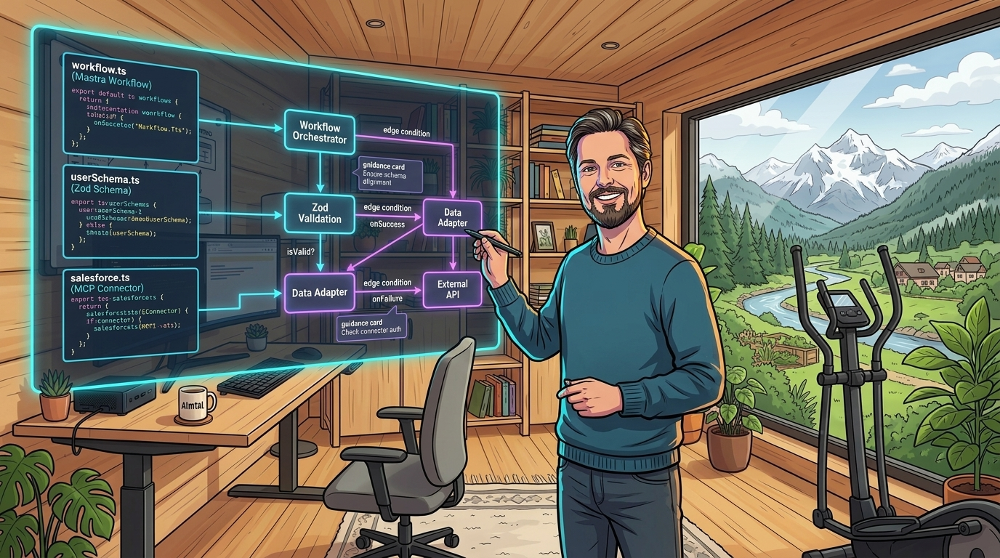
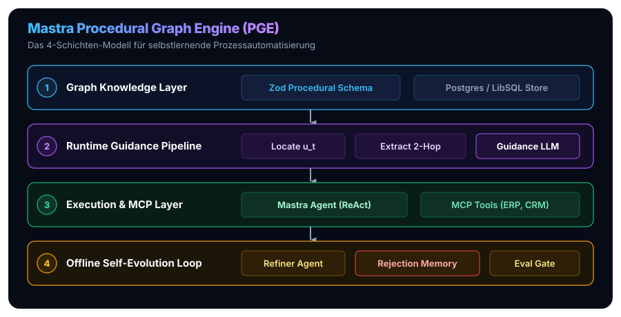
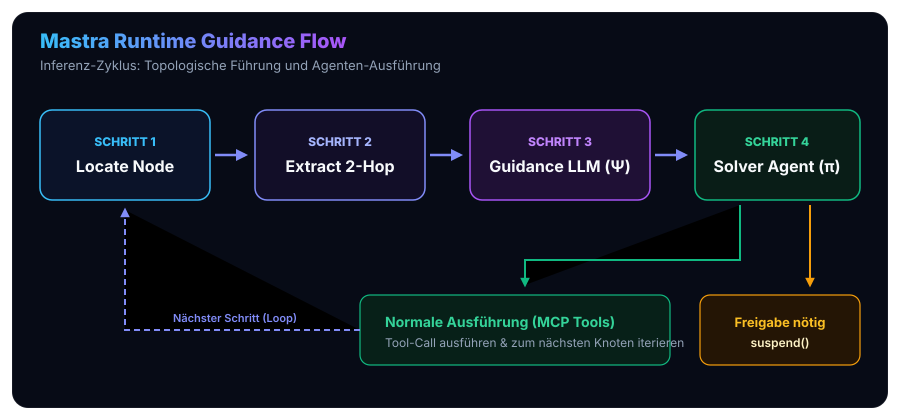
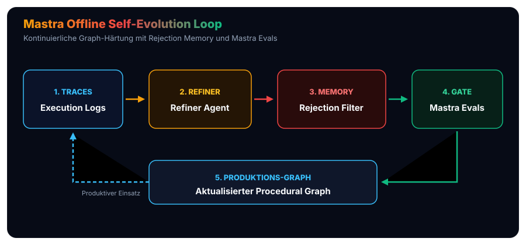

In unserer Beitragsreihe zur praktischen AI-Transformation in Unternehmen haben wir die architektonischen Grundlagen moderner KI-Systeme erschlossen: vom [standardisierten Open-Source Agentic AI Tech Stack](/posts/2026_09_03_standardisierter_open_source_agentic_ai_tech_stack/) über das sitzungsübergreifende [Langzeitgedächtnis via Mem0](/posts/2026_09_04_langzeitgedaechtnis_llm_agenten_mem0/), die Wissensevolution via [Google WikiSkills](/posts/2026_09_06_wikiskill_persistente_wissensevolution_agent_skills/) und das [Inferenz-Routing via LiteLLM](/posts/2026_09_09_litellm_architektur_und_funktionsweise/) bis zur tiefen [Architektur- und Funktionsanalyse von Mastra](/posts/2026_09_19_mastra_typescript_framework_architektur_und_funktionsweise/). 

Besonderes Aufsehen erregte zuletzt unsere Analyse des Google-Cloud-Research-Papers **„Procedural Graphs: Self-Evolving Execution Structures for LLM Agents“** (*arXiv:2609.09153*): In [Procedural Graphs in der Praxis](/posts/2026_09_18_procedural_graphs_praxis_automatisierung_repetitiver_prozesse/) haben wir dargelegt, warum über 80 % agentischer Pilotprojekte am Übergang in den Produktivbetrieb scheitern – und wie attributierte Wissensgraphen das unberechenbare „Driften“ autonomer ReAct-Agenten bei repetitiven Vorgängen zuverlässig unterbinden.

Die Resonanz aus Entwicklungsteams und IT-Architekturen war eindeutig: Das theoretische Konzept überzeugt – doch **wie implementiert man eine Procedural Graph Engine (PGE) konkret in einer modernen Unternehmenscodebasis?**

Dieser Beitrag schlägt die Brücke vom Forschungspapier zur lauffähigen Enterprise-Architektur. Wir nutzen das TypeScript-native Framework **Mastra**, um eine vollständige Referenzimplementierung zu entwerfen: mit formaler Typsicherheit via Zod, dynamischer Laufzeit-Führung (*Runtime Soft Guidance*), nativer MCP-Integration für reale Industriesysteme und einem kontinuierlichen Offline-Evolutionszyklus mit persistenter *Rejection Memory*.



> [!TIP]
> **Kompakt-Rekapitulation: Was sind Procedural Graphs & warum Mastra?**
> * **Das Problem unbeschränkter ReAct-Agenten:** Reine Prompt- und Tool-Loops driften bei mehrstufigen Geschäftsprozessen unweigerlich ab oder übersehen Compliance-Vorgaben. Klassische BPMN-Workflows sind wiederum zu starr für unstrukturierte Daten.
> * **Procedural Graphs (Google Research, 2026):** Ein attributierter Wissensgraph $\mathcal{G} = (\mathcal{V}, \mathcal{R}, \mathcal{E}, \Phi)$ fungiert als dynamisches Leitplanken-Modell. Anstelle fest verdrahteter Code-Pfade liefert jede Kante situative Bedingungen, Handlungsrichtlinien und bekannte Fehler-Fallstricke (`condition`, `guidance`, `pitfalls`) als *Soft Guidance* in den Prompt des Agenten.
> * **Warum Mastra?** Das TypeScript-Framework Mastra bietet native Zod-Validierung, asynchrone Workflow-Graphen mit programmierbaren Verzweigungen (`.branch()`) sowie die Fähigkeit, Workflows via `suspend()` und `resume()` für Genehmigungsschritte (*Human-in-the-Loop*) persistent anzuhalten.

## 1. Das Architektur-Paradigma: Ausführungsgraph vs. Attributierter Wissensgraph

Der häufigste Denkfehler bei der praktischen Umsetzung von Procedural Graphs besteht darin, sie mit klassischen Graph-Workflow-Engines gleichzusetzen. 

Wer versucht, einen Procedural Graph einfach als deterministischen Mastra-`Workflow` (`new Workflow().step(...).then(...)`) oder als starren LangGraph-`StateGraph` zu codieren, verfehlt den Kern der Innovation:

* **Klassische Workflows (Ausführungsgraphen):** Die Knoten repräsentieren fest verdrahteten Programmcode, und die Kanten erzwingen feste Steuerflüsse (`if-else`). Weicht die reale Welt ab (z. B. unvollständige Kundendaten im Freitext), bricht der Ablauf ab.
* **Procedural Graphs (Wissensgraphen zur Handlungsführung):** Der Graph ist **kein starrer Ausführungscode**, sondern ein **entkoppeltes Daten- und Wissensmodell** $\mathcal{G} = (\mathcal{V}, \mathcal{R}, \mathcal{E}, \Phi)$. Er beschreibt, welche Prozesszustände existieren, welche Pfade zulässig sind und welche Bedingungen, Leitlinien und Fallstricke (`condition`, `guidance`, `pitfalls`) an jedem Übergang gelten.

Das eigentliche Problemlösen übernimmt nach wie vor ein sprachfähiger ReAct-Agent. Er bewegt sich jedoch nicht im luftleeren Raum, sondern erhält an jedem Schritt dynamische **topologische Leitplanken (*Soft Guidance*)**, die ihn situativ absichern.



### Die vier Schichten der Mastra Procedural Graph Engine (PGE)

Um dieses Paradigma sauber umzusetzen, gliedern wir die Architektur in vier voneinander entkoppelte Schichten:

1. **Schicht 1: Graph Knowledge Layer** – Das formale Datenmodell des Prozessgraphen, typisiert über Zod und gespeichert in relationaler Persistenz (PostgreSQL / LibSQL via Mastra Storage).
2. **Schicht 2: Runtime Guidance Pipeline** – Ein schlanker Mastra-Workflow, der vor jedem Agentenschritt die aktuelle Knotenposition lokalisiert, die 2-Hop-Nachbarschaft extrahiert und daraus via Prompt-Synthese eine situative Handlungsführung ($g_t$) generiert.
3. **Schicht 3: Execution & MCP Layer** – Der ausführende Mastra-`Agent` ($\pi$), der das eigentliche Reasoning durchführt, Aktionen über das Model Context Protocol (MCP) an reale ERP-, CRM- und Datenbank-Systeme absetzt und bei Genehmigungspflichten via `suspend()` anhält.
4. **Schicht 4: Offline Self-Evolution Loop** – Ein autonomer Hintergrundprozess, der Ausführungs-Traces analysiert, den Graphen schärft und mithilfe einer *Rejection Memory* sowie `@mastra/evals` Regressionen im laufenden Betrieb verhindert.


## 2. Datenmodellierung: Tripletts und Kantenattribute mit Zod & TypeScript

In der formalen Definition nach Lu et al. (2026) ist ein Procedural Graph ein gerichteter Graph $\mathcal{G} = (\mathcal{V}, \mathcal{R}, \mathcal{E}, \Phi)$, dessen Kanten $e = (u, r, v)$ mit einem semantischen Attribut-Triplett versehen sind:

$$\Phi(e) = (\text{condition}, \text{guidance}, \text{pitfalls})$$

Dank Mastras nativer Zod-Integration können wir dieses mathematische Modell direkt in typensichere TypeScript-Definitionen überführen:

```typescript
// src/procedural-graph/schema.ts
import { z } from 'zod';

// 1. Definition der Prozess-Knoten (Verfahrensschritte)
export const ProceduralNodeSchema = z.object({
  id: z.string().describe('Eindeutiger Knoten-Identifier, z. B. node_credit_check'),
  label: z.string().describe('Menschenlesbarer Name des Prozessschritts'),
  category: z.enum(['action', 'validation', 'decision', 'terminal']),
  description: z.string().describe('Semantische Beschreibung der Aufgabe an diesem Knoten'),
  requiredTools: z.array(z.string()).default([]).describe('Mastra/MCP-Tools, die hier relevant sind'),
});

export type ProceduralNode = z.infer<typeof ProceduralNodeSchema>;

// 2. Kantenattribute: Das semantische Herzstück Phi(e)
export const EdgeAttributesSchema = z.object({
  condition: z.string().describe('Notwendige Vorbedingungen für diesen Übergang'),
  guidance: z.string().describe('Konkrete Handlungsanweisungen und Heuristiken für den Agenten'),
  pitfalls: z.string().describe('Bekannte Fehlerquellen, Compliance-Risiken und No-Gos'),
  requiresHumanReview: z.boolean().default(false).describe('Erzwingt ein Approval-Gate via suspend()'),
});

export type EdgeAttributes = z.infer<typeof EdgeAttributesSchema>;

// 3. Gerichtete Kanten als annotierte Tripletts (u, r, v, Phi)
export const ProceduralEdgeSchema = z.object({
  id: z.string(),
  source: z.string().describe('Startknoten u'),
  target: z.string().describe('Zielknoten v'),
  relation: z.enum(['LEADS_TO', 'REQUIRES_VALIDATION', 'ESCALATES_TO', 'BRANCHES_ON_ERROR']),
  attributes: EdgeAttributesSchema,
});

export type ProceduralEdge = z.infer<typeof ProceduralEdgeSchema>;

// 4. Das Gesamtmodell des Procedural Graphs
export const ProceduralGraphModelSchema = z.object({
  id: z.string(),
  name: z.string(),
  version: z.number().int().positive(),
  entryNodeId: z.string(),
  nodes: z.record(z.string(), ProceduralNodeSchema),
  edges: z.array(ProceduralEdgeSchema),
});

export type ProceduralGraphModel = z.infer<typeof ProceduralGraphModelSchema>;
```

### Abstraktion des Graph Stores in Mastra

Um den Graphen zur Laufzeit abzufragen und im Offline-Zyklus zu mutieren, kapseln wir den Zugriff in einer typsicheren Speicher-Abstraktion, die nahtlos an Mastras `PostgresStore` oder `LibSQLStore` anknüpft:

```typescript
// src/procedural-graph/store.ts
import { ProceduralGraphModel, ProceduralNode, ProceduralEdge } from './schema';

export interface SubgraphNeighborhood {
  currentNode: ProceduralNode;
  outgoingEdges: ProceduralEdge[];
  twoHopNeighbors: {
    edge: ProceduralEdge;
    targetNode: ProceduralNode;
  }[];
}

export class ProceduralGraphStore {
  constructor(private graph: ProceduralGraphModel) {}

  public getNode(nodeId: string): ProceduralNode | undefined {
    return this.graph.nodes[nodeId];
  }

  // Extrahiert die gerichtete h-Hop-Nachbarschaft (h = 2)
  public getNeighborhood(currentNodeId: string): SubgraphNeighborhood {
    const currentNode = this.graph.nodes[currentNodeId];
    if (!currentNode) {
      throw new Error(`Knoten ${currentNodeId} existiert nicht im Procedural Graph`);
    }

    const outgoingEdges = this.graph.edges.filter((e) => e.source === currentNodeId);
    
    // Zweiter Hop: Kanten von den direkten Nachfolgern
    const directTargetIds = new Set(outgoingEdges.map((e) => e.target));
    const twoHopEdges = this.graph.edges.filter((e) => directTargetIds.has(e.source));

    const twoHopNeighbors = twoHopEdges.map((edge) => ({
      edge,
      targetNode: this.graph.nodes[edge.target]!,
    }));

    return {
      currentNode,
      outgoingEdges,
      twoHopNeighbors,
    };
  }

  public updateGraph(mutatedGraph: ProceduralGraphModel): void {
    this.graph = mutatedGraph;
  }
}
```


## 3. Die Laufzeit-Führung (Runtime Soft Guidance) in Mastra

Wie wird aus dem statischen Graphen nun eine dynamische Führung für das Sprachmodell?

Der Ablauf folgt der 4-Schritte-Inferenzpipeline aus dem Forschungspapier: Vor jedem Ausführungsschritt des Problemlöser-Agenten ($\pi$) bereitet ein spezialisierter Guidance-Workflow die Leitplanken auf.



### Schritt 1: Lokalisierung (*Locate*)
Anhand des jüngsten Aktionsfensters $\mathcal{T}_{t-w:t}$ (z. B. den letzten Tool-Aufrufen und Statusmeldungen) stellt das System fest, an welchem Knoten $u_t$ sich der Prozess aktuell befindet. Bei strukturierten Tasks kann dieser Knoten direkt im Execution State mitgeführt werden.

### Schritt 2: Extraktion (*Extract*)
Die $h$-Hop-Nachbarschaft $\mathcal{N}_h(u_t)$ wird über `graphStore.getNeighborhood(u_t)` aus dem Graph-Speicher geladen. Der Agent erhält somit nicht nur die unmittelbar nächsten Optionen, sondern auch den Kontext des übernächsten Schritts.

### Schritt 3: Generierung der situativen Führung (*Generate*)
Ein schnelles, kostengünstiges Sprachmodell $\Psi$ (beispielsweise *Google Gemini 3.5 Flash* via Mastra) verdichtet die Kantenattribute (`condition`, `guidance`, `pitfalls`) und den Task-Kontext in eine prägnante, handlungsleitende Instruktion $g_t$.

### Schritt 4: Ausführung durch den Solver-Agenten (*Solve*)
Der eigentliche Task Solver Agent ($\pi$) erhält $g_t$ dynamisch in seinen Kontext injiziert und wählt die nächste Aktion $a_t$. Er behält seine volle ReAct-Agilität, wird aber durch die Guidance vor Prozessbrüchen geschützt.

### Die Implementierung als Mastra-Workflow

In Mastra lässt sich diese Orchestrierung elegant als modulare Pipeline ausdrücken:

```typescript
// src/procedural-graph/runtime-workflow.ts
import { createStep, createWorkflow } from '@mastra/core';
import { z } from 'zod';
import { ProceduralGraphStore } from './store';
import { guidanceAgent } from '../agents/guidance-agent';
import { solverAgent } from '../agents/solver-agent';

export function createProceduralExecutionWorkflow(graphStore: ProceduralGraphStore) {
  // Step 1 & 2: Lokalisieren und 2-Hop-Subgraphen extrahieren
  const extractContextStep = createStep({
    id: 'extract-guidance-context',
    inputSchema: z.object({
      currentNodeId: z.string(),
      userIntent: z.string(),
      actionHistory: z.array(z.string()),
    }),
    outputSchema: z.object({
      currentNodeId: z.string(),
      neighborhoodPrompt: z.string(),
      requiresApproval: z.boolean(),
    }),
    execute: async ({ context }) => {
      const { currentNodeId } = context;
      const neighborhood = graphStore.getNeighborhood(currentNodeId);

      // Serialisierung der Kanten für das Guidance-LLM
      const edgeDescriptions = neighborhood.outgoingEdges.map((e) => `
-> Option nach Knoten [${e.target}]:
   - Bedingung: ${e.attributes.condition}
   - Richtlinie: ${e.attributes.guidance}
   - Fallstricke: ${e.attributes.pitfalls}
   - Freigabe erforderlich: ${e.attributes.requiresHumanReview}
`).join('\n');

      const anyApprovalNeeded = neighborhood.outgoingEdges.some(
        (e) => e.attributes.requiresHumanReview
      );

      return {
        currentNodeId,
        neighborhoodPrompt: edgeDescriptions,
        requiresApproval: anyApprovalNeeded,
      };
    },
  });

  // Step 3: Generierung situativer Führung via schnellem Guidance-LLM
  const generateGuidanceStep = createStep({
    id: 'generate-guidance',
    inputSchema: z.object({
      currentNodeId: z.string(),
      neighborhoodPrompt: z.string(),
      requiresApproval: z.boolean(),
    }),
    outputSchema: z.object({
      guidanceText: z.string(),
      requiresApproval: z.boolean(),
    }),
    execute: async ({ context }) => {
      const prompt = `Du bist die Guidance Engine eines B2B-Prozesses.
Aktueller Prozess-Status: ${context.currentNodeId}
Zulässige nächste Schritte und Regeln aus dem Procedural Graph:
${context.neighborhoodPrompt}

Formuliere eine präzise, 2-3 Sätze lange Arbeitsanweisung für den Task Solver Agenten.
Hebe insbesondere kritische Fallstricke und Vorbedingungen hervor.`;

      const response = await guidanceAgent.generate([
        { role: 'user', content: prompt }
      ]);

      return {
        guidanceText: response.text,
        requiresApproval: context.requiresApproval,
      };
    },
  });

  // Step 4: Ausführung durch den Solver Agenten (inkl. Suspend/Resume)
  const executeSolverStep = createStep({
    id: 'execute-solver',
    inputSchema: z.object({
      guidanceText: z.string(),
      requiresApproval: z.boolean(),
    }),
    outputSchema: z.object({
      solverOutput: z.string(),
      nextNodeId: z.string(),
    }),
    execute: async ({ context, suspend }) => {
      // Human-in-the-Loop Gate via Mastra Durable Execution
      if (context.requiresApproval) {
        // Suspendiert den Workflow transaktional bis zur Freigabe
        await suspend({
          reason: 'Procedural Graph verlangt manuelle Freigabe vor diesem Schritt',
          guidance: context.guidanceText,
        });
      }

      // Solver-Agent ausführen mit dynamischer Guidance
      const result = await solverAgent.generate([
        {
          role: 'system',
          content: `Aktuelle Prozessführung (Leitplanken):
${context.guidanceText}`,
        },
        {
          role: 'user',
          content: 'Führe den nächsten erforderlichen Teilschritt durch.',
        },
      ]);

      // Nächsten Zustand aus dem Tool-Execution-Trace determinieren:
      // Das Modell meldet die Transition entweder über ein strukturiertes Zod-Schema
      // oder die Engine matcht den Rückgabewert des ausgeführten MCP-Tools auf den Zielknoten:
      const nextNodeId = result.toolCalls?.find(c => c.toolName === 'transition_state')?.args?.targetNodeId 
        || 'assess_liability';

      return {
        solverOutput: result.text,
        nextNodeId,
      };
    },
  });

  return createWorkflow({
    name: 'procedural-guidance-runtime',
    triggerSchema: z.object({
      currentNodeId: z.string(),
      userIntent: z.string(),
      actionHistory: z.array(z.string()),
    }),
  })
    .step(extractContextStep)
    .then(generateGuidanceStep)
    .then(executeSolverStep)
    .commit();
}
```


## 4. Enterprise-Integration: Echte Schnittstellen via Model Context Protocol (MCP)

Im realen Unternehmensalltag scheitern Agenten selten am Textverständnis, sondern an der Interaktion mit heterogenen Backend-Systemen (SAP S/4HANA, Salesforce, SQL-Datenbanken).

Hier spielt Mastra seinen entscheidenden Vorteil aus: Über das native **MCP-Gateway** können standardisierte MCP-Server direkt eingebunden und als typsichere Mastra-Tools registriert werden.

```typescript
// src/tools/mcp-enterprise-tools.ts
import { MCPClient } from '@mastra/mcp';

// Verbindung zu einem internen SAP ERP MCP Server
export const sapMcpClient = new MCPClient({
  id: 'sap-erp-gateway',
  transport: {
    type: 'sse',
    url: process.env.SAP_MCP_SERVER_URL || 'http://localhost:8080/sse',
  },
});

// Anbindung des Mail-Gateways zur Kundenkommunikation
export const mailMcpClient = new MCPClient({
  id: 'exchange-mail-gateway',
  transport: {
    type: 'stdio',
    command: 'npx',
    args: ['-y', '@modelcontextprotocol/server-mail'],
  },
});
```

Der Task Solver Agent wird in Mastra mit genau diesen Tools ausgestattet. Die Kantenattribute im Procedural Graph fungieren dabei als **semantischer Filter**: Das Guidance-Modell weist den Solver exakt darauf hin, mit welchen Parametern ein MCP-Tool aufgerufen werden muss und welche Werte aus vorherigen Schritten zwingend validiert sein müssen.


## 5. Der Offline-Evolutionszyklus: Selbstoptimierung mit Rejection Memory

Eines der bedeutendsten theoretischen Resultate von Lu et al. (2026) ist die Lösung des Problems der **Optimization Amnesia**.

In klassischen Optimierungsschleifen passiert Folgendes: Ein Optimierer schlägt eine Änderung am Ablauf vor. Diese Änderung scheitert im Testlauf. Der Optimierer rollt den Stand zurück – und schlägt wenige Zyklen später denselben fehlerhaften Pfad erneut vor (*Recurrent Blind Alley*).

Procedural Graphs lösen dies durch eine explizite **Rejection Memory** $\mathcal{H}_{\text{rejected}}$.



### Die Phasen des Evolutions-Loops in TypeScript

1. **Trace Aggregation:** Mastra zeichnet über seine Persistenzschicht sämtliche Ausführungspfade auf – inklusive Tool-Aufrufen, Latenzen, Token-Kosten und manuellen Mitarbeiterkorrekturen.
2. **Refiner Agent ($M_{\text{refine}}$):** Ein dedizierter Analyse-Agent identifiziert systematische Fehlversuche oder Reibungspunkte in den Traces.
3. **Rejection Filter ($\mathcal{H}_{\text{rejected}}$):** Vor jeder vorgeschlagenen Kanten-Mutation wird geprüft, ob eine äquivalente Änderung bereits in der Historie verworfen wurde.
4. **Validation Gate (`@mastra/evals`):** Vor dem Deployment in die Produktion durchläuft der mutierte Graph eine automatisierte Test-Suite mit Benchmark-Fällen.

### Code: Implementierung der Rejection Memory & Evolution

```typescript
// src/procedural-graph/evolution.ts
import { z } from 'zod';
import { ProceduralGraphModel, ProceduralEdge } from './schema';

export const RejectedMutationSchema = z.object({
  id: z.string().uuid(),
  timestamp: z.string().datetime(),
  proposedEdge: z.custom<ProceduralEdge>(),
  rejectionReason: z.string(),
  failedMetric: z.string(),
});

export type RejectedMutation = z.infer<typeof RejectedMutationSchema>;

export class RejectionMemoryStore {
  private rejectedEntries: RejectedMutation[] = [];

  public recordRejection(edge: ProceduralEdge, reason: string, metric: string): void {
    this.rejectedEntries.push({
      id: crypto.randomUUID(),
      timestamp: new Date().toISOString(),
      proposedEdge: edge,
      rejectionReason: reason,
      failedMetric: metric,
    });
  }

  // Prüft, ob eine Mutation bereits früher gescheitert ist
  public isMutationBlocked(candidateEdge: ProceduralEdge): boolean {
    return this.rejectedEntries.some(
      (entry) =>
        entry.proposedEdge.source === candidateEdge.source &&
        entry.proposedEdge.target === candidateEdge.target &&
        entry.proposedEdge.relation === candidateEdge.relation
    );
  }

  public getRejectionHistory(): RejectedMutation[] {
    return this.rejectedEntries;
  }
}
```

Mit dieser Speicherschicht ausgestattet, kann der Refiner-Agent gezielt neue Kanten vorschlagen, ohne bekannte Sackgassen zu wiederholen:

```typescript
// src/procedural-graph/refiner.ts
import { ProceduralGraphModel, ProceduralEdge } from './schema';
import { RejectionMemoryStore } from './evolution';

export async function proposeGraphRefinement(
  currentGraph: ProceduralGraphModel,
  traceAnomalies: string[],
  rejectionMemory: RejectionMemoryStore
): Promise<ProceduralGraphModel | null> {
  const rejectedHistory = rejectionMemory.getRejectionHistory();

  // Prompt für den Refiner-Agenten mit expliziter Negativ-Bedingung
  const prompt = `Analysiere folgende Trace-Anomalien aus dem Produktivbetrieb:
${traceAnomalies.join('\n')}

Bereits gescheiterte Mutationen (NICHT erneut vorschlagen!):
${rejectedHistory.map((r) => `- Kante [${r.proposedEdge.source} -> ${r.proposedEdge.target}]: ${r.rejectionReason}`).join('\n')}

Schlage eine präzise Korrektur vor:
1. Entweder eine Kanten-Bedingung schärfen,
2. eine neue Fehler-Eskalationskante einfügen,
3. oder ein bekanntes Pitfall-Attribut ergänzen.`;

  // Nach Validierung gegen Test-Suiten via @mastra/evals wird der Graph aktualisiert
  return null; // Rückgabe des mutierten Modells bei Erfolg
}
```


## 6. Vollständiger B2B-Praxisdurchstich: Reklamationsprüfung

Fügen wir alle Puzzlestücke an einem realen Szenario zusammen: Ein technischer Großhändler erhält eine Reklamation über 1.200 € für eine beschädigte Ventilbaugruppe. 

Der minimale Startgraph (*Minimal Prior*) umfasst vier Knoten:
1. `check_claim`: Validierung von Lieferschein und Seriennummer im SAP ERP.
2. `assess_liability`: Schadensursachenprüfung anhand von Kundenfotos und Einbauprotokollen.
3. `issue_credit_note`: Automatische Erstellung der Gutschrift im ERP.
4. `human_escalation`: Manuelle Freigabe bei Beträgen über 1.000 € oder unklarer Schadenslage.

```typescript
// src/workflows/complaint-graph.ts
import { ProceduralGraphModel } from '../procedural-graph/schema';

export const b2bComplaintGraph: ProceduralGraphModel = {
  id: 'b2b-complaint-process',
  name: 'B2B Reklamationsabwicklung & Gutschriften',
  version: 1,
  entryNodeId: 'check_claim',
  nodes: {
    check_claim: {
      id: 'check_claim',
      label: 'Reklamationsprüfung',
      category: 'validation',
      description: 'Lieferschein und Seriennummer im ERP abgleichen',
      requiredTools: ['sap_get_delivery_info'],
    },
    assess_liability: {
      id: 'assess_liability',
      label: 'Haftungsprüfung',
      category: 'decision',
      description: 'Prüfen, ob Transportschaden oder Montagefehler vorliegt',
      requiredTools: ['inspect_photo_evidence'],
    },
    issue_credit_note: {
      id: 'issue_credit_note',
      label: 'Gutschrifterstellung',
      category: 'action',
      description: 'Gutschriftsbeleg im ERP buchen und Kunde benachrichtigen',
      requiredTools: ['sap_create_credit_memo', 'send_customer_email'],
    },
    human_escalation: {
      id: 'human_escalation',
      label: 'Mitarbeiter-Freigabe',
      category: 'terminal',
      description: 'Vorgang an Teamleiter zur manuellen Prüfung übergeben',
      requiredTools: [],
    },
  },
  edges: [
    {
      id: 'e1_check_to_liability',
      source: 'check_claim',
      target: 'assess_liability',
      relation: 'LEADS_TO',
      attributes: {
        condition: 'Lieferschein existiert im ERP UND Lieferdatum liegt unter 14 Tagen zurück.',
        guidance: 'Fordere bei fehlenden Fotos das Schadensbild per E-Mail an.',
        pitfalls: 'Niemals ohne verifizierte Seriennummer fortfahren.',
        requiresHumanReview: false,
      },
    },
    {
      id: 'e2_liability_to_credit',
      source: 'assess_liability',
      target: 'issue_credit_note',
      relation: 'LEADS_TO',
      attributes: {
        condition: 'Schadensursache eindeutig beim Transport UND Warenwert <= 500 EUR.',
        guidance: 'Automatische Gutschrift mit Standard-Gutschriftstext im SAP buchen.',
        pitfalls: 'Bei Überschreitung von 500 EUR zwingend nach human_escalation verzweigen!',
        requiresHumanReview: false,
      },
    },
    {
      id: 'e3_liability_to_escalation',
      source: 'assess_liability',
      target: 'human_escalation',
      relation: 'ESCALATES_TO',
      attributes: {
        condition: 'Warenwert > 500 EUR ODER unklare Einbausituation.',
        guidance: 'Erstelle eine strukturierte Zusammenfassung mit allen SAP-IDs für den Teamleiter.',
        pitfalls: 'Keine Zusage an den Kunden formulieren, bevor der Teamleiter freigegeben hat.',
        requiresHumanReview: true, // Löst Mastra suspend() aus
      },
    },
  ],
};
```

### Was passiert zur Laufzeit?
1. Der Kunde meldet einen Schaden von **1.200 €**.
2. Knoten `check_claim` wird erfolgreich durchlaufen.
3. Vor dem Übergang zu `issue_credit_note` analysiert die Runtime Guidance Pipeline die Kantenattribute: Die Vorbedingung `Warenwert <= 500 EUR` ist verletzt!
4. Das Guidance-LLM $\Psi$ instruiert den Solver-Agenten: *„Warenwert liegt bei 1.200 €. Wähle Kante nach human_escalation. Verfasse keine endgültige Kundenzusage.“*
5. Da Kante `e3` das Attribut `requiresHumanReview: true` trägt, ruft der Mastra-Workflow automatisch `suspend()` auf.
6. Der Vorgang landet im Postfach des Sachbearbeiters (z. B. via [Open WebUI](/posts/2026_09_08_open_webui_architektur_und_funktionsweise/)). Nach dessen Klick auf „Freigeben“ nimmt der Workflow den Zustand via `resumeStream()` nahtlos wieder auf und schließt den Vorgang ab.


## 7. Fazit & Best Practices für Software-Architekten

Die Verbindung von **Procedural Graphs** mit dem **Mastra TypeScript-Ökosystem** löst eines der dringlichsten Probleme moderner KI-Systeme: Sie beendet die falsche Dichotomie zwischen starren, wartungsintensiven RPA-Workflows und unberechenbaren, stochastisch driftenden ReAct-Agenten.

### Die 4 goldenen Regeln für die Praxis

1. **Graphen als Wissen modellieren, nicht als Code:** Trennen Sie den Prozessgraphen strikt vom Ausführungscode. Der Graph gehört in den Zustandsspeicher (`PostgresStore`), nicht in statische TypeScript-Dateien.
2. **Kantenattribute reichhaltig formulieren:** Der Wert eines Procedural Graphs liegt in seinen Kantenattributen. Investieren Sie Zeit in präzise `condition`-, `guidance`- und vor allem `pitfalls`-Texte.
3. **Mastra Suspend/Resume für Compliance nutzen:** Ersetzen Sie riskante Vollautomatisierungen durch ein stufenweises *Human-in-the-Loop*-Modell. Setzen Sie `requiresHumanReview` an allen monetär oder haftungsrechtlich kritischen Kanten.
4. **Rejection Memory von Tag 1 an aktivieren:** Jeder im Validation Gate abgewiesene Optimierungsvorschlag muss dauerhaft im Gedächtnis verankert werden, um endlose Optimierungsschleifen im Keim zu ersticken.

Mit dieser Architektur erhalten Enterprise-Entwickler das Beste aus zwei Welten: die unbestechliche Verlässlichkeit und Nachvollziehbarkeit formaler Prozessstrukturen – gepaart mit der intuitiven Flexibilität und Problemlösungskompetenz modernster Sprachmodelle.
