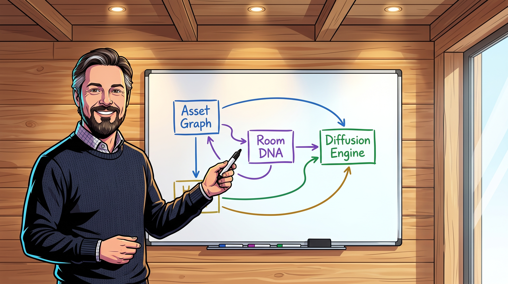
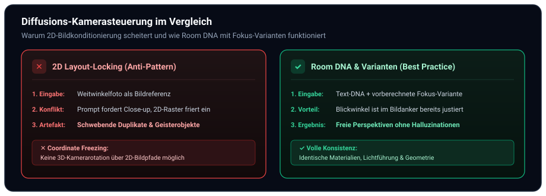
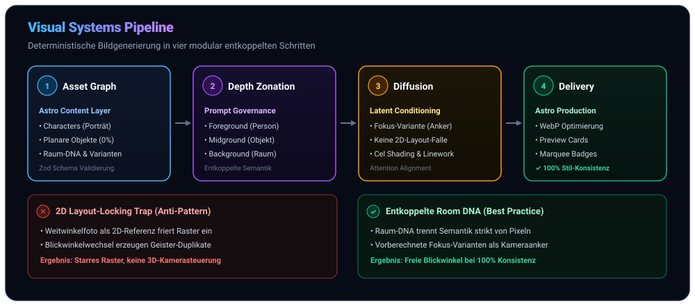
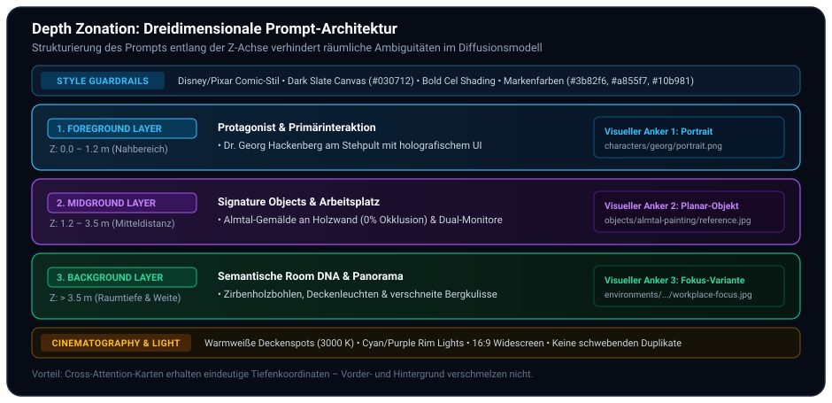

In unserer Beitragsreihe zur praktischen IT- und KI-Transformation haben wir uns ausführlich mit skalierbaren Softwarearchitekturen befasst – von [Mastra und TypeScript-basierten Procedural Graphs](/posts/2026_09_20_procedural_graphs_in_mastra_technische_umsetzung/) über das [Langzeitgedächtnis via Mem0](/posts/2026_09_04_langzeitgedaechtnis_llm_agenten_mem0/) bis zur [Performance-Optimierung moderner Astro-Websites](/posts/2026_05_23_website_relaunch_astro_typescript/). 

Diese Website ([hackenberg.tech](https://hackenberg.tech)) dient dabei nicht nur als technisches Blog und akademisches Portfolio, sondern als produktives **Reallabor für agentenbasierte Content-Automatisierung**: Wann immer neue Fachartikel, didaktische Fallstudien oder Systemarchitekturen publiziert werden, sollen autonome KI-Coding-Assistenten (wie Google Antigravity, Claude Code oder Cursor) passende Illustrationen, Hero-Grafiken und Schaubilder automatisiert und reproduzierbar generieren – mit dem Autor selbst als wiederkehrendem Protagonisten in seinen tatsächlichen Arbeits- und Forschungsumgebungen (vom alpinen Home Office in Grünau im Almtal bis zum Design Thinking Lab am Campus Wels).

Doch genau an dieser Schnittstelle stehen technische Teams vor einer völlig neuartigen Hürde: **visuelle Konsistenz**.

Während Sprachmodelle (LLMs) dank Zod-Schemas, formalen Grammatiken und Function Calling inzwischen deterministisch und reproduzierbar strukturierten JSON-Code liefern, gleicht die generative Bildsynthese in den meisten Organisationen nach wie vor einem stochastischen Glücksspiel. Wer versucht, eine zusammenhängende visuelle Markenwelt, illustrative Fallstudien oder didaktische Lehrinhalte über Hunderte Artikel hinweg konsistent zu bebildern, scheitert regelmäßig an fundamentalen Limitationen moderner Diffusionsmodelle:

* Gesichter verändern ihre Knochenstruktur und ihr Alter von Bild zu Bild.
* Signature-Objekte (wie ein bestimmtes Gemälde, ein Firmengadget oder ein Messgerät) halluzinieren unkontrolliert ihre Geometrie, Farben und Positionen.
* Innenräume driften ab: Was eben noch ein alpines Holz-Arbeitszimmer war, mutiert im nächsten Prompt zu einem sterilen Großraumbüro.
* Und vor allem: **Der Versuch, eine bestehende Szene aus einem neuen Kamerawinkel zu zeigen, endet verlässlich im visuellen Chaos.**

Dieser Beitrag dokumentiert die ingenieurwissenschaftlichen Grundlagen unseres **Visual Systems Engineering**: Wie wir die Mechanismen von Diffusionsmodellen analysiert haben, warum herkömmliche Bildkonditionierungen in die sogenannte **2D-Layout-Locking-Falle** tappen, und wie ein relationaler Asset-Graph in Kombination mit **Room DNA**, diskreten **Fokus-Varianten** und strikten **Agenten-Protokollen ([`AGENTS.md`](https://github.com/ghackenberg/ghackenberg.github.io/blob/main/AGENTS.md))** eine vollständig deterministische, markenkonforme Bildgenerierungsmaschine ermöglicht.



## 1. Das Konsistenz-Dilemma generativer Diffusionsmodelle

Um zu verstehen, warum Bildgeneratoren bei komplexen Kompositionen scheitern, muss man ihre mathematische Funktionsweise betrachten. Moderne Diffusionsmodelle (wie Stable Diffusion, Flux oder Imagen) arbeiten nicht mit einem impliziten räumlichen 3D-Weltmodell, sondern approximieren Wahrscheinlichkeitsverteilungen in einem komprimierten latenten Bildraum $\mathcal{Z}$.

Während des iterativen Denoising-Prozesses zum Zeitpunkt $t \in [0, T]$ steuern Cross-Attention-Layer, welche Text-Tokens aus dem Prompt-Embedding $\mathbf{c}$ welche latenten Raumregionen $z_t$ beeinflussen:

$$\text{Attention}(Q, K, V) = \text{softmax}\left(\frac{Q K^T}{\sqrt{d_k}}\right) V$$

Dabei repräsentiert $Q = W_Q z_t$ die Bildmerkmale und $K = W_K \mathbf{c}$ sowie $V = W_V \mathbf{c}$ die semantischen Text-Embeddings.

In der Praxis führt das naive Einspeisen von Freitext-Prompts zu zwei typischen Fehlermustern:
1. **Semantic Drift:** Je mehr Details („Mann mit Brille, Eichenschreibtisch, Kiefernholzwand, abstraktes Kunstwerk, Bergpanorama“) in einen unstrukturierten Textabsatz gestopft werden, desto stärker konkurrieren die Tokens in der Aufmerksamkeitsmatrix. Das Modell priorisiert dominante Tokens statistisch und „vergisst“ nachgelagerte Details oder vermischt Attribute (*Attribute Bleeding*).
2. **Spurious Correlation:** Bestimmte Begriffe triggern stereotype Trainingsdaten. Das Wort „Professor“ erzeugt automatisch weiße Haare und ein Tweed-Sakko; das Wort „Büro“ erzwingt Bürostühle mit Rollen und Aktenordner, selbst wenn ein ergonomisches Stehpult im Holzhaus gefordert war.

Die naheliegende Idee vieler Entwickler – dem Modell einfach ein Referenzfoto des Raums über multimodale Bildkanäle mitzugeben (in agentenbasierten Entwicklungsumgebungen und Diffusions-APIs meist als Parameter `ImagePaths` implementiert, technisch realisiert über Vision-Encoder, ControlNet oder IP-Adapter) – führt jedoch direkt in ein noch viel gravierenderes architektonisches Problem.

## 2. Die 2D-Layout-Locking-Falle (*Coordinate Freezing*)

Die schmerzhafteste Erkenntnis unserer empirischen Testreihen war die Entdeckung der **2D-Layout-Locking-Falle**:

> [!WARNING]
> **Das 2D-Layout-Locking-Dilemma:**
> Übergibt man einem Diffusionsmodell ein 2D-Weitwinkelfoto eines realen Zimmers als Bildreferenz (via `ImagePaths` bzw. Vision-Konditionierung) und fordert im Text-Prompt eine Nahaufnahme oder einen Perspektivenwechsel (z. B. *„Close-up shot of the desk facing the window“*), **rotiert das Modell die Kamera nicht im 3D-Raum**. Stattdessen friert es die 2D-Bounding-Boxen des Referenzbildes im latenten Raum ein und erzeugt surreale, schwebende Duplikate.



### Warum geschieht das?

Multimodale Konditionierungsmodule (wie IP-Adapter oder Vision-Encoder) extrahieren räumliche Feature-Maps aus der Bildreferenz. Wenn ein Weitwinkelbild übergeben wird, kodiert der Vision-Encoder:
* *Oben links:* Gemälde auf Position $(x_1, y_1)$ mit Bounding-Box $S_1$.
* *Bildmitte:* Whiteboard auf Position $(x_2, y_2)$ mit Bounding-Box $S_2$.
* *Unten rechts:* Schreibtischkante auf Position $(x_3, y_3)$.

Fordert der Prompt nun: *„Camera close-up on the desk, looking directly at the monitor“*, entsteht ein mathematischer Zielkonflikt:
* Der **Text-Prior** verlangt, dass der Monitor 70 % der Bildfläche füllt.
* Der **Image-Konditionierungs-Prior** erzwingt jedoch mit hoher Wahrscheinlichkeit, dass die Pixelregionen $(x_1, y_1)$ weiterhin das Gemälde und $(x_2, y_2)$ das Whiteboard darstellen müssen.

Das Resultat ist eine visuelle Halluzination: Das Modell zeichnet den Schreibtisch groß in den Vordergrund, inpaintet aber im verbleibenden Raum die Miniatur-Gegenstände des Weitwinkels exakt an ihren alten 2D-Koordinaten erneut. Es entstehen **zwei Monitore, zwei Gemälde oder im Raum schwebende Schreibtische**.

### Attribute Bleeding durch unsaubere Referenz-Assets

Ein verwandtes Phänomen tritt auf, wenn Referenz-Assets nicht zu 100 % isoliert sind. Fotografiert man beispielsweise ein an der Wand hängendes Bild schräg ab, sodass im Vordergrund die Ecke eines Monitors oder eine Spiegelung im Glas sichtbar ist, lernt der Encoder diese Artefakte als inhärente Eigenschaft des Kunstwerks. 

Bei der späteren Generierung „bluten“ diese Merkmale in die generierten Szenen: Plötzlich tauchen auf jedem generierten Bild unerwünschte schwarze Monitorränder oder Lichtflecken an unpassenden Stellen auf.

## 3. Die Lösung: Room DNA, Fokus-Varianten und 0 % Okklusion

Um dieses Konsistenz-Dilemma fundamental zu lösen, haben wir ein dreistufiges Entkopplungsprinzip etabliert: von rektifizierten, okklusionsfreien Signature-Objekten über rein semantische Raum-DNA bis hin zu vorberechneten Fokus-Varianten als verlässliche Kamera-Anker.

### 1. 0 % Okklusion bei Signature Objects (Planar Flat-Lays)
Jedes reale Referenzobjekt, das in generierten Szenen wiederkehren soll (z. B. das charakteristische bunte Almtal-Gemälde im Büro von Dr. Georg Hackenberg), wird vor der Aufnahme in die Bibliothek **planar und orthografisch rektifiziert**:
* Perspektivische Verzerrungen werden über Homografie-Transformationen vollständig entzerrt.
* Vordergrundverdeckungen werden auf exakt 0 % reduziert.
* Das Objekt wird als reines 2D-Flat-Lay mit sauberem Rahmen und Passepartout registriert ([`src/content/objects/almtal-abstract-painting/reference.jpg`](https://github.com/ghackenberg/ghackenberg.github.io/blob/main/src/content/objects/almtal-abstract-painting/reference.jpg)).

Dadurch fungiert das Bild als reiner semantischer Textur- und Geometrie-Anker, ohne störende Raum-Artefakte einzuschleppen.

### 2. Semantische „Room DNA“ statt 2D-Raumfotos
Anstatt dem Diffusionsmodell Weitwinkel-Fotos eines Raums zu übergeben, wenn eine neue Szene generiert werden soll, beschreiben wir Räume ausschließlich über ihre **Room DNA**:
* **Architektur:** Wandaufbau, Raumgeometrie, Fensterachsen, Deckenhöhe.
* **Materialien:** Horizontale österreichische Zirben- oder Kiefernholzbohlen, matter Sichtbeton, helle Eiche.
* **Lichtführung:** Warmweiße Deckenspots (3000 K), indirektes lineares Akzentlicht, blaues Dämmerungslicht durch Panoramafenster.
* **Farbpalette:** Warme Holztöne im Kontrast zu tiefem Dark Slate (`#030712`) und Markenakzenten (`#3b82f6`, `#a855f7`, `#10b981`).
* **Außenansicht:** Verschneiter Almtaler Bergwald, Wels-Backstein-Innenhof oder Kirchturm.

Da die Room DNA textbasiert ist, besitzt sie **keine starren 2D-Pixelkoordinaten**. Das Modell ist frei, die Kamera im Raum beliebig zu positionieren, während Materialien, Lichtstimmung und Stilidentität absolut konsistent bleiben.

### 3. Diskrete Fokus-Varianten als Kamera-Anker
Für häufig wiederkehrende Blickwinkel generieren wir einmalig hochqualitative **Fokus-Varianten** und hinterlegen sie als feste visuelle Anker:
* `workplace-focus`: Dreiviertelperspektive auf den Schreibtisch mit Blick auf das Whiteboard und das Almtal-Gemälde.
* `beamer-screen-focus`: Frontale Sicht auf die Großbildprojektion im Design Thinking Lab Wels.
* `visitor-table-focus`: Augenhöhe-Blick auf den Besprechungstisch im Campus-Büro Wels.

Soll eine neue Szene an diesem spezifischen Arbeitsplatz stattfinden, übergeben wir **nicht das Weitwinkelfoto**, sondern exakt die vorberechnete Fokus-Variante als Konditionierungsanker. Das Modell muss keine unmögliche Kamerarotation mehr vollziehen, sondern lediglich die Person oder die Bildschirminhalte in die bestehende, perfekt proportionierte Kameraperspektive einpassen.

### Exkurs: Wie entstehen Fokus-Varianten ohne Henne-Ei-Problem?

Ein aufmerksamer Leser wird an dieser Stelle einwenden: *Wenn Diffusionsmodelle bei der 2D-Bildkonditionierung die Kamera im Raum nicht drehen können, wie wurden die Fokus-Varianten dann überhaupt erst erzeugt?*

Hier greift das Entkopplungsprinzip: Fokus-Varianten werden **niemals durch das Drehen eines existierenden Weitwinkel-Referenzbildes** erzeugt. Stattdessen nutzen wir zwei deterministische Pfade:

1. **Zero-Shot Text-Synthese aus der Room DNA:** Die leere Kulisse eines gewünschten Blickwinkels wird *ohne jegliche Bildkonditionierung* (also mit leerem `ImagePaths: []`) rein aus der textuellen Room DNA und einer präzisen geometrischen Kameraanweisung generiert (z. B. *„Three-quarters eye-level perspective focused on an empty standing desk, horizontal pine timber walls, curved monitor on the left, mountain panorama window on the right, no people“*). Da das Modell nicht an eine 2D-Feature-Map gefesselt ist, erzeugt es die Raumgeometrie aus der neuen Perspektive ohne Bounding-Box-Kollisionen.
2. **Winkelgetreue Primär-Fotografie:** Alternativ fotografiert man den realen Arbeitsplatz von vornherein aus exakt diesem Blickwinkel (oder entzerrt eine reale Detailaufnahme orthografisch) und bereinigt sie auf 0 % Vordergrundverdeckung.

Sobald eine Fokus-Variante visuell verifiziert ist, wird sie als statische Bilddatei (z. B. `workplace-focus.jpg`) fest in der Bibliothek eingecheckt. Ab diesem Moment dient sie als **unveränderlicher 2D-Geometrie-Anker** für alle künftigen Bildprompts, in denen nur noch Personen, Posen, Kleidung oder Bildschirminhalte dynamisch hineingeneriert werden.

## 4. Die Architektur des Relationalen Asset-Graphen

Zur Verwaltung dieser modularen Bausteine haben wir den Astro Content Layer ([`src/content.config.ts`](https://github.com/ghackenberg/ghackenberg.github.io/blob/main/src/content.config.ts)) um drei formal typisierte Kollektionen erweitert, die über Zod-Schemas und relationale `reference()`-Felder bidirektional verknüpft sind.



### Das Schema in TypeScript ([`src/content.config.ts`](https://github.com/ghackenberg/ghackenberg.github.io/blob/main/src/content.config.ts))

```typescript
import { defineCollection, reference, z } from 'astro:content';

// 1. Signature Objects (0% Occlusion Flat-Lays)
const objects = defineCollection({
  schema: ({ image }) => z.object({
    name: z.string(),
    description: z.string(),
    referenceImage: image(),
    geometry: z.object({
      form: z.string(),
      materials: z.array(z.string()),
      colors: z.array(z.string()),
    }),
    environments: z.array(reference('environments')).default([]),
    characters: z.array(reference('characters')).default([]),
  }),
});

// 2. Environments mit Room DNA & Fokus-Varianten
const environments = defineCollection({
  schema: ({ image }) => z.object({
    name: z.string(),
    description: z.string(),
    referenceImage: image(),
    dna: z.object({
      architecture: z.string(),
      materials: z.object({
        walls: z.string(),
        ceiling: z.string(),
        flooring: z.string(),
      }),
      lighting: z.string(),
      palette: z.array(z.string()),
      view: z.string(),
    }),
    variants: z.array(z.object({
      name: z.string(),
      image: image(),
      shotType: z.enum(['close-up', 'three-quarters', 'wide-angle', 'eye-level']),
      cameraAngle: z.string(),
      focalTarget: z.string(),
      maxCharacters: z.number().default(1),
      visibleObjects: z.array(z.string()).default([]),
      depthLayers: z.object({
        foreground: z.string(),
        midground: z.string(),
        background: z.string(),
      }),
      promptSnippet: z.string(),
    })).default([]),
    characters: z.array(reference('characters')).default([]),
    objects: z.array(reference('objects')).default([]),
  }),
});

// 3. Characters mit Identitäts-Ankern
const characters = defineCollection({
  schema: ({ image }) => z.object({
    name: z.string(),
    role: z.string(),
    portrait: image(),
    attributes: z.object({
      hair: z.string(),
      eyes: z.string(),
      features: z.array(z.string()),
      clothingDefaults: z.string(),
    }),
    environments: z.array(reference('environments')).default([]),
    objects: z.array(reference('objects')).default([]),
  }),
});
```

### Die Vorteile der typisierten Modellierung:
1. **Astro als Git-versionierter Knowledge Graph:** Während Astro primär als Web-Framework für inhaltsgetriebene Websites bekannt ist, fungiert sein Content Layer hier als **lokaler, typisierter Knowledge Graph**. Da alle Umgebungen, Objekte und Charaktere als Markdown-Dateien mit Zod-Validierung im Repository liegen, können multimodale KI-Agenten die Beziehungen direkt im Dateisystem abfragen – ganz ohne externe Graphdatenbank oder Vektor-Index.
2. **Referenzielle Integrität:** Astro prüft beim Build (`npm run build`), ob alle verknüpften Umgebungen und Objekte tatsächlich existieren. Tippfehler in Pfaden oder IDs führen zu sofortigen Build-Fehlern statt stillen Halluzinationen.
3. **Kamerakapazitäts-Schranke (`maxCharacters`):** Jede Fokus-Variante deklariert explizit, wie viele Personen in den Bildausschnitt passen. Ein Arbeitsplatz-Close-up limitiert die Szene auf maximal 1 Charakter; die Beamer-Bühne erlaubt bis zu 2 Personen; das gesamte Labor bis zu 6.
4. **Objektsichtbarkeits-Filter (`visibleObjects`):** Wenn das Gemälde an der Nordwand hängt, darf es bei einer Kameraeinstellung Richtung Südfenster im Prompt gar nicht erst auftauchen. Der Filter stellt sicher, dass nur Gegenstände konditioniert werden, die sich im Sichtkegel (*Frustum*) des gewählten Winkels befinden.

## 5. Tiefengestaffeltes Prompting (*Depth Zonation*)

Wer oder was ist hierbei der „Generator“? In unserer agentenbasierten Architektur ist der Generator kein monolithisches Skript, sondern der **autonome KI-Coding-Agent** selbst (wie Google Antigravity, Claude Code oder Cursor). Wenn ein neuer Fachbeitrag bebildert werden soll, liest der Agent den relationalen Asset-Graphen aus den Markdown-Dateien ein, prüft die Sichtbarkeiten und synthetisiert den finalen Bildprompt nach dem Prinzip der **Depth Zonation**.

Anstelle eines unstrukturierten Fließtextes wird der Prompt in drei klar getrennte räumliche Ebenen zerlegt:



### Warum funktioniert diese Staffelung so verlässlich?
1. **Keine räumliche Ambiguität:** Das Diffusionsmodell muss nicht raten, ob das Gemälde vor oder hinter der Person platziert werden soll. Durch die explizite Zuweisung zu *Foreground*, *Midground* und *Background* wird die Aufmerksamkeitskarte entlang der simulierten Z-Achse strukturiert.
2. **Harmonisierte Bildpfad-Konditionierung (`ImagePaths`):** Es werden maximal drei saubere Ankerbilder übergeben:
   - *Anker 1:* Personen-Portrait ([`src/content/characters/georg/portrait.png`](https://github.com/ghackenberg/ghackenberg.github.io/blob/main/src/content/characters/georg/portrait.png)) für Gesichtszüge und Haare.
   - *Anker 2:* Fokus-Variante ([`src/content/environments/home-office-almtal/workplace-focus.jpg`](https://github.com/ghackenberg/ghackenberg.github.io/blob/main/src/content/environments/home-office-almtal/workplace-focus.jpg)) für Kameraperspektive und Raumkomposition.
   - *Anker 3:* Planar-Objekt ([`src/content/objects/almtal-abstract-painting/reference.jpg`](https://github.com/ghackenberg/ghackenberg.github.io/blob/main/src/content/objects/almtal-abstract-painting/reference.jpg)) für die exakte Gemäldereproduktion.

### Konkreter Durchstich: Vom relationalen Schema zum fertigen Prompt

Wie greifen diese Bausteine in der Praxis ineinander? Betrachten wir die Konfiguration der Fokus-Variante `workplace-focus` in [`src/content/environments/home-office-almtal/index.md`](https://github.com/ghackenberg/ghackenberg.github.io/blob/main/src/content/environments/home-office-almtal/index.md):

```yaml
variants:
  - name: "workplace-focus"
    shotType: "three-quarters"
    cameraAngle: "Dynamic three-quarters eye-level perspective angled towards the workstation"
    focalTarget: "Curved ultra-wide computer monitor on standing desk"
    maxCharacters: 1
    visibleObjects:
      - "almtal-abstract-painting"
    depthLayers:
      foreground: "Standing desk edge with black mechanical keyboard, mouse, succulent, and ALMTAL ceramic mug"
      midground: "Massive curved ultra-wide monitor with glowing blank screen and modern grey ergonomic swivel chair"
      background: "Horizontal pine timber wall with framed modernist alpine painting, rear whiteboard, and sunny mountain window"
```

Soll der KI-Agent nun eine illustrative Szene für einen Artikel über Software-Architektur generieren, fragt er diesen Datensatz ab und setzt ihn mit den Attributen des Protagonisten (`georg`) zu folgendem deterministischen Prompt zusammen:

```text
PROMPT:
A dynamic scene inside a modern timber home office in Grünau im Almtal.
- Foreground: Standing desk edge with a black mechanical keyboard, mouse, a small succulent, and an ALMTAL ceramic mug.
- Midground: Dr. Georg Hackenberg in a royal blue knit sweater sitting at the workstation, smiling towards the viewer, working on a massive curved ultra-wide monitor displaying system architecture schematics.
- Background: Warm horizontal pine timber wall with the framed Almtal modernist alpine painting, a rear magnetic whiteboard, and bright alpine daylight pouring through a panoramic picture window.
- Aesthetic: Modern Disney/Pixar comic illustration style, crisp dark ink outlines, bold vibrant cel shading, dark slate background (#030712) with electric brand accents (#3b82f6, #f59e0b).

IMAGEPATHS:
[
  "src/content/characters/georg/portrait.png",
  "src/content/environments/home-office-almtal/workplace-focus.jpg",
  "src/content/objects/almtal-abstract-painting/reference.jpg"
]
```

Das Diffusionsmodell erhält somit drei exakt aufeinander abgestimmte Konditionierungsanker und einen unmissverständlichen räumlichen Bauplan. Es muss weder die Perspektive erraten noch Gegenstände an unmöglichen Stellen im Raum erfinden.

## 6. Agenten-Governance & Leitplanken in `AGENTS.md`

Damit autonome AI-Coding-Assistenten (wie Google Antigravity, Claude Code oder Cursor) diese Regeln bei jeder Programmerweiterung verlässlich befolgen, sind die Workflows direkt in den Systemregeln des Repositories ([`AGENTS.md`](https://github.com/ghackenberg/ghackenberg.github.io/blob/main/AGENTS.md)) verankert:

```markdown
## 1. Visual Style & Image Generation Protocol
Whenever asked to generate or modify an image (preview, hero, social card, or diagram):
1. Protagonist & Character Discovery Protocol:
   - For solo professional scenes, use Dr. Georg Hackenberg as the protagonist.
   - Respect the focus variant's maxCharacters limit.
   - Propose and register new characters before generating multi-person scenes.
2. Follow the Relational Library Protocol (Environments & Objects):
   - Select the best matching focus variant for the camera angle and setting.
   - Respect visibleObjects: Incorporate only physically visible objects into depth layers.
   - Object references must be 100% planar/orthographic flat-lays with 0% foreground occlusion.
3. Decoupled Viewpoints & ImagePaths Conditioning Rules:
   - NEVER pass wide-angle room overview photos to ImagePaths when requesting a close-up.
   - MANDATORY: Always use pre-rendered Focus Variants as environment anchors in ImagePaths.
   - Use text-based Room DNA and depth zonation (Foreground / Midground / Background).
4. User Review Gate:
   - Before calling generate_image, always present the exact prompt to the user for review.
5. Style Aesthetic:
   - Strictly adhere to IMAGE_STYLE_GUIDELINES.md: Disney/Pixar comic illustration style,
     crisp dark ink line art, bold cel shading, dark slate canvas (#030712), and website brand colors.
```

Durch das verbindliche **User Review Gate** (Regel 4) bleibt der Mensch im Regelkreis (*Human-in-the-Loop*): Bevor teure GPU-Zyklen oder API-Credits verbraucht werden, erhält der Entwickler den vollständig synthetisierten Prompt zur finalen Freigabe.

### Warum Disney/Pixar Comic-Stil? (Stil als visueller Normalisierer)

Ein oft übersehener, aber entscheidender architektonischer Aspekt ist die Wahl des Bildstils: Warum erzwingen die Richtlinien ([`IMAGE_STYLE_GUIDELINES.md`](https://github.com/ghackenberg/ghackenberg.github.io/blob/main/IMAGE_STYLE_GUIDELINES.md)) einen **Disney/Pixar-inspirierten Comic-Illustrationsstil** mit dunklen Tusche-Outlines, Cel-Shading und einer Dark-Slate-Leinwand (`#030712`) anstelle von reinem Fotorealismus?

Dies ist keine rein subjektive Design-Entscheidung, sondern ein **ingenieurwissenschaftlicher Normalisierungsschritt**:
* **Heterogene Input-Quellen:** In einer realen Organisation stammen Bildanker aus völlig unterschiedlichen Welten – ein Studio-Portrait der Person, ein Smartphone-Schnappschuss eines Labortisches, ein abfotografiertes Ölgemälde und ein digitaler UI-Screenshot.
* **Das Fotorealismus-Dilemma (*Uncanny Valley*):** Versucht ein Diffusionsmodell, diese heterogenen Quellen fotorealistisch zu verschmelzen, kollidieren Farbtemperaturen, Rauschmuster, Schärfentiefen und Kameraobjektive. Das Gesicht wirkt wie hineinkopiert, die Beleuchtung bricht, und der Gesamteindruck landet im *Uncanny Valley*.
* **Stil als grafischer Compiler:** Das Regelwerk der Comic-Illustration fungiert als **visueller Compiler**. Es zwingt das Modell, alle eingehenden Merkmale auf dieselbe grafische Grammatik abzubilden: markante Vektorkonturen, flächige Schatten, harmonisierte Farbwelten und gezielte Akzentlichter in Markenfarben (`#3b82f6`, `#f59e0b`, `#10b981`). Dadurch wirken selbst radikal unterschiedliche Bildkomponenten wie aus einem einzigen Guss gezeichnet.

## 7. Fazit: Von stochastischer Generierung zu deterministischem Visual Engineering

Die Transformation generativer Bildmodelle von einem unberechenbaren Spielzeug zu einem industriell nutzbaren Produktionswerkzeug erfordert denselben Paradigmenwechsel, den die Softwareentwicklung vor Jahrzehnten durchlaufen hat: **Modularisierung, saubere Schnittstellen und strikte Entkopplung**.

| Dimension | Traditioneller Prompt-Ansatz | Visual Systems Engineering |
| :--- | :--- | :--- |
| **Raumbeschreibung** | Ad-hoc Freitext-Prompts | Strukturierte **Room DNA** (Architektur, Materialien, Licht) |
| **Kamerasteuerung** | Diffuse Schlagwörter ("wide-angle", "close-up") | Diskrete, vorgerenderte **Fokus-Varianten** |
| **Objektkonsistenz** | Halluzinierte Deko-Objekte | Rektifizierte **0 % Occlusion Flat-Lays** |
| **Personenführung** | Zufällige Nebendarsteller | Strikte **Capacity Gates** (`maxCharacters`) |
| **Bildkonditionierung** | Weitwinkelfoto in `ImagePaths` (Layout-Locking-Falle) | Entkoppelte Identitäts- und Fokusanker |
| **Architektur-Integration** | Isolierte Bilddateien im Asset-Ordner | Typisierter **Relationaler Asset-Graph** via Zod & Astro |

Mit dieser Architektur generieren wir in Sekunden druckreife Hero-Grafiken, Social Cards und Prozessdiagramme, die nahtlos in das Markenbild der Website passen – reproduzierbar, skalierbar und vollständig versionskontrolliert in Git.

### Weiterführende Ressourcen & Referenzen

* **Projekt-Leitlinien:** [`IMAGE_STYLE_GUIDELINES.md`](https://github.com/ghackenberg/ghackenberg.github.io/blob/main/IMAGE_STYLE_GUIDELINES.md) – Spezifikation der Farbpalette, Linienstärken und Cel-Shading-Ausschlüsse.
* **Agenten-Regeln:** [`AGENTS.md`](https://github.com/ghackenberg/ghackenberg.github.io/blob/main/AGENTS.md) – Die exakten Protokolle für generative AI-Assistenten.
* **Astro Content Layer:** [`src/content.config.ts`](https://github.com/ghackenberg/ghackenberg.github.io/blob/main/src/content.config.ts) – Formale Zod-Schemadefinitionen für Charaktere, Objekte und Umgebungen.
* **Research Paper:** *Zhang et al. (2023): „Adding Conditional Control to Text-to-Image Diffusion Models (ControlNet)“*, IEEE/CVF ICCV 2023.
* **Research Paper:** *Ye et al. (2023): „IP-Adapter: Text-Compatible Image Prompt Adapter for Text-to-Image Diffusion Models“*, arXiv:2308.06721.
