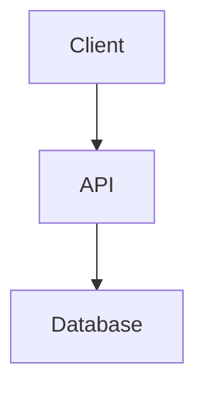
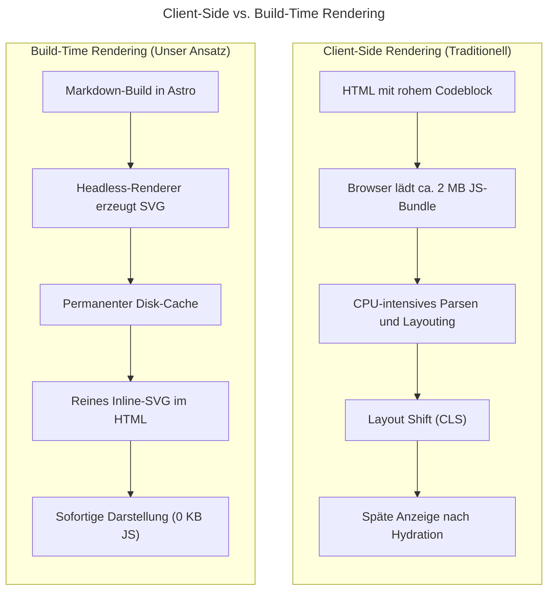
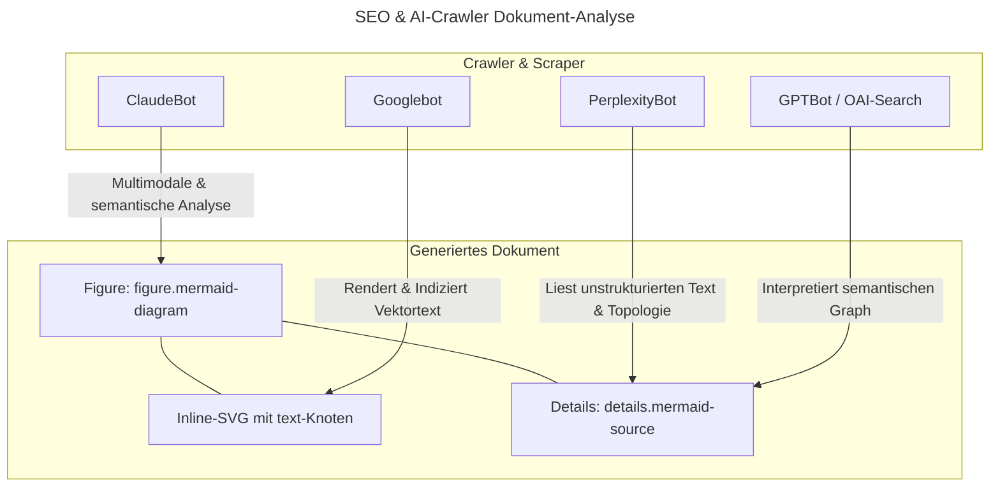
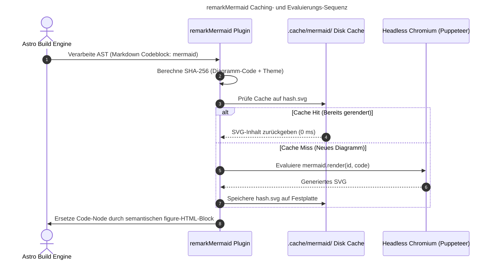
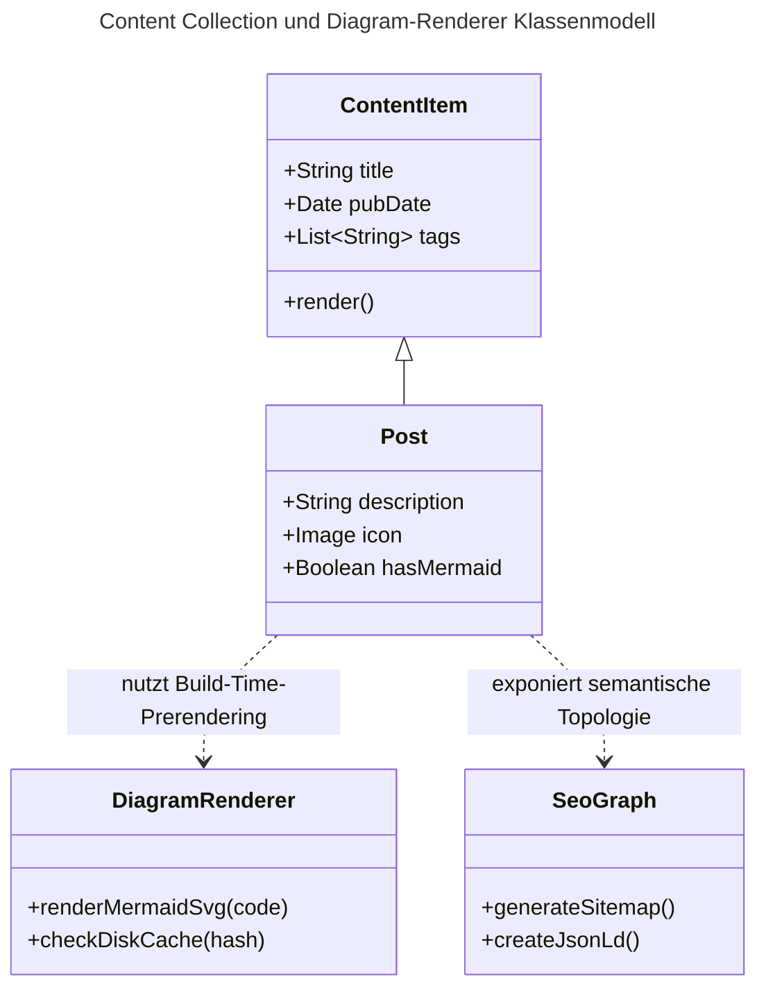

In unserer kontinuierlichen Arbeit an modernen Web- und Systemarchitekturen – von [TypeScript-basierten Agentic-Workflows](/posts/2026_09_20_procedural_graphs_in_mastra_technische_umsetzung/) über [visuelle Konsistenzsysteme](/posts/2026_09_21_bildgenerierungsmaschine_reusable_assets_room_dna/) bis hin zur [Performance-Optimierung datenintensiver Portale](/posts/2026_05_23_website_relaunch_astro_typescript/) – spielen **technische Diagramme** eine Schlüsselrolle. Komplexe Software-Topologien, Datenflussmodelle und Sequenzabläufe lassen sich visuell um ein Vielfaches schneller erfassen als durch reine Textwüsten.

Unter Entwicklern und technischen Autoren hat sich hierfür das textbasierte Format **[Mermaid.js](https://mermaid.js.org/)** als weltweiter Quasi-Standard etabliert. Statt Schaubilder mühsam in externen Vektorwerkzeugen zu zeichnen, als binäre PNG-Dateien zu exportieren und bei jeder kleinen Code-Änderung neu hochzuladen, beschreiben wir Diagramme deklarativ direkt in Markdown:

````markdown

````

Doch wer Mermaid in moderne Content-Plattformen wie [Astro](https://astro.build/) integrieren möchte, steht vor einem architektonischen Scheideweg: **Client-Side Rendering oder Build-Time Static Prerendering?**

In diesem Beitrag analysieren wir, warum herkömmliche clientseitige Rendering-Ansätze modernen Web-Vitals schaden, wie wir auf dieser Website eine **Zero-Client-JS Build-Time-Pipeline** implementiert haben und warum maschinenlesbare Vektordiagramme für traditionelle Suchmaschinen (SEO) sowie generative KI-Suchmaschinen (GEO / AIO) einen dramatischen Vorteil darstellen.


## 1. Das Dilemma des clientseitigen Diagramm-Renderings

Der gängigste Integrationspfad in Content-Management-Systemen und Frameworks besteht darin, den Markdown-Codeblock unangetastet an den Browser auszuliefern und dort mittels `mermaid.initialize()` zu parsen. Was auf den ersten Blick bequem erscheint, erkauft man sich in der Praxis mit gravierenden Nachteilen:



### Die Nachteile von Client-Side Mermaid im Detail:

1. **Massiver JavaScript-Payload:** Das offizielle Mermaid-Bundle wiegt unkomprimiert rund 1,5 bis 2 Megabyte (selbst minifiziert und komprimiert ~350–500 KB). Für einen Blog-Post, der vielleicht zwei einfache Pfeildiagramme enthält, ein unverhältnismäßig hoher Preis.
2. **Cumulative Layout Shift (CLS):** Während des Ladens der Seite sieht der Leser zunächst einen unformatierten Textblock oder einen Ladespinner. Sobald das Script initialisiert wird, springt der Content abrupt nach unten. Das verschlechtert die Core Web Vitals und stört den Lesefluss spürbar.
3. **Batterie- und CPU-Last auf Mobilgeräten:** Die Layoutberechnungen (z. B. via D3, Dagre oder ELK) werden auf die Endgeräte der Besucher abgewälzt.

## 2. Warum Build-Time-SVGs für SEO, GEO und AIO entscheidend sind

Neben der reinen Render-Performance spielt die **Maschinenlesbarkeit** in der Ära generativer KI-Suche eine entscheidende Rolle.



### Der Mehrwert unseres Ansatzes für Suchsysteme:

* **Traditionelles SEO (Googlebot):** Google bevorzugt Seiten ohne lange Rendering-Warteschlangen. Da das Vektordiagramm als pures SVG direkt im ersten HTML-Paket enthalten ist, können Textlabels im Diagramm sofort tokenisiert und indexiert werden – ohne dass ein Headless-Chrome des Suchmaschinenbetreibers erst Client-JavaScript nachladen muss.
* **GEO & AIO (Generative Engine Optimization):** Moderne KI-Suchmaschinen wie Perplexity, SearchGPT oder Claude Crawlers parsen Webseiten häufig rein textbasiert im Fast-Path ohne JavaScript-Ausführung. Indem wir die Original-Mermaid-Quelle strukturiert in einem semantischen `<details>`-Element mitliefern, können Sprachmodelle die exakte Graph-Topologie, Kantenrelationen und Abhängigkeiten fehlerfrei rekonstruieren und in KI-Zusammenfassungen zitieren.
* **Barrierefreiheit (Accessibility):** Screenreader können `<figure>`, `aria-label` sowie die Vektortexte unmittelbar interpretieren, ohne auf asynchrone DOM-Mutationen warten zu müssen.

## 3. Die technische Umsetzung: Unser Remark-Plugin

Um die statische Generierung nahtlos in Astros Build-Prozess einzubinden, haben wir ein maßgeschneidertes Remark-Plugin ([`src/plugins/remark-mermaid.js`](file:///c:/Users/georg/Desktop/Repositories/ghackenberg.github.io/src/plugins/remark-mermaid.js)) entwickelt.

Da Mermaid auf Standard-DOM-APIs (insbesondere `getBBox()` und SVG-Font-Metriken) angewiesen ist, reicht reines Node.js ohne Rendering-Engine nicht aus. Statt jedoch externe CLI-Tools mit separaten Binaries aufzurufen, nutzen wir das im Projekt bereits vorhandene **Puppeteer**:



### Die Kernkomponenten der Architektur:

1. **AST-Interzeption vor Shiki:** Das Plugin fängt Codeblöcke mit `lang === 'mermaid'` in der Remark-Phase ab – noch bevor Astros integrierter Syntax-Highlighter (Shiki) versucht, den Mermaid-Code als gewöhnlichen Quelltext hervorzuheben.
2. **Deterministisches Disk-Caching:** Jedes Diagramm wird zusammen mit der Konfiguration gehasht (`sha256`). Befindet sich das SVG bereits im `.cache/mermaid/`-Verzeichnis, wird es in Mikrosekunden synchron von der SSD gelesen. Puppeteer wird in diesem Fall gar nicht erst gestartet!
3. **Lazy Singleton Lifecycle:** Erst wenn ein tatsächlicher Cache-Miss auftritt, wird eine gemeinsame Headless-Browser-Instanz erzeugt, die alle neuen Diagramme im Batch rendert und sich nach getaner Arbeit sauber beendet.

## 4. Konfiguration in Astros Markdown-Pipeline

Seit den neuesten Astro-Versionen werden Markdown-Plugins direkt an die `unified({...})`-Konfiguration übergeben. In unserer [`astro.config.mjs`](file:///c:/Users/georg/Desktop/Repositories/ghackenberg.github.io/astro.config.mjs) fügt sich das Plugin wie folgt ein:

```javascript
import { defineConfig } from 'astro/config';
import { unified } from '@astrojs/markdown-remark';
import remarkMath from 'remark-math';
import remarkMermaid from './src/plugins/remark-mermaid.js';
import rehypeKatex from 'rehype-katex';

export default defineConfig({
  markdown: {
    processor: unified({
      remarkPlugins: [remarkMath, remarkMermaid],
      rehypePlugins: [rehypeKatex],
    }),
  },
});
```

Zusätzlich sorgt ein maßgeschneidertes Dual-Theme dafür, dass alle generierten SVGs sowohl im Dark- als auch im Light-Mode perfekt zur Geltung kommen:
* **Dark Mode:** `#1e293b` (Slate-800) mit `#3b82f6` (Brand-Blue-Borders) und `#f8fafc`-Schrift
* **Light Mode:** `#ffffff` (White / Slate-50) mit `#2563eb` (Brand-Blue-Borders) und `#0f172a`-Schrift
* **Zero-JS Auto-Switch:** Beide SVGs werden statisch erzeugt; CSS schaltet beim Theme-Wechsel flackerfrei und ohne JavaScript zwischen den Vektorgrafiken um.
* **Typografie & Anti-Clipping:** Der serifenlose Web-Font-Stack (`Inter`) wird bereits während des Build-Steps per Headless-Renderer injiziert, wodurch Text-Bounding-Boxes pixelgenau berechnet werden.

## 5. Live-Test: Was Mermaid auf dieser Seite leisten kann

Um die Vielseitigkeit unserer neuen Pipeline zu demonstrieren, betrachten wir abschließend ein relationales Architekturmodell unseres Content- und Asset-Ökosystems:



## Fazit

Mit der Einführung von **Build-Time Static Mermaid Rendering** schlagen wir zwei Fliegen mit einer Klappe:
1. **Bestehende Autoren-Ergonomie:** Technische Schaubilder können direkt in Markdown versioniert, kollaborativ über Git gepflegt und unkompliziert aktualisiert werden.
2. **Kompromisslose Web-Performance:** Unsere Leser profitieren von sofort sichtbaren, gestochen scharfen Vektorgrafiken ohne einen einzigen Byte unnötiges Client-JavaScript – während Suchmaschinen und KI-Agenten die semantische Struktur unserer Artikel mühelos erschließen können.
