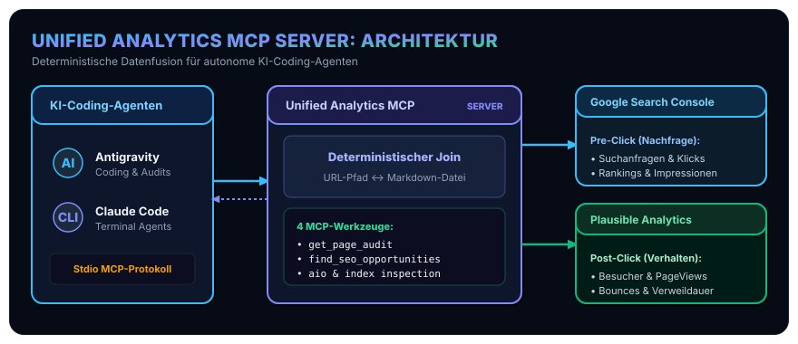
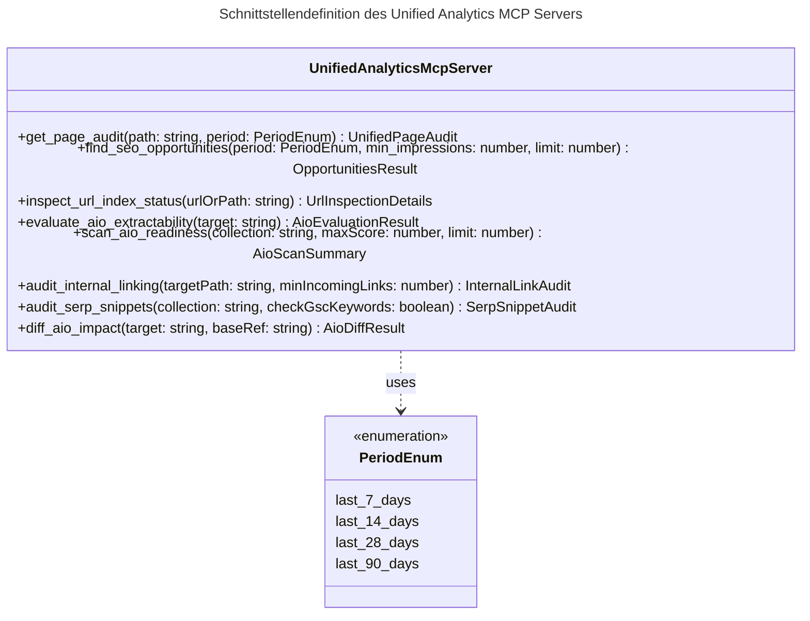
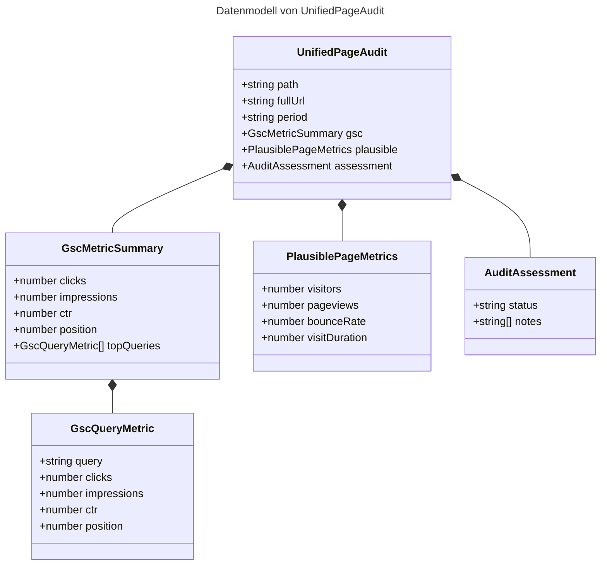
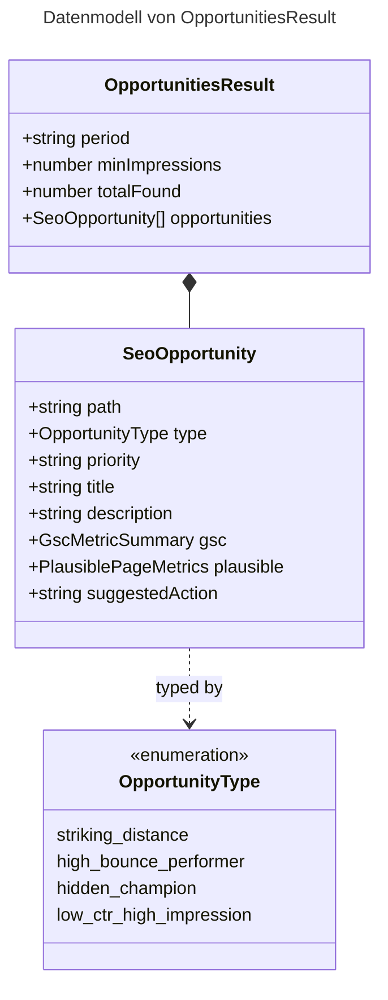
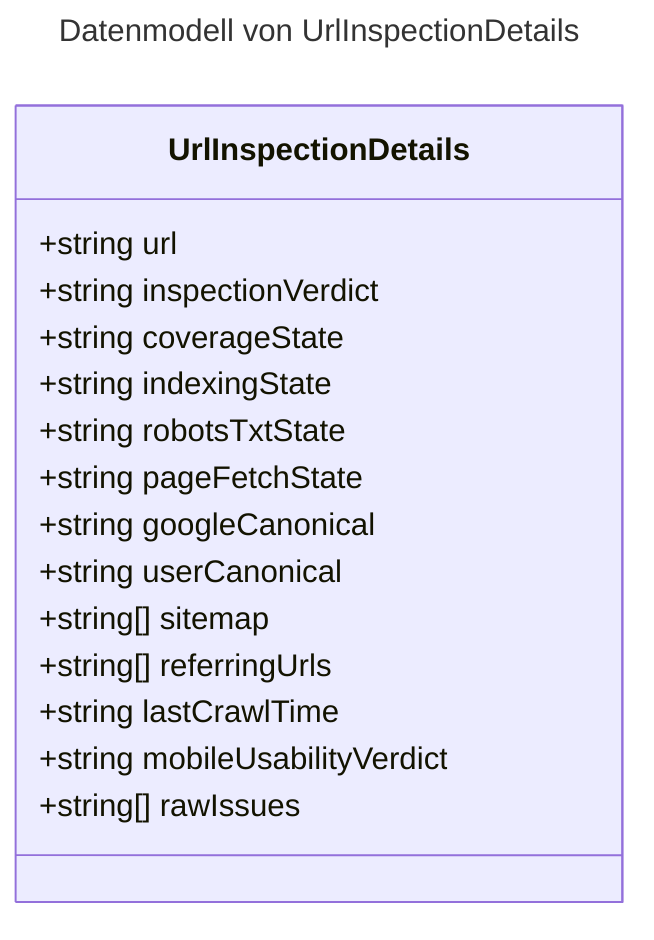
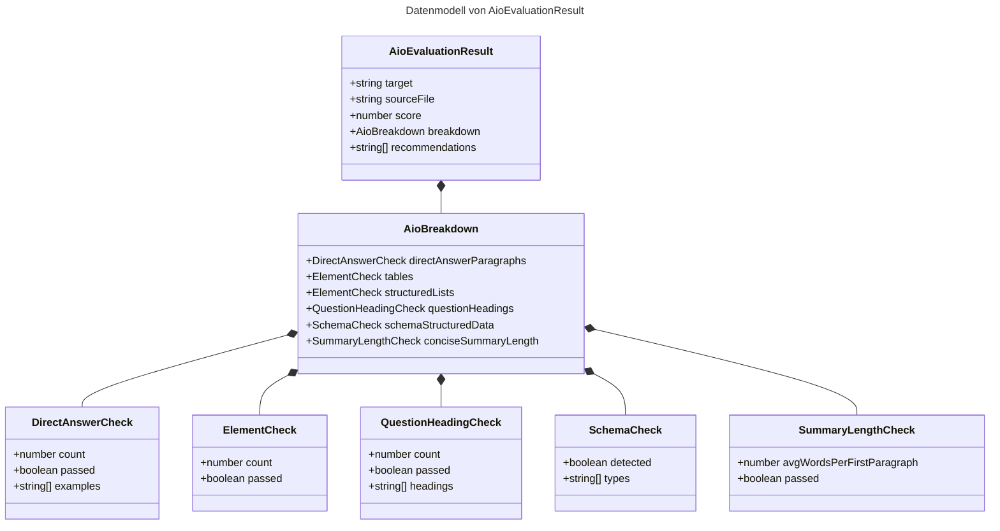
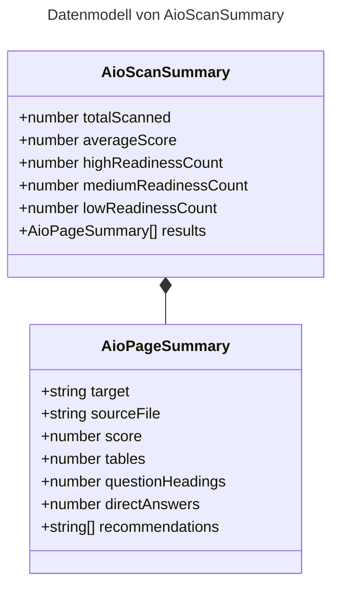
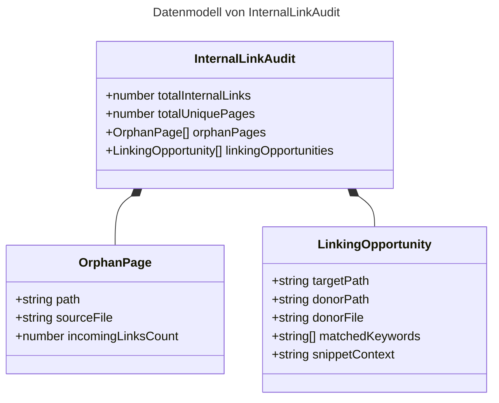
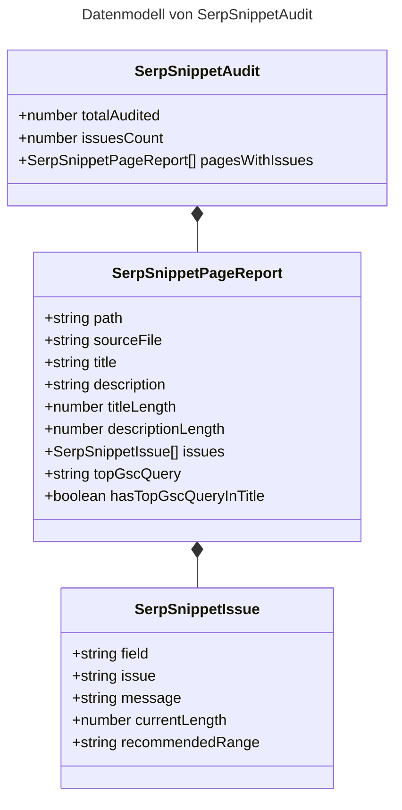
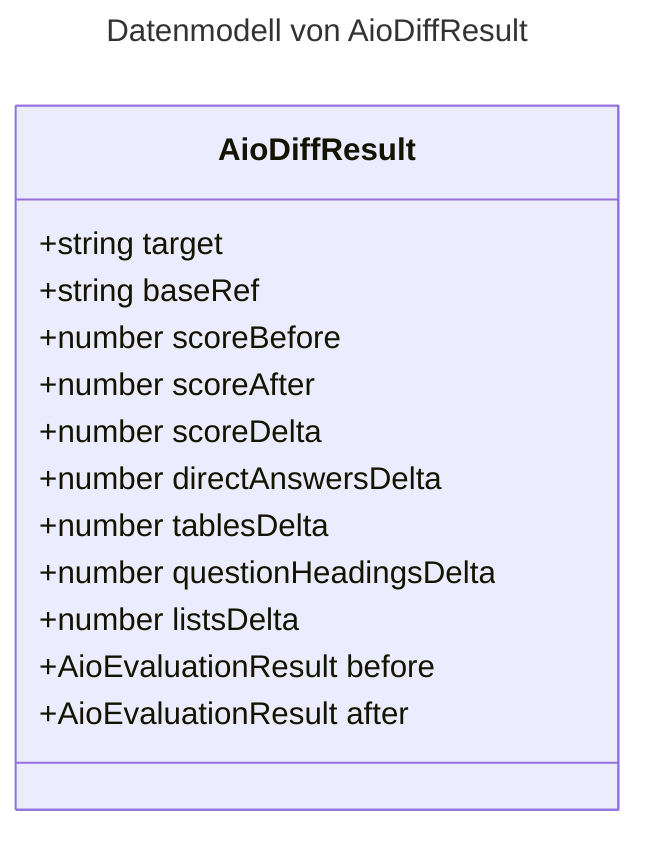

In unserer fortlaufenden Beitragsreihe zur Websichtbarkeit im Zeitalter generativer Sprachmodelle haben wir die Evolution von klassischem SEO hin zu modernen Standards schrittweise analysiert: von den [theoretischen Grundlagen und 4 Dimensionen moderner Sichtbarkeit (SEO, GEO, AEO, AIO)](/posts/2026_08_11_seo_geo_aeo_aio_optimierung/) über die [empirische Studienlage zu Zitationshebeln und Zero-Click-Suchen](/posts/2026_09_11_empirische_daten_geo_aeo_seo_studien/) bis hin zu den [industriellen Anforderungen im B2B-Bereich](/posts/2026_09_12_b2b_industrial_geo_maschinenlesbare_industrie/) und dem [vierstufigen GEO-Reifegradmodell](/posts/2026_09_13_geo_reifegradmodell_industrie_unternehmen/).

In jenem Reifegradmodell markiert **Level 4** den entscheidenden Schritt: die Transformation von manuell gepflegten Inhalten hin zu einem **geschlossenen, agentenfähigen Regelkreis**. Doch genau hier stießen Entwickler und Autoren bisher an eine methodische Mauer: das **[ROI-Paradoxon in der Zero-Click-Ökonomie](/posts/2026_09_14_roi_paradoxon_b2b_zero_click_citations/)** und die strikte Datensilo-Bildung bestehender Analysewerkzeuge.

In diesem Beitrag überführen wir die Theorie in die betriebliche Praxis. Wir stellen die Architektur unseres eigens entwickelten, quelloffenen **Unified Analytics MCP Servers** vor: wie er Google Search Console und die datenschutzfreundliche Open-Source-Plattform Plausible Analytics deterministisch zusammenführt, Rohdaten vor dem Kontext-Inject token-effizient aggregiert und autonomen Coding-Agenten (wie Antigravity oder Claude Code) acht mächtige Werkzeuge für automatische Inhaltsaudits, Graph-Analysen und Pre-Commit-Prüfungen an die Hand gibt.


## 1. Das Dilemma isolierter Datensilos: Warum SEO und Web-Analytics bisher getrennt waren

Klassische Suchmaschinenoptimierung und Web-Analytics operieren in der Praxis in zwei getrennten Welten, die ohne mühsame manuelle Tabellenkalkulationen nicht miteinander kommunizieren können.

Suchmaschinenbetreiber liefern über die **Google Search Console (GSC)** wertvolle Einblicke in die vorgelagerte Nachfrage: Welche Suchbegriffe (*Queries*) tippen Nutzer ein? Wie oft erscheint ein URL-Snippet in den Suchergebnissen (*Impressions*)? Welche Position nimmt die Seite im Ranking ein, und wie oft wird geklickt (*CTR*)? Doch sobald der Besucher auf den Link klickt, reißt der Datenstrom der Search Console vollständig ab. GSC hat keinerlei Kenntnis darüber, ob der Nutzer 5 Sekunden oder 10 Minuten auf der Seite verweilt, ob er den Artikel komplett liest oder sofort frustriert abspringt (*Bounce Rate*).

Web-Analyseplattformen wie **Plausible Analytics** erfassen hingegen exakt dieses nachgelagerte Nutzerverhalten: tatsächliche Besucherzahlen, Sitzungsdauer, Scrolltiefen und Konversionen – und das im Falle von Plausible ohne invasive Tracking-Cookies und vollkommen DSGVO-konform. Doch Plausible weiß aufgrund moderner Referrer-Policies und verschlüsselter Suchen nicht, über welche konkreten Suchanfragen der Besucher auf die jeweilige Seite gelangte.

| Analysedimension | Google Search Console (GSC) | Plausible Analytics | Vereinte Sicht (Unified Analytics) |
| :--- | :--- | :--- | :--- |
| **Erfasste Phase** | Vor dem Klick (Suchmaschine / SERP) | Nach dem Klick (Auf der Website) | Vollständige Customer Journey |
| **Kern-Metriken** | Queries, Impressions, Klicks, Ranking-Position | Unique Visitors, PageViews, Bounce Rate, Visit Duration | Opportunity-Score, Engagement-Validierung |
| **Stärke** | Exakte Intention & Sichtbarkeitspotenziale | Reale Interaktionsqualität & Leseverhalten | Ganzheitliche Inhaltsbewertung |
| **Schwäche** | Blind für Nutzerverhalten nach dem Klick | Blind für konkrete Suchbegriffe und Rankings | Benötigt deterministischen Join-Layer |

Wer Inhaltsentscheidungen isoliert auf Basis von GSC-Impressionen trifft, optimiert oft an den realen Leserinteressen vorbei. Wer nur auf PageViews in Plausible schaut, übersieht sogenannte *Striking-Distance-Chancen* (Suchbegriffe auf den Positionen 4 bis 15, die mit minimalen semantischen Justierungen auf Platz 1 steigen könnten).

## 2. Wie funktioniert die Systemarchitektur des Unified Analytics MCP Servers?

Der Unified Analytics MCP Server ist ein spezialisierter Microservice auf Basis von TypeScript und dem Model Context Protocol (MCP), der als Brücke zwischen KI-Coding-Assistenten, der Google Search Console API und der Plausible REST API fungiert.

Statt einem LLM gigantische Rohdatenmengen aus CSV-Exporten oder unfiltrierten JSON-Dumps in das Prompt-Fenster zu kippen, verlagert der MCP-Server die Rechenlast, Filterung und Aggregation vollständig auf die lokale Laufzeitumgebung. Über das standardisierte Protokoll empfängt das Sprachmodell ausschließlich präzise, token-optimierte Antworten.



### Deterministischer Pfad- und URL-Normalizer
Die größte Herausforderung beim Zusammenführen heterogener Datenquellen liegt in der Identifikation des gemeinsamen Schlüssels. Google Search Console liefert absolute, kanonische URLs (`https://hackenberg.tech/posts/mein-artikel/`), während Plausible relative Pfade (`/posts/mein-artikel`) protokolliert. Unser Normalizer vereinheitlicht Trailing Slashes, Protokolle und Domain-Präfixe deterministisch, sodass Suchanfragen und Verweildauer exakt auf denselben Markdown-Quelldateien im Astro-Repository abgebildet werden.

## 3. Die acht MCP-Werkzeuge im praktischen Überblick

Unser Server stellt dem KI-Agenten eine modulare Suite aus acht fokussierten Werkzeugen zur Verfügung, die sowohl analytische Telemetrie-Aufgaben als auch statische Inhalts-, Graph- und Git-Prüfungen abdecken. Das folgende UML-Klassendiagramm (gerendert über unsere [statische Build-Time Mermaid-Pipeline in Astro](/posts/2026_09_22_build_time_static_mermaid_in_astro/)) spezifiziert die primäre Schnittstelle (`UnifiedAnalyticsMcpServer`) mit ihren Methodensignaturen und Eingabeparametern:



In den folgenden Abschnitten betrachten wir jedes der vier Werkzeuge im Detail und analysieren die jeweiligen Datenstrukturen der Rückgabeobjekte.

### 1. `get_page_audit`: 360-Grad-Analyse einzelner Pfade
Führt eine ganzheitliche 360-Grad-Prüfung für eine bestimmte Seite oder ein URL-Muster durch. Das Werkzeug verknüpft die wichtigsten organischen Suchbegriffe (Top Queries nach Klicks und Impressionen) direkt mit den realen Besuchszahlen, der Absprungrate und der durchschnittlichen Verweildauer der letzten 30 Tage.



### 2. `find_seo_opportunities`: Heuristische Potenzialerkennung
Implementiert datengestützte Heuristiken, um ungenutzte Hebel im Content-Bestand automatisch zu identifizieren:
* **Striking-Distance-Keywords:** Suchanfragen auf durchschnittlichen Ranking-Positionen zwischen 4.0 und 15.0 mit hoher Impression-Zahl. Hier lohnt sich eine Schärfung von Überschriften (`<h2>`) und Meta-Snippets.
* **High-Bounce-Performers:** Seiten mit starkem Such-Traffic, aber über 75% Absprungrate. Hier fehlt meist ein sofortiges direktes Antwort-Muster (*Answer-First*) am Textanfang.
* **Hidden Champions:** Artikel mit außergewöhnlich langer Verweildauer (> 2,5 Minuten), die jedoch in Google kaum Impressionen erhalten und gezielte interne Verlinkungen aus Pillar-Artikeln benötigen.



### 3. `inspect_url_index_status`: Live-Indexierungsdiagnose
Kommuniziert direkt mit der Google URL Inspection API. Das Tool prüft live, ob eine Seite im Google-Index gelistet ist, wann der Googlebot sie zuletzt gecrawlt hat, ob die kanonische URL vom Crawler akzeptiert wurde und ob Rich-Snippet-Strukturen fehlerfrei erkannt wurden.



### 4. `evaluate_aio_extractability`: Lokale GEO- und Answer-Engine-Prüfung
Ein rein lokales, extrem schnelles Prüfwerkzeug, das Markdown-Dokumente (`src/content/**`) vor dem Veröffentlichen parst. Es misst:
* Die **Answer-First-Dichte**: Steht unter zentralen `##`-Überschriften sofort ein prägnanter Definitionssatz (40–55 Wörter) ohne Floskeln?
* Die **Struktur-Dichte**: Werden Vergleiche in Tabellen (`| ... |`) und Prozessschritte in nummerierten Listen geführt, die von generativen Engines (ChatGPT, Perplexity) bevorzugt zitiert werden?
* Das Vorhandensein valider Frontmatter-Metadaten und barrierefreier Diagramm-Captions.



### 5. `scan_aio_readiness`: Flächenhafter Batch-Content-Scanner
Während die Einzelprüfung für gezielte Pre-Commit-Checks konzipiert ist, erfordert die Content-Strategie eines gesamten Repositories mit über 130 Artikeln einen flächendeckenden Scan. `scan_aio_readiness` iteriert rekursiv über definierte Sammlungen (`posts`, `visualizations`, `courses`), berechnet den Gesamtdurchschnitt und liefert eine nach Optimierungsbedarf aufsteigend sortierte Prioritätenliste.



### 6. `audit_internal_linking`: Graph-Analyse & Backlink-Matching
Generative Suchmaschinen und traditionelle Crawler bewerten thematische Autorität maßgeblich über die interne Linktopologie. `audit_internal_linking` parst alle relativen Markdown-Verlinkungen im gesamten Projekt, deckt verwaiste Seiten (*Orphan Pages* mit weniger als zwei eingehenden Links) auf und löst das Dilemma von *Hidden Champions*: Für eine Ziel-URL durchsucht das Werkzeug alle übrigen Fachartikel nach semantisch verwandten Keywords und schlägt sofort konkrete Spender-Absätze mit Kontext-Snippets für organische Querverweise vor.



### 7. `audit_serp_snippets`: SERP- & Snippet-Hygiene
Die Klickrate auf den Suchergebnisseiten entscheidet darüber, ob gewonnene Rankings auch in tatsächliche Leser konvertieren. `audit_serp_snippets` validiert Seitentitel (< 60 Zeichen) und Meta-Beschreibungen (140–160 Zeichen) gegen visuelle Truncation-Grenzen. Bei konfigurierter Google Search Console prüft das Tool zusätzlich, ob die tatsächliche Hauptsuchanfrage im Seitentitel verankert ist, um Keyword-Relevanzverluste automatisch zu verhindern.



### 8. `diff_aio_impact`: Git-Delta-Validierung vor dem Commit
Um den Netto-Effekt einer Inhaltsüberarbeitung objektiv messbar zu machen, vergleicht `diff_aio_impact` den aktuellen Stand einer Datei gegen eine beliebige Git-Revision (standardmäßig `HEAD`). Es weist neben dem exakten Punktegewinn (z. B. `50 -> 95 (+45 Punkte)`) detailliert aus, wie viele Direct Answers, Spezifikationstabellen und W-Fragen durch die Bearbeitung netto hinzugewonnen wurden.



## 4. Token-Effizienz: Warum Aggregation vor dem Prompting entscheidend ist

In modernen Entwicklungs- und Pair-Programming-Szenarien ist das Kontextfenster von Sprachmodellen ein kostbares Gut. Ein naiver Ansatz, der rohe JSON-Antworten mit tausenden Zeilen unbereinigter Suchbegriffe in den Agenten-Prompt injiziert, führt zu drei gravierenden Problemen:
1. **Context Bloat:** Der Chat-Verlauf füllt sich rasch mit irrelevanten Datenzeilen.
2. **Attention Dilution:** Große Sprachmodelle verlieren bei ausufernden Kontextmengen an logischer Präzision (*Lost in the Middle*).
3. **Kosten & Latenz:** Unnötige Ein- und Ausgabetoken verlangsamen die Reaktionszeit der IDE spürbar.

Der Unified Analytics MCP Server filtert, gruppiert und bewertet die Rohdaten bereits auf Knotenebene vor. Statt 5.000 Einzelsuchanfragen erhält der Agent eine kompakte Liste der 10 wirkungsvollsten Keywords mitsamt berechneter Metrik-Differenzen.

## 5. Vollständige Integration in den Entwicklungs-Workflow

Um den MCP Server nahtlos in moderne Multi-Agenten-Umgebungen wie Antigravity oder Claude Code einzubinden, haben wir die Architektur auf zwei Pfeilern aufgesetzt:

1. **Standardisiertes Package-Management:**  
   Über ein dediziertes Setup-Skript in unserer Root-[`package.json`](https://github.com/ghackenberg/ghackenberg.github.io/blob/main/package.json) wird der MCP-Server in [`scripts/mcp-unified-analytics/`](https://github.com/ghackenberg/ghackenberg.github.io/blob/main/scripts/mcp-unified-analytics) sauber gebaut und global im System verlinkt:
   ````bash
   npm run setup:mcp
   ````
2. **Deklarative Agenten-Instruktionen:**  
   In den zentralen Agenten-Richtlinien unserer [`AGENTS.md`](https://github.com/ghackenberg/ghackenberg.github.io/blob/main/AGENTS.md) ist die Nutzung des Servers vor jeder Inhaltsüberarbeitung und vor jedem Commit verbindlich vorgeschrieben.

```typescript
// Auszug aus der Tool-Implementierung: Striking Distance Heuristik
export function calculateStrikingDistance(queries: SearchConsoleRow[]) {
  return queries
    .filter((q) => q.position >= 4.0 && q.position <= 15.0 && q.impressions >= 100)
    .sort((a, b) => b.impressions - a.impressions)
    .slice(0, 10)
    .map((q) => ({
      query: q.keys[0],
      impressions: q.impressions,
      currentPosition: Math.round(q.position * 10) / 10,
      ctr: Math.round(q.ctr * 1000) / 10 + '%',
    }));
}
```

## 6. Fazit & Ausblick: Der geschlossene Regelkreis für KI-Sichtbarkeit

Mit dem Unified Analytics MCP Server schließt sich der Kreis, den wir vor Wochen mit den theoretischen Fundamenten der KI-Sichtbarkeit begonnen haben. Technische Autoren und Software-Architekten müssen Content-Optimierung nicht mehr im Blindflug oder anhand veralteter Ranking-Tabellen betreiben.

Indem wir Google Search Console und Plausible über das Model Context Protocol direkt in die Entwicklungsumgebung integrieren, wird die Optimierung für generative Suchmaschinen (GEO), Antwortmaschinen (AEO) und traditionelle Crawler (SEO) zu einem messbaren, automatisierten und reproduzierbaren Standardprozess.

Wie sich dieser geschlossene Regelkreis im praktischen Live-Betrieb bei realen Code-Änderungen und Search-Console-Audits bewährt, dokumentieren wir im nachfolgenden [Praxisbericht mit unserem Agentic SEO/GEO/AIO MCP Server](/posts/2026_09_24_agentic_seo_geo_aio_mcp_praxisbericht/).
