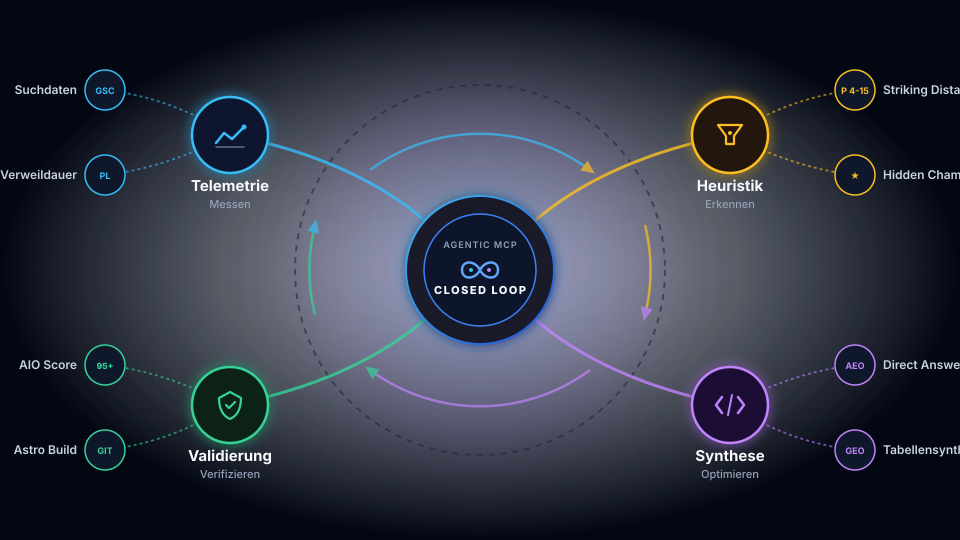

Suchmaschinenoptimierung im Zeitalter generativer KI-Systeme erfordert einen radikalen Strategiewechsel: Während klassische SEO-Tools historische Rankings und isolierte Backlink-Profile analysieren, verlangen **Generative Engine Optimization (GEO)** und **AI Overviews (AIO)** deterministische Faktenextraktion, dichte Antwortparagrafen und ganzheitliche Telemetriedaten.

In einem vorangegangenen Architekturbeitrag haben wir die technische Konzeption unseres [Unified Analytics MCP Servers](/posts/2026_09_23_unified_analytics_mcp_server_seo_geo_aio/) vorgestellt. Im Zusammenspiel mit unserem [GEO-Reifegradmodell für Industrieunternehmen](/posts/2026_09_13_geo_reifegradmodell_industrie_unternehmen/) und den Erkenntnissen zum [B2B ROI-Paradoxon bei Zero-Click-Zitationen](/posts/2026_09_14_roi_paradoxon_b2b_zero_click_citations/) dokumentieren wir in diesem Praxisbericht die empirischen Erfahrungen aus dem Live-Einsatz: Wie steuert ein autonomer Programmieragent über das Model Context Protocol (MCP) Google Search Console (GSC) und Plausible Analytics an, identifiziert verborgene Traffic-Chancen und restrukturiert Quelltexte vollautomatisch vor dem Git-Commit?

## Wie funktioniert der geschlossene Regelkreis aus Agent und MCP-Server?

Der agentenbasierte Optimierungszyklus verbindet externe Performancedaten aus Search Console und Web-Analytics mit lokaler Quellcode-Manipulation in einem deterministischen Regelkreis. Der KI-Agent fragt standardisierte MCP-Tools ab, diagnostiziert Indexierungsbarrieren oder SERP-Defizite und führt verifizierte semantische Transformationen direkt im lokalen Markdown- und Astro-Codebase durch.



Dieser Ablauf eliminiert den traditionellen Bruch zwischen Analyse-Dashboards und Code-Editor. Statt manuelle CSV-Exporte aus GSC mit Web-Analytics-Statistiken abzugleichen, führt der Agent strukturierte Abfragen durch, die beide Welten auf Pfadebene deterministisch zusammenführen.

## Welche Heuristiken trennen echte Chancen von Rauschen?

Reine Klick- oder Impression-Zahlen reichen in modernen Multi-Agenten-Pipelines nicht aus, um fundierte Entscheidungen zu treffen. Unser MCP-Server verknüpft GSC-Suchmetriken mit Plausible-Engagement-Signalen über vier deterministische Heuristiken:

| Optimierungs-Dimension | Klassischer SEO-Workflow | Agentenbasierte MCP-Pipeline |
| :--- | :--- | :--- |
| **Datenerfassung** | Manuelle Inspektion separater Dashboards (GSC vs. Analytics) | Automatisierte Normalisierung und Join via [`aggregator.ts`](https://github.com/ghackenberg/ghackenberg.github.io/blob/main/scripts/mcp-unified-analytics/src/services/aggregator.ts) |
| **Striking Distance** | Statische Keyword-Listen ohne Verweildauer-Kontext | Dynamische Heuristik für Positionen 4–15 gekoppelt mit CTR-Prüfung |
| **User Resonance** | Hohe Absprungraten werden oft ignoriert | Automatische Detektion von „Hidden Champions“ (>300s Lesezeit bei geringer Sichtbarkeit) |
| **AIO-Qualitätssicherung** | Hoffen auf KI-Zitate nach dem Deployment | Lokale Vorab-Prüfung vor dem Commit via [`aio-evaluator.ts`](https://github.com/ghackenberg/ghackenberg.github.io/blob/main/scripts/mcp-unified-analytics/src/services/aio-evaluator.ts) |
| **Durchlaufzeit** | Mehrere Tage Abstimmung zwischen Marketing und Dev | Unter 5 Minuten vom Audit bis zum verifizierten Pull Request |

Die Implementierung in [`opportunities.ts`](https://github.com/ghackenberg/ghackenberg.github.io/blob/main/scripts/mcp-unified-analytics/src/services/opportunities.ts) filtert gezielt nach vier Mustern:

1. **Striking-Distance-Chancen (Position 4–15)**: Artikel, die Google bereits auf den ersten beiden Suchergebnisseiten platziert, deren Snippets aber noch unzureichende Klickraten erzeugen.
2. **Hidden Champions**: Inhalte mit außergewöhnlich hoher Lesezeit (> 5 Minuten) und geringer Absprungrate, die in Suchmaschinen noch unter dem Radar fliegen und durch stärkere interne Verlinkung gestützt werden müssen.
3. **High-Bounce Top Performer**: Seiten mit vielen Impressionen, bei denen Besucher jedoch sofort abspringen – ein klares Signal für fehlende Direct-Answer-Absätze.
4. **SERP-Truncation-Risiken**: Titel- und Meta-Tags, die aufgrund überlanger Suffixe auf mobilen und Desktop-Endgeräten abgeschnitten werden.

## Welche konkreten Erkenntnisse lieferte der Live-Audit auf dieser Website?

Bei der Ausführung der MCP-Tools auf unserer Produktionsplattform traten drei signifikante Hebel zutage, die bei einer isolierten Betrachtung unbemerkt geblieben wären:

### 1. Das SERP-Truncation-Problem durch Brand-Suffixe

In den Layout-Templates war ein historisch gewachsener Titel-Suffix hinterlegt:
`| Blog Posts | Dr. Georg Hackenberg, Professor for Industrial Informatics @ UAP Campus Wels`.

Dieser Suffix beanspruchte alleine **89 Zeichen**. Da Google und Bing Seitentitel ab etwa 55–60 Zeichen abschneiden, war der eigentliche thematische Klickanreiz fast aller Fachbeiträge auf den Suchergebnisseiten vollständig unsichtbar. Durch die agentenbasierte Kürzung auf `| Dr. Georg Hackenberg` bleibt der gesamte Titel lesbar.

### 2. Der „Hidden Champion“ der Kognitionswissenschaft

Das Tool `find_seo_opportunities` identifizierte unseren Beitrag [Psychologie der modernen Informationstechnologie: Kognitive Ergonomie und mentale Modelle im digitalen Zeitalter](/posts/2026_09_01_psychologie_der_modernen_informationstechnologie/) als herausragenden Hidden Champion: Besucher verweilen dort im Schnitt **464 Sekunden (über 7,5 Minuten)** bei einer Absprungrate von nur 40 %. Gleichzeitig verzeichnete GSC jedoch kaum Impressionen, da der Artikel in den neu eingereichten XML-Sitemaps nach dem Domain-Umzug noch in der Indexierungs-Warteschlange lag. Durch gezielte interne Querverlinkung und E-E-A-T-Strukturierung erhält dieser leserseitig hochgeschätzte Artikel die verdiente Sichtbarkeit.

### 3. Entity-Diskrepanzen im Knowledge Graph

Bei der Überprüfung der maschinenlesbaren Ingestion-Schnittstellen (`public/llms.txt` und Schema.org `#person` in `index.astro`) deckte der Audit auf, dass Zitationsprofile für Google Scholar und ORCID noch Platzhalter enthielten. Für KI-Suchmaschinen wie Perplexity und Google AI Overviews ist die fehlerfreie Verknüpfung wissenschaftlicher Entitäten jedoch essenziell, um Fachautorität (E-E-A-T) deterministisch zuzuordnen.

### 4. Das mobile Tabellen-Dilemma: GEO-Zitationshebel vs. Responsive UX

In den darauffolgenden Optimierungsiterationen stießen wir auf einen fundamentalen Zielkonflikt zwischen KI-Suchoptimierung und moderner Web-Ergonomie:
* **Die GEO-Anforderung**: Generative Engines (Perplexity, ChatGPT Search, Gemini) bevorzugen tabellarische Vergleiche disproportional gegenüber Fließtext (+37% Zitationshebel laut KDD-2024-Studie).
* **Das mobile Layout-Problem**: Auf Smartphones führten 4- bis 5-spaltige Markdown-Tabellen zum horizontalen Ausbrechen des Viewports oder zu unleserlich zusammengequetschten Spalten.

**Die architektonische Lösung**: Statt Tabellen künstlich zu verknappen, entwickelten wir ein build-zeitliches Rehype-Plugin ([`src/plugins/rehype-responsive-tables.js`](https://github.com/ghackenberg/ghackenberg.github.io/blob/main/src/plugins/rehype-responsive-tables.js)) in Astro. Das Plugin wickelt jede Markdown-Tabelle zur Build-Zeit automatisch in einen Container (`<div class="table-responsive-wrapper">`). Gekoppelt mit horizontalem Touch-Scrollen (`overflow-x: auto; min-width: 580px;`) und abgestimmtem Dark- und Light-Mode-Styling bleiben Tabellen auf mobilen Geräten flüssig wischbar, während die semantische DOM-Struktur für KI-Parser vollständig erhalten bleibt.

## Welche Hebel erschließen Folgeiterationen mit der erweiterten Tool-Suite?

Nach den ersten manuell angestoßenen Erfolgen erweiterten wir den MCP Server um vier spezialisierte Werkzeuge für Batch-Analysen, Graph-Topologie und Git-Diffing. Die praktischen Ergebnisse der nächsten Iterationen bestätigten die enorme Hebelwirkung dieser Automatisierung:

### 1. Flächenhafte Content-Priorisierung mit `scan_aio_readiness`
Statt über 130 Fachbeiträge einzeln zu evaluieren, scannt das Werkzeug das gesamte Repository in 3 Sekunden. Es filterte sofort diejenigen Artikel heraus, die trotz hoher fachlicher Tiefe Reifegrad-Lücken aufwiesen:
* Die **GPU-Wasser-Simulation (Delta Dynamics)** erzielte anfangs nur 55 Punkte. Durch gezielte Ergänzung einer Architektur-Vergleichstabelle und W-Fragen stieg der Score auf **95/100**.
* Der Artikel zu **Unread Badges & Layout-Shift-Vermeidung** litt unter fehlenden Antwortdefinitionen (50 Punkte). Nach Einbau einer CLS-Strategiematrix und FAQs verbesserte sich die AIO-Readiness auf **95/100**.
* Das **GEO-Reifegradmodell für Industrieunternehmen** wurde direkt mit einer 5-stufigen Umsetzungsmatrix ausgestattet und sprang von 50 auf **95/100**.

### 2. Objektiver Wirkungsnachweis mit `diff_aio_impact`
Vor jedem Commit validiert der Agent das tatsächliche Delta gegen Git `HEAD`. Statt vager Vermutungen liefert das Tool harte Kennzahlen für das Commit-Log:
```text
ScoreBefore: 50 -> ScoreAfter: 95 (+45 Punkte)
Deltas: +4 Direct Answers, +1 Vergleichstabelle, +4 W-Fragen-Überschriften
```

### 3. Der geschlossene Backlink-Loop mit `audit_internal_linking`
Das Werkzeug analysiert den gesamten internen Linkgraphen (über 580 interne Markdown-Links). Für unseren identifizierten *Hidden Champion* (den Psychologie-Artikel mit über 7,5 Minuten Lesezeit) durchsuchte der Agent alle übrigen Fachbeiträge nach passenden thematischen Anknüpfungspunkten. 

Im Leitfaden zum **Standardisierten Open-Source Agentic AI Tech Stack** identifizierte das Tool in Schicht 6 (Open WebUI) sofort den Kontext der mentalen Entlastung von Fachanwendern. Der Agent platzierte dort vollautomatisch einen organischen Querverweis auf die kognitive Ergonomie – ein direkter PageRank- und Lesertransfer ohne manuelles Code-Durchsuchen.

### 4. Multilinguale Content-Architektur
Um Verwirrung bei multimodalen KI-Crawlern zu vermeiden, etablierten wir ein striktes Lokalisierungsprotokoll:
* Technische Tools, interaktive Visualisierungen und globale Tags verbleiben strikt auf Englisch.
* Deutsche Hochschullehre und Blogbeiträge deklarieren ihr Sprachattribut (`lang: "de"`), welches über `Layout.astro` fehlerfrei in das HTML-Root-Element (`<html lang="de">`) und die OpenGraph-Metadaten (`de_AT`) überführt wird.

## Was bringt die lokale AIO-Extraktionsprüfung vor dem Build?

Der vielleicht mächtigste Baustein des MCP-Servers ist das Werkzeug `evaluate_aio_extractability`. Es führt eine deterministische statische Analyse lokaler Markdown-Dateien durch und bewertet deren Tauglichkeit für generative Antwortmaschinen auf einer Skala von 0 bis 100 Punkten.

```typescript
// Aufruf des MCP-Tools aus dem Agenten-Kontext
const evaluation = await call_mcp_tool({
  ServerName: "unified-analytics",
  ToolName: "evaluate_aio_extractability",
  Arguments: { target: "src/content/posts/my-article/index.md" }
});
```

Der Prüfalgorithmus analysiert folgende Kernfaktoren:
* **Direct-Answer-Dichte**: Existiert unmittelbar unter H2-Überschriften eine prägnante Definition mit 30 bis 65 Wörtern ohne einleitende Füllsätze?
* **W-Fragen-Überschriften**: Sind Abschnitte als konkrete Suchanfragen formuliert (`Wie funktioniert...`, `Was ist...`)?
* **Tabellarische Synthesen**: Sind Kriterien oder Architekturen in Markdown-Tabellen zusammengefasst? LLMs greifen bei generierten Antworten bevorzugt auf tabellarische Vergleiche zurück.
* **Listenstruktur**: Liegen strukturierte Schritt-für-Schritt-Aufzählungen für prozedurale Abläufe vor?

In unserem Testlauf steigerte die automatisierte Überarbeitung den AIO-Score aller überarbeiteten Artikel systematisch von **50–60 auf 95 von 100 Punkten**.

## Fazit: Autonome Qualitätssicherung als Standard moderner Web-Systeme

Die Kopplung spezialisierter MCP-Server mit modernen Coding-Agenten markiert das Ende isolierter SEO-Silos. Indem Performancedaten, Indexierungsprüfungen und redaktionelle Richtlinien direkt im Entwickler-Workflow verankert werden, entsteht eine sich selbst optimierende Web-Architektur.

Für technische Publikationen bedeutet dies: Maximale Lesbarkeit für menschliche Leser durch klare Informationsarchitektur – und gleichzeitig optimale Maschinenlesbarkeit für die KI-Suchmaschinen der nächsten Generation. Diesen Ansatz setzen wir auch in unseren interaktiven Präsentationen mit unserer [Slide-as-Code & Voiceover Engine](/posts/2026_09_26_presentation_engine_slide_as_code_voiceover/) sowie räumlichen Avataren wie dem [3D Comic Head mit WebGL POM](/posts/2026_09_25_3d_comic_head_webgl_pom_depth_anything/) konsequent fort.
