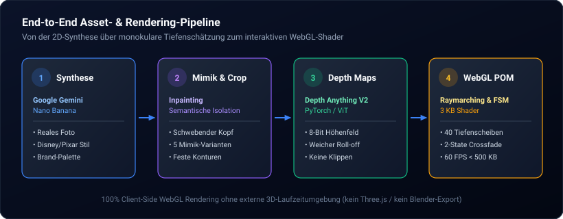
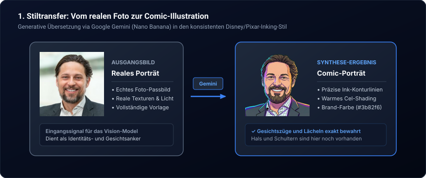
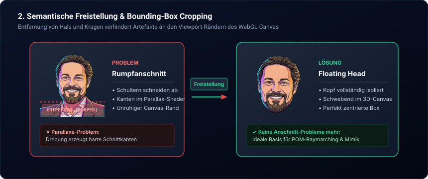
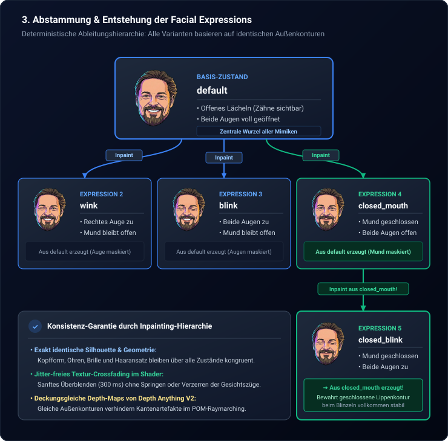
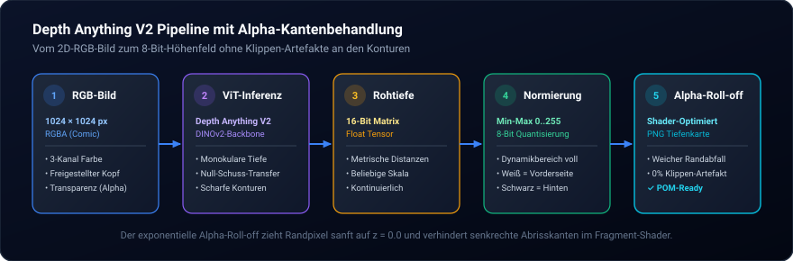
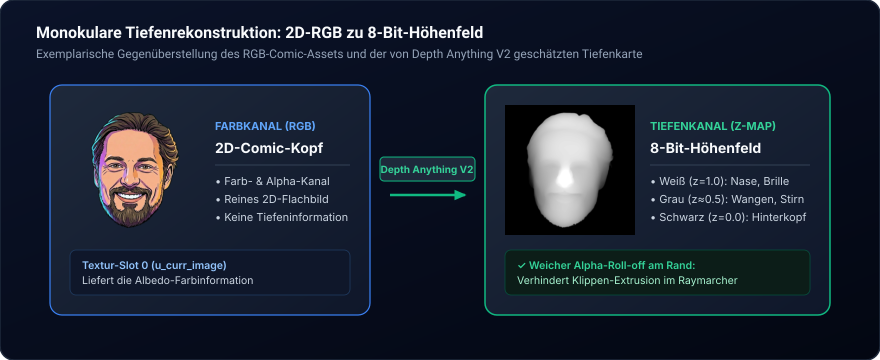
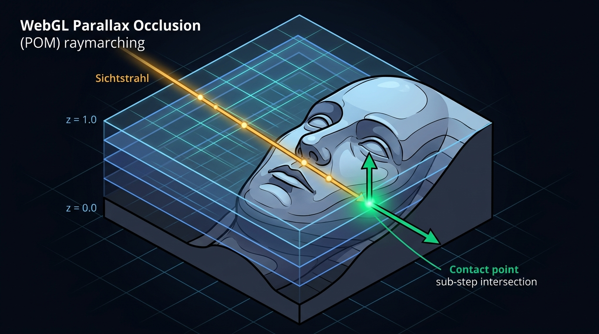
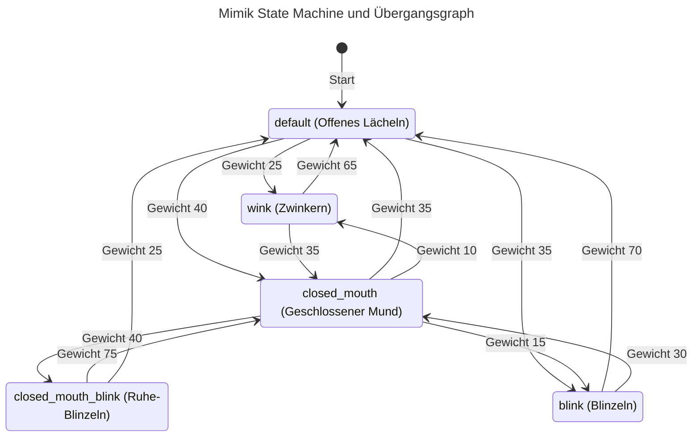

Moderne Web-Erlebnisse leben von lebendiger visueller Tiefe, scheitern in der Praxis jedoch oft an der Schere zwischen visueller Immersion und technischer Effizienz. Wer Gesichtern oder Illustrationen im Browser eine echte räumliche Dreidimensionalität verleihen möchte, greift typischerweise zu vollwertigen 3D-Meshes via [Three.js](https://threejs.org/) oder [Babylon.js](https://doc.babylonjs.com/) – und bezahlt diesen Schritt mit Megabytes an Geometrie-Downloads, komplexen UV-Rigging-Pipelines und spürbarem CPU-Overhead.

Auf dieser Website gehen wir im Hero-Bereich einen radikal leichtgewichtigen Weg: Ein handgezeichnet wirkendes Comic-Porträt wechselt organisch zwischen verschiedenen Gesichtsausdrücken und besitzt dank **Parallax Occlusion Mapping (POM)** eine überzeugende räumliche 3D-Tiefe samt dynamischer Lichtbrechung und Oberflächenkrümmung – bei einem Gesamt-Shader von unter 3 KB und einer Ladezeit von wenigen hundert Millisekunden.

In diesem Beitrag dokumentieren wir den vollständigen Engineering-Workflow: Von der generativen Stilübertragung eines echten Fotos über die semantische Freistellung und Mimik-Synthese bis hin zur monokularen Tiefenschätzung via [Depth Anything V2](https://depth-anything-v2.github.io/) und dem mathematischen Raymarching im WebGL-Fragment-Shader.

> [!TIP]
> **Interaktive Live-Version:**  
> Die hier beschriebene Komponente [`DepthPortrait.astro`](https://github.com/ghackenberg/ghackenberg.github.io/blob/main/src/components/DepthPortrait.astro) ist live im Hero-Bereich der [Startseite auf hackenberg.tech](https://hackenberg.tech) im Einsatz.

## Wie ist die ganzheitliche Synthese- und Rendering-Pipeline aufgebaut?

Der Übergang von einem statischen zweidimensionalen Porträt zu einer interaktiven 2.5D-Echtzeit-Präsenz gliedert sich in vier strikt entkoppelte Stufen: generative Stilübertragung, mimische Zustandsgenerierung, monokulare Tiefenextraktion und hardwarebeschleunigtes Shader-Raymarching.



Jede dieser vier Stufen löst eine konkrete physikalische oder visuelle Hürde:

1. **Generative Stilsynthese via [Google Gemini](https://deepmind.google/technologies/gemini/) (Nano Banana):** Das reale Passbild wird in eine stilisierte Comic-Darstellung übersetzt. Das Modell bewahrt charakteristische Gesichtszüge, reichert das Bild jedoch mit prägnanten Tuschelinien (Inking), flächigem Cel-Shading und der Farbpalette der Website (`#3b82f6` Primärfarbe, `#030712` Schieferhintergrund) an.
2. **Semantische Freistellung & Mimik-Inpainting via [Pillow](https://python-pillow.org/):** Um störende Schnittkanten bei der späteren 3D-Neigung zu verhindern, wird der Kopf semantisch vom Körper befreit. Aus diesem „Floating Head“ werden anschließend über gezieltes Inpainting fünf Mimik-Zustände auf einer exakt identischen Außenkontur abgeleitet.
3. **Monokulare Tiefenschätzung via [Depth Anything V2](https://depth-anything-v2.github.io/):** Aus den fünf zweidimensionalen RGB-Bildern rekonstruiert ein Vision-Transformer (ViT) die zugehörigen 2.5D-Höhenfelder. Ein exponentieller Alpha-Roll-off an den Rändern stellt sicher, dass keine senkrechten Tiefenklippen entstehen.
4. **Hardwarebeschleunigtes Raymarching via [WebGL 1.0](https://www.khronos.org/webgl/):** Im Browser durchwandert der Fragment-Shader das Höhenfeld in 40 Z-Schritten. Eine probilistische Finite State Machine (FSM) steuert organische Übergänge und Textur-Crossfades bei konstant 60 FPS – vollständig ohne externe 3D-Engines.

## Wie gelingt der Schritt vom realen Foto zur konsistenten Comic-Mimik?

Der Übergang vom zweidimensionalen Foto zur animierten Mimik-Palette gliedert sich in drei aufeinander aufbauende Gestaltungs- und Inpainting-Phasen: die generative Stilübertragung, die anatomische Freistellung des Kopfes und die hierarchische Ableitung der einzelnen Gesichtsausdrücke.

### 1. Stiltransfer vom echten Foto zur Comic-Illustration
Ausgangspunkt des Porträts war ein herkömmliches fotografisches Passbild ([`original-photo.jpg`](https://github.com/ghackenberg/ghackenberg.github.io/blob/main/src/content/posts/2026_09_25_3d_comic_head_webgl_pom_depth_anything/original-photo.jpg)). Über Google Gemini (Nano Banana) wurde das Foto in eine stilisierte Comic-Darstellung übersetzt. Das Ziel: Die charakteristische Physiognomie, Bartstruktur und Augenpartie des Autors exakt zu bewahren, das Bild jedoch mit prägnanten Tuschelinien (Inking), flächigem Cel-Shading und den Markenfarben der Website (`#3b82f6` Primärakzente, dunkler Schieferhintergrund) anzureichern:



### 2. Semantische Freistellung des schwebenden Kopfes (Body Removal & Cropping)
Herkömmliche Porträts zeigen Halsansatz, Hemdkragen und Schulterpartien. Wird ein solches Porträt später im 3D-Raum des Shaders interaktiv geneigt, schneiden Schulterkanten abrupt an den Rändern des Canvas ab. Das erzeugt harte Kantenartefakte und zerstört die räumliche Illusion.

Mittels gezieltem Prompting und Inpainting wurde der Kopf daher semantisch vom Rumpf getrennt und von Hals und Kleidung befreit. Das Ergebnis ist ein sauber freigestellter, im Canvas zentrierter „Floating Head“, dessen Außenkonturen weich auslaufen:



### 3. Hierarchische Ableitung der Facial Expressions
Damit das spätere Überblenden zwischen den Mimik-Zuständen im WebGL-Shader ohne Verzerrungen (Ghosting) gelingt, müssen Kopfform, Ohren, Brille und Haaransatz über alle Zustände hinweg absolut deckungsgleich bleiben. Die Gesichtsausdrücke wurden daher nicht unabhängig voneinander generiert, sondern hierarchisch über gezieltes Inpainting voneinander abgeleitet:

1. **Ableitung aus `default`:** Ausgehend vom offenen Lächeln (`default`) wurden das Zwinkern (`wink`, rechtes Auge geschlossen), das beidseitige Blinzeln (`blink`, beide Augen geschlossen, Mund offen) sowie der ruhige Gesichtsausdruck mit geschlossenem Mund (`closed_mouth`) erzeugt.
2. **Ableitung aus `closed_mouth`:** Um den Zustand mit geschlossenem Mund und gleichzeitig geschlossenen Augen (`closed_mouth_blink`) zu erhalten, diente **nicht** das Ursprungsbild als Basis, sondern die bereits geschlossene Mundpartie von `closed_mouth`. Dadurch bleibt die geschlossene Lippenkontur beim Blinzeln vollkommen stabil.



Die Lebensnähe der resultierenden Animation beruht auf einem biologisch plausiblen Zeitmodell (`durationRange`), das zwischen Ruhezuständen und impulsiven Mikrobewegungen unterscheidet:

- **Stabile Ruhezustände (`default` & `closed_mouth`):** Die beiden Grundhaltungen mit geöffneten Augen verweilen zwischen 2.500 ms und 6.000 ms. Diese langen Intervalle geben dem Porträt einen ruhigen, aufmerksamen Blick und verhindern hyperaktive Unruhe.
- **Impulsive Mikrobewegungen (`blink`, `closed_mouth_blink` & `wink`):** Ein natürlicher menschlicher Lidschlag dauert typischerweise zwischen 150 ms und 300 ms. Die Zustände `blink` und `closed_mouth_blink` sind daher auf 180 ms bis 280 ms begrenzt, während das etwas bewusstere Zwinkern (`wink`) nach 250 ms bis 380 ms wieder in die Ausgangslage zurückkehrt.
- **Nahtlose Alpha-Überblendung (300 ms Crossfade):** Sobald die State Machine einen Wechsel anstößt, interpoliert der Fragment-Shader im Untermoment über einen 300-Millisekunden-Blendvektor. Weil alle fünf Texturen auf exakt derselben Inpainting-Silhouette beruhen, morphen die Gesichtszüge vollkommen artefaktfrei.

## Warum ist Depth Anything V2 für Tiefenkarten unverzichtbar?

Monokulare Tiefenschätzung rekonstruiert aus einem einzelnen RGB-Bild ein kontinuierliches Höhenfeld, bei dem helle Pixel nahe Bildpunkte (Nase, Brillensteg) und dunkle Pixel ferne Bildpunkte (Hinterkopf, Ohren) codieren.

Frühere Modelle wie MiDaS neigten bei Comic-Grafiken zu starken Unschärfen an Konturlinien oder interpretierten schwarze Tintenstriche fälschlicherweise als unendlich tiefe Spalten. [Depth Anything V2](https://depth-anything-v2.github.io/) basiert auf einem Vision-Transformer-Backbone (DINOv2) und wurde mit Millionen synthetischer und realer Szenen trainiert. Es liefert selbst bei gezeichneten Illustrationen messerscharfe Tiefenkanten:



### Das Klippen-Problem an den Außengrenzen (Silhouette Bleeding)
Würde eine Tiefenkarte an der Haargrenze abrupt von $z=0.4$ auf $z=0.0$ abfallen, träfe der Blickstrahl des Shaders bei seitlichem Blickwinkel auf eine senkrechte Wand. Das Gesicht würde wirken wie aus Holz ausgestanzt („Kuchenteig-Effekt“). 

Um dies zu verhindern, wendet ein Vorverarbeitungsskript einen exponentiellen Alpha-Roll-off an den Rändern an: Fällt die Deckkraft des RGB-Bildes ab, wird auch der Tiefenwert sanft gegen Null gezogen. Da sich die Tiefenstrukturen der mimischen Varianten im Wesentlichen nur in feinen Nuancen an Lippen und Augenlidern unterscheiden, genügt die Betrachtung des exemplarischen Übergangs von 2D-RGB zu 2.5D-Höhenfeld:



## Wie funktioniert Parallax Occlusion Mapping (POM) im Fragment-Shader?

Parallax Occlusion Mapping ist ein Verfahren aus der Computergrafik, das planaren Flächen ohne zusätzliche Polygone plastische geometrische Tiefe verleiht. Anstatt Geometrie im Vertex-Shader zu deformieren, marschiert ein Sichtstrahl im Fragment-Shader schrittweise durch ein 2.5D-Höhenfeld.



Der Algorithmus in unserem Fragment-Shader ([`src/components/DepthPortrait.astro`](https://github.com/ghackenberg/ghackenberg.github.io/blob/main/src/components/DepthPortrait.astro)) gliedert sich in vier mathematische Schritte:

### 1. Initialer Sichtstrahl und Discard-Test
Trifft das Fragment auf den transparenten Hintergrund, bricht der Shader sofort ab (`discard`). Das verhindert, dass Strahlen aus dem Hintergrund in die Seitenwand des Kopfes hineinragen:

```glsl
vec4 initColorCurr = texture2D(u_curr_image, v_uv);
vec4 initColorNext = texture2D(u_next_image, v_uv);
float initAlpha = mix(initColorCurr.a, initColorNext.a, u_blend);
if (initAlpha < 0.05) {
  gl_FragColor = vec4(0.0);
  return;
}
```

### 2. Raymarching über 40 Tiefenscheiben
Der Sichtstrahl wandert von der vordersten Ebene ($z = 1.0$) schrittweise in die Tiefe ($z = 0.0$). An jedem Schritt berechnet der Shader den Versatz der Texturkoordinate relativ zum Drehpunkthorizont ($pivotZ = 0.40$):

```glsl
float stepSize = 1.0 / float(NUM_STEPS); // NUM_STEPS = 40
for (int i = 0; i <= NUM_STEPS; i++) {
  currZ = 1.0 - float(i) * stepSize;
  currUV = v_uv - (currZ - pivotZ) * rayDir;

  float dCurr = texture2D(u_curr_depth, currUV).r;
  float dNext = texture2D(u_next_depth, currUV).r;
  currDepth = mix(dCurr, dNext, u_blend);

  if (currDepth > 0.001 && currDepth >= currZ) {
    hit = true;
    break;
  }
  prevZ = currZ;
  prevUV = currUV;
  prevDepth = currDepth;
}
```

### 3. Sub-Schritt-Interpolation (Refinement)
Statt auf der diskreten Stufe stehen zu bleiben, interpoliert der Shader den Schnittpunkt zwischen dem letzten Punkt vor dem Durchstoß (`prevStep`) und dem ersten Punkt nach dem Durchstoß (`hitStep`) linear:

$$weight = \frac{z_{prev} - d_{prev}}{(z_{prev} - d_{prev}) + (d_{curr} - z_{curr})}$$

Dieser Schritt eliminiert unschöne Treppenstufen (Slicing-Artefakte) vollständig und erzeugt seidig glatte Wölbungen.

### 4. Dynamische Normalenberechnung und Beleuchtung
Um das Porträt greifbar zu machen, berechnet der Shader den Normalenvektor der Oberfläche on-the-fly aus den partiellen Ableitungen der Tiefenkarte:

```glsl
vec2 texel = vec2(0.003, 0.003);
float dL = mix(texture2D(u_curr_depth, finalUV - vec2(texel.x, 0.0)).r, texture2D(u_next_depth, finalUV - vec2(texel.x, 0.0)).r, u_blend);
float dR = mix(texture2D(u_curr_depth, finalUV + vec2(texel.x, 0.0)).r, texture2D(u_next_depth, finalUV + vec2(texel.x, 0.0)).r, u_blend);
float dU = mix(texture2D(u_curr_depth, finalUV - vec2(0.0, texel.y)).r, texture2D(u_next_depth, finalUV - vec2(0.0, texel.y)).r, u_blend);
float dD = mix(texture2D(u_curr_depth, finalUV + vec2(0.0, texel.y)).r, texture2D(u_next_depth, finalUV + vec2(0.0, texel.y)).r, u_blend);

vec3 normal = normalize(vec3((dL - dR) * 12.0 * normalWeight, (dU - dD) * 12.0 * normalWeight, 1.0));
```

Das Ergebnis ist eine plastische Beleuchtung mit diffusem Streulicht und Glanzlichtern (`specular`), die sich synchron zur dezenten Idle-Bewegung verändern.

## Wie steuert die State Machine natürliche Übergänge und Zufallsauswahl?

Ein wiederkehrendes Problem animierter Porträts im Web ist Monotonie: Entweder wiederholt sich eine Schleife exakt alle vier Sekunden, oder ein reiner Zufallsgenerator lässt die Figur dreimal hintereinander unnatürlich mit den Augen zucken.

Unsere Komponente implementiert deshalb eine **Finite State Machine (FSM)** mit historienbasierter Gewichtung:



### Der zweistufige Wahrscheinlichkeitsausgleich (Frequenz & Recency)
Um sicherzustellen, dass seltene Zustände (wie `wink` oder `closed_mouth_blink`) zuverlässig auftauchen, ohne vorhersehbar zu sein, führt [`chooseNextExpression`](https://github.com/ghackenberg/ghackenberg.github.io/blob/main/src/components/DepthPortrait.astro#L444-L500) zwei dynamische Korrekturfaktoren ein:

1. **Frequenz-Multiplikator ($1.0$ bis $3.5\times$):** Zustände, die in der aktuellen Sitzung seltener als das Maximum gezeigt wurden, erhalten einen signifikanten Boost:
   $$F_{boost} = 1.0 + 2.5 \cdot \frac{\text{count}_{max} - \text{count}_{id}}{\text{count}_{max}}$$

2. **Recency-Bonus:** Ein Zustand, der seit mehr als 30 Sekunden nicht mehr sichtbar war, erhält zusätzliche Bonuspunkte proportional zur verstrichenen Zeit.

Das Ergebnis ist ein lebendiges, natürliches Verhalten, das über die gesamte Verweildauer des Besuchers abwechslungsreich bleibt.

## Welche Vorteile bietet die WebGL-POM-Architektur für Core Web Vitals und SEO?

Der Verzicht auf ein vollwertiges 3D-Framework bringt messbare Vorteile für Ladezeiten, Accessibility und Suchmaschinen:

1. **Minimale Payload:** Das gesamte WebGL-Rendering benötigt keine externen Bibliotheken. Der Shader und die Script-Logik umfassen lediglich ~8 KB JavaScript. Zusammen mit den hochoptimierten WebP/PNG-Texturen bleibt die gesamte Komponente unter 450 KB.
2. **Zero Layout Shift (CLS = 0):** Ein statisches Fallback-Bild ([`img.depth-fallback-img`](https://github.com/ghackenberg/ghackenberg.github.io/blob/main/src/components/DepthPortrait.astro#L78-L85)) wird serverseitig in exakt denselben Dimensionen gerendert. Sobald die WebGL-Texturen im Hintergrund geladen sind, blendet das Canvas mit einem 700ms-Crossfade weich ein.
3. **Barrierefreiheit & Reduced Motion:** Nutzer mit der Systemeinstellung `prefers-reduced-motion: reduce` erhalten automatisch das statische Bild ohne Shader-Initialisierung oder Animationen.
4. **Semantische Bildmetadaten:** Für Suchmaschinen und Screenreader agiert der Wrapper als reguläres `role="img"` mit aussagekräftigem `aria-label` und Alt-Attributen.

Die folgende Benchmark-Gegenüberstellung verdeutlicht die Architektur-Vorteile im Vergleich zu herkömmlichen 3D-Meshes und statischen Grafiken:

| Kriterium | Vollwertiges 3D-Mesh (Three.js / GLTF) | WebGL POM (Depth Anything V2) | Statisches Bild (Klassischer Fallback) |
| :--- | :--- | :--- | :--- |
| **Payload & Transfer** | ~3.5 MB – 8.0 MB (Geometrie, Rig & Lib) | **&lt; 450 KB** (Alle Texturen + 8 KB JS) | &lt; 80 KB (Einzelbild) |
| **Räumliche Plastizität** | Vollständig (360° rotierbar) | **2.5D (Perspektivisch & dynamisch beleuchtet)** | Keine (Flache 2D-Fläche) |
| **Animation & Mimik** | Skelett-Rigging / Morph-Targets | **Zustands-Crossfading via Inpainting** | Keine Animation |
| **Core Web Vitals** | Hohes TBT- und CLS-Risiko beim Framework-Init | **CLS = 0, TBT / INP unbeeinflusst** | CLS = 0 |
| **GPU/CPU-Ressourcen** | Kontinuierliche Geometrie-Berechnung | **Extrem leichtgewichtig (1 planares Quad)** | Keine Shader-Last |

## Fazit: Plastische Web-Interaktion ohne Framework-Ballast

Die Kombination aus moderner generativer KI für die Asset-Erstellung und klassischen Shader-Techniken der Computergrafik eröffnet faszinierende Möglichkeiten für das Webdesign:

Statt zwischen flachen 2D-Grafiken oder ressourcenhungrigen 3D-Szenen wählen zu müssen, bietet **Parallax Occlusion Mapping in Verbindung mit monokularer Tiefenschätzung** den idealen Mittelweg: Ausdrucksstarke räumliche Plastizität, flüssige 60 FPS und blitzschnelle Ladezeiten direkt im Canvas.
