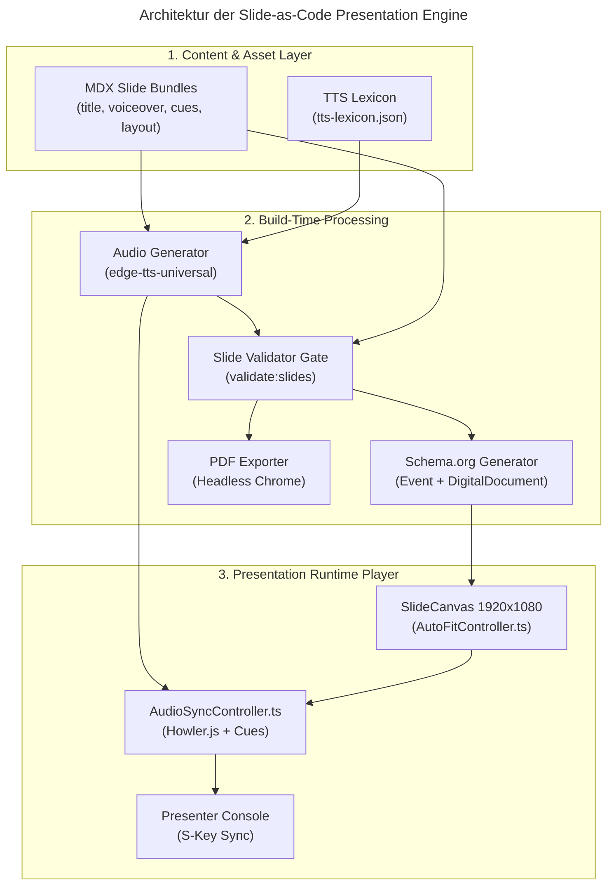
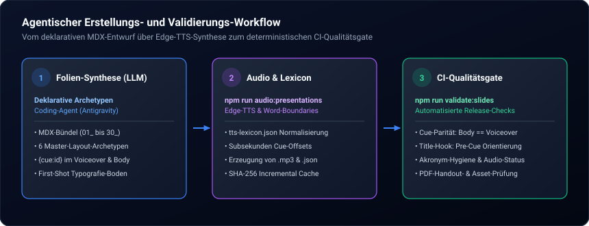

Fachvorträge, Keynotes und Vorlesungen gehören zu den wertvollsten Wissensressourcen von Forschern und Software-Architekten. Im modernen Web fristen sie dennoch oft ein Schattendasein: Entweder landen sie als schwerfällige PDF-Downloads in verwaisten Dateiablagen, oder sie werden über ressourcenhungrige, werbeüberladene Fremd-iFrames eingebettet. Beide Wege vernichten die Lesbarkeit für Suchmaschinen, bieten auf mobilen Bildschirmen eine frustrierende Usability und trennen das gesprochene Vortragswort vollständig vom visuellen Folienkontext.

Mit dem Launch unseres neuen Webseiten-Bereichs [Interactive Presentations](/presentations/) haben wir dieses Problem an der Wurzel gelöst. Anstatt auf isolierte Drittanbieter-Tools zu setzen, haben wir eine native **Slide-as-Code Presentation Engine** direkt in unser [Astro & TypeScript-Ökosystem](/posts/2026_05_23_website_relaunch_astro_typescript/) integriert. Die Engine kombiniert modulare MDX-Folienkomponenten, eine virtuelle 1920x1080-Vektorbühne, microsekundengenaue akustische Neural-Voiceover-Synchronisation und granulare Schema.org-Wissensgraphen.

In diesem Beitrag analysieren wir die architektonischen Schwächen klassischer Präsentations-Tools, stellen die Funktionsweise unserer Custom Engine vor und dokumentieren, wie autonome KI-Programmieragenten vollwertige Keynotes mit deterministischen Qualitätsgarantien generieren.

> [!TIP]
> **Interaktive Live-Präsentation:**  
> Das Gesamtsystem lässt sich im neuen Bereich [Interactive Presentations](/presentations/) erleben. Als erster produktiver Vortrag steht die Keynote [SEO im Zeitalter von KI: Strategien für SEO, GEO, AIO und AEO](/presentations/2026_10_01_seo_im_zeitalter_von_ki/) mit 30 synchronisierten Folien, automatischer Sprachausgabe und vollständigem Folientranskript bereit.

## Warum scheitern klassische Presentation Tools im modernen Web?

Klassische Präsentations-Tools scheitern im Web an der mangelnden Integration in statische Site-Generatoren, fehlender Barrierefreiheit und unzureichender Sichtbarkeit für Suchmaschinen. Externe Cloud-iFrames blockieren Web-Crawler und zerstören die Seiten-Performance, während isolierte Entwickler-Frameworks keine native akustische Wortsynchronisation für synthetisierte Sprachausgaben bieten und getrennte Build-Pipelines erzwingen.

Wer Folien auf einer modernen Website veröffentlichen möchte, steht typischerweise vor der Wahl zwischen zwei unbefriedigenden Produktkategorien:

### 1. Cloud-basierte iFrame-Embeds

Plattformen wie [Google Slides](https://www.google.com/slides/about/), [Pitch](https://pitch.com/), [Speaker Deck](https://speakerdeck.com/) oder [SlideShare](https://www.slideshare.net/) ermöglichen den raschen Export von Präsentationen als eingebettetes `<iframe>`. Für anspruchsvolle Entwickler und Content-Architekten bringt dieser Ansatz gravierende Nachteile:

- **Zero SEO & GEO Impact:** Der gesamte Folientext liegt innerhalb einer externen Frame-Sandbox. Weder Google noch KI-Antwortmaschinen wie Perplexity oder ChatGPT Search können den Text den URLs der eigenen Domain zuordnen.
- **Ressourcen- und Privacy-Overhead:** Eingebettete Player laden Megabytes an Drittanbieter-Skripten, Cookies und Tracking-Pixeln herunter, was gegen Prinzipien des datensparsamen Webdesigns verstößt.
- **Starre Responsivität:** Folien skalieren in iframes selten artefaktfrei und zwingen Nutzer auf Smartphones zu mühsamem Zoomen und horizontalem Scrolling.
- **Keine akustische Synchronisation:** Das gesprochene Vortragswort lässt sich nicht dynamisch an visuelle Hervorhebungen auf der Folie koppeln.

### 2. Code-basierte Entwickler-Frameworks

In der Entwickler-Community existieren etablierte Open-Source-Frameworks für Präsentationen aus Markdown-Dateien:

- [Reveal.js](https://revealjs.com/): Der weltweite De-facto-Standard für HTML-Präsentationen. Reveal.js bietet exzellente Folienübergänge und ein ausgereiftes Plugin-System. Es läuft jedoch primär als clientseitige DOM-Anwendung, besitzt kein nativeres Verständnis für statische Astro Content Collections und bringt out-of-the-box weder Text-to-Speech (TTS) noch automatisierte Cue-Trigger mit.
- [Slidev](https://sli.dev/): Ein modernes, auf Vue 3 und Vite basierendes Markdown-Präsentationstool mit interaktiven Vue-Komponenten und Monaco-Code-Editor. Slidev eignet sich hervorragend für Live-Coding-Vorträge, ist jedoch als eigenständige Single-Page Application (SPA) konzipiert. Die Einbettung in eine existierende Multi-Page Astro-Architektur erfordert redundante Build-Pipelines und erschwert einheitliches Server-Side Rendering (SSR).
- [Marp](https://marp.app/): Ein minimalistisches Markdown-Ökosystem, das Markdown über maßgeschneiderte CSS-Themes nach HTML und PDF konvertiert. Marp glänzt bei schnellen Notizen, bietet jedoch keine interaktiven Animations-Queues, keine Audio-Steuerung und keine programmierbaren UI-State-Machines.
- [Spectacle](https://formidable.com/open-source/spectacle/) & [MDX Deck](https://github.com/jxnblk/mdx-deck): React-basierte Foliensysteme, die JSX in Präsentationen ermöglichen. Sie bringen den vollen React-Runtime-Overhead mit und stehen im Widerspruch zur Null-JS-Baseline moderner inhaltszentrierter Websites.

Die folgende Vergleichsmatrix fasst die Kernunterschiede unserer Custom Presentation Engine gegenüber den verbreiteten Alternativen zusammen:

| Feature / Architektur-Dimension | Cloud Embeds (Google / Pitch) | Reveal.js / Slidev | Custom Astro Engine |
| :--- | :--- | :--- | :--- |
| **Hosting & Ownership** | Fremdserver / Cloud-Lock-in | Eigener Server / SPA | Vollständig self-hosted via Astro SSG |
| **SEO, GEO & Schema.org** | ❌ 0 % (im iFrame isoliert) | ⚠️ Nur Basis-HTML-DOM | ✅ Granulare `PresentationDigitalDocument`-Knoten |
| **Synthetisiertes Voiceover** | ❌ Nicht vorhanden | ❌ Kein Standard-Feature | ✅ Automatisches Edge TTS mit Caching |
| **Wortgenaue Cue-Synchronisation** | ❌ Nicht möglich | ❌ Nicht integriert | ✅ Sub-Sekunden-Matching via AudioSyncController |
| **Agentische Folien-Erstellung** | ❌ Manuelle GUI-Klicks | ⚠️ Freiform-Markdown (Layout-Bruch) | ✅ 6 deterministische Master-Archetypen |
| **CI-Qualitätsgate** | ❌ Keines | ⚠️ Nur Linter / Typechecks | ✅ `validate:slides` (Cues, Acronyms, Caches) |
| **Multi-Format-Export** | ⚠️ Plattformabhängig | ⚠️ Manueller Druckdialog | ✅ Automatisierte PDFs (Dark/Light) & WebP-Thumbs |

## Warum haben wir uns für eine maßgeschneiderte Engine entschieden?

Wir haben uns für eine maßgeschneiderte Presentation Engine entschieden, um vollständige Kontrolle über die semantische HTML-Struktur, Zero-Runtime-Performance und multimediale Barrierefreiheit zu behalten. Die native Integration in Astro ermöglicht statisches Pre-Rendering jedes Folientranskripts für KI-Suchmaschinen, automatisiertes Neural-Voiceover via Microsoft Edge TTS und eine deterministische Autoren-Ergonomie für autonome KI-Agenten.

Fünf konkrete Anforderungen gaben den Ausschlag für den Eigenbau:

1. **Nahtlose Design- und Framework-Integration:**  
   Die Präsentationen nutzen exakt dieselben Tailwind CSS Design-Tokens, Typografie-Hierarchien und Farbakzente (`#3b82f6`, `#f59e0b`, `#10b981`) wie der Rest der Website. Besucher erleben keinen visuellen Stilbruch beim Wechsel zwischen Blogbeitrag, Portfolio und Vortrag.
2. **KI- und Suchmaschinen-Indexierbarkeit (GEO & AIO):**  
   Im Zeitalter generativer Suchmaschinen ([AEO/GEO-Optimierung](/posts/2026_08_11_seo_geo_aeo_aio_optimierung/)) ist unsichtbarer Folientext inakzeptabel. Unsere Engine rendert für jede Präsentation ein duales Schema.org JSON-LD-Modell: Eine `Event`-Entität (für Ort, Zeit, Konferenz und Sprecher) verknüpft mit einem `PresentationDigitalDocument`. Jede einzelne Folie wird als eigenes `CreativeWork` mit Folientitel, Volltexttranskript und referenzierter `AudioObject`-Audiodatei deklariert. Google AI Overviews und LLM-Crawler erfassen jedes Folienargument ohne Umwege.
3. **Akustische Wort-Anker-Synchronisation:**  
   Präsentationen im Web werden selten von vorn bis hinten durchgelesen. Durch das synchrone Abspielen einer hochqualitativen KI-Sprecherstimme, gekoppelt mit zeitgenauen visuellen Scheinwerfer-Effekten (`data-cue-active`), entsteht das immersive Erlebnis eines echten Vortragsbesuchs.
4. **Vollständige Multi-Format-Pipeline:**  
   Ein einziger Build-Befehl erzeugt den interaktiven Web-Player, eine barrierefreie Textansicht für Screenreader, eine hochauflösende Druckansicht (`/print`), WebP-Folien-Thumbnails und druckoptimierte PDF-Handouts sowohl im Dark- als auch im Light-Mode.
5. **Agentic Slide-as-Code Ergonomie:**  
   Als forschender Informatiker arbeite ich täglich mit autonomen KI-Programmieragenten ([Standardisierter Agentic AI Tech Stack](/posts/2026_09_03_standardisierter_open_source_agentic_ai_tech_stack/)). Um Folien reproduzierbar durch LLMs generieren zu lassen, bedarf es strenger, deklarativer Baupläne statt unvorhersehbarer CSS-Freiform-Experimente.

## Wie ist die Slide-as-Code Architektur aufgebaut?

Die Slide-as-Code Architektur basiert auf atomaren MDX-Folienbündeln, die über eine globale Astro Content Collection geladen und zur Build-Zeit typisiert werden. Eine strikte Trennung zwischen deklarativem Folien-Markup und einem autarken Audio-Synchronisations-Controller garantiert maximale Trennung von Struktur, Inhalt und Abspielogik.



### Die 6 Master-Folien-Archetypen

Große Sprachmodelle scheitern bei der Folienerstellung regelmäßig daran, dass sie CSS-Klassen und Pixelabstände frei erfinden. Das Resultat sind abgeschnittene Boxen, überlappende Schriften und uneinheitliche Ränder. 

Unsere Engine löst dieses Dilemma durch 6 standardisierte Layout-Archetypen, die als Astro-Komponenten im Verzeichnis [`src/components/slides/layouts/`](https://github.com/ghackenberg/ghackenberg.github.io/blob/main/src/components/slides/layouts/) gekapselt sind:

1. **TitleSlide ([`TitleSlide.astro`](https://github.com/ghackenberg/ghackenberg.github.io/blob/main/src/components/slides/layouts/TitleSlide.astro)):** Der Keynote-Auftakt mit primärer Headline, Subtitle, Sprecherprofil, Affiliation und Datumsangaben.
2. **SplitSlide ([`SplitSlide.astro`](https://github.com/ghackenberg/ghackenberg.github.io/blob/main/src/components/slides/layouts/SplitSlide.astro)):** Zwei-Spalten-Layout (wahlweise 50/50 oder 40/60) für Gegenüberstellungen (Vorher vs. Nachher, Problem vs. Lösung).
3. **PipelineSlide ([`PipelineSlide.astro`](https://github.com/ghackenberg/ghackenberg.github.io/blob/main/src/components/slides/layouts/PipelineSlide.astro)):** Sequenzielle Prozessketten für Agenden, chronologische Meilensteine und mehrstufige Workflows.
4. **GridSlide ([`GridSlide.astro`](https://github.com/ghackenberg/ghackenberg.github.io/blob/main/src/components/slides/layouts/GridSlide.astro)):** 2x2-Quadrant oder 3-Spalten-Matrix für Taxonomien, Tool-Übersichten und Begriffsdefinitionen.
5. **MetricSlide ([`MetricSlide.astro`](https://github.com/ghackenberg/ghackenberg.github.io/blob/main/src/components/slides/layouts/MetricSlide.astro)):** KPI-Folie mit großformatigen Kennzahlen (`<MetricStat>`) und strategischen Implikationen.
6. **CodeSlide ([`CodeSlide.astro`](https://github.com/ghackenberg/ghackenberg.github.io/blob/main/src/components/slides/layouts/CodeSlide.astro)):** Code-Container mit Syntax-Highlighting auf der linken Seite (`col-span-7`) und strukturierter Erklärung auf der rechten Seite (`col-span-5`).

Ergänzt werden die Archetypen durch wiederverwendbare Primitives wie `<BentoCard>`, `<CalloutBox>`, `<BulletList>`, `<BarChart>` und `<EntityGraphVisual>`. Kein Folienautor muss jemals manuelle CSS-Grid-Deklarationen schreiben.

### Die virtuelle 1920x1080 Vektorbühne

Web-Präsentationen leiden traditionell darunter, dass relative Schriftgrößen (`rem`, `vw`) auf unterschiedlich großen Monitoren zu Zeilenumbrüchen führen, die das Folienlayout zerstören.

Unsere Engine rendert alle Folien in einer virtuellen 1920x1080-Pixel-Canvas-Bühne ([`SlideCanvas.astro`](https://github.com/ghackenberg/ghackenberg.github.io/blob/main/src/components/slides/primitives/SlideCanvas.astro)). Der [`AutoFitController.ts`](https://github.com/ghackenberg/ghackenberg.github.io/blob/main/src/components/slides/player/AutoFitController.ts) ermittelt kontinuierlich über einen `ResizeObserver` die verfügbare Viewport-Größe und berechnet den idealen Skalierungsfaktor:

$$\text{scale} = \min\left(\frac{W_{\text{container}}}{1920}, \frac{H_{\text{container}}}{1080}\right)$$

Über ein performantes CSS-`transform: scale(...)` wird die gesamte Folie verlustfrei und hardwarebeschleunigt skaliert. Schriftgrößen, Boxen und Pfeile behalten exakt ihr vorgesehenes geometrisches Verhältnis – egal ob auf einem 4K-Konferenzbeamer oder einem kompakten 13-Zoll-Laptop.

## Wie funktioniert die akustische Cue-Synchronisation im Browser?

Die akustische Cue-Synchronisation funktioniert durch das Extrahieren von Zeitmarken aus synthetisierten Sprachaudiodateien und deren subsekundengenauem Abgleich mit visuellen DOM-Elementen. Das Skript `generate-presentation-audio.js` ermittelt Wortgrenzen via Edge TTS, während der clientseitige `AudioSyncController.ts` über einen kontinuierlichen Animation-Frame-Loop visuelle Spotlight-Klassen und Highlighter-Sweeps triggert.

Der Ablauf gliedert sich in vier präzise aufeinander abgestimmte Phasen:

### 1. Deklaratives Voiceover mit Cue-Tags im Frontmatter

Jede Folie definiert ihr gesprochenes Skript im YAML-Frontmatter. Spezielle `{cue:id}`-Tags markieren exakt die Silbe, bei deren Aussprache ein optisches Element fokussiert oder animiert werden soll:

````markdown
---
title: "Klassische Suche vs. Synthese-Maschine"
subtitle: "Warum Zitationen die neuen Klicks sind"
voiceover: >
  Beim Betrachten moderner Websuchen stellen wir einen fundamentalen Wandel fest.
  {cue:col-classic}Während traditionelle Suchmaschinen lediglich Indexlisten abgleichen{/cue},
  {cue:col-modern}generieren KI-Synthesesysteme direkte Antworten für den Nutzer.{/cue}
slideLayout: "split"
---
<SplitSlide title={frontmatter.title} subtitle={frontmatter.subtitle}>
  <BentoCard slot="left" cue="col-classic" title="Klassischer Web-Index">
    <!-- Folieninhalt -->
  </BentoCard>
  <BentoCard slot="right" cue="col-modern" title="Synthese-Maschine" accent="blue">
    <!-- Folieninhalt -->
  </BentoCard>
</SplitSlide>
````

### 2. Phonetische Normalisierung via `tts-lexicon.json`

Neuronale Sprachsynthese-Engines stolpern im Deutschen häufig über englische Fachbegriffe und technische Akronyme. So würde ein TTS-Modell die Abkürzung *RAG* wie ein deutsches Wort („Rag“) aussprechen oder *Knowledge Graph* unnatürlich betonen.

In [`src/content/presentations/tts-lexicon.json`](https://github.com/ghackenberg/ghackenberg.github.io/blob/main/src/content/presentations/tts-lexicon.json) pflegen wir ein zentrales Konfigurations-Lexikon:

```json
{
  "acronyms": {
    "RAG": "R-A-G",
    "URL": "U-R-L",
    "MCP": "M-C-P",
    "LLM": "L-L-M",
    "JSON-LD": "Dschäison-L-D",
    "AIO": "A-I-O",
    "GEO": "G-E-O"
  },
  "phonetics": {
    "Snapshot": "Snäpschott",
    "Zero-Click": "Siero-Klick",
    "Knowledge Graph": "Nolledsch Graf",
    "Grounding": "Graunding"
  }
}
```

Das Node.js-Buildskript [`generate-presentation-audio.js`](https://github.com/ghackenberg/ghackenberg.github.io/blob/main/scripts/generate-presentation-audio.js) wendet diese Ersetzungen deterministisch an, bevor der Text an die Synthese übergeben wird. Der Markdown-Quelltext bleibt für Menschen und barrierefreie Screenreader semantisch sauber.

### 3. Akustische Wortgrenzen-Synthese (Edge TTS)

Über das Paket `edge-tts-universal` und die deutsche Stimme `de-DE-ConradNeural` streamt das Buildskript das Audiosignal. Die Synthese liefert nicht nur das MP3-Audio, sondern zu jedem gesprochenen Wort ein präzises Offset:

```json
{
  "col-classic": 4.12,
  "col-modern": 8.75
}
```

Das Skript gleicht den Zielanker des Cues (`wordAfter` bzw. `wordBefore`) über eine fehlertolerante Normalisierungs- und Prefix-Matching-Heuristik mit den tatsächlichen Audiowortgrenzen ab. Das Resultat wird als schlanke JSON-Datei neben der Folien-MP3 im Audio-Verzeichnis abgelegt. Ein robuster SHA-256-Cache verhindert unnötige Neugenerierungen bereits synthetisierter Folien.

### 4. Clientseitige Wiedergabe via `AudioSyncController.ts`

Im Browser übernimmt die TypeScript-Klasse [`AudioSyncController.ts`](https://github.com/ghackenberg/ghackenberg.github.io/blob/main/src/components/slides/player/AudioSyncController.ts) (basierend auf Howler.js) die Regie:

- **60fps Tracking:** Ein `requestAnimationFrame`-Loop vergleicht die aktuelle Audio-Abspielposition mit der Cue-Zeittabelle.
- **Spotlight-State-Machine:** Erreicht das Audio den Zeitstempel eines Cues, erhalten die korrespondierenden DOM-Elemente das Attribut `data-cue-active="true"`. Zuvor aktive Elemente wechseln sanft auf `data-cue-past="true"`.
- **Highlighter-Sweeps:** Für Textspannen `{cue:hl-id}hervorgehobener Text{/cue}` berechnet der Controller die exakte Wortdauer und animiert eine neonblaue oder bernsteinfarbene Marker-Welle unter der Schriftzeile.
- **Auto-Advance:** Ist das Folienaudio beendet, pausiert der Player kurz und navigiert nahtlos zur nächsten Folie.

### Das 2-Phasen „Title-Hook“-Protokoll

Um das Publikum nicht kognitiv zu überfordern, erzwingt unser System das **Title-Hook-Protokoll**:

1. **Phase 1: Orientierung (0–4 Sekunden, Pre-Cue):**  
   Beim Erscheinen einer Folie bleiben alle Inhaltskarten abgedunkelt. Die Sprecherstimme beginnt immer mit 1–2 Sätzen, die den Folientitel verbal spiegeln und kontextualisieren. Erst danach fällt der erste Cue.
2. **Phase 2: Progressive Cued Content:**  
   Die Argumente werden Schritt für Schritt beleuchtet, synchron zur auditiven Argumentation des Sprechers.

## Wie steuern autonome KI-Agenten die Folien-Erstellung?

Autonome KI-Agenten steuern die Folien-Erstellung, indem sie strukturierte MDX-Dateien auf Basis standardisierter Archetypen verfassen und durch ein automatisiertes Validierungs-Gate absichern. Das Skript `validate-slides.js` prüft Folien auf Vollständigkeit des Frontmatters, Konsistenz zwischen Voiceover-Cues und visuellen DOM-IDs sowie Übereinstimmung mit dem Title-Hook-Protokoll vor jedem Deployment.

Die Zusammenarbeit mit Coding-Agenten wie Antigravity folgt einem klaren dreistufigen Prozess:



### Die First-Shot Designregeln für Agenten

Damit Agenten auf Anhieb produktionsreife Folien generieren, sind in den Entwickler-Richtlinien unverrückbare Untergrenzen für Schriftgrößen verankert:

- **Folientitel (`h1`):** 56px–64px (`leading-[1.12]`)
- **Karten-Überschriften (`h3`, `h4`):** 32px–38px
- **Fließtext & Listenpunkte (`p`, `li`):** 24px–28px
- **Fußnoten & Quellenangaben:** Mindestens 18px–21px (absolutes Minimum)
- **Verbot von Ad-hoc-CSS:** Agenten dürfen keine manuellen Pixelmargins oder CSS-Grid-Hacks einfügen.

### Das automatisierte Qualitätsgate: `validate-slides.js`

Vor jedem Git-Commit oder Production-Build analysiert [`scripts/validate-slides.js`](https://github.com/ghackenberg/ghackenberg.github.io/blob/main/scripts/validate-slides.js) den gesamten Präsentationsbestand. Das Skript bricht den Build mit einem Fehlercode ab, falls eine der folgenden Bedingungen verletzt wird:

1. **Frontmatter-Parität:** Fehlt `title`, `voiceover` oder `notes`?
2. **Cue-Integrität:** Wurde im Voiceover ein `{cue:step-02}` deklariert, der im JSX-Body nicht existiert (oder umgekehrt)?
3. **Reihenfolge-Konsistenz:** Werden Cues in derselben sequentiellen Reihenfolge gesprochen, in der sie optisch im DOM platziert sind?
4. **Title-Hook-Verstoß:** Startet das Voiceover sofort im ersten Satz mit einem Trigger, ohne dem Hörer Zeit zum Lesen des Folientitels zu geben?
5. **Lexikon-Hygiene:** Befinden sich unregistrierte Großbuchstaben-Akronyme im Skript, die im Audio falsch betont werden könnten?
6. **Audio-Aktualität:** Weicht der SHA-256-Hash des Folientexts vom Hash in `.cache.json` ab, was auf ungespeicherte Voiceover-Änderungen hinweist?

Dieses automatisierte Kontrollnetz ermöglicht es mir, komplexe 30-Folien-Vorträge gemeinsam mit KI-Agenten in wenigen Stunden zu entwerfen, zu iterieren und fehlerfrei bereitzustellen.

## Fazit & Ausblick

Präsentationen müssen im Web nicht länger in isolierten PDF-Silos oder schwerfälligen iFrames verstauben. Durch das Zusammenspiel aus modernem Static Site Generation via Astro, microsekundengenauer Edge-TTS-Audiosynchronisation und autonomen Agenten-Pipelines verwandeln sich Vortragsfolien in erstklassige, barrierefreie und suchmaschinenoptimierte Wissensgraphen.

Entdecken Sie das Gesamtergebnis live im neuen Bereich [Interactive Presentations](/presentations/) oder werfen Sie einen Blick in unsere [Flagship-Keynote über SEO, GEO und AIO](/presentations/2026_10_01_seo_im_zeitalter_von_ki/). In kommenden Beiträgen werden wir die mathematische Zero-Line-Berechnung unserer SVG-Diagrammkomponenten und die Anbindung interaktiver 3D-Shader-Elemente an die Folien-Timeline vertiefen.
